# Uncertainty in pyair2stream: a guide for water quality scientists

pyair2stream can tell you more than "the water was 19.8 °C". It can tell you how
far that prediction could be from the truth, how likely it is that a temperature
limit was exceeded, and whether those statements held up when the model was
tested on years it had never seen. This guide explains each of these, without
assuming a statistics background: what it means, when to use it, how to run it,
how to read it, what it rests on, and how to defend it.

It complements [METHODS.md](METHODS.md) (the exact steps and formulas, §11–§13)
and the [User Guide](../USER_GUIDE.md) (settings, §11–§14). Every number quoted
here comes from the package's own examples and its
[validation report](../validation/REPORT.md). The figures are drawn by
[`figures/make_uncertainty_figures.py`](figures/make_uncertainty_figures.py) from
examples 03 and 04, so anyone can redraw them.

**Contents**

1. [Start here: which tool answers your question](#1-start-here-which-tool-answers-your-question)
2. [Where uncertainty comes from](#2-where-uncertainty-comes-from)
3. [Ten words you will meet](#3-ten-words-you-will-meet)
4. [How pyair2stream builds its uncertainty, in seven steps](#4-how-pyair2stream-builds-its-uncertainty-in-seven-steps)
5. [The model's errors: their size and how long they last](#5-the-models-errors-their-size-and-how-long-they-last)
6. [Daily prediction intervals](#6-daily-prediction-intervals)
7. [Weekly means, yearly peaks, days above a limit](#7-weekly-means-yearly-peaks-days-above-a-limit)
8. [Testing on years the model has not seen: cross-validation](#8-testing-on-years-the-model-has-not-seen-cross-validation)
9. [Correcting yearly statistics for the model's bias](#9-correcting-yearly-statistics-for-the-models-bias)
10. [Comparing two scenarios](#10-comparing-two-scenarios)
11. [How well are the parameters known?](#11-how-well-are-the-parameters-known)
12. [Mean error by month and season](#12-mean-error-by-month-and-season)
13. [Choosing the level: 90%, 95% or 99%?](#13-choosing-the-level-90-95-or-99)
14. [Warnings and what to do about them](#14-warnings-and-what-to-do-about-them)
15. [Is it defensible?](#15-is-it-defensible)
16. [A worked example, from data to a statement](#16-a-worked-example-from-data-to-a-statement)
17. [Common mistakes](#17-common-mistakes)
18. [References](#18-references)

---

## 1. Start here: which tool answers your question

| Your question | Use | Check before you report it | Section |
|---|---|---|---|
| How far could a daily prediction be from the truth? | the daily prediction interval (`DE-MCMC`, then `FORWARD` with intervals) | its coverage on years not used for calibration | [6](#6-daily-prediction-intervals) |
| What range for a weekly or monthly mean, or for a run of warm days? | statistics computed in each of the 1,000 simulated series (`save_ensemble: true`) | the 7-day coverage in `cv_interval_coverage.csv` | [7](#7-weekly-means-yearly-peaks-days-above-a-limit) |
| How likely is it that a yearly limit was exceeded (highest daily mean, highest 7-day mean, days above a threshold)? | the share of simulated series above the limit, **corrected** by cross-validation | `cv_yearly_statistics_summary.csv` | [7](#7-weekly-means-yearly-peaks-days-above-a-limit), [8](#8-testing-on-years-the-model-has-not-seen-cross-validation), [9](#9-correcting-yearly-statistics-for-the-models-bias) |
| What difference would a change in flow or climate make? | the paired difference of two scenario runs | that both runs used the same parameter sets | [10](#10-comparing-two-scenarios) |
| How precisely do the data fix the model's parameters? | MCMC parameter intervals; jackknife intervals from cross-validation | convergence; no parameter on a bound | [11](#11-how-well-are-the-parameters-known) |
| Is the model too warm or too cool in some season? | mean error by month and season | whether its 95% interval excludes zero | [12](#12-mean-error-by-month-and-season) |
| Should I report 90%, 95% or 99%? | `uncertainty_options.prediction_interval` | the coverage at that level | [13](#13-choosing-the-level-90-95-or-99) |

> **The three rules that matter most**
>
> 1. Compute every multi-day or yearly quantity **in each simulated series**,
>    then take the range across series. Never compute it from the daily band.
> 2. **Check** what you report on years the model was not calibrated on.
> 3. For a **yearly** statistic, use the **corrected** probability.

---

## 2. Where uncertainty comes from

A model is a simplification. Even with the best parameters, its daily water
temperature differs from the measured one: on the Mentue (a small Swiss river)
by 0.63 °C on a typical day. That difference has three sources:

1. **Parameters.** The 3–8 coefficients are fitted to a limited record. Other
   values would fit almost as well (section [11](#11-how-well-are-the-parameters-known)).
2. **The model's structure.** One equation driven by air temperature and flow
   cannot represent everything that sets a river's temperature: shading,
   groundwater, snowmelt, a reservoir release, a heatwave unlike any in the
   record.
3. **The data.** Measurements have errors, and daily means hide what happens
   within a day.

pyair2stream represents source 1 by many parameter sets, each consistent with the
data, and sources 2 and 3 together by a statistical description of the model's
past errors: the **error model** (section [5](#5-the-models-errors-their-size-and-how-long-they-last)).
Figure 1 shows that, for daily values, the error model is by far the larger part.

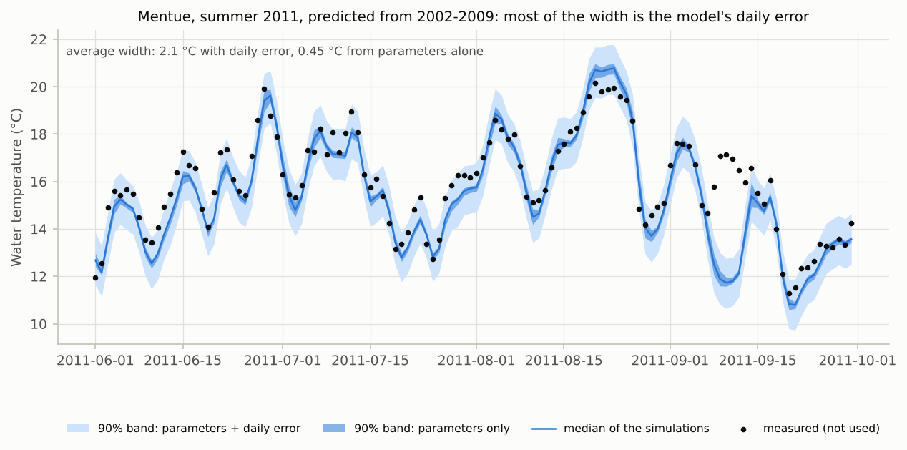

*Figure 1. Mentue, summer 2011, predicted from a calibration on 2002–2009. The
90% band from parameter uncertainty alone is 0.45 °C wide on average; with the
model's daily error it is 2.1 °C wide, and it contains the measurements (dots),
which the prediction did not use.*

**What the uncertainty does not include.** The inputs you give the model are
taken as exact: a projected air temperature or a naturalised flow series is not
made uncertain by pyair2stream. And the river is assumed to behave in the years
predicted as it did in the years calibrated on (no new dam, abstraction pattern
or loss of shading in between). If either matters, treat it separately, for
example by running several input scenarios.

---

## 3. Ten words you will meet

| Word | Meaning |
|---|---|
| **Error** (residual) | simulated minus measured water temperature on a day. Positive: the model is too warm. |
| **Bias** | the average error. A model can have a small error overall and still be biased in summer. |
| **σ** (sigma) | the typical size of the daily error (the root-mean-square error, in °C). |
| **Persistence**, **ρ** (rho) | how much an error carries over from one day to the next: 0 means each day's error is new, near 1 means errors last for weeks. |
| **Ensemble** | the 1,000 simulated series a run produces, each with its own parameter set and its own daily errors. |
| **Interval**, **range**, **level** | a band that should contain the truth with a stated chance: a 90% interval should miss about 1 value in 10. |
| **Coverage** | the share of measured values that actually fell inside the interval. For a trustworthy 90% interval it is close to 90%. |
| **Probability of exceedance** | the share of simulated series in which a statistic (say the year's highest 7-day mean) is above the limit. |
| **Held-out year** | a year whose measurements were hidden from the calibration, so the model can be tested on it. |
| **PIT** | where a measured value falls among the simulations: 0.3 means 30% of the simulations were below it (section [8](#8-testing-on-years-the-model-has-not-seen-cross-validation)). |

---

## 4. How pyair2stream builds its uncertainty, in seven steps

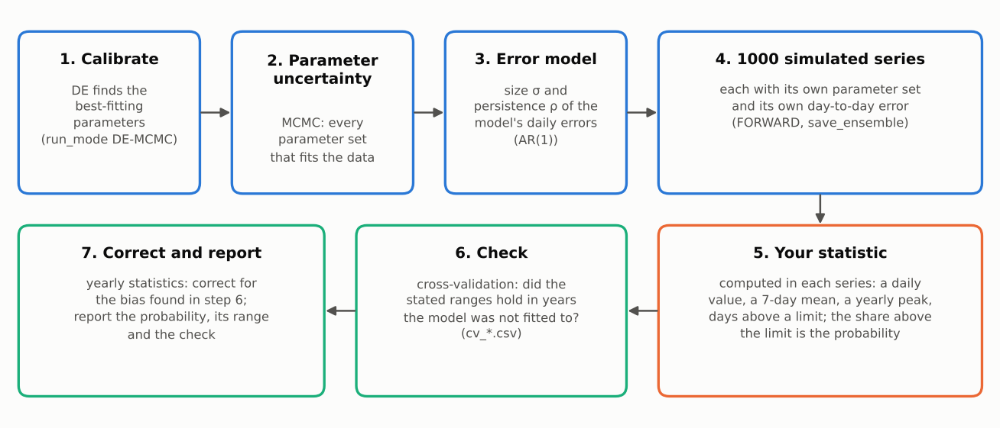

*Figure 2. The seven steps from calibration to a reported probability.*

1. **Calibrate.** Differential Evolution finds the parameters that fit the
   measured water temperature best (`run_mode: "DE-MCMC"` starts with this).
2. **Parameter uncertainty.** MCMC (Markov chain Monte Carlo) then collects
   thousands of parameter sets, each in proportion to how well it fits
   (section [11](#11-how-well-are-the-parameters-known)).
3. **Error model.** The size σ and persistence ρ of the best fit's daily errors
   are measured (section [5](#5-the-models-errors-their-size-and-how-long-they-last)).
4. **1,000 simulated series.** A `FORWARD` run draws 1,000 parameter sets,
   simulates each, and adds a random error series of size σ and persistence ρ to
   each one. Each series is one plausible version of what the water temperature
   was (or will be).
5. **Your statistic.** Whatever your question is about, a daily value, a 7-day
   mean, a yearly peak or a count of days, is computed in each of the 1,000
   series. The spread across series is its uncertainty; the share above a limit
   is the probability that the limit was exceeded (section [7](#7-weekly-means-yearly-peaks-days-above-a-limit)).
6. **Check.** Cross-validation hides each year in turn and repeats steps 1, 3,
   4 and 5 without it (step 2 is left out: each fold has one parameter set, so
   its ranges are slightly narrower). It records whether the stated ranges
   contained what was measured
   (section [8](#8-testing-on-years-the-model-has-not-seen-cross-validation)).
7. **Correct and report.** For yearly statistics, the bias found in step 6 is
   removed (section [9](#9-correcting-yearly-statistics-for-the-models-bias)).
   Report the probability, its range and the check.

---

## 5. The model's errors: their size and how long they last

This section explains the **error model**, and in particular the setting
`rho_timescale: "weekly"`. The setting affects every range and probability
that covers more than a single day. It is also the one part of the method that
is pyair2stream's own. So it is explained here in full, with the evidence and
answers to the questions reviewers ask. The formulas are in
[METHODS §12](METHODS.md#error-persistence-how-it-is-estimated-and-why-the-weekly-scale).

### In short

- The model's daily errors last for a day or two, and they also drift for
  weeks.
- pyair2stream describes them with two numbers: their size σ and their
  persistence ρ.
- ρ can be measured from one day to the next (`"daily"`), or from one week to
  the next (`"weekly"`, the default).
- Both give the same range for a single day.
- The weekly ρ keeps the slow drift. Ranges for 7-day means, monthly means,
  yearly peaks and counts of warm days are then realistic. With the daily ρ
  they are too narrow.
- Where the errors have no slow drift, the two give the same ρ. Then the
  weekly choice costs nothing.
- Keep the default.

### What it is

The **error model** describes the best fit's daily errors (simulated minus
measured temperature) with two numbers:

- **σ** (sigma): their typical size, in °C (the root-mean-square error of the
  calibration);
- **ρ** (rho): their persistence, between 0 and 1. It says how much of today's
  error carries over to tomorrow.

pyair2stream uses the simplest model of persistence, called AR(1)
("autoregressive of order 1"): each day's error is ρ times yesterday's error,
plus something new. It also assumes that the errors are normally distributed,
with the same size all year.

### Why persistence matters

Real errors come in runs: when the model is too warm today, it is likely to be
too warm tomorrow (Figure 3). A random error that is new every day would look
very different.

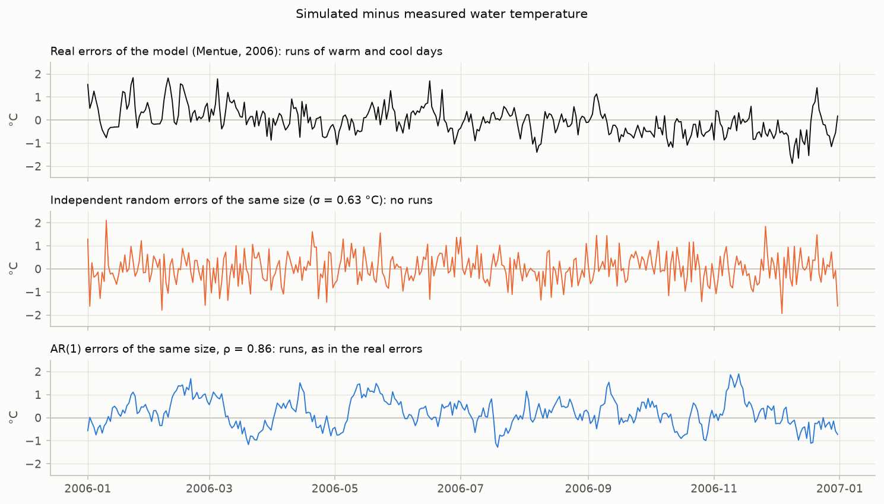

*Figure 3. Top: the model's real errors on the Mentue in 2006. Middle: random
errors of the same size that are new every day. Bottom: AR(1) errors of the same
size with ρ = 0.86, as pyair2stream generates them.*

This matters because a compliance question is usually about several days: a
7-day mean, a run of warm days, a summer peak. Errors that are new every day
cancel out in an average. Errors that persist do not (Figure 5). If the error
model ignored persistence, the range for a 7-day mean would be far too narrow.
On the Swiss rivers, 90% ranges for 7-day means made that way contained only
39–62% of the measured values ([V5](../validation/REPORT.md#v5)).

### Real errors have two memories

Figure 4 shows how long the real errors last. They have two parts:

- **a fast part**, which fades within a day or two. This is the weather of a
  single day that the model misses.
- **a slow part**, which lasts weeks. This is, for example, a summer when the
  model runs slightly warm throughout, a dry spell, or a change in the river
  that the model does not represent.

An AR(1) process has only one memory: its correlation falls by the same factor,
ρ, every day. So one number cannot follow both parts. A choice must be made:
which part should ρ follow?

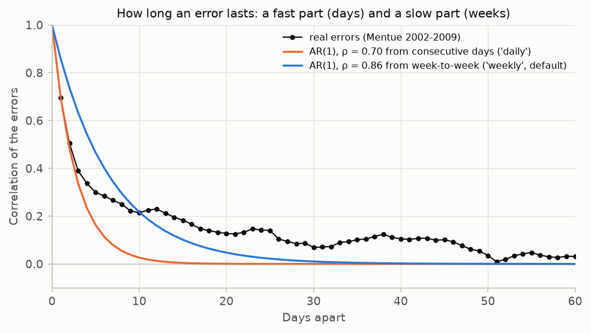

*Figure 4. How long an error lasts on the Mentue: its correlation with the error
k days later. The "daily" ρ (orange) follows only the first few days, and says
that nothing lasts beyond a week or two. The default "weekly" ρ (blue) lies
between the two parts: above the real correlation over the first ten days,
below it after. No single ρ can follow both.*

What matters in practice is how errors behave when they are averaged over
several days (Figure 5).


*Figure 5. The typical error of an average over 1 to 90 days, on the Mentue.
Errors that are new every day (dashed) average out quickly. Real errors
(black) do not. The default "weekly" ρ (blue) is slightly wider than the real
errors up to about a month (cautious), and close to them at one to two months.
The "daily" ρ (orange) is close at a week, but increasingly too narrow beyond
it.*

### Two ways to measure ρ

Figure 6 shows the same errors read in two ways.


*Figure 6. How the two estimates of ρ are made, on the Mentue (version 8).*

- **`"daily"`** correlates each day's error with the next day's. On the Mentue
  this gives ρ = 0.70. It sees mostly the fast part.
- **`"weekly"`** (the default) works in five steps:
  1. Take every 7-day window in which all days were measured, starting on any
     day of the week.
  2. Average the error over the window, and over the 7 days that follow it.
  3. Correlate the two averages, over all such pairs of windows. On the Mentue:
     0.52.
  4. Find the AR(1) whose 7-day averages would correlate that much (Figure 7,
     left). On the Mentue: ρ = 0.86.
  5. Use the larger of this value and the daily value.

The weekly ρ is still the persistence from one day to the next of an AR(1).
Only the way it is measured differs. It is chosen so that the simulated errors
carry over from one week to the next as much as the real errors did.


*Figure 7. Left: the conversion. If the errors were AR(1) with the daily
ρ = 0.70, consecutive weeks would correlate only 0.25. They correlate 0.52.
Right: the same on all three Swiss rivers, versions 5 and 8. Consecutive
weeks' errors correlate 0.52–0.81, about twice what the daily ρ implies
(0.25–0.51). That gap is the slow part.*

### What changes, and what does not

**A single day: almost nothing.** σ is the same, so the range for one day is
almost the same. On the Swiss rivers, the test was years not used for
calibration. There, 90% daily ranges held on 85.4–89.3% of days with the weekly
ρ, and on 84.7–89.6% with the daily ρ ([V5](../validation/REPORT.md#v5)).

**Averages over a week or more: a lot.** Figure 8 shows simulated errors with
each ρ, made from the same random numbers. Day by day they look alike. Over a
month they do not: the daily ρ averages the errors away.

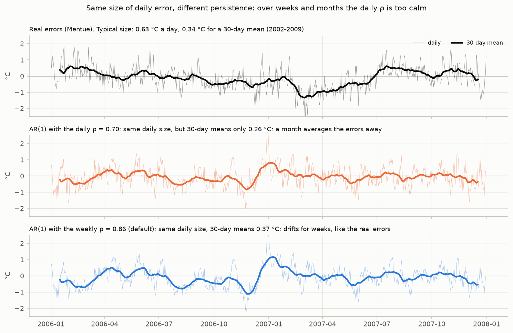

*Figure 8. Same daily size, different persistence (Mentue). The typical error
of a 30-day mean is 0.34 °C for the real errors, 0.26 °C with the daily ρ and
0.37 °C with the weekly ρ.*

Figure 9 and the table below show the same on all three rivers, for averages
from 1 to 90 days. They also show two other ways to choose a single ρ, for
comparison.


*Figure 9. The typical error of an average, as each choice of ρ gives it,
divided by the real one. 1 is right. Above 1 the ranges are wider than needed;
below 1 they are too narrow. Bands: the six river and version cases. Lines:
their median.*

| Averaging period | daily ρ | ρ matched to the size of a 7-day mean | weekly ρ (default) | ρ matched to month-to-month persistence |
|---|---|---|---|---|
| ρ itself | 0.70–0.86 | 0.73–0.88 | 0.86–0.95 | 0.94–0.96 |
| 1 day | 1.00 | 1.00 | 1.00 | 1.00 |
| 7 days | 0.94–0.98 | 1.00 | 1.09–1.17 | 1.09–1.26 |
| 14 days | 0.84–0.90 | 0.90–0.94 | 1.08–1.17 | 1.09–1.38 |
| 30 days | 0.70–0.77 | 0.75–0.81 | 1.02–1.11 | 1.07–1.46 |
| 60 days | 0.60–0.68 | 0.65–0.73 | 0.94–1.07 | 1.07–1.46 |
| 90 days | 0.58–0.70 | 0.62–0.76 | 0.91–1.15 | 1.16–1.42 |

*The typical error of an average, as each choice gives it, divided by the real
one: ranges over the three Swiss rivers, versions 5 and 8.*

Reading it:

- For a single 7-day mean, the daily ρ is about right in the calibration
  years. The weekly ρ makes it 9–17% too wide, which is cautious.
- Beyond two weeks, the daily ρ is too narrow, by about a third at 60–90 days.
  The weekly ρ stays within about 10–15% of the real errors up to three months.
- Yearly peaks, counts of warm days and probabilities that a limit was exceeded
  depend on how errors hang together over a season. So they need the slow part
  too.

**The parameter ranges: wider.** ρ also sets how much information the
calibration contains. With persistent errors, n measured days count as only
n(1 − ρ)/(1 + ρ) independent ones (Figure 17, section 11). With the weekly ρ,
the Mentue's 2,907 days count as about 220 instead of about 520. So the
parameter ranges are about 1.5 times wider than with the daily ρ (1.5–1.8 times
on the three rivers).

**Where ρ is used:**

| Where | What ρ does there |
|---|---|
| DE-MCMC: the parameter ranges | sets the effective number of independent days in the default likelihood |
| DE-MCMC: the band for the calibration years | sets how long the random error added to each simulation lasts |
| `FORWARD` runs with intervals | the same, for each of the 1,000 series, using the σ and ρ stored with the chain |
| Cross-validation check (section 8) | the same, with each fold's own σ and ρ |
| `likelihood: "exact"` (not the default) | always uses the daily ρ, because that likelihood removes the correlation of consecutive days |

### Does it work? The evidence


*Figure 10. The validation suite's tests of the two choices: the share of
cases inside the stated 90% range. For parameter ranges, above 90% is cautious
and below is over-confident.*

- **Errors that really are AR(1)** (made-up data,
  [V4](../validation/REPORT.md#v4)). The weekly and daily estimates agree
  (ρ = 0.70 and 0.69), and every result is the same. The weekly choice costs
  nothing when there is no slow part.
- **Errors with a fast and a slow part, built like the real ones** (made-up
  data, V4 and [V9](../validation/REPORT.md#v9)). How often the 90% ranges
  contained the truth:
  - all parameter ranges: 98% with the weekly ρ, 89% with the daily ρ;
  - the range of the seasonal timing `a7`: 90% against 67%;
  - the ranges of yearly peaks and counts: 90–94% against 80–88%.
- **Real rivers, years not used for calibration** (V5, V9). Daily values: the
  same with both. 90% ranges for 7-day means held 89.1–93.6% of the time with
  the weekly ρ, against 82.7–88.5% with the daily ρ. Ranges for yearly peaks
  and counts held in 80–93% of river-years, against 53–87%.

### When to use which

| Situation | Setting |
|---|---|
| Any range or probability: intervals, limits, scenarios, cross-validation | `rho_timescale: "weekly"` (the default) |
| Reproducing results made with version 0.4.1 or earlier | `rho_timescale: "daily"` |
| Showing how much a conclusion depends on the choice | run both, and report both |
| You know ρ from another source (expert use) | `uncertainty_options.ar1_rho` in a `FORWARD` run |

The weekly estimate needs at least 140 pairs of complete 7-day windows a week
apart: about 21 complete weeks of daily measurements. With fewer, or with
measurements only every other day, the daily value is used, with a warning. A
few years of daily measurements give thousands of pairs.

### How to set it and check it

```yaml
uncertainty_options:
  noise_model: "ar1"        # the default
  rho_timescale: "weekly"   # the default; or "daily"
```

- DE-MCMC records `rho`, `rho_timescale` and `rho_likelihood` in
  `MCMC_chain_*_meta.json`.
- Every `FORWARD` run uses the chain's error model and ρ, and prints them, for
  example `Using rho=0.8585 carried from calibration run ...`. A different
  value set in the FORWARD settings is used, with a note in `summary.md`.
- To check it at your site, run a cross-validation (section 8). In
  `cv_interval_coverage.csv`, the 7-day mean column should be close to the
  stated levels. In `cv_yearly_statistics_summary.csv`, the yearly statistics'
  ranges should hold about as often as stated.

### Questions and criticisms

**Is this a standard method?** The parts are standard. AR(1) error models are
widely used in hydrology (Sorooshian and Dracup, 1980; Schoups and Vrugt, 2010;
Evin et al., 2014). The effect of persistence on averages is a textbook result
(Bayley and Hammersley, 1946). Choosing the AR(1) to match how averages carry
over from one week to the next is pyair2stream's own approximation. It is not
published under this name. That is why it is explained in full here, tested
in the validation suite (V4, V5, V9), and why the older choice is still
available.

**Why not use a model with two memories, a fast one and a slow one?** That is
the better model, in principle. It is not implemented, for three reasons:

- it adds two more numbers to estimate, alongside up to 8 model parameters;
- a few years of data contain only a few dozen independent slow episodes, so
  the size and length of the slow part would be poorly known;
- the likelihood and the effective number of days would need new formulas,
  which would need their own validation.

The single weekly ρ meets the coverage targets in the tests. A model with two
memories remains a possible future improvement.

**Why a week, and not a day or a month?** Figure 9 answers this. Matching a
day misses the slow part. Matching a month gives ρ = 0.94–0.96, and ranges up
to 1.46 times too wide. A week is the shortest period over which the slow part
dominates. The week-to-week match stays within about 0.9 to 1.2 of the real
errors from 1 to 90 days. A few years of data also give thousands of
pairs of weeks, so the estimate is stable. And many temperature standards are
set on 7-day means.

**Why match how the errors carry over between weeks, not the size of a weekly
mean?** The size of one 7-day mean says nothing about whether the next week is
likely to be off in the same direction. Yearly peaks, counts of warm days and
monthly means depend on that. Matching the size of a 7-day mean (ρ =
0.73–0.88) gets a single 7-day mean right, but it is too narrow for longer
periods: 0.75–0.81 of the real error at 30 days (Figure 9).

**Doesn't it get the first few days wrong?** A little. It overstates how
strongly an error carries over to the next few days (Figure 4). This makes
ranges for averages over 3 to 14 days 5–17% wider than needed. That errs on
the side of caution. Single-day ranges are not affected.

**Doesn't it make the parameter ranges too wide?** For some parameters, yes.
One ρ sets the width of every parameter's range.

- Parameters whose effect changes slowly over the year (the constant `a1`, the
  seasonal size `a6` and timing `a7`) need the full allowance for slow errors.
  With the daily ρ, the range of `a7` was too narrow: in the test, it contained
  the truth 67% of the time instead of 90% (V4). With the weekly ρ it held
  (90%).
- Parameters whose effect changes from day to day (`a2`, `a3`) then get ranges
  two to three times wider than they need.

A range that is too wide errs on the side of caution. One that is too narrow
claims more than the data show. Rely on the predictions, which held their
stated levels, rather than on single parameter values (section 11).

**Why take the larger of the daily and weekly values?** Two reasons. Errors are
never less persistent than consecutive days show. And when the errors are only
weakly correlated, the weekly estimate alone is imprecise; the daily value then
sets a floor. For errors that really are AR(1), the two agree anyway (0.70 and
0.69 in V4).

**What if ρ comes out very high (0.99)?** Then the errors last for months. That
usually means a systematic error, such as a bias in one season. pyair2stream
warns when this happens. Look at the error by month (section 12), and try
another model version.

**Why not resample the real errors instead (a block bootstrap)?** Resampling
blocks of the real errors would keep both memories without a model (Künsch,
1989). But it needs a block length, which is the same kind of choice. Long
blocks leave few independent blocks in a few years of data. And it cannot
produce errors larger than those already seen. It is not implemented. It would
be a reasonable cross-check.

**Is ρ tuned to make the tests pass?** No. ρ is measured on the calibration
years only, with a rule fixed in advance. Every `FORWARD` run, and every
cross-validation fold, uses the σ and ρ measured on its own calibration data.
The years the tests check were never used to set ρ.

**Does it overlap with the correction of yearly statistics (section 9)?** No.
ρ sets the *spread* of the simulations. The correction moves their *centre* by
the model's average error in that statistic. They fix different things, and
both are needed (V11 used both).

**How much does my conclusion depend on it?** Run once more with
`rho_timescale: "daily"` and compare. For single days, the answer hardly
changes. For weekly or longer quantities, the daily setting gives narrower
ranges and more extreme probabilities. If your conclusion changes between the
two, say so.

### Limits

- **One ρ cannot follow two memories.** The weekly ρ is slightly too wide for
  averages over 3 to 14 days. Real errors that last for months (Figure 8, top)
  are only partly reproduced.
- **Heavier tails.** Real errors are occasionally larger than a normal
  distribution allows. This hardly matters up to 95% intervals, but matters at
  99% (section [13](#13-choosing-the-level-90-95-or-99)).
- **The same size all year.** Real errors differ by season: on the Swiss
  rivers, by up to about a factor of two between months. The error model uses
  one size for the whole year. Check the coverage in the season of your limit:
  validation V5 reports summer coverage separately.
- **The past errors are assumed to describe the future ones.** In years unlike
  the calibration years, errors are often somewhat larger (section
  [6](#6-daily-prediction-intervals)).

### What it rests on

Describing model errors as autocorrelated, and fitting them alongside the
model, is long established in hydrology (Sorooshian and Dracup, 1980; Schoups
and Vrugt, 2010; Evin et al., 2014). Errors at several time scales are known to
matter for aggregated quantities (McInerney et al., 2020). The variance of an
average of correlated values (Figures 5 and 9) is a textbook result (Bayley and
Hammersley, 1946). So is the effective number of independent values (Zwiers
and von Storch, 1995). Choosing ρ at the weekly scale is pyair2stream's own,
documented approximation.
[METHODS §12](METHODS.md#error-persistence-how-it-is-estimated-and-why-the-weekly-scale) gives
the formulas and the reasoning, and validation V4, V5 and V9 test it.

---

## 6. Daily prediction intervals

### What it is

A band around the simulated water temperature that should contain the measured
value on a stated share of days, for example 90%.

### How it is made

1. 1,000 parameter sets are drawn from the MCMC chain.
2. The model is run with each, and an AR(1) error series (σ, ρ) is added.
3. On each day, the band runs from the 5th to the 95th percentile of the 1,000
   values (for a 90% band; the level is `uncertainty_options.prediction_interval`).

### When to use it

To show how uncertain the daily simulation is, to fill gaps in a record with an
honest range, or as a first look at a scenario. **Not** for anything spanning
several days (section [7](#7-weekly-means-yearly-peaks-days-above-a-limit)).

### How to run it

```yaml
# calibration
run_mode: "DE-MCMC"
uncertainty_options:
  prediction_interval: 90        # any level above 0 and below 100

# prediction, on the period of interest
run_mode: "FORWARD"
paths:
  calibration_metadata: "output/calibration/calibration_metadata.json"
forward_options:
  enable_prediction_intervals: true
  mcmc_chain_path: "output/calibration/MCMC_chain_<station>_<series>_1d.csv"
uncertainty_options:
  prediction_interval: 90        # the level of this run's band
  save_ensemble: true            # keep the 1,000 series (needed for section 7)
```

Outputs: `Forward_Prediction_Envelopes_*.csv` (lower, median and upper value of
each day) and, with `save_ensemble`, `Forward_Prediction_Ensemble_*.npz` (every
series).

### How to read it

The run reports its **coverage**: the share of measured days inside the band
(in the console and the `_meta.json`). On the calibration years it is close to
the stated level almost automatically, because σ and ρ were measured there.
What counts is the coverage on years the model
was **not** calibrated on: a separate validation file, or cross-validation
(`cv_interval_coverage.csv`, section [8](#8-testing-on-years-the-model-has-not-seen-cross-validation)).

### What the validation shows

| Share of days inside the band | 50% | 80% | 90% | 95% | 99% |
|---|---|---|---|---|---|
| Synthetic data, model exactly right (V4) | within 1.3 points of the level at every level | | | | |
| Swiss rivers, 48 held-out years per version (V11) | 52–54% | 81–82% | 90% | 94.4–94.5% | 98.0–98.2% |
| Swiss rivers, later validation years (V5) | 43–53% | 75–79% | 85–89% | 91–95% | 95–99.5% |
| Swiss rivers, the hottest 10% of days by prediction, version 8 (V14) | | 80% | 91% | 95% | |
| The same, version 5 (no discharge term) (V14) | | 68% | 84% | 92% | |

Up to 95% the bands hold when averaged over many years. In years unlike those
calibrated on (the validation periods of V5 came after the calibration periods,
and the model's errors there were somewhat larger), they are somewhat narrower
than stated. At 99% they miss about twice as many days as stated. On the
hottest days, where limits are breached, version 8's bands held as stated;
version 5's did not, because it predicted its hottest days about 0.5 °C too
warm ([V14](../validation/REPORT.md#v14)).

### What it rests on

The band is a posterior predictive interval, the standard Bayesian way of
combining parameter uncertainty and random error into a prediction (Gelman et
al., 2013). Checking intervals by their coverage on independent data is standard
practice in hydrology (Laio and Tamea, 2007; Renard et al., 2010).

---

## 7. Weekly means, yearly peaks, days above a limit

### The rule: compute it in each series

The daily band says how uncertain each day is on its own. It does not say how
uncertain a 7-day mean, a yearly peak or a count of days is, because those depend
on how the errors of successive days hang together. The only correct way is to
compute the statistic in each of the 1,000 series, then take the range across
series (Figure 11).


*Figure 11. Mentue, 2011. Counted series by series, the number of days above 18 °C
has a 90% range of 13 to 26 days, and 21 were measured. Counting the days on
which the band's lower or upper edge is above 18 °C gives 9 and 33 days: a range
almost twice as wide, and with no stated chance at all.*

### How to do it

```python
from pyair2stream import scenario
ens, dates = scenario.load_ensemble("output/prediction/Forward_Prediction_Ensemble_<...>.npz")

# the three yearly statistics, in every series
stats = scenario.year_statistics(ens, dates, threshold=18.0)
peak = stats[2011]["highest 7-day mean"]          # 1,000 values, one per series
low, high = scenario.central_range(peak, 90)      # its 90% range
p_exceeded = (peak > 20.0).mean()                 # probability that a 20 °C limit was exceeded

# other quantities
weekly = scenario.aggregate(ens, dates, how="mean", freq="7D")      # fixed 7-day blocks
runs = scenario.exceedance(ens, 18.0, consecutive_days=3)           # days in runs of 3+ days above 18 °C
```

`year_statistics` gives, for each year: the highest daily mean, the highest 7-day
moving mean (the day and the six before it) and the number of days above a
threshold. A year the dates cover only in part (at either end of the file)
is left out, with a warning. If your standard defines a statistic differently (fixed weeks, a
season, a 30-day mean), compute it the same way: once per series.

### The probability that a limit was exceeded

It is the share of series in which the statistic is above the limit. Three
points to know:

- **It is a probability, not a verdict.** 0.6 means the model cannot tell
  whether the limit was exceeded, and says so honestly. Report it as such.
- **It has a small sampling error.** With 1,000 series it is precise to about
  ±0.03 (95%), because it is a share counted from a finite number of series.
  If the answer is close to a decision threshold, run more series
  (`forward_options.n_samples`).
- **It does not depend on the interval level you choose** (section [13](#13-choosing-the-level-90-95-or-99)):
  only the reported ranges do.

For a **yearly** statistic, use the corrected probability (section [9](#9-correcting-yearly-statistics-for-the-models-bias)).

### What it rests on

Estimating probabilities and ranges from an ensemble of simulations is standard
in forecasting (Wilks, 2011). That the percentile of a sum is not the sum of
percentiles, and therefore that a statistic must be computed before taking
percentiles, is a basic property of probability.

---

## 8. Testing on years the model has not seen: cross-validation

### What it is

The model is calibrated with one year hidden, then asked to predict that year.
This is repeated for every year except the first one or two, which are always
used for calibration (`min_train_years`; the model needs earlier data to start
from). Each prediction is honest, because the year's measurements played
no part in it.

### Why

A model always fits the years it was calibrated on. The question that matters
for a decision is how well it predicts other years, and whether its stated
ranges hold there. Cross-validation answers that with your own data, at your own
site.

### What is hidden, and what is not

Only the year's measured **water temperatures** are hidden. Its air temperature
and discharge are kept, and the year is predicted from them, just as any real
prediction is made from the inputs of the period predicted. That is how
cross-validation is defined: hide what is predicted, keep what it is predicted
from. The model never uses measured water temperature, so hiding it removes
everything the year could tell the model about the answer.

Validation [V12](../validation/REPORT.md#v12) checked this on 96 held-out years
of three Swiss rivers. Hiding the year's air temperature and discharge from the
calibration as well, or leaving two months unused on each side of the year,
changed no year's error by more than 0.01 °C, and did not change how often the
ranges held.

### How to run it

```yaml
run_mode: "DE"
Qmedia: 1.4915                 # your calibration's mean discharge (here the Mentue's): every fold scales flow alike
cross_validation:
  enabled: true
  min_train_years: 0           # hold out every year but the first: the check needs as many years as possible
  threshold: 18                # °C: the threshold of your question, for "days above threshold"
  season_months: [6, 7, 8, 9]  # a year counts if 80% of these months was measured (default: the 4 warmest)
uncertainty_options:
  prediction_interval: 90      # the level you intend to report
```

### What it writes, and how to read each

| File | What it tells you |
|---|---|
| `cv_results.csv` | the error (RMSE, NSE, KGE) in each held-out year, and the parameters fitted without it; jackknife parameter intervals (section [11](#11-how-well-are-the-parameters-known)) |
| `cv_bias_by_month.csv` / `.png` | the mean error by month and season in the held-out years (section [12](#12-mean-error-by-month-and-season)) |
| `cv_interval_coverage.csv` | the share of held-out days, and of 7-day means, inside the interval at 50%, 80%, 90%, 95% and your level |
| `cv_yearly_statistics.csv` | for each held-out year and yearly statistic: the measured value, the predicted median and range, the PIT and the deviation (measured minus predicted median) |
| `cv_yearly_statistics_summary.csv` | for each statistic: how often the ranges held at each level, the range expected by chance, and the mean deviation with its 95% interval |

### The PIT: where the measured value falls

For each held-out year, the check makes 1,000 simulations of the year's
statistic and records the share below the measured value: the **PIT**
(probability integral transform). If the predictions are right, the measured
value is equally likely to fall anywhere among the simulations, so over many
years the PITs spread evenly between 0 and 1. Their pattern shows what is wrong
when they do not (Figure 12). The share of years with a PIT between 0.05 and 0.95
is the coverage of the 90% range.

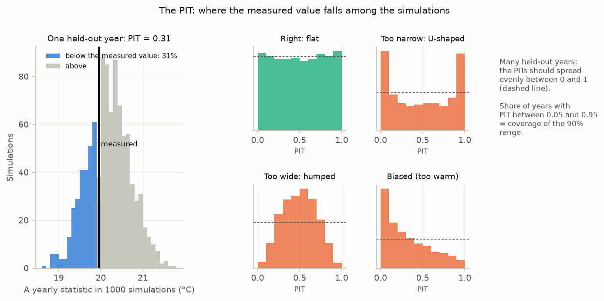

*Figure 12. Left: one held-out year; 31% of the simulations lie below the measured
value, so its PIT is 0.31. Right: what many years' PITs look like when the
ranges are right, too narrow, too wide, or biased (illustration).*

### "Expected by chance": why 8 out of 10 is not a failure

Even a perfect 90% range does not contain exactly 90% of a handful of years,
just as ten coin tosses rarely give exactly five heads. The summary therefore
gives the range of shares that chance alone produces: with 10 years, anything
from 7 to 10 inside a 90% range is consistent with a correct range (Figure 13).
A share outside that range is evidence that the ranges are wrong; a share inside
it is no proof that they are right, only that the years available cannot show
otherwise. With fewer than about 5 held-out years the check says little.

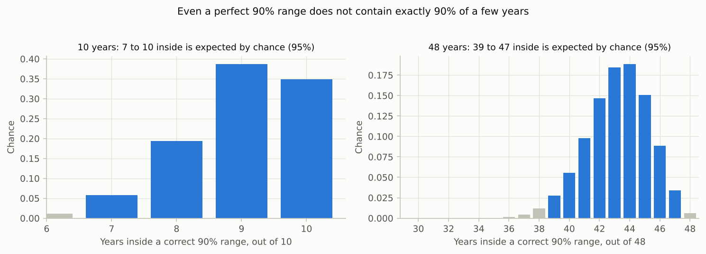

*Figure 13. How many years a correct 90% range contains by chance: 7–10 of 10
years, 39–47 of 48 (central 95% of outcomes).*

### The mean deviation: is the model biased in that statistic?

The deviation is the measured value minus the predicted median. Its mean over
the held-out years is the model's average error in the statistic, given with a
95% confidence interval. An interval that excludes zero means the model is
consistently too warm (negative) or too cool (positive) in that statistic. That
is what section [9](#9-correcting-yearly-statistics-for-the-models-bias)
corrects.

### Limits

- The check's simulations use each fold's best-fit parameters, not a full MCMC,
  so their ranges are slightly narrower than a `FORWARD` run's (parameters add
  little to the width; Figure 1). The check therefore errs towards finding
  ranges too narrow, not too wide.
- Years are treated as independent. A long drift (a river that slowly changes)
  breaks that.
- The inputs are measured ones. Cross-validation shows how well the model does
  with correct air temperature and discharge; a prediction from projected or
  borrowed inputs (a climate model, another station, a flow scenario) carries
  their errors on top.
- Each year is predicted from a calibration on the other years, later ones
  included. For predicting the future, a test that uses only earlier years is
  stricter: in V12 it was as accurate, but its 90% intervals held on 87% of days
  instead of 90%. For predictions of future years, quote the later-years tests
  ([V5](../validation/REPORT.md#v5), [V10](../validation/REPORT.md#v10)) as well.

### What it rests on

Cross-validation is a standard way to estimate how well a model predicts new
data (Stone, 1974), and testing a hydrological model on periods it was not
calibrated on is a long-standing requirement in hydrology (Klemeš, 1986).
Hiding what is predicted and keeping what it is predicted from is how both are
done (Hastie et al., 2009; Coron et al., 2012); using the inputs of the period
predicted is not "leakage", which is information a real prediction would not
have (Kaufman et al., 2012). The
PIT and its histogram are the standard check of probabilistic predictions in
weather forecasting and hydrology (Dawid, 1984; Hamill, 2001; Gneiting et al.,
2007; Laio and Tamea, 2007).

---

## 9. Correcting yearly statistics for the model's bias

### Why it is needed

The model's error on the hottest days of the year is not always its typical
error. Calibrated on the whole year, it can put the summer peak systematically
too high at one river and too low at another (Figure 14). Random error of the
typical size cannot fix that: the predicted range is centred in the wrong place,
so it misses the measured peak more often than it states. On the Swiss rivers,
uncorrected 90% ranges for yearly statistics held in only 73–92% of 48 held-out
years per version ([V11](../validation/REPORT.md#v11)).

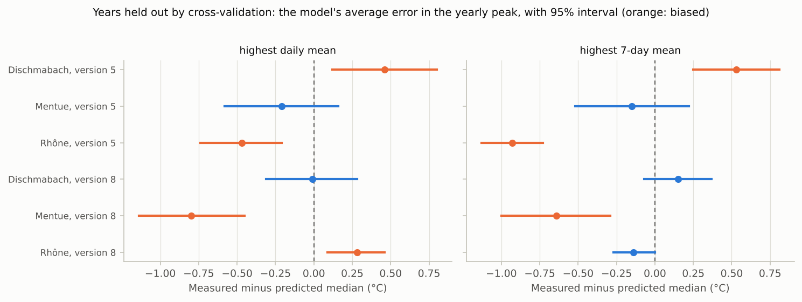

*Figure 14. The model's average error in the yearly peak, in years held out by
cross-validation. Orange: a bias whose 95% interval excludes zero. Version 8
puts the Mentue's peak 0.6–0.8 °C too high; version 5 puts the Rhône's too high
and the Dischmabach's too low.*

### How it works

1. **The check** (section [8](#8-testing-on-years-the-model-has-not-seen-cross-validation))
   gives the deviation in each held-out year: how far the measured statistic
   was from the predicted median.
2. **The correction** shifts each simulated value of the statistic by the mean
   of those deviations. Because that mean is itself uncertain (it comes from a
   few years), each simulation is shifted by a slightly different amount: the
   mean plus a random draw of its uncertainty (its standard error times a
   Student t variable, the standard allowance for a mean estimated from few
   values). With few years the corrected range is therefore wider.

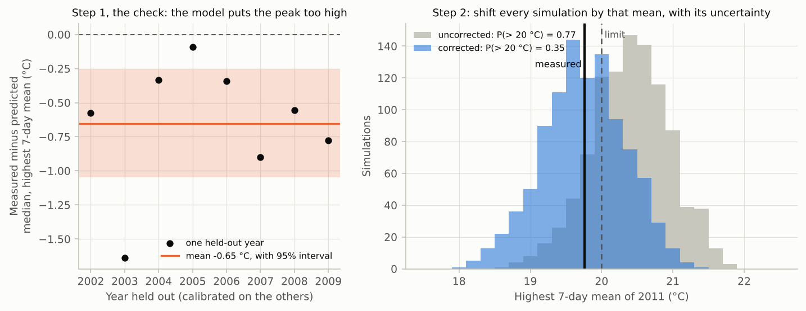

*Figure 15. Example 03. Left: in the seven held-out years of 2003–2009 the
measured highest 7-day mean was on average 0.65 °C below the prediction (95%
interval 0.20–1.10 °C). Right: corrected, the probability that 2011 exceeded a
20 °C limit falls from 0.77 to 0.34; the measured value was 19.8 °C, below the
limit.*

### When to use it

For every **yearly** statistic (a peak, a count of days above a threshold) when
cross-validation is available with at least 5 held-out years, and **always**, not
only when the check finds a bias. Deciding afterwards would let the result steer
the method. Report the corrected probability and range, and give the
uncorrected ones and the check alongside for transparency.

### How to run it

```python
import pandas as pd
from pyair2stream import scenario

check = pd.read_csv("output/check/cv_yearly_statistics.csv")
dev = check[check.statistic == "highest 7-day mean"].deviation         # the same statistic as the question
peak = scenario.year_statistics(ens, dates, threshold=18.0)[2011]["highest 7-day mean"]
peak_corrected = scenario.correct_statistic(peak, dev, seed=1)
p_exceeded = (peak_corrected > 20.0).mean()
```

The statistic, threshold and season must be defined the same way in the check
and in the question.

### What the validation shows

| Held-out years inside the range (V11, 48 per version) | 80% | 90% | 95% | 99% |
|---|---|---|---|---|
| uncorrected | 56–85% | 73–92% | 85–94% | 92–98% |
| corrected | 75–85% | 85–94% | 92–100% | 100% |

After the correction every statistic was within the range expected by chance at
80%, 90% and 95%, and the measured values sat on average at the middle of the
simulations (mean PIT 0.48–0.50, against 0.31–0.52 before). Applied to genuinely
later years (V9 part C), the corrected probabilities were closer to what
happened for 5 of 6 combinations of model version and statistic. The highest
**daily** mean remains the hardest statistic: its corrected 90% ranges held in
85% of held-out years, and in 11 of 15 later years for version 8.

### Limits

- It assumes the model's average bias in the statistic is the same in the years
  predicted as in the years held out.
- It corrects the centre of the range, not its shape.
- It applies to yearly statistics. Ranges for daily values and 7-day means are
  much less affected (sections [6](#6-daily-prediction-intervals) and [13](#13-choosing-the-level-90-95-or-99)).

### What it rests on

Correcting a model's systematic error with statistics of its past errors is
standard practice in weather forecasting, where it is called model output
statistics (Glahn and Lowry, 1972) or, for ensembles, ensemble model output
statistics (Gneiting et al., 2005). pyair2stream's version is the simplest form,
a shift, estimated only from years other than the one predicted, with its
uncertainty carried through.

---

## 10. Comparing two scenarios

### What it is

The change a different flow or climate would make, for example "how much warmer
would the river have been with 30% of its flow abstracted?", with an uncertainty
band for the **change itself**.

### Why pairing matters

Run alone, each scenario's range is wide, and the two overlap almost entirely
(Figure 16, left). But most of that width is shared: a parameter set that makes
one scenario warm makes the other warm too. Pairing the two runs, so that series
number k uses the same parameter set and the same daily error in both, cancels
everything they share. What remains is the uncertainty of the difference.

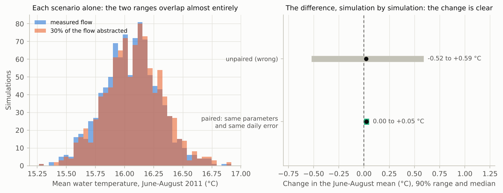

*Figure 16. Example 04. Left: each scenario's June–August 2011 mean, with a
90% range 0.8 °C wide. Right: the change, paired, is 0.00 to +0.05 °C (90% range);
subtracting unpaired series would give −0.56 to +0.58 °C and suggest that the
change could go either way.*

### How to run it

1. Run scenario A with `save_ensemble: true`.
2. Run scenario B from the same chain with `save_ensemble: true` and
   `forward_options.reuse_sample_indices_from:` set to scenario A's
   `Forward_Prediction_Ensemble_*_meta.json`.
3. `diff = scenario.paired_difference_from_files(path_b, path_a)` refuses to
   subtract runs that did not use the same parameter sets.

Both runs must use the calibration's `Qmedia` (`paths.calibration_metadata`):
recomputing it from the scenario's flows would cancel the flow change.

### Limits

The band shows **parameter uncertainty only**. Pairing assumes the model's error
on a given day would have been the same under both scenarios. A scenario far
outside the calibrated flows (the run warns when more than 1% of days are) is an
extrapolation.

### What it rests on

Using the same random numbers for the runs being compared ("common random
numbers") is a standard technique in simulation for estimating differences
precisely (Law, 2015). The validation checks that the paired difference equals
the exact effect where it is known ([V8](../validation/REPORT.md#v8)).

---

## 11. How well are the parameters known?

### MCMC in plain words

MCMC is a guided random walk through the possible parameter values. It spends
time in each region in proportion to how plausible the parameters there are,
given the data and the bounds, so the places it visits most are the most
plausible parameters, and the spread of the places it visits is their
uncertainty. pyair2stream
runs 32 walkers at once, each proposing moves along the difference between two
others (the differential-evolution move; ter Braak, 2006), which handles
parameters that trade off against each other.

What goes into it:

- **The prior**: before seeing the data, every value inside `parameter_bounds`
  is equally plausible, and values outside are impossible. Results can depend
  on the bounds; a parameter piled up against a bound means the bound is too
  narrow.
- **The likelihood**: how well a parameter set explains the data. pyair2stream's
  default is the least-squares fit (as the original authors calibrated), with
  the number of days replaced by the **effective number of independent days**.
  Persistent errors carry less information than independent ones (Figure 17):
  on the Mentue, 2,907 measured days count as 221 independent ones. Without
  that allowance the parameter intervals would be far too narrow. How ρ is
  chosen, and what the choice does to these intervals, is in section
  [5](#5-the-models-errors-their-size-and-how-long-they-last).

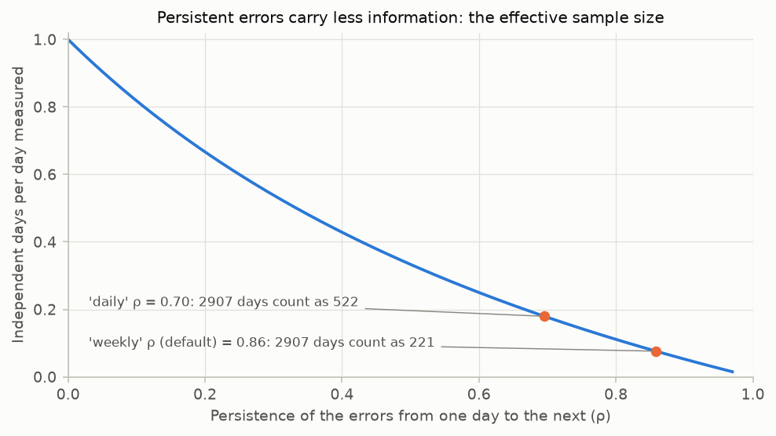

*Figure 17. The effective sample size: with errors that persist (ρ = 0.86), 2,907
days carry about as much information as 221 independent ones.*

### Has it converged?

The walk must run long enough to forget its starting point and to visit the
plausible region thoroughly. pyair2stream checks two standard diagnostics: the
run must be at least 50 times longer than the **autocorrelation time** (how many
steps it takes the walk to produce a new, independent sample), and **split-R̂**
(whether different walkers and different halves of the run agree) must be below
1.01. If not, the run stops with an error by default (`strict_convergence`),
because unconverged results are not valid. Try more steps (`mcmc_steps`), or a
simpler model version: a posterior that will not settle usually means the data
cannot pin down all the parameters.

### Parameter intervals

`parameter_significance_*.csv` gives each parameter's mean, standard deviation
and central interval at `uncertainty_options.parameter_interval` (default 90%),
and whether zero lies outside its central 95% (a test at the usual 5% level;
meaningful only for parameters where zero means "no effect": `a2`, `a4`, `a5`,
`a6`, `a8`).

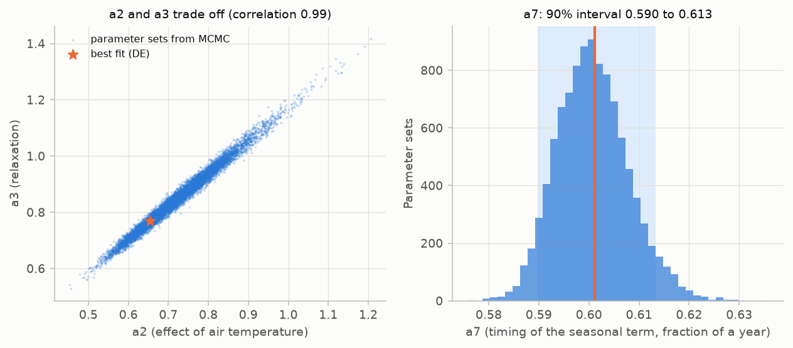

*Figure 18. Example 03. Left: `a2` and `a3` trade off; many combinations along
the diagonal fit almost equally well. Right: the seasonal timing `a7` is fixed
precisely (90% interval 0.590–0.613).*

Read parameter intervals with care:

- **Parameters trade off.** Each interval is for one parameter on its own. Do not
  combine the ends of several intervals (a high `a2` with a low `a3`): such
  combinations do not fit the data. Rely on predictions, which keep the
  trade-offs, rather than on individual parameter values. That many parameter
  sets can fit equally well is a general property of environmental models
  ("equifinality"; Beven, 2006).
- **One allowance for persistence widens every parameter equally.** It is about
  right for the slowly acting parameters (`a1`, `a6`, `a7`) and makes the
  intervals of the fast-acting ones (`a2`, `a3`) two to three times wider than
  necessary: cautious, not optimistic ([METHODS §12](METHODS.md#12-parameter-and-prediction-uncertainty-de-mcmc)).

### Jackknife intervals from cross-validation

Cross-validation fits the parameters once per held-out year. `cv_results.csv`
turns their spread into approximate intervals (the delete-one-year jackknife,
`jackknife_90_lower`/`upper`; level `parameter_interval`). Do **not** use the
`std` row as an uncertainty: the folds share most of their data, so it is far
too small.

The jackknife intervals depend on the optimizer too. Where parameters trade
off, one fold can end on a distant parameter set with almost the same fit, and
widen the interval. In [V12](../validation/REPORT.md#v12), another optimizer
seed alone changed version 8's jackknife standard errors by a factor of 0.35 to
1.55. For poorly determined parameters, treat them as indicative and repeat the
cross-validation with a second `random_seed`.

### What the validation shows

On synthetic data with known parameters, the default MCMC intervals (90%)
contained the true values 93–97% of the time, and the jackknife intervals 83–95%
([V4](../validation/REPORT.md#v4)). The parameters published for the Swiss
rivers (Piccolroaz et al., 2016) lay inside pyair2stream's MCMC intervals for 76
of 81 values ([V2](../validation/REPORT.md#v2)).

### What it rests on

Bayesian calibration by MCMC is standard in hydrology (Kuczera and Parent, 1998;
Vrugt et al., 2009). The sampler is emcee (Foreman-Mackey et al., 2013) with
the differential-evolution move (ter Braak, 2006); the convergence rules follow
Gelman et al. (2013). Reducing the number of observations to an effective number
for correlated errors is classical (Bayley and Hammersley, 1946; Zwiers and von
Storch, 1995); applying it inside a likelihood is an adjusted likelihood in the
sense of Pauli et al. (2011) and Ribatet et al. (2012), and is pyair2stream's
documented approximation. The jackknife is described by Efron and Tibshirani
(1993), and for blocks of dependent data by Künsch (1989).

---

## 12. Mean error by month and season

### What it is

`bias_by_month_*.csv` and `.png` (calibration and validation periods) and
`cv_bias_by_month.*` (held-out years) give the mean error in each calendar month,
season and the whole year, with a 95% interval.

### Why

A model can score well over the year and still be too warm in summer and too
cool in spring. For a summer limit, a summer bias matters more than the yearly
score: a model that is too warm overstates the chance a warm-water limit was
exceeded.

### How it is computed

The errors are first averaged within each year (a month counts in a year if at
least 10 of its days were measured), then the bias is the mean of those yearly
values, with interval mean ± t × standard deviation / √(number of years). Days
are not used as independent values, because errors persist for days to weeks
and an interval from days would be far too narrow.

### How to read it

An interval that excludes zero means the model is consistently biased in that
month. Use the held-out version (`cv_bias_by_month`) for the honest picture.
Where a bias remains in the season of your limit, compare model versions (on the
Rhône, version 5, which ignores discharge, was too warm every summer), and
report it.

---

## 13. Choosing the level: 90%, 95% or 99%?

### What a level means

A central L% range should miss the truth (100 − L)% of the time: a 90% range
about 1 time in 10, a 95% range 1 in 20, a 99% range 1 in 100. For normally
distributed errors, the half-width grows from 1.64 σ (90%) to 1.96 σ (95%) and
2.58 σ (99%) (Figure 19). The higher the level, the more it depends on the rare,
large errors, which are the hardest to describe.

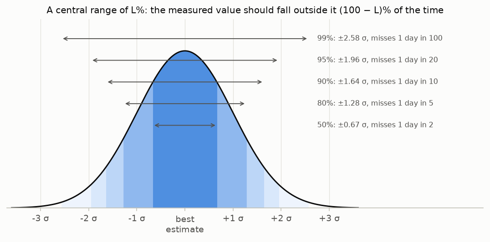

*Figure 19. Central ranges of a normal distribution.*

### Setting it

| Setting | Controls | Default |
|---|---|---|
| `uncertainty_options.prediction_interval` | every prediction range: daily bands, the cross-validation check | 90 |
| `uncertainty_options.parameter_interval` | every parameter range: MCMC summary, jackknife | 90 |
| fixed at 95% | tests for a difference from zero: mean bias by month, the check's mean deviation, "differs from zero" | |

**The probability that a limit was exceeded does not depend on the level.** It is
the share of all 1,000 series above the limit; the level only decides which
range you quote beside it.

### The record on the Swiss rivers

| Share inside the range | 50% | 80% | 90% | 95% | 99% |
|---|---|---|---|---|---|
| days, synthetic data (V4) | within 1.3 points of the level at every level | | | | |
| days, 48 held-out years per version (V11) | 52–54% | 81–82% | 90% | 94.4–94.5% | 98.0–98.2% |
| 7-day means, held-out years (V11) | 53–59% | 84–88% | 93–94% | 96–97% | 98.6–99.2% |
| days, later validation years (V5) | 43–53% | 75–79% | 85–89% | 91–95% | 95–99.5% |
| yearly statistics, corrected (V11) | 50–69% | 75–85% | 85–94% | 92–100% | 100% |

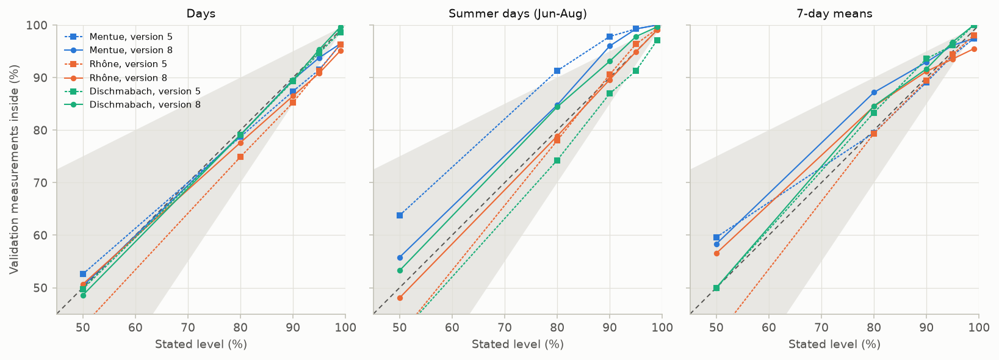

*Figure 20. Real rivers, later validation years (V5): stated level against the
share of measurements inside. On the dashed diagonal the ranges hold; the shaded
area is the accepted range (a miss rate between half and 1.5 times the stated
one).*

### Advice

- **90% (default)** holds well for days, 7-day means and corrected yearly
  statistics.
- **95%** holds for days and 7-day means over many years, and for corrected
  yearly statistics. In years unlike the calibration years it can be somewhat
  narrow (91–95% in V5). Check it at your site (`cv_interval_coverage.csv`).
- **99%** daily intervals missed about twice as many days as stated (98.0–98.2%
  held), because real errors have heavier tails than the normal distribution.
  Do not quote a 99% daily interval without showing its coverage at your site.
  For yearly statistics, 99% cannot be verified with the years usually
  available.
- Whatever level you choose, choose it **before** looking at the results, and
  report its coverage on years not used for calibration.

---

## 14. Warnings and what to do about them

| Message | Meaning | What to do |
|---|---|---|
| `MCMC did not converge within ... steps` | the parameter sets are not yet a reliable sample | more `mcmc_steps`, or a simpler model version; never use unconverged results for a decision |
| `... draws were excluded as numerically divergent` | some parameter sets make the simulation blow up (usually with an explicit integrator) | use `CRN` (the default); check `parameter_bounds` |
| `rho reached its upper limit of 0.99` | errors persist for months: a systematic error | look at the mean error by month; consider another model version |
| `the exact AR(1) likelihood treats the scored errors as independent` | with weekly or monthly scoring that likelihood ignores persistence | keep the default `likelihood: "least_squares"` |
| `The MCMC chain ... was fitted with ...` | the chain belongs to a calibration with another model version, integrator, `Qmedia`, `Tice_cover` or `min_theta_floor` | use the matching chain and `paths.calibration_metadata` |
| `the relaxation rate B is negative` / `zigzags from one day to the next` | physically impossible parameters, usually after weekly or monthly scoring | set the minimum of `a2` and `a3` to 0 and calibrate again |
| `... days ... have theta = Q/Qmedia outside the calibrated range` | the scenario's flows go beyond those calibrated on | treat the results as extrapolation |
| `Note: ... does not record the model version, integrator and Qmedia` | a chain from version 0.4.2 or earlier | make sure it matches, or rerun DE-MCMC |
| `Note: ... does not record the Tice_cover and min_theta_floor` | a chain or calibration from version 0.5.0 or earlier | make sure they match, or rerun the calibration |

---

## 15. Is it defensible?

When a result is used in a permit, a compliance assessment or a hearing, experts
are commonly asked whether the method has been tested, whether its error rate
is known, whether it rests on published and accepted methods, and whether the
result can be reproduced. In US courts these are the Daubert factors (Daubert v.
Merrell Dow Pharmaceuticals, 1993); guidance on environmental models asks the
same of model results (Jakeman et al., 2006; Refsgaard et al., 2007; US EPA,
2009). This is how pyair2stream answers them.

| Question | pyair2stream's answer |
|---|---|
| Is the method tested? | The [validation suite](../validation/REPORT.md) runs 15 checks with stated pass criteria, through the same code a user runs: identical results to the original Fortran, reproduction of the published results, recovery of known truths, coverage of intervals at several levels, and performance on three real rivers. Failures are reported, not hidden. |
| Is its error rate known? | Yes, as coverage at each level (section [13](#13-choosing-the-level-90-95-or-99)), on synthetic data and real rivers, and at your own site through cross-validation. |
| Does it rest on published methods? | Each component does (table below). The combination, and three approximations, are pyair2stream's own and documented as such. |
| Can the result be reproduced? | With `random_seed`, every run gives identical results. Each run records its settings (`calibration_metadata.json`, `_meta.json` with σ, ρ, the chain's content hash and the parameter sets used), and a FORWARD run refuses a chain from a different calibration. |

### What each component rests on

| Component | Published basis | What is pyair2stream's own | Evidence |
|---|---|---|---|
| The model | Toffolon and Piccolroaz (2015); Piccolroaz et al. (2016); Callahan and Moore (2025) | a Python version | V1, V2, V13, V15 |
| MCMC calibration | Kuczera and Parent (1998); ter Braak (2006); Foreman-Mackey et al. (2013); Gelman et al. (2013) | | V4 |
| Autocorrelated error model | Sorooshian and Dracup (1980); Schoups and Vrugt (2010); Evin et al. (2014) | ρ chosen at the weekly scale | V4, V5, V9 |
| Effective sample size in the likelihood | Bayley and Hammersley (1946); Pauli et al. (2011); Ribatet et al. (2012) | its use with the least-squares likelihood | V4 |
| Probabilities from an ensemble | Wilks (2011) | | V9 |
| Cross-validation and the PIT | Stone (1974); Klemeš (1986); Hastie et al. (2009); Coron et al. (2012); Dawid (1984); Gneiting et al. (2007) | | V11, V12 |
| Correction of yearly statistics | Glahn and Lowry (1972); Gneiting et al. (2005) | the shift with its uncertainty, from held-out years | V9 C, V11 |
| Paired scenarios | common random numbers (Law, 2015) | | V8 |

### What to state as limitations

- The model gives **daily means**; a limit on daily maxima needs a separate,
  justified step.
- The error model assumes normally distributed errors of constant size whose
  persistence is described by one number. Up to 95% this was adequate on the
  Swiss rivers; at 99% daily intervals were too narrow.
- Uncertainty is estimated from the calibration years and assumes the river
  behaves alike in the years predicted. In years unlike them, intervals were
  somewhat narrower than stated.
- Yearly statistics need the cross-validation correction; the highest daily
  mean remains the least reliable.
- The weekly ρ, the effective-sample-size likelihood and the correction of
  yearly statistics are validated approximations, not methods published under
  those names.
- The evidence comes from three Swiss rivers. Your river may differ: that is
  what the check at your site is for.

### How to word a result

> The model, calibrated on 2002–2009 and checked by leave-one-year-out
> cross-validation (7 held-out years), gives a probability of 0.34 that the
> highest 7-day mean water temperature in 2011 exceeded 20 °C (90% range for
> that statistic 18.8–20.8 °C), after correcting for the model's average error
> in that statistic in the held-out years (−0.65 °C, 95% interval −1.10 to
> −0.20 °C). Uncorrected, the probability would be 0.77. pyair2stream 0.5.0,
> commit `<sha>`, random seed 42.

### Checklist before you report

1. The model validates well on years not used for calibration, and no parameter
   sits on a bound.
2. The MCMC run converged.
3. Multi-day and yearly quantities were computed in each simulated series.
4. Yearly statistics were checked by cross-validation and corrected, with the
   same definition, threshold and season as the question.
5. The coverage at the level you report was checked at your site.
6. The mean error by month shows no unexplained bias in the season of the limit.
7. The config, input files, commit, `pip freeze` and output folder are kept.

---

## 16. A worked example, from data to a statement

[Example 03](../examples/03_compliance/README.md) does all of this on the
Mentue. `python examples/03_compliance/run.py` runs these three steps, then
computes the statistics, the correction and the table:

```bash
pyair2stream --config examples/03_compliance/calibrate.yaml   # DE-MCMC on 2002-2009: parameters, σ, ρ
pyair2stream --config examples/03_compliance/predict.yaml     # FORWARD on 2010-2012: 1,000 series
pyair2stream --config examples/03_compliance/check.yaml       # cross-validation of 2002-2009
```

| Year | P(7-day mean > 20 °C), corrected | uncorrected | Measured highest 7-day mean |
|---|---|---|---|
| 2010 | 0.57 | 0.92 | 21.0 °C (exceeded) |
| 2011 | 0.34 | 0.77 | 19.8 °C (not exceeded) |
| 2012 | 0.14 | 0.51 | 19.6 °C (not exceeded) |

The check found that the model put the yearly peak 0.65 °C too high in the
held-out years. Corrected, the probabilities matched what happened better (Brier
score, the mean squared difference between probability and outcome; Brier,
1950: 0.11 against 0.29), and all three measured values lay inside the corrected 90%
ranges.

---

## 17. Common mistakes

| Mistake | Why it is wrong | Instead |
|---|---|---|
| Reading a weekly mean, a yearly peak or a count of days off the daily band | the band's edges are not the edges of those statistics (Figure 11) | compute the statistic in each series (section [7](#7-weekly-means-yearly-peaks-days-above-a-limit)) |
| `noise_model: "iid"` for multi-day quantities | errors that are new every day average out, so ranges are far too narrow (Figure 5) | keep `"ar1"` |
| Reporting an uncorrected probability for a yearly statistic | the model can be biased at the peaks (Figure 14) | check and correct (sections [8](#8-testing-on-years-the-model-has-not-seen-cross-validation), [9](#9-correcting-yearly-statistics-for-the-models-bias)) |
| Correcting only when the check shows a bias | the result then steers the method | always correct yearly statistics |
| Calling 8 of 10 years inside a 90% range a failure | chance alone gives 7–10 (Figure 13) | compare with the range expected by chance |
| Subtracting two scenario runs that used different parameter sets | the shared uncertainty does not cancel (Figure 16) | `reuse_sample_indices_from` and `paired_difference_from_files` |
| Recomputing `Qmedia` from scenario flows | it cancels the flow change | `paths.calibration_metadata` |
| Using the `std` row of `cv_results.csv` as a parameter uncertainty | the folds share most of their data | the jackknife rows |
| Combining the ends of several parameter intervals | parameters trade off (Figure 18) | rely on predictions |
| Quoting a 99% daily interval unchecked | real errors have heavier tails | check its coverage at your site (section [13](#13-choosing-the-level-90-95-or-99)) |
| Checking a band only on the days the limit was exceeded | those days were chosen partly because their error was positive: even a correct 90% band is exceeded there far more often than 10% of the time (V14) | check on the days predicted to be hottest, or with the hottest air |
| Using an unconverged chain | its parameter sets are not a valid sample | more steps or a simpler version |

---

## 18. References

- Bayley, G. V. and Hammersley, J. M. (1946). The "effective" number of
  independent observations in an autocorrelated time series. *Supplement to the
  Journal of the Royal Statistical Society*, 8, 184–197.
- Beven, K. (2006). A manifesto for the equifinality thesis. *Journal of
  Hydrology*, 320, 18–36.
- Brier, G. W. (1950). Verification of forecasts expressed in terms of
  probability. *Monthly Weather Review*, 78, 1–3.
- Callahan, L. and Moore, R. D. (2025). Evaluation of the hybrid air2stream
  model for simulating daily stream temperature during extreme summer heat wave
  and autumn drought conditions. *Hydrological Processes*, 39(1), e70033.
  Data: Moore, R. D. and Callahan, L. (2024), Zenodo,
  https://doi.org/10.5281/zenodo.14502248.
- Coron, L., Andréassian, V., Perrin, C., Lerat, J., Vaze, J., Bourqui, M. and
  Hendrickx, F. (2012). Crash testing hydrological models in contrasted climate
  conditions: an experiment on 216 Australian catchments. *Water Resources
  Research*, 48, W05552.
- Daubert v. Merrell Dow Pharmaceuticals, Inc., 509 U.S. 579 (1993).
- Dawid, A. P. (1984). Statistical theory: the prequential approach. *Journal of
  the Royal Statistical Society A*, 147, 278–292.
- Efron, B. and Tibshirani, R. J. (1993). *An Introduction to the Bootstrap*.
  Chapman & Hall.
- Evin, G., Thyer, M., Kavetski, D., McInerney, D. and Kuczera, G. (2014).
  Comparison of joint versus postprocessor approaches for hydrological
  uncertainty estimation accounting for error autocorrelation and
  heteroscedasticity. *Water Resources Research*, 50, 2350–2375.
- Foreman-Mackey, D., Hogg, D. W., Lang, D. and Goodman, J. (2013). emcee: the
  MCMC hammer. *Publications of the Astronomical Society of the Pacific*, 125,
  306–312.
- Gelman, A., Carlin, J. B., Stern, H. S., Dunson, D. B., Vehtari, A. and Rubin,
  D. B. (2013). *Bayesian Data Analysis*, 3rd edn. CRC Press.
- Glahn, H. R. and Lowry, D. A. (1972). The use of model output statistics (MOS)
  in objective weather forecasting. *Journal of Applied Meteorology*, 11,
  1203–1211.
- Gneiting, T., Raftery, A. E., Westveld, A. H. and Goldman, T. (2005).
  Calibrated probabilistic forecasting using ensemble model output statistics
  and minimum CRPS estimation. *Monthly Weather Review*, 133, 1098–1118.
- Gneiting, T., Balabdaoui, F. and Raftery, A. E. (2007). Probabilistic
  forecasts, calibration and sharpness. *Journal of the Royal Statistical
  Society B*, 69, 243–268.
- Hamill, T. M. (2001). Interpretation of rank histograms for verifying ensemble
  forecasts. *Monthly Weather Review*, 129, 550–560.
- Hastie, T., Tibshirani, R. and Friedman, J. (2009). *The Elements of
  Statistical Learning*, 2nd edn. Springer.
- Jakeman, A. J., Letcher, R. A. and Norton, J. P. (2006). Ten iterative steps
  in development and evaluation of environmental models. *Environmental
  Modelling & Software*, 21, 602–614.
- Kaufman, S., Rosset, S., Perlich, C. and Stitelman, O. (2012). Leakage in data
  mining: formulation, detection, and avoidance. *ACM Transactions on Knowledge
  Discovery from Data*, 6(4), 15.
- Klemeš, V. (1986). Operational testing of hydrological simulation models.
  *Hydrological Sciences Journal*, 31, 13–24.
- Kuczera, G. and Parent, E. (1998). Monte Carlo assessment of parameter
  uncertainty in conceptual catchment models: the Metropolis algorithm.
  *Journal of Hydrology*, 211, 69–85.
- Künsch, H. R. (1989). The jackknife and the bootstrap for general stationary
  observations. *Annals of Statistics*, 17, 1217–1241.
- Laio, F. and Tamea, S. (2007). Verification tools for probabilistic forecasts
  of continuous hydrological variables. *Hydrology and Earth System Sciences*,
  11, 1267–1277.
- Law, A. M. (2015). *Simulation Modeling and Analysis*, 5th edn. McGraw-Hill.
- McInerney, D., Thyer, M., Kavetski, D., Laugesen, R., Tuteja, N. and Kuczera,
  G. (2020). Multi-temporal hydrological residual error modeling for seamless
  subseasonal streamflow forecasting. *Water Resources Research*, 56,
  e2019WR026979.
- Pauli, F., Racugno, W. and Ventura, L. (2011). Bayesian composite marginal
  likelihoods. *Statistica Sinica*, 21, 149–164.
- Piccolroaz, S., Calamita, E., Majone, B., Gallice, A., Siviglia, A. and
  Toffolon, M. (2016). Prediction of river water temperature: a comparison
  between a new family of hybrid models and statistical approaches.
  *Hydrological Processes*, 30, 3901–3917.
- Refsgaard, J. C., van der Sluijs, J. P., Højberg, A. L. and Vanrolleghem, P. A.
  (2007). Uncertainty in the environmental modelling process – a framework and
  guidance. *Environmental Modelling & Software*, 22, 1543–1556.
- Renard, B., Kavetski, D., Kuczera, G., Thyer, M. and Franks, S. W. (2010).
  Understanding predictive uncertainty in hydrologic modeling: the challenge of
  identifying input and structural errors. *Water Resources Research*, 46,
  W05521.
- Ribatet, M., Cooley, D. and Davison, A. C. (2012). Bayesian inference from
  composite likelihoods, with an application to spatial extremes. *Statistica
  Sinica*, 22, 813–845.
- Schoups, G. and Vrugt, J. A. (2010). A formal likelihood function for
  parameter and predictive inference of hydrologic models with correlated,
  heteroscedastic, and non-Gaussian errors. *Water Resources Research*, 46,
  W10531.
- Sorooshian, S. and Dracup, J. A. (1980). Stochastic parameter estimation
  procedures for hydrologic rainfall-runoff models: correlated and
  heteroscedastic error cases. *Water Resources Research*, 16, 430–442.
- Stone, M. (1974). Cross-validatory choice and assessment of statistical
  predictions. *Journal of the Royal Statistical Society B*, 36, 111–147.
- ter Braak, C. J. F. (2006). A Markov chain Monte Carlo version of the genetic
  algorithm Differential Evolution: easy Bayesian computing for real parameter
  spaces. *Statistics and Computing*, 16, 239–249.
- Toffolon, M. and Piccolroaz, S. (2015). A hybrid model for river water
  temperature as a function of air temperature and discharge. *Environmental
  Research Letters*, 10, 114011.
- US EPA (2009). *Guidance on the Development, Evaluation, and Application of
  Environmental Models*. EPA/100/K-09/003. US Environmental Protection Agency.
- Vrugt, J. A., ter Braak, C. J. F., Diks, C. G. H., Robinson, B. A., Hyman, J. M.
  and Higdon, D. (2009). Accelerating Markov chain Monte Carlo simulation by
  differential evolution with self-adaptive randomized subspace sampling.
  *International Journal of Nonlinear Sciences and Numerical Simulation*, 10,
  273–290.
- Wilks, D. S. (2011). *Statistical Methods in the Atmospheric Sciences*, 3rd
  edn. Academic Press.
- Zwiers, F. W. and von Storch, H. (1995). Taking serial correlation into account
  in tests of the mean. *Journal of Climate*, 8, 336–351.
