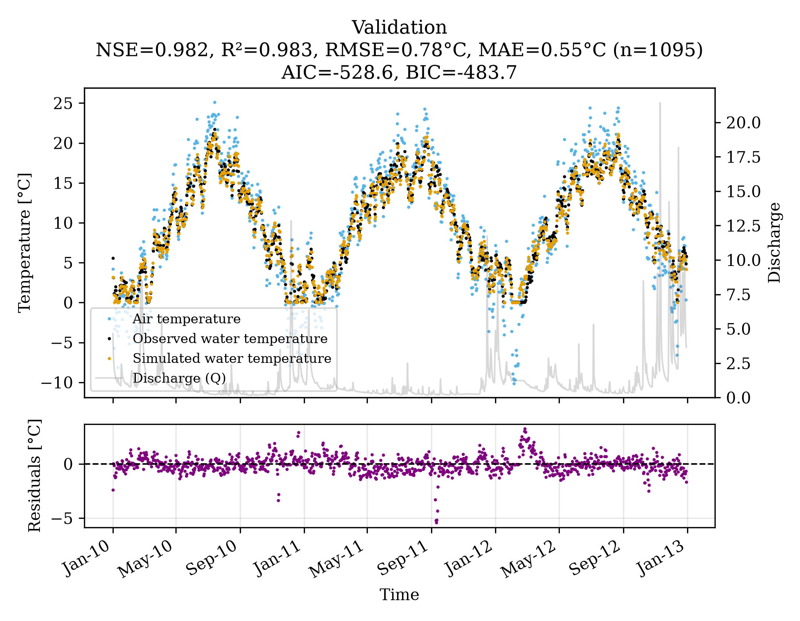

# 01 Quickstart: calibrate and test a model

**Question:** can air2stream reproduce the water temperature of the Mentue, a
small Swiss river, from air temperature and discharge, including in years it
was not calibrated on?

**Data:** daily air temperature, water temperature and discharge, 2002–2012
([`data/switzerland/`](../../data/switzerland/README.md)). The model is
calibrated on 2002–2009 and tested on 2010–2012.

## Run it

From the repository's top folder:

```bash
pyair2stream --config examples/01_quickstart/config.yaml
```

It takes under a minute. The last lines of the console output are:

```
DE Finished. Best internal negated objective: -0.985672
L-BFGS-B Finished. Best internal negated objective: -0.987927
Efficiency Index in calibration 0.9879266378568211
Consistency check passed.
```

The configuration ([`config.yaml`](config.yaml)) sets the model version (8,
the full model), the calibration method (DE) and `random_seed: 42`, so you get
exactly these numbers.

## Read the results

Everything is written to `examples/01_quickstart/output/`.

| | Calibration (2002–2009) | Validation (2010–2012) |
|---|---|---|
| NSE (1 = perfect) | 0.988 | 0.982 |
| RMSE | 0.63 °C | 0.78 °C |
| Mean absolute error | 0.49 °C | 0.55 °C |

These come from `goodness_of_fit_calibration_*.csv` and
`goodness_of_fit_validation_*.csv`. Validation is the score that matters: it is
measured on years the model has not seen. It is a little worse than
calibration, as expected.



*`validation_DE_NSE_Mentue.png`: observed (black) and simulated (orange) water
temperature for the validation years, with the residuals (observed minus
simulated) below. Look for long runs of residuals on one side of zero: they
show periods the model gets systematically wrong (here early 2012, after the
river froze).*

The calibrated parameters are on the first line of `1_DE_NSE_Mentue_c_1d.out`
and in `calibration_metadata.json`, which later runs can reuse (examples 02–04).
USER_GUIDE [§8](../../USER_GUIDE.md#8-understanding-the-output-files) explains every file.

## Use your own data

Copy `config.yaml`, point `paths` at your files (format:
USER_GUIDE [§5](../../USER_GUIDE.md#5-preparing-your-own-data)) and change the
names. Keep some years back for validation.

## Next

A single best fit has no error bars. Example [02](../02_uncertainty/README.md)
adds them.
