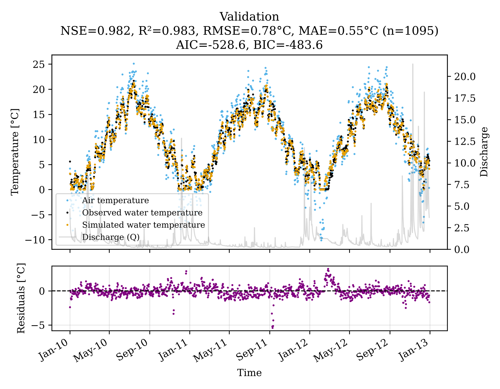

# 01 Quickstart: calibrate and test a model

**Question:** can air2stream reproduce the water temperature of the Mentue, a
small Swiss river, from air temperature and discharge? And can it predict
years it was not fitted to?

**Data:** daily air temperature, water temperature and discharge, 2002–2012
([`data/switzerland/`](../../data/switzerland/README.md)). The model is
calibrated (fitted) on 2002–2009 and tested on 2010–2012.

## Run it

From the repository's top folder:

```bash
pyair2stream --config examples/01_quickstart/config.yaml
```

It takes under a minute. Near the end, the console shows:

```
DE Finished. Best internal negated objective: -0.987657
L-BFGS-B Finished. Best internal negated objective: -0.987927
Efficiency Index in calibration 0.9879265649786034
Consistency check passed.
```

The settings file, [`config.yaml`](config.yaml), sets:

- the model version: 8, the full model;
- the calibration method: `DE` (Differential Evolution);
- `random_seed: 42`, so you get exactly these numbers.

## Read the results

Everything is written to `examples/01_quickstart/output/`.

| | Calibration (2002–2009) | Validation (2010–2012) |
|---|---|---|
| NSE (1 = perfect) | 0.988 | 0.982 |
| RMSE (typical daily error) | 0.63 °C | 0.78 °C |
| Mean absolute error | 0.49 °C | 0.55 °C |

These come from `goodness_of_fit_calibration_*.csv` and
`goodness_of_fit_validation_*.csv`. **The validation score is the one that
matters**, because the model has not seen those years. It is a little worse
than the calibration score, as expected.



*`validation_DE_NSE_Mentue.png`: measured (black) and simulated (orange) water
temperature in the validation years. The residuals (measured minus simulated)
are below. Look for long runs of residuals on one side of zero: they show
periods the model gets wrong. Here that is early 2012, after the river froze.*

Also look at `bias_by_month_validation_DE_NSE_Mentue.png`. It shows the average
error in each month, with a 95% interval. If an interval does not include
zero, the model is too warm or too cool in that month.

The fitted parameters are on the first line of `1_DE_NSE_Mentue_c_1d.out`. They
are also in `calibration_metadata.json`, which later runs reuse (examples
02–04). USER_GUIDE [§8](../../USER_GUIDE.md#8-understanding-the-output-files)
explains every file.

## Use your own data

1. Copy `config.yaml`.
2. Point `paths` at your files. The format is in USER_GUIDE
   [§5](../../USER_GUIDE.md#5-preparing-your-own-data).
3. Change the names.

Keep some years back for validation.

## Next

A single best fit has no error bars. Example [02](../02_uncertainty/README.md)
adds them.
