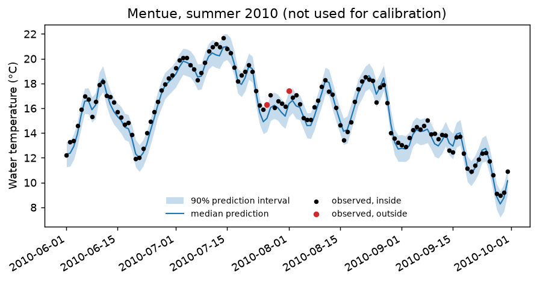

# 02 Uncertainty: how sure is the prediction?

**Question:** what range of water temperatures should we expect on each day of
2010–2012, given what the model learned from 2002–2009, and does that range
contain the real measurements as often as it claims?

Two things make a prediction uncertain:

- **The parameters.** Many parameter sets fit the calibration years almost
  equally well. DE-MCMC finds all of them, in proportion to how well they fit.
- **Model error.** Even the best parameters are off by some tenths of a degree on
  a given day, and these errors persist for several days at a time.

A **90% prediction interval** includes both: on 90% of days, the measured
temperature should fall inside it.

## Step 1: calibrate with uncertainty

```bash
pyair2stream --config examples/02_uncertainty/calibrate.yaml
```

About a minute. [`calibrate.yaml`](calibrate.yaml) is example 01's
configuration with `run_mode: "DE-MCMC"` and an `uncertainty_options` block.
After the DE calibration, the sampler runs in blocks of 1,000 steps until its
results are stable, and reports:

```
  5000 steps: max autocorrelation time 29.1, max split-Rhat 1.0091
MCMC converged after 5000 steps (at least 50 x the autocorrelation time, split-Rhat below 1.01).
...
Interval check: 90.2% of 2907 observed days lie inside the 90% prediction interval.
```

**Check both lines before using the results.**

- **Converged.** If the sampler has not converged after `mcmc_steps` (default
  20,000), the run stops with an error rather than give unreliable intervals.
  This usually means the data cannot pin down all the parameters; try a simpler
  model version.
- **Coverage.** The share of observed days inside the interval should be close
  to 90%.

Both are also recorded in `output/calibration/MCMC_chain_Mentue_c_1d_meta.json`
(`converged`, `max_split_rhat`, `interval_coverage`).

## Step 2: predict other years

```bash
pyair2stream --config examples/02_uncertainty/predict.yaml
```

[`predict.yaml`](predict.yaml) is a `FORWARD` run on the 2010–2012 data. It takes
the calibrated parameters and discharge scaling from step 1's
`calibration_metadata.json` and draws 1,000 parameter sets from the chain. It
writes the interval for every day to
`output/prediction/Forward_Prediction_Envelopes_Mentue_c_1d.csv`
(`Twat_mod_lower`, `Twat_mod_p50`, `Twat_mod_upper`). Because 2010–2012 have
measurements, it also reports how many fall inside:

```
Interval check: 87.6% of 1095 observed days lie inside the 90% prediction interval.
```

That is a little below 90%. The validation suite found the same on all three
Swiss rivers (85–89%, [V5](../../validation/REPORT.md#v5)): the model's errors
are somewhat larger in years it has not seen, so the intervals are slightly
optimistic for new years.



*The 90% interval (shaded) and the measured temperature for summer 2010. Red
points fall outside it.*

## Choices in the configuration

- **`noise_model: "ar1"`** treats model errors as persisting from day to day, as
  they do in practice. For a single day it gives about the same interval as the
  default `"iid"`, but for anything spanning several days (7-day means,
  consecutive days above a limit) `"iid"` gives intervals that are far too
  narrow. On the Swiss rivers, 90% intervals for 7-day means contained only
  39–62% of observed values with `"iid"`, and 76–88% with `"ar1"`
  ([V5](../../validation/REPORT.md#v5)). Use `"ar1"`.
- **`random_seed`** makes the whole run repeatable.

## About the parameters

`output/calibration/parameter_significance_DE-MCMC_Mentue.csv` lists each
parameter's mean and 95% range. Two cautions for version 8, whose parameters
trade off against each other (several combinations fit almost equally well):

- The ranges are narrower than they should be
  ([V4](../../validation/REPORT.md#v4)).
- With `noise_model: "ar1"` they can be centred on a different combination from
  the best fit in `calibration_metadata.json`, which maximises NSE and so treats
  errors as independent. Here `a5` is 2.6 in the best fit but 4.7 ± 0.3 in the
  chain. The predictions barely differ (validation RMSE 0.78 against 0.79 °C).

Rely on the predictions, not on individual parameter values.

## Next

Example [03](../03_compliance/README.md) turns these predictions into the
probability that a temperature limit was exceeded.
