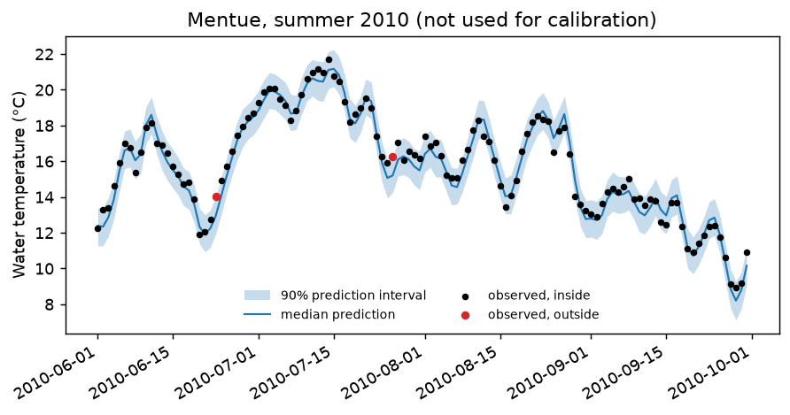

# 02 Uncertainty: how sure is the prediction?

**Question:** the model learned from 2002–2009. What range of water
temperatures should we expect on each day of 2010–2012? And does that range
contain the real measurements as often as it claims?

Two things make a prediction uncertain:

- **The parameters.** Many parameter sets fit the calibration years almost
  equally well. DE-MCMC finds all of them, in proportion to how well they fit.
- **Model error.** Even the best parameters are off by a few tenths of a
  degree on a given day. These errors last for several days at a time.

A **90% prediction interval** includes both. On 90% of days, the measured
temperature should fall inside it.

## Step 1: calibrate with uncertainty

```bash
pyair2stream --config examples/02_uncertainty/calibrate.yaml
```

This takes one to two minutes. [`calibrate.yaml`](calibrate.yaml) is example
01's settings file with `run_mode: "DE-MCMC"` and an `uncertainty_options`
block. After the calibration, the sampler runs in blocks of 1,000 steps until
its results are stable. Then it reports:

```
  6000 steps: max autocorrelation time 35.4, max split-Rhat 1.0077
MCMC converged after 6000 steps (at least 50 x the autocorrelation time, split-Rhat below 1.01).
...
Interval check: 91.0% of 2907 observed days lie inside the 90% prediction interval.
```

**Check both lines before you use the results.**

- **Converged.** If the sampler has not converged after `mcmc_steps` (default
  20,000), the run stops with an error. It does not give unreliable ranges.
  This usually means the data cannot pin down all the parameters. Try a
  simpler model version.
- **Coverage.** The share of measured days inside the interval should be close
  to 90%.

Both are also recorded in `output/calibration/MCMC_chain_Mentue_c_1d_meta.json`
(`converged`, `max_split_rhat`, `interval_coverage`).

## Step 2: predict other years

```bash
pyair2stream --config examples/02_uncertainty/predict.yaml
```

[`predict.yaml`](predict.yaml) is a `FORWARD` run on the 2010–2012 data. It:

- takes the fitted parameters and the discharge scaling (`Qmedia`) from step 1's
  `calibration_metadata.json`;
- draws 1,000 parameter sets from the chain;
- writes the interval for every day to
  `output/prediction/Forward_Prediction_Envelopes_Mentue_c_1d.csv`
  (`Twat_mod_lower`, `Twat_mod_p50`, `Twat_mod_upper`).

2010–2012 have measurements, so it also reports how many fall inside:

```
Interval check: 89.5% of 1095 observed days lie inside the 90% prediction interval.
```

That is close to 90%, slightly below. The validation suite found 85–89.6% on
three Swiss rivers ([V5](../../validation/REPORT.md#v5)). The model's errors
are somewhat larger in years it has not seen. So the intervals are slightly
too narrow for new years.



*The 90% interval (shaded) and the measured temperature for summer 2010. Red
points fall outside it.*

## Choices in the settings

Keep the defaults. In short:

- **`noise_model: "ar1"`** (the default, written out here for clarity) treats
  model errors as lasting from day to day, as they do in practice. For a single
  day, the alternative `"iid"` (independent errors) gives about the same
  interval. But for anything over several days (7-day means, a run of days
  above a limit), `"iid"` gives intervals that are far too narrow. On the Swiss
  rivers, its 90% intervals for 7-day means held only 39–62% of the time,
  against 89–94% with `"ar1"` ([V5](../../validation/REPORT.md#v5)).
- **`likelihood`** is left at its default, `"least_squares"`. It keeps the band
  centred on the best fit. The alternative, `"exact"`, centred this example's
  band about 0.04 °C cooler. It also gave lower probabilities of exceeding a
  limit in example 03 ([V5](../../validation/REPORT.md#v5)).
- **`rho_timescale`** is left at its default, `"weekly"`. ρ measures how long
  the model's errors last. Real errors have a part that lasts for weeks.
  `"weekly"` matches how errors carry over from one week to the next (ρ = 0.86
  here). `"daily"` matches only how they carry over from one day to the next
  (ρ = 0.70). For a single day this hardly changes the interval. For 7-day
  means and yearly peaks it does (example 03).
- **`random_seed`** makes the whole run repeatable.

## About the parameters

`output/calibration/parameter_significance_DE-MCMC_Mentue.csv` lists each
parameter's mean and 90% range. The ranges lie around the best fit in
`calibration_metadata.json`, but not always evenly. For example, `a5` is 2.54
in the best fit and 3.01 on average in the chain, with a 90% range of 2.02 to
4.24.

In a test with known parameters, such 90% ranges contained the true value at
least 90% of the time ([V4](../../validation/REPORT.md#v4)). In that test
(version 5), the ranges of the slow-acting parameters (`a1`, `a6`, `a7`) were
about the right width. Those of the fast-acting ones (`a2`, `a3`) were wider
than needed, which errs on the side of caution
([METHODS §12](../../docs/METHODS.md#12-parameter-and-prediction-uncertainty-de-mcmc)).

Version 8's parameters trade off against each other. Several combinations fit
almost equally well, so each range is wide, and the parameters move together.
Rely on the predictions rather than on single parameter values. Do not combine
the ends of several ranges.

## Next

Example [03](../03_compliance/README.md) turns these predictions into the
probability that a temperature limit was exceeded.
