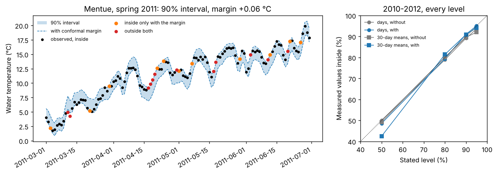

# 02 Uncertainty: how sure is the prediction?

**Question:** the model learned from 2002–2009. What range of water
temperatures should we expect on each day of 2010–2012? Does that range
contain the real measurements as often as it claims? And if it does not, how
can it be widened?

Two things make a prediction uncertain:

- **The parameters.** Many parameter sets fit the calibration years almost
  equally well. DE-MCMC finds all of them, in proportion to how well they fit.
- **Model error.** Even the best parameters are off by a few tenths of a
  degree on a given day. These errors last for several days at a time.

A **90% prediction interval** includes both. On 90% of days, the measured
temperature should fall inside it.

## The method, and why

This example uses the package's standard route to a prediction range, in two
runs:

1. **`DE-MCMC` on the calibration years.** DE finds the best fit. MCMC (Markov
   chain Monte Carlo) then collects thousands of parameter sets, each in
   proportion to how well it fits: the **chain**. The run also measures the
   size (σ) and persistence (ρ) of the best fit's daily errors.
2. **A `FORWARD` run with intervals on the years to predict.** It draws 1,000
   parameter sets from the chain, simulates each, and adds a random error
   series of size σ and persistence ρ to each one. On each day, the 90%
   interval runs from the 5th to the 95th percentile of the 1,000 values. Each
   series is kept at or above the ice floor (`Tice_cover`, 0 °C by default),
   as the simulation itself is.

Why this way: the parameters alone would give a band far too narrow (they are
fixed well by eight years of data), and the error model alone would ignore
that other parameter sets fit almost as well. The chain carries the first, the
error model the second. The interval is then tested on years the calibration
did not see (step 2 below), because only that shows whether it holds.
[docs/UNCERTAINTY.md](../../docs/UNCERTAINTY.md) explains each part in plain
words (§4, §6 and §11).

## Run it

Run the four steps below in Python, from the repository's top folder, after
`import pyair2stream`. Each returns its result: the scores, the warnings and
the output folder (`.output_dir`). From a terminal,
`pyair2stream --config <settings file>` does the same.
[`run.py`](run.py) runs all four, prints the checks below and draws the
figures (about four minutes):

```bash
python examples/02_uncertainty/run.py
```

## Step 1: calibrate with uncertainty

```python
calibrate = pyair2stream.run("examples/02_uncertainty/calibrate.yaml")
```

This takes about two minutes. [`calibrate.yaml`](calibrate.yaml) is example
01's settings file with `run_mode: "DE-MCMC"` and an `uncertainty_options`
block. After the calibration, the sampler runs in blocks of 1,000 steps until
its results are stable. Then it reports:

```
  6000 steps: max autocorrelation time 34.9, max split-Rhat 1.0090
MCMC converged after 6000 steps (at least 50 x the autocorrelation time, split-Rhat below 1.01).
...
Interval check: 91.1% of 2907 observed days lie inside the 90% prediction interval.
```

The two numbers say whether the sampler has run long enough. The
autocorrelation time is roughly how many steps it takes to forget where it
was. Split-Rhat compares the first and second halves of the run: close to 1
means they agree. You do not need to judge them yourself. The run checks them
and says whether it converged.

**Check both lines before you use the results.**

- **Converged.** If the sampler has not converged after `mcmc_steps` (default
  20,000), the run stops with an error. It does not give unreliable ranges.
  This usually means the data cannot pin down all the parameters. Try a
  simpler model version.
- **Coverage.** The share of measured days inside the interval should be close
  to 90%.

Both are also recorded in `output/calibration/MCMC_chain_Mentue_c_1d_meta.json`
(`converged`, `max_split_rhat`, `interval_coverage`).

## Step 2: predict other years

```python
predict = pyair2stream.run("examples/02_uncertainty/predict.yaml")
```

[`predict.yaml`](predict.yaml) is a `FORWARD` run on the 2010–2012 data. It:

- takes the fitted parameters and the discharge scaling (`Qmedia`) from step 1's
  `calibration_metadata.json`. It stops if the chain was fitted with another
  model version, integrator, `Qmedia`, `Tice_cover` or `min_theta_floor`;
- draws 1,000 parameter sets from the chain;
- takes the error model (`noise_model`, σ and ρ) from the chain's
  `_meta.json`, so it adds the same kind of error as step 1 measured;
- writes the interval for every day to
  `output/prediction/Forward_Prediction_Envelopes_Mentue_c_1d.csv`
  (`Twat_mod_lower`, `Twat_mod_p50`, `Twat_mod_upper`).

2010–2012 have measurements, so it also reports how many fall inside:

```
Interval check: 89.1% of 1095 observed days lie inside the 90% prediction interval.
```

That is close to 90%, slightly below. The validation suite found 85–90% on
three Swiss rivers ([V5](../../validation/REPORT.md#v5)). The model's errors
are somewhat larger in years it has not seen. So the intervals are slightly
too narrow for new years.


*The 90% interval (shaded) and the measured temperature for summer 2010, drawn
with `pyair2stream.plots.prediction_range(..., outside=True)`. A measurement
outside the interval would be marked with a cross; in this summer, all 122 fell
inside. Spring 2011 (step 4) has some.*

## Step 3: check the interval on held-out years, and measure the margins

```python
check = pyair2stream.run("examples/02_uncertainty/check.yaml")
```

Steps 1 and 2 found the interval slightly narrow in new years. A
cross-validation measures this before any new year is seen, and measures by how
much to widen it. [`check.yaml`](check.yaml) is a `DE` run with
`cross_validation: enabled: true` on the same 2002–2009 data, with the same
model version, `Qmedia`, error model and level as step 1. It hides each year in
turn, predicts it from the other years, and records how far each measurement
fell outside the hidden year's interval. This takes about a minute and a half.

It writes `output/check/cv_conformal_margins.csv`, and draws it in
`cv_interval_coverage.png` (the shares inside, without and with the margins, at
every level). For days, 7-day means and
30-day means, and for the 50%, 80%, 90% and 95% intervals, it gives the
**margin**: the amount to add to both edges of the interval so that it would
have held as stated in the hidden years. The margin is the 90th percentile (for
a 90% interval) of how far the measurements fell outside, each hidden year
counted equally. A negative margin narrows an interval that held too often.
The run reports:

```
Conformal margins of the 90% interval (...):
  days: margin +0.06 degC; inside 88.4% without, 89.9% with
  7-day means: margin +0.00 degC; inside 90.0% without, 89.3% with
  30-day means: margin +0.04 degC; inside 87.3% without, 89.1% with
```

"Without" is the share of hidden values inside the interval as it is. "With"
judges each hidden year with a margin made from the *other* years only, so no
year helps to set its own margin: it is the test of the margin. On the Mentue
the margins are small, because the interval already almost held.

## Step 4: predict again, with the margin

```python
predict_conformal = pyair2stream.run("examples/02_uncertainty/predict_conformal.yaml")
```

[`predict_conformal.yaml`](predict_conformal.yaml) is step 2's run with one
more line, `forward_options.conformal_margins`, pointing at step 3's file (and
`save_ensemble: true`, for the means below). It draws the same 1,000 series as
step 2. The interval file now also has the widened interval
(`Twat_mod_lower_conformal`, `Twat_mod_upper_conformal`), never below the ice
floor, and the run reports both:

```
Conformal margin of the 90% interval: +0.061 degC, from 8 held-out years (...).
Interval check: 89.1% of 1095 observed days lie inside the 90% prediction interval.
Interval check: 91.1% of 1095 observed days lie inside the 90% conformal prediction interval.
```

The run stops if the margins file was made with another model version, error
model or ρ time scale: a margin measures the misses of one model.

For 7-day and 30-day means, `run.py` applies the margin made for them to the
range of the saved series' moving means, as you would for your own question:

```python
from pyair2stream import scenario

ens, dates = scenario.load_ensemble("examples/02_uncertainty/output/prediction_conformal/"
                                    "Forward_Prediction_Ensemble_Mentue_c_1d.npz")
means = pd.DataFrame(ens.T).rolling(30).mean().to_numpy().T              # 30-day moving means, in each series
margin = scenario.conformal_margin("examples/02_uncertainty/output/check/cv_conformal_margins.csv",
                                   90, window_days=30)
lower, upper = scenario.conformal_range(means[:, 29:], 90, margin, floor=0.0)   # floor: Tice_cover
```

**The effect in 2010–2012** (share of measured values inside; from `run.py`):

| | margin | without | with | mean width without → with |
|---|---|---|---|---|
| days, 90% | +0.06 °C | 89.1% | 91.1% | 2.06 → 2.18 °C |
| days, 95% | +0.14 °C | 93.6% | 95.1% | 2.45 → 2.72 °C |
| 7-day means, 90% | +0.00 °C | 91.8% | 91.8% | 1.75 → 1.76 °C |
| 30-day means, 90% | +0.04 °C | 89.6% | 90.9% | 1.21 → 1.30 °C |



*Left: spring 2011, the months of 2010–2012 in which the margin changed most
(`plots.prediction_range` with `margin=` and `outside=True`). The shaded band
is step 2's 90% interval; the dashed lines are the widened interval of step 4.
Open squares are inside only with the margin; crosses are outside both. Right:
for every level, the share of 2010–2012 values inside, without (open markers,
dashed) and with (filled markers) the margins, for days, 7-day and 30-day means
(`plots.coverage`); on the dotted line an interval holds exactly. The
cross-validation of step 3 draws the same figure for its held-out years,
`cv_interval_coverage.png`.*

**What it shows.** On this river the interval nearly held already, so the
margin is small: the 90% interval for days becomes 0.12 °C wider and holds on
91.1% instead of 89.1% of days. Where intervals hold too rarely, the margins are
larger: on 23 rivers in British Columbia, 90% intervals held on 86.9% of days
and 84.8% of 30-day means in later years, and on 90.7% and 92.1% with the margins
([V19](../../validation/REPORT.md#v19)). On the Swiss rivers, where intervals
already held, the margins were small and the intervals kept holding.

**What it does not do.**

- It does not fix misses the hidden years did not have. In the cold spell of
  February–March 2012, 27 days fell outside the interval and 26 still did with
  the margin: no hidden year of 2002–2009 had such misses.
- The margin is the same all year. Check the widened interval in the season of
  your limit.
- The margin is only as good as the years it comes from: here 8. From fewer
  than about 5 it is uncertain. A margin at one level does not carry over to
  another: at 50%, the 30-day margin (−0.03 °C) narrowed an interval that then
  held on 42.5% of 2010–2012 values.
- It is not for yearly peaks and counts (use the correction of example
  [03](../03_compliance/README.md)) or for the difference between two scenarios.

The method is split conformal prediction
([docs/METHODS.md §13](../../docs/METHODS.md#13-forward-runs-and-scenario-comparisons);
in plain words, [docs/UNCERTAINTY.md §6](../../docs/UNCERTAINTY.md#widening-a-band-that-held-too-rarely-optional)).
Report the margin and its check (`inside_after`) with any widened interval.

## Choices in the settings

Keep the defaults. In short:

- **`noise_model: "ar1"`** (the default, written out here for clarity) treats
  model errors as lasting from day to day, as they do in practice. For a single
  day, the alternative `"iid"` (independent errors) gives about the same
  interval. But for anything over several days (7-day means, a run of days
  above a limit), `"iid"` gives intervals that are far too narrow. On the Swiss
  rivers, its 90% intervals for 7-day means held only 39–59% of the time,
  against 87–93% with `"ar1"` ([V5](../../validation/REPORT.md#v5)).
- **`likelihood`** is left at its default, `"least_squares"`. It keeps the band
  centred on the best fit. The alternative, `"exact"`, centred this example's
  band about 0.04 °C cooler. It also gave lower probabilities of exceeding a
  limit in example 03 ([V5](../../validation/REPORT.md#v5)).
- **`rho_timescale`** is left at its default, `"weekly"`. ρ measures how long
  the model's errors last. Real errors have a part that lasts for weeks.
  `"weekly"` matches how errors carry over from one week to the next (ρ = 0.86
  here). `"daily"` matches only how they carry over from one day to the next
  (ρ = 0.70). For a single day this hardly changes the interval. For 7-day
  means and yearly peaks it does (example 03).
- **`random_seed`** makes the whole run repeatable.

## What the result means, and what it does not

- It means: on a day of 2010–2012, the measured daily mean water temperature
  lay inside the 90% interval on about 9 days in 10. The interval is honest for
  single days in years like the calibration years.
- It does not give a range for anything spanning several days (a 7-day mean,
  a yearly peak, a count of warm days). Those must be computed in each
  simulated series (example [03](../03_compliance/README.md)).
- It does not cover errors in the inputs (air temperature and discharge are
  taken as exact), or a river that changed after the calibration years.
- For years unlike the calibration years, expect the interval to be slightly
  too narrow (see above). Check it by cross-validation (step 3), and widen it
  with the margins if it held too rarely (step 4).

## About the parameters

`output/calibration/parameter_significance_DE-MCMC_Mentue.csv` lists each
parameter's mean and 90% range. The ranges lie around the best fit in
`calibration_metadata.json`, but not always evenly. For example, `a5` is 2.55
in the best fit and 3.02 on average in the chain, with a 90% range of 2.03 to
4.25.

In a test with known parameters, such 90% ranges, made with the default
settings used here, contained the true value at least 90% of the time
([V4](../../validation/REPORT.md#v4)). In that test
(version 5), the ranges of the slow-acting parameters (`a1`, `a6`, `a7`) were
about the right width. Those of the fast-acting ones (`a2`, `a3`) were wider
than needed, which errs on the side of caution
([METHODS §12](../../docs/METHODS.md#12-parameter-and-prediction-uncertainty-de-mcmc)).

Version 8's parameters trade off against each other. Several combinations fit
almost equally well, so each range is wide, and the parameters move together.
Rely on the predictions rather than on single parameter values. Do not combine
the ends of several ranges.

## Next

Example [03](../03_compliance/README.md) turns these predictions into the
probability that a temperature limit was exceeded.
