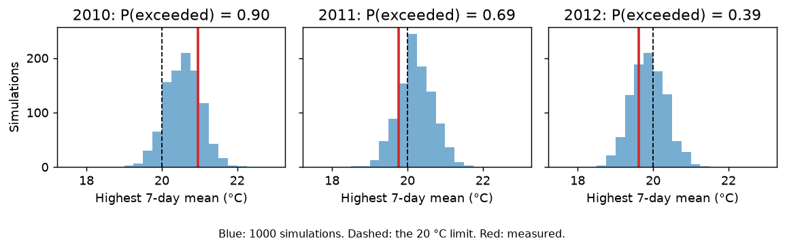

# 03 Compliance: was a temperature limit exceeded?

**Question:** suppose water temperature had not been measured in 2010–2012.
From air temperature and discharge alone, how likely is it that the 7-day mean
water temperature of the Mentue exceeded 20 °C in each year? And on how many
days did the daily mean exceed 18 °C?

The limits are illustrative. The measurements that do exist for 2010–2012 are
used only at the end, to check the answer.

## Why every simulation is needed

The daily 90% interval (example 02) says nothing directly about a 7-day mean, a
yearly peak, or a count of days. Those have to be computed within each
simulated series first, and the probability then taken across series. The
upper edge of the daily band is not the upper edge of the weekly peak.

## Steps

```bash
pyair2stream --config examples/03_compliance/calibrate.yaml    # as example 02, step 1
pyair2stream --config examples/03_compliance/predict.yaml      # 1000 simulations of 2010-2012
python examples/03_compliance/run.py                           # runs both, then the analysis
```

[`predict.yaml`](predict.yaml) sets `save_ensemble: true`, which keeps all 1,000
simulated series (`output/prediction/Forward_Prediction_Ensemble_Mentue_c_1d.npz`).
Each series has its own parameters and its own day-to-day model error.
`noise_model: "ar1"` makes those errors persist from day to day, as real ones
do; with `"iid"` the 7-day means would be far too certain
([V5](../../validation/REPORT.md#v5)).

The analysis in [`run.py`](run.py) is a few lines:

```python
from pyair2stream import scenario
ens, dates = scenario.load_ensemble("output/prediction/Forward_Prediction_Ensemble_Mentue_c_1d.npz")
sims = pd.DataFrame(ens.T, index=dates)          # one column per simulation
week = sims.rolling(7).mean()                    # 7-day means, within each simulation
peak = week.loc["2010"].max()                    # each simulation's highest 7-day mean in 2010
p_exceeded = (peak > 20).mean()                  # share of simulations above the limit
warm_days = scenario.exceedance(sims.loc["2010"].T.to_numpy(), 18)   # days above 18 °C, per simulation
```

## Results

| Year | P(7-day mean > 20 °C) | Highest 7-day mean, 90% range | Measured | Days above 18 °C, median (90% range) | Measured |
|---|---|---|---|---|---|
| 2010 | 0.90 | 19.8 to 21.3 °C | 21.0 °C | 29 (23 to 34) | 30 |
| 2011 | 0.69 | 19.5 to 21.0 °C | 19.8 °C | 17 (13 to 22) | 21 |
| 2012 | 0.39 | 19.1 to 20.7 °C | 19.6 °C | 23 (17 to 29) | 22 |



**Reading it.** In 2010 the limit was very likely exceeded (probability 0.90),
and it was. In 2011 and 2012 the measured peaks, 19.8 and 19.6 °C, were within a
few tenths of a degree of the limit. That is closer than the model can resolve,
and its probabilities (0.69 and 0.39) say so: they leave both outcomes open. All
measured values lie inside the model's 90% ranges. Report such results as
probabilities with ranges, not as a yes or no.

## Limits of this approach

- **Daily means only.** The model simulates daily mean temperature. It cannot
  assess limits on daily maximum temperature.
- **The probabilities are somewhat too confident.** On unseen years, 90% ranges
  for 7-day means contained the measured value 76–88% of the time
  ([V5](../../validation/REPORT.md#v5)). Treat probabilities near 0.9 or 0.1 as
  less certain than they look.
- **The answer depends on the definition.** Here a 7-day mean is a moving
  average over the current and previous six days. Use your standard's own
  definition (moving or fixed weeks, calendar year or season).

## Next

Example [04](../04_scenario/README.md) compares two situations, for example
with and without a water abstraction.
