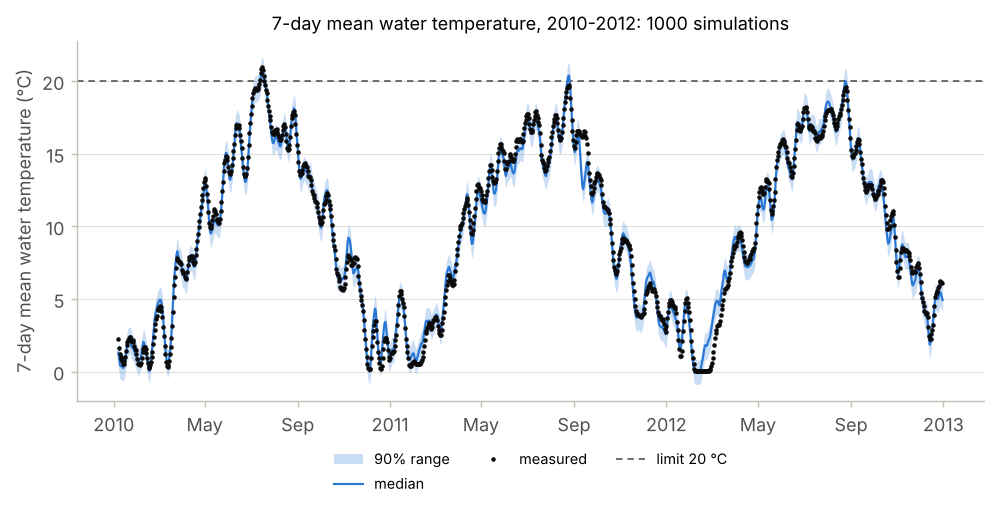
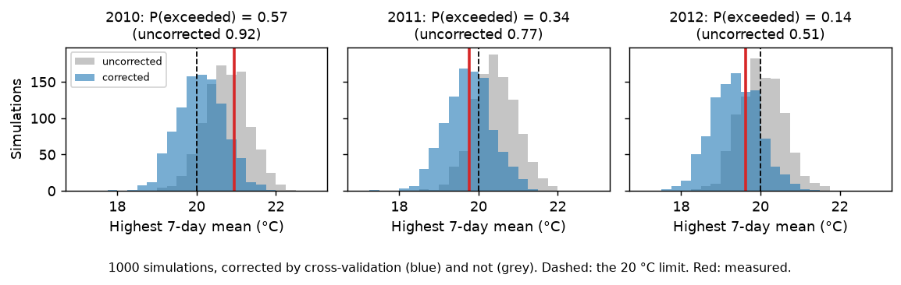

# 03 Compliance: was a temperature limit exceeded?

**Question:** suppose water temperature had not been measured in 2010–2012.
From air temperature and discharge alone, how likely is it that the Mentue's
7-day mean water temperature went above 20 °C in each year? And on how many
days was the daily mean above 18 °C?

The limits are only examples. The measurements that do exist for 2010–2012 are
used only at the end, to check the answer.

## Why every simulation is needed

The daily 90% interval of example 02 cannot answer this. A 7-day mean, a
yearly peak or a count of days must first be computed within each simulated
series. The probability is then the share of series above the limit. The upper
edge of the daily band is not the upper edge of the weekly peak.

## Steps

Run everything with one command, from the repository's top folder:

```bash
python examples/03_compliance/run.py
```

It takes about four minutes. It runs these three steps, then the analysis
below:

```bash
pyair2stream --config examples/03_compliance/calibrate.yaml    # calibrate with uncertainty, as in example 02
pyair2stream --config examples/03_compliance/predict.yaml      # 1,000 simulations of 2010-2012
pyair2stream --config examples/03_compliance/check.yaml        # cross-validation of 2002-2009
```

[`predict.yaml`](predict.yaml) sets `save_ensemble: true`. This keeps all
1,000 simulated series
(`output/prediction/Forward_Prediction_Ensemble_Mentue_c_1d.npz`). Each series
has its own parameters and its own day-to-day model error.
`noise_model: "ar1"` makes those errors last from day to day, as real ones do.
With `"iid"`, the 7-day means would be far too certain
([V5](../../validation/REPORT.md#v5)).

[`check.yaml`](check.yaml) tests the same statistics on years the model was not
calibrated on. It hides each of 2002–2009 in turn and calibrates on the
others. For each hidden year, it records where the measured statistic fell
among 1,000 simulations (`output/check/cv_yearly_statistics.csv`). It uses the
same 18 °C threshold as the question.

The analysis in [`run.py`](run.py) is a few lines:

```python
import pandas as pd
from pyair2stream import scenario

out = "examples/03_compliance/output"
ens, dates = scenario.load_ensemble(f"{out}/prediction/Forward_Prediction_Ensemble_Mentue_c_1d.npz")
stats = scenario.year_statistics(ens, dates, threshold=18)     # each year's statistics, in every simulation
peak = stats[2010]["highest 7-day mean"]                        # one value per simulation

check = pd.read_csv(f"{out}/check/cv_yearly_statistics.csv")
dev = check[check.statistic == "highest 7-day mean"].deviation  # measured minus predicted median, per hidden year
peak_c = scenario.correct_statistic(peak, dev, seed=2010)       # corrected for the model's bias
p_exceeded = (peak_c > 20).mean()                               # share of simulations above the limit: 0.57
```

The correction includes a random draw. `seed` makes it repeatable.

The figures come from `pyair2stream.plots` (USER_GUIDE §12):

```python
from pyair2stream import plots

ax = plots.prediction_range(ens, dates, window=7, limit=20)   # the 7-day mean in every simulation
ax = plots.yearly_statistic({"uncorrected": {2010: peak}, "corrected": {2010: peak_c}}, limit=20)
ax.figure.savefig("peak_7day_mean.png", dpi=150, bbox_inches="tight")
```

## Results

**The check.** In the eight hidden years (2002–2009), the measured yearly
peaks were lower than predicted:

- the highest 7-day mean by 0.65 °C on average (95% interval 0.26 to 1.05 °C);
- the highest daily mean by 0.75 °C (95% interval 0.40 to 1.10 °C).

The uncorrected 90% ranges held in only 6 of the 8 years, for both. The number
of days above 18 °C was not biased (−0.3 days, 95% interval −5.5 to +5.0). So on this river, the model (fitted to the whole
year) puts the summer peaks too high.

**The answer.**

| Year | P(7-day mean > 20 °C), corrected | uncorrected | Highest 7-day mean, 90% range, corrected | Measured | Days above 18 °C, corrected: median (90% range) | Measured |
|---|---|---|---|---|---|---|
| 2010 | 0.57 | 0.92 | 19.2 to 21.1 °C | 21.0 °C | 30 (22 to 38) | 30 |
| 2011 | 0.33 | 0.77 | 18.8 to 20.8 °C | 19.8 °C | 18 (11 to 27) | 21 |
| 2012 | 0.14 | 0.51 | 18.4 to 20.4 °C | 19.6 °C | 24 (15 to 33) | 22 |



*The 7-day mean water temperature in 2010–2012: the median of the 1,000
simulations (line) and their 90% range (band), not corrected. Dots: measured.
Dashed: the 20 °C limit.*



*Each year's highest 7-day mean: the median of the 1,000 simulations (dot) and
their 90% range (bar), not corrected (grey) and corrected (blue). Black:
measured. The number above each bar is the chance that the limit was
exceeded.*

**Reading it.**

- The limit was in fact exceeded in 2010, and not in 2011 or 2012.
- The corrected probabilities (0.57, 0.33, 0.14) match this better than the
  uncorrected ones (0.92, 0.77, 0.51). The uncorrected ones would have called
  2011 a likely exceedance.
- The Brier score (the mean squared difference between probability and
  outcome; lower is better) is 0.10 corrected, against 0.29 uncorrected.
- All measured values lie inside the corrected 90% ranges.
- 2010's measured peak, 21.0 °C, is near the top of its range: the bias in
  2010–2012 was smaller than in 2002–2009.

Report such results as probabilities with ranges, together with the check. Do
not report them as a yes or no.

## Limits of this approach

- **Daily means only.** The model simulates daily mean temperature. It cannot
  assess limits on daily maximum temperature.
- **The correction rests on the check.** It assumes the model's average error
  in the statistic is the same in the years predicted as in the hidden years.
  With 8 years that average is uncertain, and the corrected ranges include
  this uncertainty. Over 48 hidden years on three Swiss rivers, corrected 90%
  ranges held in 85–94% of years, and uncorrected ones in 73–92%
  ([V11](../../validation/REPORT.md#v11)).
- **The method matters.** With `likelihood: "exact"`, the simulations run
  slightly cooler. The default keeps them centred on the best fit
  ([METHODS §12](../../docs/METHODS.md#12-parameter-and-prediction-uncertainty-de-mcmc)).
- **So does how long the errors last.** The model's errors have a part that
  changes from day to day and a part that lasts for weeks. The default
  (`rho_timescale: "weekly"`, ρ = 0.86 here) includes both. `"daily"` matches
  only the day-to-day part (ρ = 0.70). It gives ranges for 7-day means and
  yearly peaks that are too narrow
  ([METHODS §12](../../docs/METHODS.md#12-parameter-and-prediction-uncertainty-de-mcmc)).
- **The answer depends on the definition.** Here a 7-day mean is a moving
  average of the day and the six days before it, within the calendar year. Use
  your standard's own definition (moving or fixed weeks, calendar year or
  season), and use the same one in the check.

## Next

Example [04](../04_scenario/README.md) compares two situations, for example
with and without a water abstraction.
