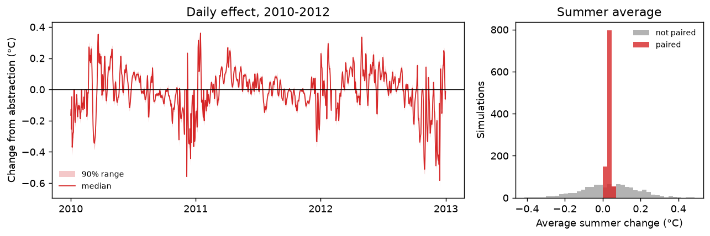

# 04 Scenario: what difference would a change make?

**Question:** if 30% of the Mentue's flow had been abstracted in 2010–2012, how
much would its water temperature have changed, and how sure can we be?

The same approach works for any change in the inputs: naturalised flows, a
dam release, or air temperatures from a climate projection.

## The key idea: pair the simulations

Run the model twice, once on the measured discharge and once on the reduced
discharge, and subtract. Each simulation in the second run must use **the same
parameter set** as its partner in the first. The uncertainty that the two runs
share then cancels, and what remains is the uncertainty of the *difference*.
pyair2stream also gives each pair the same day-to-day model error, which
cancels too. This assumes the model's error on a given day would be the same
under both scenarios.

## Steps

```bash
python examples/04_scenario/run.py
```

This makes the scenario's input file (the measured file with discharge × 0.7,
and water temperature removed because it was not measured under that scenario),
then runs:

```bash
pyair2stream --config examples/04_scenario/calibrate.yaml     # as example 02, step 1
pyair2stream --config examples/04_scenario/baseline.yaml      # measured discharge
pyair2stream --config examples/04_scenario/abstraction.yaml   # 70% of the discharge
```

Two settings in [`abstraction.yaml`](abstraction.yaml) matter:

- `reuse_sample_indices_from` points at the baseline run's record of which
  parameter sets it used, so this run uses exactly the same ones.
- `calibration_metadata` keeps the calibration's mean discharge (`Qmedia`). The
  model sees discharge only relative to `Qmedia`. If `Qmedia` were recomputed
  from the reduced flows, the reduction would cancel out and the scenario would
  show no effect at all.

Then the difference, simulation by simulation:

```python
from pyair2stream import scenario
diff = scenario.paired_difference_from_files(
    "output/abstraction/Forward_Prediction_Ensemble_Mentue_c_1d.npz",
    "output/baseline/Forward_Prediction_Ensemble_Mentue_c_1d.npz")
# one row per simulation, one column per day; it refuses runs that did not use the same parameter sets
```

## Results

| | Median | 90% range |
|---|---|---|
| Average summer (Jun–Aug) change | +0.03 °C | +0.02 to +0.05 °C |
| Average winter (Dec–Feb) change | −0.07 °C | −0.09 to −0.05 °C |
| Largest warming on a single day | +0.36 °C | +0.34 to +0.38 °C |
| Extra days per year above 18 °C | 0.7 | 0.0 to 1.7 |
| *Summer change if the runs were not paired* | *+0.03 °C* | *−0.21 to +0.26 °C* |



**Reading it.** According to the calibrated model, this abstraction changes the
Mentue's temperature only slightly on average. Summers are marginally warmer and
winters marginally colder: with less water, the river follows the air more
closely. On individual low-flow days the warming reaches about 0.4 °C. Without
pairing (last row, grey in the figure), the same simulations cannot even tell
whether the river gets warmer or colder.

## Limits of this approach

- **Parameter uncertainty only.** The narrow ranges reflect uncertainty in the
  parameters *within this model*. They do not cover the possibility that the
  model's response to discharge is wrong. That response is learned from the
  natural variation of flow in the calibration years.
- **Stay within the calibrated flows.** If the scenario's discharge goes
  outside the range seen in calibration, the run prints a warning: the model is
  then extrapolating.
- The validation suite checks that paired differences are exact where the true
  answer is known ([V8](../../validation/REPORT.md#v8)).

## Next

Example [05](../05_gaps/README.md) deals with gaps in the data.
