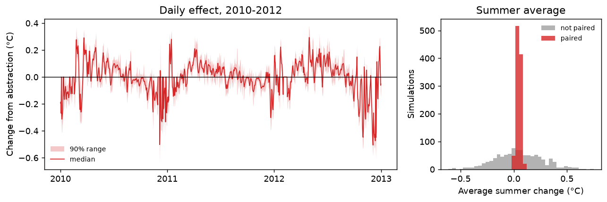

# 04 Scenario: what difference would a change make?

**Question:** if 30% of the Mentue's flow had been taken out (abstracted) in
2010–2012, how much would its water temperature have changed? And how sure can
we be?

The same approach works for any change in the inputs: naturalised flows, a dam
release, or air temperatures from a climate projection.

## Paired and not paired

The model is run twice: once with the measured discharge (the **baseline**),
and once with the reduced discharge (the **abstraction**). The effect of the
abstraction is the difference between the two. But how the two runs are
compared matters a great deal.

**Why there are 1,000 simulations.** As example
[02](../02_uncertainty/README.md) explains, the model's parameters are not
known exactly: many sets of parameter values fit the calibration years almost
equally well. Each run here draws 1,000 of these parameter sets. Each one gives
one **simulation** of 2010–2012, with its own parameter values and its own
day-to-day model error.

The simulations disagree about how warm the river is. Their average summer
water temperature ranges from 16.3 to 16.8 °C (90% range). The abstraction
changes it by only about 0.05 °C, ten times less. To see such a small effect,
the uncertainty about the river's temperature must be taken out.

**Paired** means that simulation 1 of the abstraction run uses the same
parameter set, and the same model error, as simulation 1 of the baseline run.
Simulation 2 is paired with simulation 2, and so on. Each pair is then
subtracted. Whatever a parameter set gets wrong, it gets wrong in both runs, so
it cancels. What is left is the effect of the abstraction:

| | Baseline: average summer temperature | Abstraction | Difference |
|---|---|---|---|
| Simulation 1 | 16.57 °C | 16.63 °C | +0.07 °C |
| Simulation 2 | 16.43 °C | 16.50 °C | +0.07 °C |
| Simulation 3 | 16.36 °C | 16.39 °C | +0.03 °C |

Simulations 1 and 3 disagree by 0.2 °C about the river. But they agree that the
abstraction warms it a little in summer.

**Not paired** means comparing simulations that used different parameter sets.
The abstraction of simulation 3 minus the baseline of simulation 2 gives
+0.13 °C. The other way round, it gives −0.04 °C, a cooling. These numbers mostly show the
difference between two parameter sets, not the effect of the abstraction. This
is what you would get by running the two scenarios separately, each with its
own random parameter sets, and comparing their results.

An everyday comparison: to find out what a diet does, weigh the same people
before and after it (paired). Weighing one group before and a different group
after (not paired) mixes the effect with the differences between people.

The last row of the results table shows the cost. There, `run.py` matches the
simulations of the two runs at random, on purpose. The 90% range of the summer
change becomes −0.30 to +0.39 °C, so you could not even tell whether the
abstraction warms or cools the river. It is shown only to make the point:
always pair.

Pairing assumes that the model's error on a given day would be the same in both
scenarios. On a winter day when a simulation is held at the ice floor
(`Tice_cover`, 0 °C) in one run and not in the other, the error does not
cancel exactly.

**The uncertainty method, and why.** This example uses a DE-MCMC chain (as in
example 02) and two `FORWARD` runs that draw the same 1,000 parameter sets from
it, with the same daily errors, and are then subtracted series by series (a
paired difference). It is used because the question is about a *change*: what
is uncertain about the river in both runs cancels, and what is left is the
uncertainty of the change itself, from the parameters. No cross-validated
correction is applied: it corrects a bias in a yearly statistic, which affects
both runs alike and cancels in their difference.
[docs/UNCERTAINTY.md §10](../../docs/UNCERTAINTY.md#10-comparing-two-scenarios)
explains pairing in plain words.

## Steps

Run everything with one command, from the repository's top folder:

```bash
python examples/04_scenario/run.py
```

It takes two to three minutes. First it makes the scenario's input file: the
measured file with the discharge multiplied by 0.7. It removes the water
temperature, because that was not measured under the scenario. Then it runs:

```bash
pyair2stream --config examples/04_scenario/calibrate.yaml     # calibrate with uncertainty, as in example 02
pyair2stream --config examples/04_scenario/baseline.yaml      # 1,000 simulations with the measured discharge
pyair2stream --config examples/04_scenario/abstraction.yaml   # the same, with 70% of the discharge
```

Two settings in [`abstraction.yaml`](abstraction.yaml) matter:

- `reuse_sample_indices_from` points at the baseline run's record of which
  parameter sets it used. So this run uses exactly the same ones, in the same
  order: this is what pairs the simulations.
- `calibration_metadata` keeps the calibration's mean discharge (`Qmedia`). The
  model sees discharge only relative to `Qmedia`. If `Qmedia` were recomputed
  from the reduced flows, the reduction would cancel out. The scenario would
  then show no effect at all.

Then the difference, simulation by simulation:

```python
from pyair2stream import scenario

out = "examples/04_scenario/output"
diff = scenario.paired_difference_from_files(
    f"{out}/abstraction/Forward_Prediction_Ensemble_Mentue_c_1d.npz",
    f"{out}/baseline/Forward_Prediction_Ensemble_Mentue_c_1d.npz")
# abstraction minus baseline: one row per simulation, one column per day.
# It refuses runs that did not use the same parameter sets.
```

## Results

| | Median | 90% range |
|---|---|---|
| Average summer (Jun–Aug) change | +0.05 °C | +0.02 to +0.08 °C |
| Average winter (Dec–Feb) change | −0.06 °C | −0.11 to −0.02 °C |
| Largest warming on a single day | +0.33 °C | +0.27 to +0.40 °C |
| Extra days per year above 18 °C | 0.7 | 0.0 to 2.0 |
| *Summer change if the runs were not paired* | *+0.05 °C* | *−0.30 to +0.39 °C* |



*Left: the change on each day, the median of the 1,000 paired simulations and
their 90% range, drawn with `plots.change(diff, dates, by="day")`. Right: each
simulation's average summer change, paired (orange) and not paired (grey).*

**Reading it.**

- According to the fitted model, this abstraction changes the Mentue's
  temperature only slightly on average.
- Summers are a little warmer and winters a little colder. With less water,
  the river follows the air more closely.
- On single low-flow days, the warming reaches about 0.3 °C.
- Without pairing (the last row, grey in the figure), the same simulations
  cannot even tell whether the river gets warmer or colder (see
  [Paired and not paired](#paired-and-not-paired)).

## Limits of this approach

- **Parameter uncertainty only.** The narrow ranges show the uncertainty of the
  parameters *within this model*. They do not cover the chance that the
  model's response to discharge is wrong. The model learns that response from
  the natural changes in flow during the calibration years.
- **Stay within the calibrated flows.** If the scenario's discharge goes
  outside the range seen in calibration, the run reports every such day, with
  their number and the first date. The model is then extrapolating. Here the
  reduced flows stay inside the calibrated range.
- **What it does not mean.** "+0.05 °C in summer" is the effect of this
  abstraction according to this model, on the weather of 2010–2012. It is not
  a measured effect, and it does not include the chance that the model's
  response to discharge is wrong (above).
- The validation suite checks that paired differences are exact where the true
  answer is known ([V8](../../validation/REPORT.md#v8)).

## Next

Example [05](../05_gaps/README.md) deals with gaps in the data.
