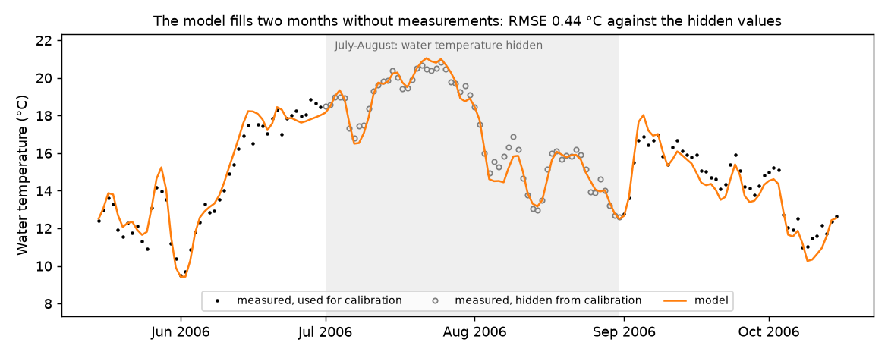
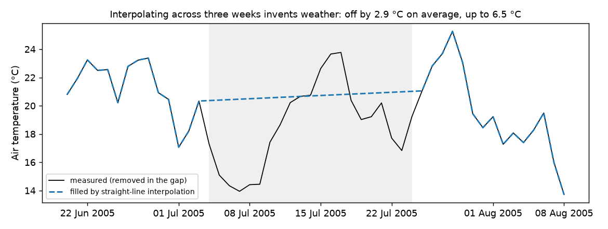
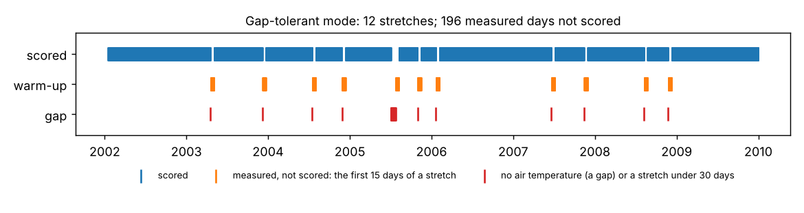
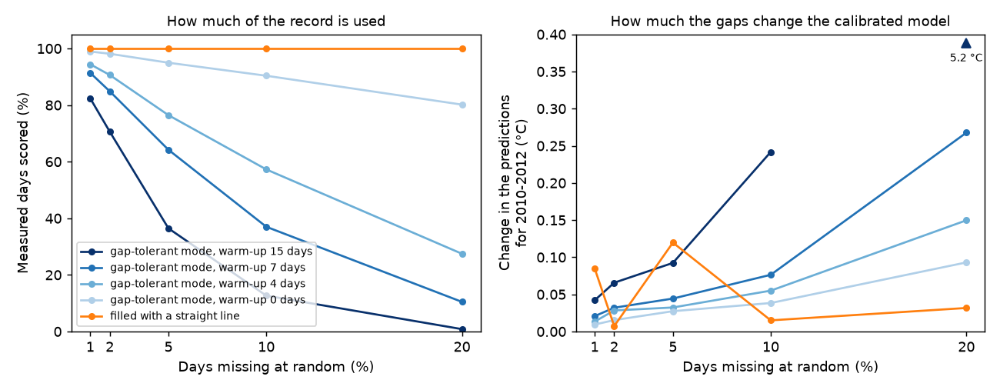

# 05 Gaps: what to do with missing data

**Question:** my records have gaps. What should I do?

That depends on which record has them:

| Missing | What to do |
|---|---|
| water temperature | nothing: the model fills it |
| air temperature or discharge, a few days here and there | fill the gaps |
| air temperature or discharge, weeks at a time | gap-tolerant mode, or fill from a nearby station |

This example shows each case on the Mentue's 2002–2009 record, after removing
data on purpose. Because the removed values are known, it can show how well
each approach does.

## Run it

```bash
python examples/05_gaps/run.py
```

It takes about two minutes. It runs four calibrations and writes the figures
below.

## Step 1: check the data first

A run checks every file before it calibrates anything. You can make the same
check yourself first, with `pyair2stream.analyze_timeseries`. Here, three weeks
(July 2005) and ten single days of air temperature have been removed. The
report starts with what a run would do:

```
--- Checks a run would make (calibration file, version 8, gap_tolerant false) ---
A run would STOP on this data:
  - The series of observed air temperature in gappy_calibration.csv must be complete:
    31 day(s) have no value (first: 2003-04-19, line 475). Fill them, or set gap_tolerant: true.
```

A real run on this file stops with the same message, before it calibrates. The
full report, with the missing data and the usable stretches, is in
`output/data_check.txt`.

## Missing water temperature: nothing to do

The model does not need water temperature to run. It needs it only to score
the fit. Days without a measurement are simply left out of the score. Leave
them empty in your file, or write `-999`.

The simulation still runs on every day, so the model **fills the gaps** in
your water temperature record. Here, the measurements of July and August 2006
were hidden from the calibration ([`water_gaps.yaml`](water_gaps.yaml)). The
model's values for those 62 days were then compared with the hidden
measurements:

| Hidden days | RMSE | Mean error | Largest error |
|---|---|---|---|
| 62 | 0.44 °C | −0.10 °C | 1.40 °C |



*Grey circles: the measurements hidden from the calibration. Orange: the
model. The fit in the hidden months is as good as in the measured ones.*

The validation suite tested this harder. It removed up to half the days at
random, whole winters, a whole year, and all but one day a week. The model
still predicted other years to within 0.06 °C of the truth
([V7](../../validation/REPORT.md#v7)). To give the filled values an
uncertainty range, run `DE-MCMC` and a `FORWARD` run with intervals, as in
example [02](../02_uncertainty/README.md).

## Missing air temperature or discharge: fill or split

The model needs air temperature on every day to run. Versions 4, 7 and 8 also
need discharge on every day. There are two ways forward.

### Option 1: fill the gaps

Use a nearby station if you can. For short gaps, straight-line interpolation is
fine. Every day is kept ([`filled.yaml`](filled.yaml)).

But interpolation across weeks invents weather that did not happen. In the
three-week gap, the straight line missed the real air temperature by 2.9 °C on
average, and by up to 6.5 °C:



*Black: the measured air temperature, removed for the example. Blue: the
straight line that filled the gap.*

### Option 2: gap-tolerant mode

`gap_tolerant: true` ([`gap_tolerant.yaml`](gap_tolerant.yaml)) splits the
record at each gap and restarts the model after it.

- The first 15 days of each stretch (`warmup_drop_days`) are not scored,
  because the model needs time to forget its approximate restart.
- Stretches shorter than 30 days (`min_segment_days`) are dropped.

USER_GUIDE [§10](../../USER_GUIDE.md#10-gap-tolerant-mode) has the details.
Here the record split into 12 stretches, and 196 measured days were not scored:



*Blue: days scored. Orange: measured days not scored, the first 15 days after
each gap. Red: days without air temperature.*

### The two options compared

| Approach | Days scored in calibration | Validation NSE | Validation RMSE |
|---|---|---|---|
| Gaps filled by interpolation | 2,907 | 0.982 | 0.78 °C |
| Gap-tolerant mode | 2,711 | 0.982 | 0.78 °C |

Both give the same predictions for 2010–2012: on every scored day they differ
by less than 0.05 °C. Here, 31 missing days out of 2,922 did not matter much
either way.

## Scattered gaps: why gap-tolerant mode can lose most of the record

Each gap costs gap-tolerant mode more than the missing day itself: the next 15
days are not scored, and a stretch shorter than 30 days is dropped. So
scattered gaps throw away far more than their share. Here, days without air
temperature were placed at random in the Mentue's record:

| Days missing at random | 1% | 2% | 5% | 10% | 20% |
|---|---|---|---|---|---|
| Measured days still scored | 83% | 68% | 36% | 10% | 0% |



*Left: the share of measured days scored. Right: how much the gaps change the
calibrated model's predictions for 2010–2012. Blues: gap-tolerant mode with
warm-ups from 15 days (dark) to 0 days (light). Orange: gaps filled with a
straight line. This figure comes from `gap_study.py` (being written up).*

## Which to choose

- **Short, scattered gaps: fill them.** With gaps every few weeks,
  gap-tolerant mode throws away most of the record. With 5% of days missing at
  random, only about a third of the measured days were scored.
- **Long gaps: use gap-tolerant mode**, or fill them from a nearby station.
  Interpolating across weeks invents weather.
- **Missing water temperature: leave it.** The model fills it.
- Either way, **say what you did**, and how many days were filled or dropped.
  `gaps_summary.txt` in a gap-tolerant run's output lists the stretches used.

## Next

Example [06](../06_cross_validation/README.md) checks how stable the model is
from year to year.
