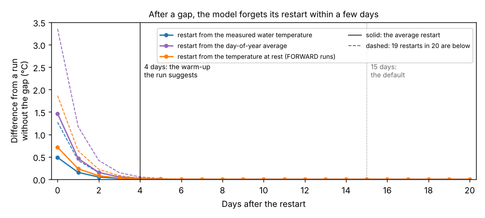
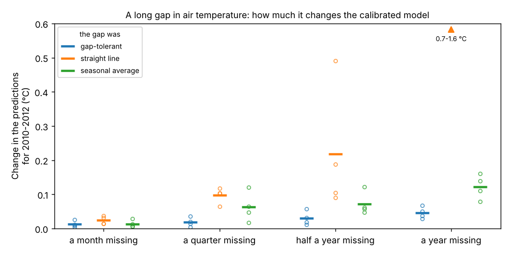

# 05 Gaps: what to do with missing data

**Question:** my records have gaps. What should I do?

That depends on which record has them, and how they are spread:

| Missing | What to do |
|---|---|
| water temperature | nothing: the model fills it |
| air temperature or discharge, for weeks to a year | gap-tolerant mode |
| air temperature or discharge, single days here and there | gap-tolerant mode with a shorter warm-up, or fill the days |
| air temperature or discharge, on one day in five or more | fill the days, from a nearby station if you can |

This example shows each case on the Mentue's 2002–2009 record, after removing
data on purpose. Because the removed values are known, it can show how well
each approach does.

## Run it

```bash
python examples/05_gaps/run.py          # about two minutes
python examples/05_gaps/gap_study.py    # the test of gap-tolerant mode: about ten minutes
```

`run.py` runs four calibrations and draws the figures of the first sections.
`gap_study.py` runs about 130 calibrations and draws the figures of
[When does gap-tolerant mode work?](#when-does-gap-tolerant-mode-work)

## Step 1: check the data first

A run checks every file before it calibrates anything. You can make the same
check yourself first, with `pyair2stream.analyze_timeseries`. Here, three weeks
(July 2005) and ten single days of air temperature have been removed. Near
its top, the report says what a run would do:

```
--- Checks a run would make (calibration file, version 8, gap_tolerant false) ---
A run would STOP on this data:
  - The series of observed air temperature in gappy_calibration.csv must be complete:
    31 day(s) have no value (first: 2003-04-19, line 475). Fill them, or set gap_tolerant: true.
```

A real run on this file stops with the same message, before it calibrates. The
full report, with the missing data and the usable stretches, is in
`output/data_check.txt`.

## Missing water temperature: nothing to do

The model does not need water temperature to run. It needs it only to score
the fit. Days without a measurement are simply left out of the score. Leave
them empty in your file, or write `-999`.

The simulation still runs on every day, so the model **fills the gaps** in
your water temperature record. Here, the measurements of July and August 2006
were hidden from the calibration ([`water_gaps.yaml`](water_gaps.yaml)). The
model's values for those 62 days were then compared with the hidden
measurements:

| Hidden days | RMSE | Mean error | Largest error |
|---|---|---|---|
| 62 | 0.44 °C | −0.10 °C | 1.40 °C |


*Grey circles: the measurements hidden from the calibration. Orange: the
model. The fit in the hidden months is as good as in the measured ones.*

The validation suite tested this harder. It removed up to half the days at
random, whole winters, a whole year, and all but one day a week. The model
still predicted other years to within 0.06 °C of the truth
([V7](../../validation/REPORT.md#v7)).

Every run writes the filled record for you:
`filled_water_temperature_calibration.csv` in the output folder. It has the
measured value where there is one and the model's value elsewhere, and a
`source` column says which (`measured` or `model`; `none` inside a gap where
the model did not run). In gap-tolerant mode, a `warm_up` column marks the
first days of each stretch, where the model is still settling and its values
are less reliable. After a `DE-MCMC` run, or
a `FORWARD` run with intervals (as in example
[02](../02_uncertainty/README.md)), it also has the 90% range of each day's
value.

## Missing air temperature or discharge: fill or split

The model needs air temperature on every day to run. Versions 4, 7 and 8 also
need discharge on every day. There are two ways forward.

### Option 1: fill the gaps

Use a nearby station if you can. For a missing day or two, a straight line is
close to the truth. Every day is kept ([`filled.yaml`](filled.yaml)).

But interpolation across weeks invents weather that did not happen. In the
three-week gap, the straight line missed the real air temperature by 2.9 °C on
average, and by up to 6.5 °C:


*Black: the measured air temperature, removed for the example. Blue: the
straight line that filled the gap.*

### Option 2: gap-tolerant mode

`gap_tolerant: true` ([`gap_tolerant.yaml`](gap_tolerant.yaml)) splits the
record at each gap and restarts the model after it.

- The first 15 days of each stretch (`warmup_drop_days`) are not scored,
  because the model needs time to forget its approximate restart.
- Stretches shorter than 30 days (`min_segment_days`) are dropped.

USER_GUIDE [§10](../../USER_GUIDE.md#10-gap-tolerant-mode) has the details.
Here the record split into 12 stretches, and 196 measured days were not scored:


*Blue: days scored. Orange: measured days not scored, the first 15 days after
each gap. Red: days without air temperature.*

### The two options compared

| Approach | Days scored in calibration | Validation NSE | Validation RMSE |
|---|---|---|---|
| Gaps filled by interpolation | 2,907 | 0.982 | 0.78 °C |
| Gap-tolerant mode | 2,711 | 0.982 | 0.78 °C |

Both give the same predictions for 2010–2012: on every scored day they differ
by less than 0.05 °C. Here, 31 missing days out of 2,922 did not matter much
either way.

## When does gap-tolerant mode work?

Gap-tolerant mode never invents weather. But each gap costs it more than the
missing days. The model restarts after the gap, and the first days after a
restart (the warm-up) are not scored. `gap_study.py` tests when this cost is
worth paying. It removes air temperature from the Mentue's 2002–2009 record in
many ways and calibrates each time. Water temperature is kept on every day.

**How the test measures harm.** It compares each calibration's predictions for
2010–2012 with those of the calibration on the complete record. The measure is
their typical difference (root mean square). Zero means the gap did no harm.
For scale:

- the model's typical error in those years is 0.78 °C;
- calibrating the complete record again with other random seeds changes the
  predictions by at most 0.001 °C.

(The error against the measurements is a blunter measure: it hardly moves for
changes of a few hundredths of a degree.)

### After a gap, how long must the warm-up be?

After a gap, a gap-tolerant calibration or validation run restarts the model
from the measured water temperature of the first day. If there is none, it
uses the average for that calendar date. (A gap-tolerant `FORWARD` run, which
may have no water temperature, starts each stretch instead from the
temperature at which the model's equation is at rest on its first day.) How long does the model take to forget this restart? The test
restarted the model on every day of the record. It then followed the
difference from a run without the restart:



*Solid: the average restart. Dashed: 19 restarts in 20 are below this line.*

| Days after the restart | 0 | 1 | 2 | 3 | 4 | 5 |
|---|---|---|---|---|---|---|
| Restart from the measured water temperature | 0.49 °C | 0.15 °C | 0.05 °C | 0.02 °C | 0.01 °C | 0.00 °C |
| Restart from the day-of-year average | 1.47 °C | 0.46 °C | 0.15 °C | 0.05 °C | 0.02 °C | 0.01 °C |
| Start at rest (a gap-tolerant `FORWARD` run) | 0.71 °C | 0.23 °C | 0.08 °C | 0.03 °C | 0.01 °C | 0.00 °C |

*The mean difference from a run without the restart.*

**Reading it.**

- The Mentue forgets its restart within 3–4 days, whichever way it starts. The
  default warm-up,
  15 days, is about four times longer than this river needs.
- The model's own equation gives this time: three "relaxation times", or 3/B
  days. B is how fast the water temperature returns to its balance
  (USER_GUIDE [§9.1](../../USER_GUIDE.md#91-numerical-stability-and-the-choice-of-integrator)). A
  gap-tolerant run works it out from the fitted model. Here it suggests
  4 days.
- Rivers differ. The test also worked out the suggestion from the published
  parameters of 26 rivers:
  - 2–3 days on the three Swiss rivers;
  - 2–5 days on 9 rain-fed, glacier-fed and mixed rivers in British Columbia;
  - 3–11 days on 14 snowmelt rivers there.

  None needs more than 15 days. So the default is safe, but often far longer
  than needed.

### Long gaps: a month to a year

Gaps of a month, a quarter, half a year and a year were each placed at four
places in the record: starting in July 2003, January 2005, April 2006 and
October 2007. Each gap was then either left as a gap (gap-tolerant mode) or
filled. It was filled with a straight line, or with the seasonal average: the
mean air temperature of that day of the year in the other years, smoothed over
15 days.



*Each circle is one placement of the gap; the bar is their mean. The triangle
marks values off the scale.*

| Gap | Gap-tolerant mode | Filled with a straight line | Filled with the seasonal average |
|---|---|---|---|
| a month | 0.01 °C (0.03) | 0.02 °C (0.04) | 0.01 °C (0.03) |
| a quarter | 0.02 °C (0.04) | 0.10 °C (0.12) | 0.06 °C (0.12) |
| half a year | 0.03 °C (0.06) | 0.22 °C (0.49) | 0.07 °C (0.12) |
| a year | 0.05 °C (0.07) | 1.15 °C (1.55) | 0.12 °C (0.16) |

*The change in the predictions for 2010–2012: the mean of the four placements,
with the largest in brackets.*

**Reading it.**

- **Gap-tolerant mode changed the model least, at every gap length.** For a
  month, all three approaches did about equally well. Even a whole missing year
  changed the predictions by at most 0.07 °C in gap-tolerant mode. It loses
  only the gap and the warm-up after it.
- **A straight line is fine for a month, but poor beyond.** Across a quarter or
  more it misses the seasons. A missing year was the worst case: a straight line
  from one summer to the next keeps the winter warm. The error in 2010–2012 rose
  from 0.78 °C to as much as 1.56 °C.
- **The seasonal average is better than a straight line, but worse than
  gap-tolerant mode.** It has the right season, but not the weather of those
  days. The model is then fitted to water temperatures that followed the real
  weather.
- In gap-tolerant mode, the model does not run inside a gap in air
  temperature. So it gives no water temperatures there. If you need them, get
  air temperature for those days from a nearby station.

### Many short gaps: shorten the warm-up

Here, single days of air temperature were removed at random: from 1% to 20% of
the days, three random draws each. Gap-tolerant mode was run with warm-ups
(`warmup_drop_days`) of 15 days (the default), 7, 4 (what the run suggests here)
and 0 days. Pieces shorter than twice the warm-up were dropped
(`min_segment_days`; 30 days for the default). Filling the missing days with a
straight line was the comparison.


*Left: the share of the measured days scored. Right: how much the gaps change
the predictions for 2010–2012 (mean of three draws). The triangle marks a value
off the scale.*

| Days missing at random | 1% | 2% | 5% | 10% | 20% |
|---|---|---|---|---|---|
| Measured days scored, warm-up 15 days (default) | 82% | 71% | 36% | 13% | 1% |
| Measured days scored, warm-up 4 days | 94% | 91% | 76% | 57% | 27% |
| Change in the predictions, warm-up 15 days | 0.04 °C | 0.07 °C | 0.09 °C | 0.24 °C | 5.2 °C (failed) |
| Change in the predictions, warm-up 4 days | 0.01 °C | 0.03 °C | 0.03 °C | 0.06 °C | 0.15 °C |
| Change in the predictions, filled with a straight line | 0.01 °C | 0.01 °C | 0.01 °C | 0.01 °C | 0.03 °C |

**Reading it.**

- **With the default warm-up, scattered gaps waste most of the record.** Each
  one-day gap costs the 15 days after it, and pieces shorter than 30 days are
  dropped. With 10% of days missing, only 13% of the measured days were scored.
  With 20%, almost nothing was left, and the calibration failed.
- **A 4-day warm-up doubles the days scored** with 5–10% of days missing. The
  predictions changed by 0.06 °C or less.
- **With gaps on one day in five, gap-tolerant mode still loses most of the
  record** (27% scored), and the change grows to 0.15 °C.
- **For single missing days, a straight line changed the model least.** Air
  temperature changes little from one day to the next, so one missing day is
  easy to fill. It is gaps of weeks that a straight line gets wrong.
- **Do not use a warm-up of 0 days.** It scored the most days and changed the
  model little here. But it makes the fit look better than it is: the first
  days after each restart start from the measured water temperature, so they
  are scored almost without error. With 20% of days missing, the run reported
  an RMSE of 0.53 °C. On the same days without restarts, it was 0.64 °C. With a
  4-day warm-up, both were 0.60 °C. Also, where the first day after a gap has
  no water temperature, the restart is 1.5 °C off on average (table above).

**How to shorten the warm-up.** Run gap-tolerant mode once with the defaults.
If the warm-up is much longer than the fitted model needs, the run says so. For
example, a run on one of the study's files with 5% of days missing says:

```
Note: the calibrated model forgets its restart within about 4 days.
warmup_drop_days: 4 and min_segment_days: 8 would score 2157 measured days
instead of 916. Consider them and calibrate again; see USER_GUIDE.md §10.
```

Set those two values in your settings file and calibrate again.

### Where gap-tolerant mode works, and where it does not

It works well for:

- gaps of weeks to a year. It changed the model least of all the approaches
  tested. The test removed air temperature; a gap in discharge splits the
  record in the same way.
- scattered gaps on up to about one day in ten, with the warm-up the run
  suggests.

It works poorly for:

- gaps on one day in five or more. Most of the record is lost. Fill single
  days instead, from a nearby station if you can;
- gaps every few weeks with the default 15-day warm-up. Shorten the warm-up.

It cannot give water temperatures inside a gap in air temperature or discharge,
because the model does not run there.

These results are for one river, with water temperature measured on every day.
For your river, use the warm-up the run suggests. Report how many days were
scored.

## Which to choose

- **Long gaps (weeks to a year): use gap-tolerant mode.** It changed the model
  least, even for a whole missing year. Filling across a season invents weather.
- **Single missing days here and there:** fill them (a straight line across one
  day is close to the truth), or use gap-tolerant mode with the warm-up the run
  suggests.
- **Missing on many days (one in five or more): fill them**, from a nearby
  station if you can. Gap-tolerant mode would score only a small part of the
  record.
- **Missing water temperature: leave it.** The model fills it.
- Either way, **say what you did**, and how many days were filled or dropped.
  `gaps_summary.txt` in a gap-tolerant run's output lists the stretches used.

## Next

Example [06](../06_cross_validation/README.md) checks how stable the model is
from year to year.
