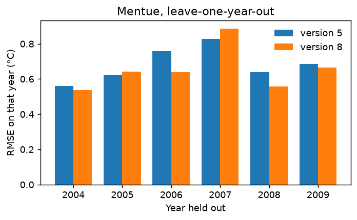

# 06 Cross-validation: is the model stable from year to year?

**Question:** does the model predict every year well, or only some? Do its
parameters depend on which years it was calibrated on? And is the full model
(version 8) worth its extra parameters compared with version 5?

Cross-validation answers this with the data you have. It hides one year,
calibrates on the others, predicts the hidden year, and repeats for each year.

## Run it

```bash
python examples/06_cross_validation/run.py
```

This runs [`version5.yaml`](version5.yaml) and [`version8.yaml`](version8.yaml)
(about 30 s each). They are ordinary DE configurations on the Mentue's 2002–2009
record with a `cross_validation` block:

```yaml
cross_validation:
  enabled: true
  unit: "year"             # hide one calendar year at a time
  skip_first_year: true    # 2002 and 2003 are always used for calibration
```

Each run writes `cv_results.csv`: one row per held-out year with its NSE, KGE,
RMSE and the parameters fitted without it, then the mean, standard deviation,
and scores over all held-out days together (`pooled`).

## Results

| Year held out | RMSE, version 5 | RMSE, version 8 |
|---|---|---|
| 2004 | 0.56 °C | 0.54 °C |
| 2005 | 0.62 °C | 0.64 °C |
| 2006 | 0.76 °C | 0.64 °C |
| 2007 | 0.83 °C | 0.89 °C |
| 2008 | 0.64 °C | 0.56 °C |
| 2009 | 0.69 °C | 0.67 °C |
| all held-out days | 0.69 °C | 0.66 °C |



**Reading it.**

- **Every year is predicted to within 0.9 °C.** 2007 is the hardest year for
  both versions. When one year stands out like this, look at what was unusual
  about it before relying on the model in similar conditions. In the Mentue's
  data, 2007 had the warmest April–May of the record and a summer discharge
  about three times the usual (mean 2.5 against 0.4–0.9 in other years).
- **The parameters are stable.** When a different year is held out, each
  parameter changes by about 1–7% of its value. The exception is version 8's
  `a4`, which is close to zero, so small absolute changes are large relative
  ones. Large changes would mean the data cannot pin the parameters down.
- **Version 8 is slightly better** (0.66 against 0.69 °C over all held-out
  days), and better in four of six years. The gain is small. Version 5 does not
  use discharge, so it cannot be used for flow scenarios such as example 04.

## When to use it

Use cross-validation to choose a model version, and to report how well the
model predicts years it has not seen. A single calibration/validation split
(example 01) tests the model on only one set of years.

## Next

That completes the examples. For results that support a decision, work through
the checklist in USER_GUIDE [§14](../../USER_GUIDE.md#14-checklist-for-results-that-support-a-decision).
