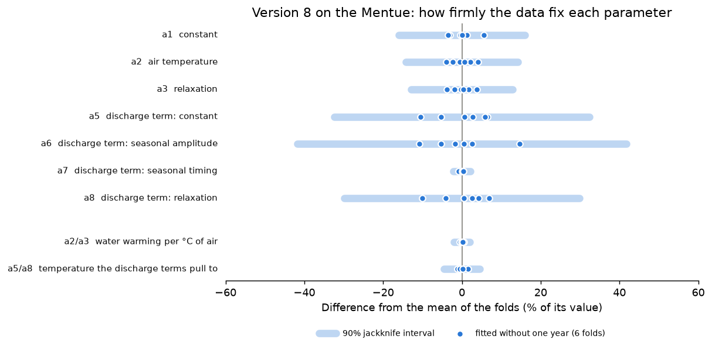

# 06 Cross-validation: is the model stable from year to year?

**Question:** does the model predict every year well, or only some? Does
calibration find the same parameter values whichever years it is given, and how
precisely do the data fix them? And is the full model (version 8) worth its
extra parameters compared with version 5?

Cross-validation answers this with the data you have. It hides one year,
calibrates on the others, predicts the hidden year, and repeats for each year.

## Run it

```bash
python examples/06_cross_validation/run.py
```

This runs [`version5.yaml`](version5.yaml) and [`version8.yaml`](version8.yaml)
(about 45 s each). They are ordinary DE configurations on the Mentue's 2002–2009
record with a `cross_validation` block:

```yaml
cross_validation:
  enabled: true
  unit: "year"             # hide one calendar year at a time
  skip_first_year: true    # 2002 and 2003 are always used for calibration
```

They also set `Qmedia` (the mean discharge of 2002–2009), so every fold scales
discharge the same way; otherwise version 8's parameters would also move with
each fold's own mean discharge.

Each run writes `cv_results.csv`: one row per held-out year with its NSE, KGE,
RMSE and the parameters fitted without it, then the mean, standard deviation,
scores over all held-out days together (`pooled`), and 90% confidence intervals
for the parameters (`jackknife_90_lower`, `jackknife_90_upper`).

## Results

| Year held out | RMSE, version 5 | RMSE, version 8 |
|---|---|---|
| 2004 | 0.56 °C | 0.54 °C |
| 2005 | 0.62 °C | 0.64 °C |
| 2006 | 0.76 °C | 0.64 °C |
| 2007 | 0.83 °C | 0.89 °C |
| 2008 | 0.64 °C | 0.56 °C |
| 2009 | 0.69 °C | 0.67 °C |
| all held-out days | 0.69 °C | 0.66 °C |


**Reading it.**

- **Every year is predicted to within 0.9 °C.** 2007 is the hardest year for
  both versions. When one year stands out like this, look at what was unusual
  about it before relying on the model in similar conditions. In the Mentue's
  data, 2007 had the warmest April–May of the record and a summer discharge
  about three times the usual (mean 2.5 against 0.4–0.9 in other years).
- **Version 8 is slightly better** (0.66 against 0.69 °C over all held-out
  days), and better in four of six years. The gain is small. Version 5 does not
  use discharge, so it cannot be used for flow scenarios such as example 04.

## Do the parameters come back the same?

Each fold is a separate calibration, so cross-validation also shows how much the
best-fit parameters move when the data change. For version 8:

| Year held out | a1 | a2 | a3 | a4 | a5 | a6 | a7 | a8 |
|---|---|---|---|---|---|---|---|---|
| 2004 | 0.926 | 0.652 | 0.769 | 0.069 | 2.476 | 1.647 | 0.601 | 0.260 |
| 2005 | 0.888 | 0.681 | 0.800 | 0.061 | 2.687 | 1.748 | 0.601 | 0.278 |
| 2006 | 0.850 | 0.669 | 0.783 | 0.047 | 2.782 | 1.783 | 0.595 | 0.289 |
| 2007 | 0.874 | 0.639 | 0.757 | 0.071 | 2.767 | 1.991 | 0.603 | 0.282 |
| 2008 | 0.878 | 0.629 | 0.741 | 0.078 | 2.340 | 1.550 | 0.601 | 0.244 |
| 2009 | 0.847 | 0.659 | 0.773 | −0.036 | 2.629 | 1.709 | 0.602 | 0.272 |
| **mean** | 0.877 | 0.655 | 0.771 | 0.048 | 2.613 | 1.738 | 0.600 | 0.271 |
| **90% interval** | 0.736–1.018 | 0.562–0.748 | 0.672–0.870 | −0.159–0.255 | 1.767–3.460 | 1.013–2.463 | 0.588–0.613 | 0.190–0.352 |



**Reading it.**

- **Some parameters are fixed firmly, others loosely.** `a7` (the timing of the
  seasonal term) comes back within ±1% every time; `a1`–`a3` within ±6%;
  the discharge terms `a5`, `a6` and `a8` move by up to ±15%. `a6` moves most
  when 2007, the unusual year, is left out.
- **`a4` is not determined by these data.** It even changes sign (2009 held
  out). Its interval includes zero, so the data cannot tell whether discharge
  changes the river's thermal inertia; version 7 fixes `a4` at zero.
- **Parameters that trade off move together.** `a2` and `a3` rise and fall
  together (correlation 0.99 across the folds), as do `a5` and `a8`. Their
  ratios are much steadier than either parameter: `a2/a3`, how much the water
  temperature rises per degree of air temperature, stays between 0.845 and
  0.854 (90% interval ±2%, against ±13–14% for `a2` and `a3`), and `a5/a8`, the
  temperature the discharge terms pull the water towards, between 9.5 and
  9.8 °C (±5%, against ±30–32%). The data fix these combinations well, which is
  why the predictions change so little when the individual values move.

`run.py` prints the same table for version 5 and the ranges for the ratios.

## From year-to-year changes to confidence intervals

The folds do show how uncertain the best-fit values are, but not directly. The spread between folds (the `std` row) is far too small to use as
an uncertainty: any two folds share six of their seven calibration years, so
they are bound to agree more closely than calibrations on different records
would. The jackknife corrects for this overlap (here it widens the spread by a
factor of 2.4) and gives the `jackknife_90` rows: approximate 90% confidence
intervals for the value calibration would find from a record of similar years.
They are the bands in the figure.

Keep in mind:

- In a test with known parameters, these intervals contained the true values
  83–94% of the time, for every model version
  ([validation V4](../../validation/REPORT.md#v4)), so treat them as
  approximate. For version 8 they did better than the MCMC parameter intervals
  of example 02.
- They describe years like those in the record. Conditions the record does not
  contain (for example much lower summer flows) can need different values.
- Each interval is for one parameter on its own. Do not combine the ends of
  several intervals (such as a high `a5` with a low `a8`): because the
  parameters trade off, such combinations do not fit the data. For predictions
  with uncertainty, use the prediction intervals of example 02, which keep the
  trade-offs.

The version 8 parameters published for the Mentue by Piccolroaz et al. (2016)
lie outside several of these intervals (for example `a5` = 4.39). They are not
at the best fit of these data ([validation V2](../../validation/REPORT.md#v2)):
they lie further along the same ridge of almost equally good fits.

## When to use it

Use cross-validation to choose a model version, to report how well the model
predicts years it has not seen, and to see how firmly the data fix each
parameter. A single calibration/validation split (example 01) tests the model
on only one set of years.

## Next

That completes the examples. For results that support a decision, work through
the checklist in USER_GUIDE [§14](../../USER_GUIDE.md#14-checklist-for-results-that-support-a-decision).
