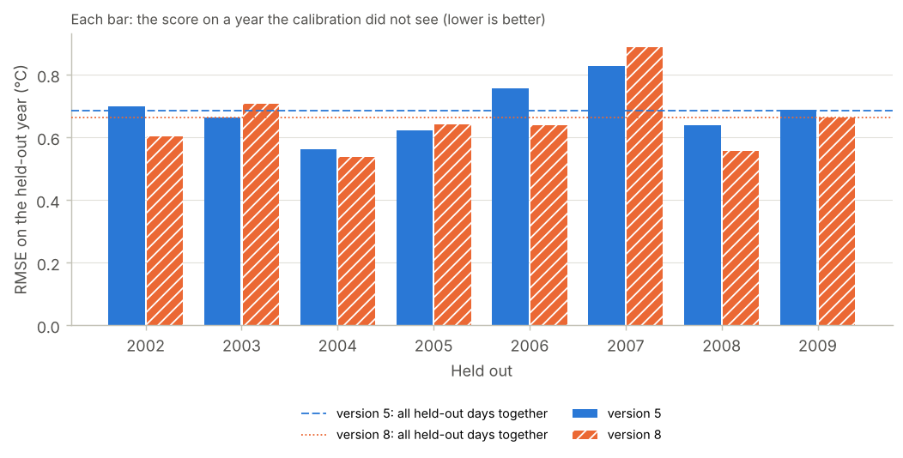
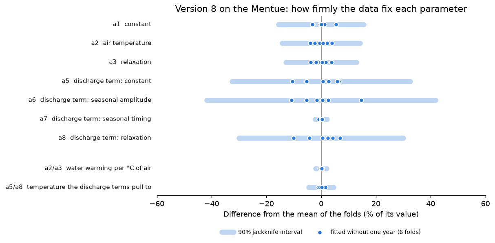
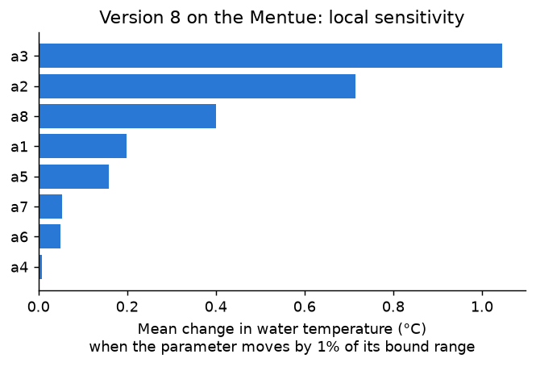

# 06 Cross-validation: is the model stable from year to year?

**Questions:**

- Does the model predict every year well, or only some?
- Does calibration find the same parameter values, whichever years it is
  given? How precisely do the data fix them?
- Is the full model (version 8) worth its extra parameters, compared with
  version 5?

Cross-validation answers these with the data you have. It hides one year,
calibrates on the others, and predicts the hidden year. Then it repeats this
for each year. Each of these calibrations, with one year hidden, is called a
**fold**.

**The uncertainty methods, and why.** This example uses two:

- **Cross-validation** for the predictions. Each year is predicted from a
  calibration that never saw its water temperatures (its air temperature and
  discharge, the model's inputs, are kept). So the error on the hidden years
  is an honest measure of how well the model predicts a year it was not
  fitted to.
- **The jackknife** for the parameters. The folds share most of their years,
  so the spread of their parameters is far too small to be an uncertainty. The
  jackknife scales it up to account for that overlap, and gives approximate
  90% confidence intervals for the parameters.

Neither gives a prediction interval. For that, use DE-MCMC and a `FORWARD` run
(example [02](../02_uncertainty/README.md)).
[docs/UNCERTAINTY.md](../../docs/UNCERTAINTY.md) explains cross-validation in
§8 and the jackknife in §11.

## Run it

```bash
python examples/06_cross_validation/run.py
```

It takes about three minutes. It runs [`version5.yaml`](version5.yaml)
and [`version8.yaml`](version8.yaml) with `pyair2stream.run`, then the
sensitivity analysis at the end of this page:

```python
import pyair2stream

for v in (5, 8):
    result = pyair2stream.run(f"examples/06_cross_validation/version{v}.yaml")
    result.scores["cross-validation"]     # all held-out days together: NSE, KGE, RMSE
```

[`version5.yaml`](version5.yaml) and [`version8.yaml`](version8.yaml) are
ordinary DE settings files for the Mentue's 2002–2009 record, with a
`cross_validation` block:

```yaml
cross_validation:
  enabled: true
  unit: "year"             # hide one calendar year at a time: each of 2002-2009 in turn
```

Every year is hidden in turn, the first one included: the model does not need
earlier data to start from.

They also set `Qmedia`, the mean discharge of 2002–2009. Then every fold scales
discharge the same way. Otherwise, version 8's parameters would also move with
each fold's own mean discharge.

Each run writes:

- **`cv_results.csv`**: one row per hidden year, with its scores (NSE and KGE,
  where 1 is perfect, and RMSE, the typical daily error) and the parameters
  fitted without it. Then the mean, the standard deviation,
  the scores over all hidden days together (`pooled`), and 90% confidence
  intervals for the parameters (`jackknife_90_lower`, `jackknife_90_upper`).
- **`cv_bias_by_month.png`** (and `.csv`): the mean error in each month over
  the hidden years, with 95% intervals. Here, no month's interval excludes
  zero for version 8. A version that does not suit a river shows a seasonal
  pattern instead. On the Rhône, version 5 was too warm every summer, and too
  cool in spring and autumn.
- **`cv_yearly_statistics.csv`** (and `_summary.csv`): a check of each year's
  highest daily mean, highest 7-day mean and number of days above a threshold.
  Example [03](../03_compliance/README.md) uses it to check and correct the
  probability that a limit was exceeded.

## Results

| Year held out | RMSE, version 5 | RMSE, version 8 |
|---|---|---|
| 2002 | 0.70 °C | 0.60 °C |
| 2003 | 0.66 °C | 0.71 °C |
| 2004 | 0.56 °C | 0.54 °C |
| 2005 | 0.62 °C | 0.64 °C |
| 2006 | 0.76 °C | 0.64 °C |
| 2007 | 0.83 °C | 0.89 °C |
| 2008 | 0.64 °C | 0.56 °C |
| 2009 | 0.69 °C | 0.67 °C |
| all held-out days | 0.69 °C | 0.66 °C |



**Reading it.**

- **Every year is predicted to within 0.9 °C.** 2007 is the hardest year for
  both versions. When one year stands out like this, look at what was unusual
  about it, before you rely on the model in similar conditions. In the Mentue's
  data, 2007 had the warmest April and May of the record. Its summer discharge
  was about three times the usual (a mean of 2.5, against 0.4–0.9 in the other
  years).
- **Version 8 is slightly better.** Its error over all held-out days is
  0.66 °C, against 0.69 °C, and it is better in five of the eight years. The gain
  is small. But version 5 does not use discharge, so it cannot be used for flow
  scenarios such as example 04.

## Do the parameters come back the same?

Each fold is a separate calibration. So cross-validation also shows how much
the best-fit parameters move when the data change. For version 8:

| Year held out | a1 | a2 | a3 | a4 | a5 | a6 | a7 | a8 |
|---|---|---|---|---|---|---|---|---|
| 2002 | 0.912 | 0.635 | 0.750 | 0.107 | 2.288 | 1.545 | 0.601 | 0.241 |
| 2003 | 0.925 | 0.677 | 0.795 | 0.096 | 2.689 | 1.764 | 0.602 | 0.282 |
| 2004 | 0.926 | 0.659 | 0.778 | 0.062 | 2.562 | 1.701 | 0.601 | 0.268 |
| 2005 | 0.888 | 0.681 | 0.800 | 0.061 | 2.685 | 1.747 | 0.601 | 0.278 |
| 2006 | 0.849 | 0.669 | 0.783 | 0.048 | 2.781 | 1.782 | 0.595 | 0.289 |
| 2007 | 0.873 | 0.639 | 0.756 | 0.070 | 2.766 | 1.991 | 0.603 | 0.282 |
| 2008 | 0.878 | 0.629 | 0.742 | 0.078 | 2.340 | 1.550 | 0.601 | 0.244 |
| 2009 | 0.848 | 0.660 | 0.775 | −0.036 | 2.630 | 1.710 | 0.602 | 0.272 |
| **mean** | 0.887 | 0.656 | 0.772 | 0.061 | 2.593 | 1.724 | 0.601 | 0.270 |
| **90% interval** | 0.742–1.033 | 0.564–0.749 | 0.674–0.871 | −0.144–0.265 | 1.720–3.465 | 1.061–2.387 | 0.590–0.612 | 0.185–0.354 |



**Reading it.**

- **Some parameters are fixed firmly, others loosely.** `a7`, the timing of
  the seasonal term, comes back within ±1% every time. `a1` to `a3` come back
  within ±5%. The discharge terms `a5`, `a6` and `a8` move by up to 16%. `a6`
  moves most when 2007, the unusual year, is left out.
- **The data do not fix `a4`.** It even changes sign (when 2009 is left out).
  Its interval includes zero. So the data cannot tell whether discharge
  changes the river's thermal inertia. Version 7 fixes `a4` at zero.
- **Parameters that trade off move together.** `a2` and `a3` rise and fall
  together (correlation 1.00 across the folds), and so do `a5` and `a8` (0.99). Their
  ratios are much steadier than either parameter:
  - `a2/a3` is how much the water warms per degree of air temperature. It
    stays between 0.845 and 0.854. Its 90% interval is ±2%, against ±13–14% for
    `a2` and `a3` themselves.
  - `a5/a8` is the temperature the discharge terms pull the water towards. It
    stays between 9.5 and 9.8 °C. Its interval is ±5%, against ±31–34% for
    `a5` and `a8`.

  The data fix these combinations well. That is why the predictions change so
  little when the individual values move.

`run.py` prints the same table for version 5, and the ranges of the ratios.

## From year-to-year changes to confidence intervals

The spread between folds (the `std` row) is far too small to use as an
uncertainty. Any two folds share six of their seven calibration years, so they
are bound to agree more closely than calibrations on different records would.

The jackknife corrects for this overlap. Here it widens the spread by a factor
of 2.5. The result is the `jackknife_90` rows: approximate 90% confidence
intervals for the value a calibration would find from a record of similar
years. They are the bands in the figure.

Keep in mind:

- **They are approximate.** In a test with known parameters, these intervals
  contained the true values 81–95% of the time, for every model version
  ([validation V4](../../validation/REPORT.md#v4)). The MCMC parameter ranges
  of example 02 did as well or better in that test (97% for version 5, 92% for
  version 8).
- **They describe years like those in the record.** Conditions the record does
  not contain, such as much lower summer flows, can need different values.
- **Each interval is for one parameter on its own.** Do not combine the ends of
  several intervals, such as a high `a5` with a low `a8`. Because the
  parameters trade off, such combinations do not fit the data. For predictions
  with uncertainty, use the prediction intervals of example 02, which keep the
  trade-offs.

Piccolroaz et al. (2016) published version 8 parameters for the Mentue. Several
of them lie outside these intervals (for example `a5` = 4.39). They are not at
the best fit of these data ([validation V2](../../validation/REPORT.md#v2)).
Instead, they lie further along the same ridge of almost equally good fits.

## Which parameters matter most?

A sensitivity analysis answers a related question: which parameters change the
simulated temperature most? [`sensitivity.yaml`](sensitivity.yaml) calibrates
version 8 once on 2002–2009 and sets:

```yaml
sensitivity_analysis: true
sensitivity_perturbations: [1.0]          # move each parameter up and down by 1% ...
sensitivity_perturbation_mode: "range"    # ... of its bound range, so parameters can be compared
```

It moves one parameter at a time, up and down, and reports the mean change in
the simulated water temperature (`output/sensitivity/sensitivity_*.csv`):

| Parameter | What it does | Change for 1% of its range |
|---|---|---|
| `a3` | how fast the water returns to balance | 1.05 °C |
| `a2` | the effect of air temperature | 0.72 °C |
| `a8` | the return to balance, scaled by discharge | 0.40 °C |
| `a1` | a constant heat input | 0.20 °C |
| `a5` | a constant, scaled by discharge | 0.16 °C |
| `a7` | the timing of the yearly cycle | 0.05 °C |
| `a6` | the size of the yearly cycle | 0.05 °C |
| `a4` | the discharge exponent | 0.007 °C |



**Reading it.**

- `a3` and `a2` move the simulation most: how fast the water follows the air,
  and how strongly.
- `a4` hardly matters (0.007 °C). This matches the cross-validation above: the
  data cannot fix `a4`, because it changes so little.
- The numbers describe small changes near the best fit, one parameter at a
  time. They ignore trade-offs (`a2` and `a3` move together), and they depend
  on the width of the bounds.
- A low sensitivity does not mean a poorly fixed parameter. `a7` changes the
  simulation little per 1% of its range (3.7 days), yet the data fix it within
  ±1%, because it shifts the whole yearly cycle.

## What the results mean, and what they do not

- The held-out errors mean: in a year like 2002–2009, with measured air
  temperature and discharge, expect a typical daily error of about 0.7 °C,
  and up to 0.9 °C in an unusual year.
- They do not show how the model does in conditions the record does not
  contain (a much drier or warmer year), or with inputs that are themselves
  uncertain (a climate scenario, a borrowed air-temperature record).
- Each year is predicted from the other years, later ones included. For
  predictions of the future, a test on later years only (example
  [01](../01_quickstart/README.md)) is the stricter one.

## When to use it

Use cross-validation to:

- choose a model version;
- report how well the model predicts years it has not seen;
- see how firmly the data fix each parameter.

A single calibration/validation split (example 01) tests the model on only
one set of years.

## Next

Example [07](../07_preparing_data/README.md) shows how to prepare your own data
from raw logger files.
