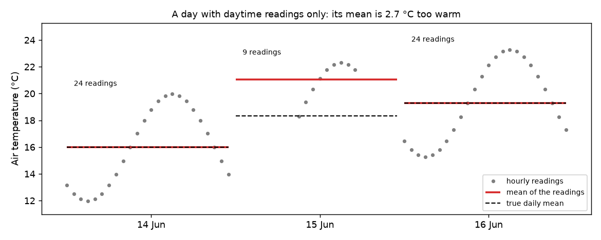
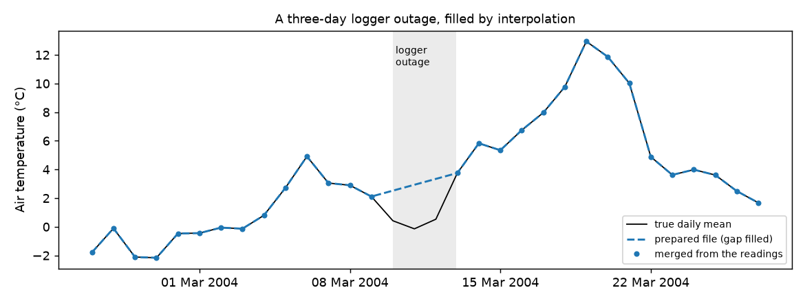

# 07 Preparing your data: from raw logger files to checked input files

**Question:** my data come as separate raw files, with readings every hour or
every 15 minutes, and with the usual faults. How do I turn them into the daily
files pyair2stream needs, and know that they are right?

pyair2stream has two helpers for this:

- `merge_timeseries` turns several raw files into one daily file;
- `analyze_timeseries` checks a daily file exactly as a run would, before you
  run anything.

## The raw files

[`run.py`](run.py) first makes three raw files, as you might receive them.
They are built from the Mentue's daily data (2002–2012), so the right answer is
known:

| File | Readings | Faults added |
|---|---|---|
| `air_station.csv` | air temperature, every hour, dates like `15.06.2005 14:00` | a three-day logger outage (no rows); 6 unreadable timestamps; 4 readings coded `ERR`; one day with daytime readings only |
| `river_logger.csv` | water temperature, every 15 minutes | three days of sensor fault coded `-999`; the days the original data lack |
| `flow_gauge.csv` | discharge, daily means | none |

The hourly and 15-minute readings follow a daily cycle around the original
daily mean, so a full day of readings averages to that mean.

## Run it

```bash
python examples/07_preparing_data/run.py
```

It takes under a minute.

## Step 1: merge the raw files

Each raw file is described by its name, its time column, its value column, and
the standard column it becomes:

```python
import pyair2stream

files = [
    {"file_path": "raw/air_station.csv", "date_col": "timestamp", "value_col": "air_temp",
     "standard_col_name": "T_air", "date_format": "%d.%m.%Y %H:%M"},
    {"file_path": "raw/river_logger.csv", "date_col": "Time", "value_col": "Tw",
     "standard_col_name": "T_water"},
    {"file_path": "raw/flow_gauge.csv", "date_col": "date", "value_col": "Q",
     "standard_col_name": "Discharge"},
]
merged = pyair2stream.merge_timeseries(files, output_file="merged.csv")
```

The first attempt stops, and says why:

```
Warning: 6 row(s) of raw/air_station.csv have a time in column 'timestamp' that cannot be read,
  and were left out (first: '##.##.#### ##:##' on line 55710).
ValueError: Column 'air_temp' in raw/air_station.csv has 4 value(s) that are not numbers
  (first: 'ERR' on line 509). Correct them, or name such codes as missing with na_values ...
```

`ERR` is the weather station's code for a failed reading. So name it as
"missing", and ask for at least 20 of the 24 hourly readings (and 80 of the 96
quarter-hourly readings) before a daily mean is used:

```python
files[0].update(na_values=["ERR"], min_readings_per_day=20)
files[1].update(min_readings_per_day=80)
merged = pyair2stream.merge_timeseries(files, output_file="merged.csv")
```

```
Note: 1 day(s) of raw/air_station.csv have fewer than 20 readings and are left blank
  (first: 2005-06-15 with 9).
Note: 288 value(s) of -999 in column 'Tw' of raw/river_logger.csv are treated as missing.
Note: T_air has no value on 4 of the 4018 days from 2002-01-01 to 2012-12-31 (first: 2004-03-10).
Note: T_water has no value on 19 of the 4018 days from 2002-01-01 to 2012-12-31 (first: 2002-01-01).
```

**Why the minimum number of readings matters.** On 15 June 2005 the station
recorded only from 9:00 to 17:00. The mean of those readings is 2.7 °C warmer
than the true daily mean, because the cool night is missing:



*Grey: the hourly readings. Red: their mean. Dashed: the true daily mean.*

Without `min_readings_per_day`, `merge_timeseries` would use such a day, with a
warning. With it, the day is left blank and treated as a gap.

## Step 2: check the file as a run would

```python
summary, report = pyair2stream.analyze_timeseries(merged, version=8, source="merged.csv")
print(report)
```

```
--- Checks a run would make (calibration file, version 8, gap_tolerant false) ---
A run would STOP on this data:
  - The series of observed air temperature in merged.csv must be complete: 4 day(s) have no
    value (first: 2004-03-10, line 801). Fill them, or set gap_tolerant: true.
```

The four days without air temperature are the three days of the logger outage
and the day with daytime readings only. The water temperature gaps are fine:
the model does not need water temperature on every day (example
[05](../05_gaps/README.md)).

## Step 3: fill short gaps, and check again

These gaps are short, so straight-line interpolation is reasonable (for longer
gaps, see example [05](../05_gaps/README.md)). Fill only gaps of up to three
days:

```python
filled = merged.copy()
filled["T_air"] = filled["T_air"].interpolate(limit=3, limit_area="inside")
summary, report = pyair2stream.analyze_timeseries(filled, version=8, source="filled.csv")
```

```
A run would accept this data.
```



*The three days of the logger outage, filled by a straight line between the
days either side. The true daily means (black) were colder.*

How close is the prepared file to the original daily data? Water temperature
and discharge are identical. Air temperature differs only by rounding (median
0.001 °C), except on the four filled days (up to 3.1 °C).

## Step 4: split the file and run the model

Calibration and validation files must start on 1 January. Split the prepared
file by year:

```python
dates = pd.to_datetime(filled.Date)
filled[dates.dt.year <= 2009].to_csv("calibration.csv", index=False)
filled[dates.dt.year >= 2010].to_csv("validation.csv", index=False)
```

[`config.yaml`](config.yaml) is example 01's settings file pointing at these
files. On 2010–2012, the model predicts with NSE 0.982 and RMSE 0.78 °C, the
same as example [01](../01_quickstart/README.md) on the original data.

## In short

1. Merge the raw files with `merge_timeseries`. Read its warnings and notes.
2. Name the codes your loggers use for "missing" with `na_values`. Set
   `min_readings_per_day` so that partial days are not used.
3. Check the merged file with `analyze_timeseries`, using the settings of your
   run (`version`, `gap_tolerant`).
4. Fill short gaps in air temperature and discharge. For long gaps, see
   example [05](../05_gaps/README.md).
5. Check again, then split into calibration and validation files that start on
   1 January.

Keep the raw files, and record what you filled or left out.

## Next

Example [08](../08_climate/README.md) runs the model on a warmer climate.
