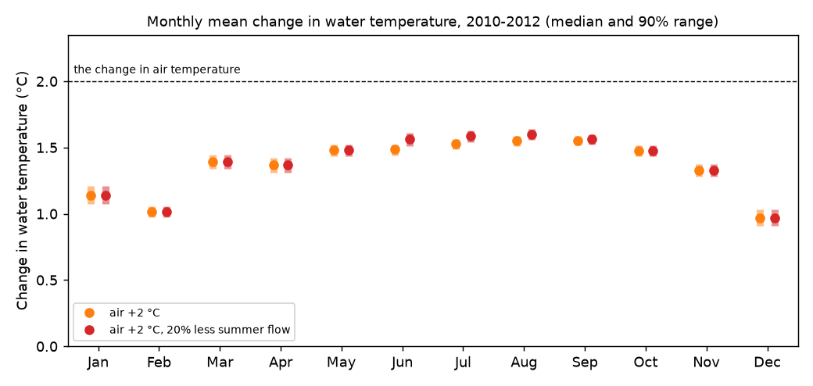
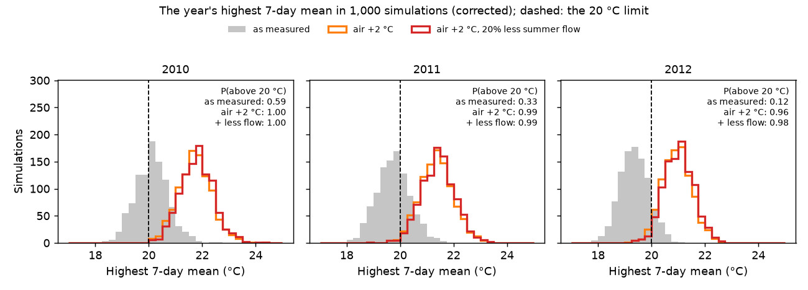

# 08 Climate: what would a warmer climate do?

**Question:** if the air over the Mentue had been 2 °C warmer in 2010–2012, how
much warmer would the river have been? How often would a 20 °C limit on the
7-day mean have been exceeded? And what if summer flows had also been 20%
lower?

This example uses the simplest kind of climate scenario, a "delta change": the
measured air temperature plus 2 °C on every day. The same steps work for air
temperature and discharge from a climate model (see [Climate-model
data](#climate-model-data) below).

## Run it

```bash
python examples/08_climate/run.py
```

It takes about four minutes. It makes the two scenario files from the measured
2010–2012 file, then runs:

```bash
pyair2stream --config examples/08_climate/calibrate.yaml      # calibrate with uncertainty (as example 02)
pyair2stream --config examples/08_climate/baseline.yaml       # 1,000 simulations, as measured
pyair2stream --config examples/08_climate/warmer.yaml         # the same, with the air 2 °C warmer
pyair2stream --config examples/08_climate/warmer_drier.yaml   # 2 °C warmer, and 20% less flow in June-September
pyair2stream --config examples/08_climate/check.yaml          # cross-validation, to check the yearly peaks (as example 03)
```

Two settings in [`warmer.yaml`](warmer.yaml) and
[`warmer_drier.yaml`](warmer_drier.yaml) matter:

- `reuse_sample_indices_from` makes each scenario use the same 1,000
  parameter sets as the baseline. The change can then be computed simulation
  by simulation, as in example [04](../04_scenario/README.md).
- `calibration_metadata` keeps the calibration's mean discharge (`Qmedia`), so
  a reduced flow is seen as reduced.

The scenario files have no water temperature: it was not measured under these
conditions.

## Step 1: is the scenario inside what the model has seen?

A scenario warmer than any calibration year asks the model to extrapolate. The
script compares them:

| | 2010–2012, measured | 2010–2012, +2 °C | Warmest of 2002–2009 |
|---|---|---|---|
| Mean summer (Jun–Aug) air temperature | 18.3 °C | 20.3 °C | 21.3 °C (2003) |

Only 1.0% of the scenario's days are warmer than the warmest day of
2002–2009 (25.5 °C). The 2003 heatwave summer lies in the calibration years,
so the scenario stays mostly inside the conditions the model was fitted to.
Check this for your own scenario. On the Swiss rivers, the model was
calibrated on the coolest third of the years. It predicted the warmest third
almost as well: at most 0.07 °C worse (validation
[V10](../../validation/REPORT.md#v10)).

## Step 2: how much warmer is the river?

The change, simulation by simulation (scenario minus baseline):

| Scenario | Change in | Median | 90% range |
|---|---|---|---|
| air +2 °C | summer (Jun–Aug) mean | +1.52 °C | +1.48 to +1.56 °C |
| air +2 °C | winter (Dec–Feb) mean | +1.04 °C | +0.99 to +1.10 °C |
| air +2 °C | whole-year mean | +1.36 °C | +1.32 to +1.40 °C |
| air +2 °C, 20% less summer flow | summer (Jun–Aug) mean | +1.58 °C | +1.54 to +1.63 °C |
| air +2 °C, 20% less summer flow | winter (Dec–Feb) mean | +1.04 °C | +0.99 to +1.10 °C |



*The monthly mean change, with its 90% range across the 1,000 parameter sets.
The dashed line is the change in air temperature.*

**Reading it.**

- The river warms by less than the air: about 1.5 °C in summer and 1.0 °C in
  winter, for 2 °C warmer air.
- **Why less, and why less in winter?** In the model's equation, 1 °C warmer air
  raises the water's balance temperature by a2 / (a3 + a8·θ). Here θ is the
  flow relative to its mean. With this calibration, that is 0.78 °C at the
  median summer flow, and 0.63 °C at the mean flow. The Mentue's flow is higher
  in winter, so the response is smaller then. In cold spells the water also
  cannot fall below 0 °C in either run, so the change there is small.
- **Less summer flow adds little:** 0.06 °C in summer. With less water, the
  river follows the air a little more closely (as in example 04).
- The ranges are narrow because they show only the uncertainty of the
  parameters within this model (see [Limits](#limits-of-this-approach)).

## Step 3: the yearly peaks and the limit

The year's highest 7-day mean is checked and corrected by cross-validation, as
in example [03](../03_compliance/README.md). The same correction is applied to
all three runs.

| Year | P(7-day mean > 20 °C): as measured | air +2 °C | air +2 °C, less summer flow | Days above 18 °C: as measured | air +2 °C | air +2 °C, less summer flow |
|---|---|---|---|---|---|---|
| 2010 | 0.59 | 1.00 | 1.00 | 31 (23 to 39) | 51 (42 to 60) | 52 (43 to 61) |
| 2011 | 0.33 | 0.99 | 0.99 | 19 (12 to 27) | 41 (33 to 50) | 42 (34 to 51) |
| 2012 | 0.12 | 0.96 | 0.98 | 25 (16 to 34) | 57 (44 to 69) | 59 (46 to 71) |

*Days above 18 °C: median, with the 90% range in brackets.*



*Grey: as measured. Orange and red outlines: the two scenarios. Dashed: the
20 °C limit. P: the share of the simulations above the limit.*

**Reading it.** The year's highest 7-day mean rises by 1.6 °C (90% range 1.56 to
1.65 °C). In 2010–2012, a 20 °C limit was exceeded in one year of three (P =
0.12 to 0.59). With 2 °C warmer air, it would be exceeded almost every year (P =
0.96 to 1.00). The number of days above 18 °C would roughly double.

## Climate-model data

To use air temperature and discharge from a climate model instead of a delta
change:

- run `FORWARD` directly on the climate model's daily series, with
  `calibration_metadata` from your calibration, as here;
- if the model uses a 365-day or 360-day calendar, declare it with
  `calendar: "noleap"` or `calendar: "360_day"` (USER_GUIDE
  [§5](../../USER_GUIDE.md#5-preparing-your-own-data));
- climate models are biased. Adjust their air temperature and discharge to the
  measured ones first (bias correction). Or use them as a change applied to the
  measurements, as here;
- a scenario file must be at least 365 days long.

## Limits of this approach

- **Parameter uncertainty only, for the change.** The narrow ranges show the
  uncertainty of the parameters *within this model*. They do not cover the
  chance that the river responds differently in a warmer climate: changes in
  shading, groundwater, snowmelt or the timing of flows.
- **A delta change keeps the measured weather.** Adding 2 °C to every day keeps
  the day-to-day pattern of 2010–2012. A warmer climate may also bring more or
  longer heatwaves. Climate-model series can include that.
- **The yearly peaks rest on the cross-validation check.** The correction
  assumes the model's error in the peaks is the same in a warmer climate.
- **Stay near the calibrated conditions.** Check how far the scenario goes
  beyond the calibration years (step 1). Discharge outside the calibrated range
  gives a warning.

## Next

That completes the examples. For results that support a decision, work through
the checklist in USER_GUIDE [§14](../../USER_GUIDE.md#14-checklist-for-results-that-support-a-decision).
