# 09 Integrator stability: the B series and the five methods

**Questions:**

- Why is `CRN` the default integrator? When do `RK4`, `RK2` and `EUL` fail,
  and is `EXP` as safe as `CRN`?
- Does the answer depend on the model version (3, 4, 5, 7, 8) and on the river?
- What is the B series, and what can it tell me before I run a scenario?
- Where do the stability limits, 2 and 2.785, come from? B-series (Butcher
  series) answer this.

The model steps the water temperature forward one day at a time. The
numerical method that takes each step is the integrator (`integrator` in the
settings file). Whether a method is stable comes down to one number per day:
B, how fast the water temperature is pulled back towards equilibrium. This
example works out B for every river and model version, and what each method
does with it. Then it checks the theory against the package itself and
against a fine-step solution of the same equation.

No calibration is needed. The example uses the parameters published by the
original model's authors for the three Swiss rivers
([`data/switzerland/`](../../data/switzerland/README.md)), for every version:

- the **2016 parameters** (Piccolroaz et al., 2016), calibrated with `CRN`;
- the **2015 parameters** (Toffolon and Piccolroaz, 2015), calibrated with `RK4`.

Each set reproduces its paper's errors only with its own method
([V2](../../validation/REPORT.md#v2), [V13](../../validation/REPORT.md#v13)).

## Run it

```bash
python examples/09_integrator_stability/run.py
```

It takes under a minute. It runs the package's integrators several hundred
times, through the same functions a run uses (`read_calibration`,
`read_Tseries`, `call_model`, and the checks a FORWARD run makes). It writes
the tables to `output/` and the figures below to `figures/`. Every number on
this page comes from it.

## In short

- **B decides stability.** With a one-day step, the explicit methods are
  stable only while B stays below 2 (`EUL`, `RK2`) or 2.785 (`RK4`). `CRN` and
  `EXP` are stable for any B ≥ 0.
- **The model version decides how B behaves.** In versions 3 and 5, B is a
  constant (`a3`), so stability is settled once, whatever the flow. In versions
  4, 7 and 8, B follows discharge: a method that is stable on the recorded
  flows can be unstable on other flows.
- **`CRN` and `EXP` always followed the equation.** With all 30 published
  parameter sets, they stayed within 0.10 °C (`CRN`) and 0.21 °C (`EXP`) RMS of
  a fine-step solution. With the 2016 parameters, `RK4` failed for 10 of the 15
  sets and `RK2` for 12. `EUL` failed for 12 and was 0.73–0.88 °C off for the
  other 3.
- **Calibration adapts to its method.** Calibration with `RK4` kept B under
  `RK4`'s limit. In one case it went further: the fit relies on how `RK4`
  behaves just under its limit, and the same equation solved exactly fits much
  worse.
- **An unstable run does not always blow up.** The 0 °C floor can turn it into
  plausible-looking numbers that no check after the run sees. So the package
  checks the B series before running. Besides the share of days above the
  limit, it works out how much a difference can grow over a stretch of days,
  and stops the run if it can grow more than 100 times. With the 30 published
  parameter sets, that stops every run that was more than 1 °C off the
  equation.
- **With `CRN`, discharge cannot make a run unstable.** A difference can grow
  briefly when B falls sharply after a flood (at most 2.6 times here), but the
  growth cannot compound.

## 1. One equation, one number: B

Every model version can be written in the same form
([docs/METHODS.md §5](../../docs/METHODS.md#5-the-equation-and-model-versions);
θ is discharge divided by its mean, `Qmedia`):

    dTw/dt = A(t) − B(t)·Tw

| Version | A(t): the terms without Tw | B(t): what multiplies −Tw |
|:-:|---|---|
| 3 | a1 + a2·Ta | a3 |
| 4 | (a1 + a2·Ta) / θ^a4 | a3 / θ^a4 |
| 5 | a1 + a2·Ta + a6·cos(2π(t − a7)) | a3 |
| 7 | a1 + a2·Ta + θ·(a5 + a6·cos(2π(t − a7))) | a3 + a8·θ |
| 8 | [a1 + a2·Ta + θ·(a5 + a6·cos(2π(t − a7)))] / θ^a4 | (a3 + a8·θ) / θ^a4 |

What B means:

- **B is a rate, per day.** The water temperature is pulled towards the
  equilibrium A/B. Left alone, a difference from it shrinks by a factor
  exp(−B) each day: to 37% after one day if B = 1, to 5% if B = 3.
- **1/B is the response time**, in days.
- **B must be positive.** A negative B pushes the water away from
  equilibrium, which is impossible, and every method then grows, as the
  equation does. The package warns if a calibration gives one
  ([USER_GUIDE §9.1](../../USER_GUIDE.md#91-numerical-stability-and-the-choice-of-integrator)).

The step is one day (Δt = 1 day). So what matters for stability is the
product B·Δt, which has no unit and the same value as B.

The equation is linear in Tw. So if two simulations differ on one day (in the
start value, by rounding, or by an error in the inputs), they differ on the
next day by a factor that depends only on B and the method. That makes the
analysis below exact, apart from the 0 °C floor (`Tice_cover`), which the
package applies after every step.

## 2. The B series

`compute_B_series` returns B for every day of a loaded record, with the
parameters loaded. It is the series the package's stability check uses:

```python
from pyair2stream.io import read_calibration, read_Tseries
from pyair2stream.model import compute_B_series, stability_report

data = read_calibration("my_scenario.yaml")     # e.g. a FORWARD settings file
read_Tseries(data, "c")
B = compute_B_series(data)    # per day; the first 365 values repeat the first year (the warm-up)
print(B[365:].max())          # the largest B
print(stability_report(data)) # the share of days above the integrator's limit, the worst days,
                              # and the largest growth of a difference (section 9)
```

Here is B through 2004, with the 2016 parameters:

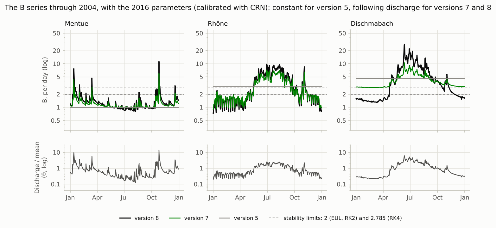

And B against discharge, from the formulas of the table above:

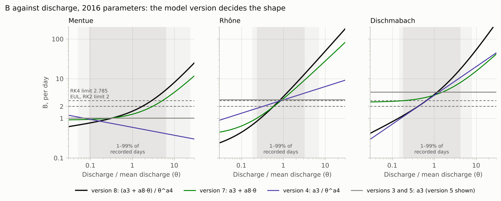

**Reading it.**

- **Versions 3 and 5: B is constant** (B = a3). Stability is settled once, by
  one number, whatever the flow.
- **Version 4: B = a3 / θ^a4 moves one way with flow.** With a4 > 0 (the
  Mentue, 0.200), B rises as flow falls. With a4 < 0 (the Rhône and the
  Dischmabach), it rises with flow.
- **Version 7: B = a3 + a8·θ rises in proportion to flow** (a8 > 0 on all
  three rivers).
- **Version 8 combines both: B = a3·θ^(−a4) + a8·θ^(1−a4).** With a4 < 0, as in
  all three 2016 sets, B rises faster than flow (as θ^1.53 on the
  Dischmabach). With 0 < a4 < 1, as in all three 2015 sets, both low and high
  flows raise B.
- **Floods give the fastest response.** With version 8 and the 2016
  parameters, B reaches 39 per day on the Dischmabach (a response time under an
  hour), 33 on the Rhône and 20 on the Mentue.
- **On the Rhône and the Dischmabach, the 2016 parameters put B above 2 on at
  least half of the days, in every version.** There, `EUL` and `RK2` are
  unstable on those days.

B on the calibration record, 2016 parameters (`output/B_series_statistics.csv`
has the 2015 sets too):

| River | Version | a3 | a4 | a8 | median B | 99th percentile | largest | days B > 2 | days B > 2.785 |
|---|:-:|---|---|---|---|---|---|---|---|
| Mentue | 3 | 0.639 | | | 0.64 | 0.64 | 0.64 | 0% | 0% |
| Mentue | 4 | 0.593 | 0.200 | | 0.65 | 0.95 | 1.08 | 0% | 0% |
| Mentue | 5 | 1.010 | | | 1.01 | 1.01 | 1.01 | 0% | 0% |
| Mentue | 7 | 0.905 | | 0.361 | 1.13 | 3.23 | 9.69 | 4.8% | 1.7% |
| Mentue | 8 | 1.060 | −0.158 | 0.450 | 1.25 | 5.32 | 19.9 | 12.8% | 5.3% |
| Rhône | 3 | 2.565 | | | 2.56 | 2.56 | 2.56 | 100% | 0% |
| Rhône | 4 | 2.913 | −0.337 | | 2.48 | 4.31 | 5.65 | 93.2% | 39.0% |
| Rhône | 5 | 2.966 | | | 2.97 | 2.97 | 2.97 | 100% | 100% |
| Rhône | 7 | 0.365 | | 2.742 | 2.07 | 9.17 | 20.0 | 52.1% | 38.7% |
| Rhône | 8 | 0.374 | −0.191 | 3.139 | 2.12 | 13.1 | 33.3 | 53.1% | 41.3% |
| Dischmabach | 3 | 2.477 | | | 2.48 | 2.48 | 2.48 | 100% | 0% |
| Dischmabach | 4 | 3.785 | −0.725 | | 2.49 | 10.8 | 17.0 | 59.8% | 47.3% |
| Dischmabach | 5 | 4.617 | | | 4.62 | 4.62 | 4.62 | 100% | 100% |
| Dischmabach | 7 | 2.552 | | 1.295 | 3.28 | 8.03 | 12.8 | 100% | 98.8% |
| Dischmabach | 8 | 2.658 | −0.530 | 1.305 | 2.50 | 17.6 | 38.9 | 59.9% | 47.6% |

## 3. What one step does: the amplification factor

Take two simulations that differ by some amount on one day. After one step,
they differ by R times that amount. R is the method's **amplification
factor**. For the equation itself, R = exp(−B·Δt). For each method, when B is
the same on both days of the step:

| `integrator` | Method | R | Stable for |
|---|---|---|---|
| `CRN` | Crank–Nicolson (implicit trapezoidal rule) | (1 − B/2) / (1 + B/2) | every B ≥ 0 |
| `EXP` | exponential (integrating factor) | exp(−B) | every B ≥ 0 |
| `RK4` | classical Runge–Kutta, 4th order | 1 − B + B²/2 − B³/6 + B⁴/24 | B ≤ 2.785 |
| `RK2` | Heun (Runge–Kutta, 2nd order) | 1 − B + B²/2 | B ≤ 2 |
| `EUL` | explicit Euler | 1 − B | B ≤ 2 |

A method is stable while |R| ≤ 1, so that differences do not grow.

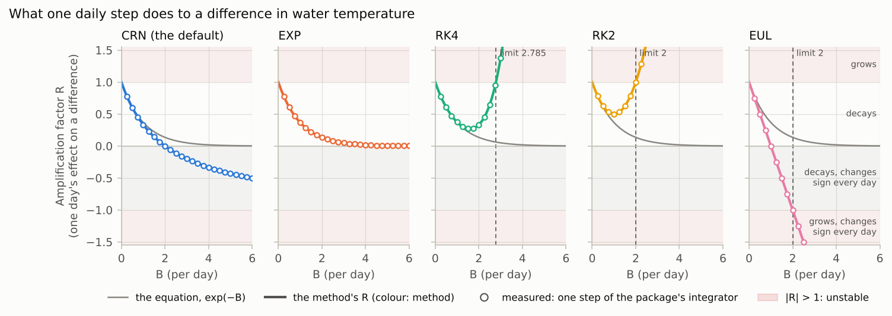

| B (per day) | equation, exp(−B) | `CRN` | `EXP` | `RK4` | `RK2` | `EUL` |
|---|---|---|---|---|---|---|
| 0.5 | 0.607 | 0.600 | 0.607 | 0.607 | 0.625 | 0.500 |
| 1 | 0.368 | 0.333 | 0.368 | 0.375 | 0.500 | 0.000 |
| 1.6 | 0.202 | 0.111 | 0.202 | 0.270 | 0.680 | −0.600 |
| 2 | 0.135 | 0.000 | 0.135 | 0.333 | 1.000 | −1.000 |
| 2.5 | 0.082 | −0.111 | 0.082 | 0.648 | 1.625 | −1.500 |
| 2.785 | 0.062 | −0.164 | 0.062 | 1.000 | 2.093 | −1.785 |
| 3 | 0.050 | −0.200 | 0.050 | 1.375 | 2.500 | −2.000 |
| 5 | 0.007 | −0.429 | 0.007 | 13.708 | 8.500 | −4.000 |

**Reading it.**

- **There are four kinds of behaviour.** With 0 < R < 1, a difference decays,
  as in the equation. With −1 < R < 0, it decays but changes sign every day (a
  zigzag). With R < −1, it grows and zigzags. With R > 1, it grows steadily.
- **`EXP` is exact** for this decay, for any B.
- **`CRN`** is close to the equation up to B ≈ 1. At B = 2 it removes a
  difference completely (R = 0). Above 2 it makes the difference zigzag, and
  the zigzag decays more slowly as B grows (R tends to −1). It never grows.
- **`RK4` and `RK2` never damp as much as the equation.** `RK4`'s R is never
  below 0.27 (at B = 1.6), and `RK2`'s never below 0.5 (at B = 1). Past their
  limits they grow without changing sign: an unstable run drifts away
  smoothly instead of zigzagging.
- **`EUL`** zigzags above B = 1 and grows above B = 2.
- **These are the package's own numbers.** The circles are R measured by one
  step of the package's integrators (version 3 with no forcing). They match
  the formulas to 4 × 10⁻¹⁵.

When B changes from day to day, each method takes B from particular days.
With B_j and B_j+1 the values on the two days of a step:

| `integrator` | R for the step from day j to day j+1 |
|---|---|
| `CRN` | (1 − B_j/2) / (1 + B_j+1/2) |
| `EXP` | exp(−(B_j + B_j+1)/2) |
| `RK4` | its four stages use B_j, then twice B at the mean discharge of the two days, then B_j+1 |
| `RK2` | 1 − B_j/2 − B_j+1·(1 − B_j)/2 |
| `EUL` | 1 − B_j+1 (like the Fortran, it uses the next day's inputs) |

The package computes these daily factors itself (`step_amplification`). On the
real discharge of the three rivers (version 8, all five methods), they match
the integrators' steps to 1.2 × 10⁻¹⁵, over 10,997 steps.

**With `CRN`, a difference can grow for a step when B falls sharply**, for
example the day after a flood peak: 1 − B_j/2 is then large and negative, and
1 + B_j+1/2 is small. But it cannot compound. Over a stretch of days the
factors telescope: their product is (1 − B_first/2) / (1 + B_last/2) times a
factor (1 − B/2) / (1 + B/2) for each day in between, and each of those lies
between −1 and 1. So however long the run, a difference never grows by more
than a factor of about half the largest B. With the published parameters it
grew at most 2.6 times (the Mentue, version 8), and at most 1.5 times in the
scenario flows of section 8. `EXP` never lets a difference grow: its factor is
exp(−B) on every step.

## 4. Where the limits come from: B-series

**A note on names.** The B series of section 2 is a series of daily values of
B. A B-series in numerical analysis is something else. It writes what one step
of a method does as a sum over rooted trees. It is named after John Butcher,
whose theory of these trees it rests on (Hairer and Wanner, 1974). It is the
standard tool for finding a method's order and its stability function, and so
the limits 2 and 2.785. You can skip this section.

**Runge–Kutta methods are tables of numbers.** One step of a Runge–Kutta
method for dy/dt = f(y) computes s stage values and combines them:

    Y_i   = y + Δt · Σ_j a_ij · f(Y_j)        (i = 1 … s)
    y_new = y + Δt · Σ_i b_i · f(Y_i)

The numbers a_ij and b_i (the Butcher tableau) define the method. c_i = Σ_j
a_ij is the point in the step at which stage i takes the inputs. Four of the
package's methods are Runge–Kutta methods (only the non-zero a_ij are listed):

| `integrator` | Method | Stages | a_ij | b_i | c_i |
|---|---|:-:|---|---|---|
| `EUL` | explicit Euler | 1 | none | 1 | 0 |
| `RK2` | Heun (explicit trapezoidal rule) | 2 | a21 = 1 | 1/2, 1/2 | 0, 1 |
| `CRN` | implicit trapezoidal rule (2-stage Lobatto IIIA) | 2 | a21 = a22 = 1/2 | 1/2, 1/2 | 0, 1 |
| `RK4` | classical Runge–Kutta | 4 | a21 = a32 = 1/2, a43 = 1 | 1/6, 1/3, 1/3, 1/6 | 0, 1/2, 1/2, 1 |

`CRN` is implicit: a22 is not zero, so its second stage depends on itself.
Because the equation is linear in Tw, the package solves that stage exactly.
The package's `EUL`, like the Fortran's, takes the inputs at the end of the
step (c = 1) instead of the start; that changes nothing below, which concerns
the trees and the stability function. `EXP` is not a Runge–Kutta method; it
uses the exponential function itself.

**The B-series of one step.** Expand one step in powers of Δt. Each term
belongs to a rooted tree t:

    y_new = y + Σ over trees t of   Δt^|t| / σ(t) · Φ(t) · F(t)(y)

- |t| is the number of vertices of the tree (its order), and σ(t) a symmetry
  factor.
- F(t) is an elementary differential, built from f and its derivatives in the
  shape of the tree: f for a single vertex, f′f for two in a line, f″(f, f) for
  a root with two leaves, and so on.
- Φ(t) is the method's elementary weight for the tree, a polynomial in the
  a_ij and b_i: Σ b_i for a single vertex, Σ b_i c_i for two, Σ b_i c_i² for a
  root with two leaves, Σ b_i a_ij c_j for three in a line, and so on.

The exact solution has the same expansion, with Φ(t) = 1/γ(t). Here γ(t) is
the product, over the vertices, of the number of vertices in the subtree that
each one heads. A method has order p if Φ(t) = 1/γ(t) for every tree with up to
p vertices. There are 8 trees up to order 4:

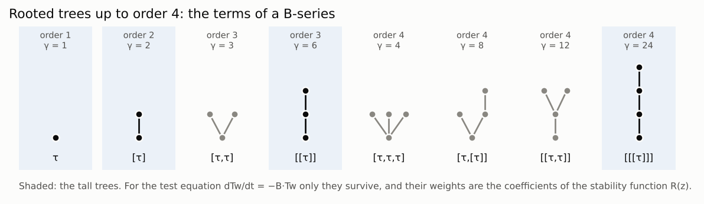

The elementary weights of the four Runge–Kutta methods (exact fractions from
`run.py`; in bold, the first trees each method gets wrong):

| Tree | Order | exact, 1/γ | `EUL` | `RK2` | `CRN` | `RK4` |
|---|:-:|---|---|---|---|---|
| τ | 1 | 1 | 1 | 1 | 1 | 1 |
| [τ] | 2 | 1/2 | **0** | 1/2 | 1/2 | 1/2 |
| [τ,τ] | 3 | 1/3 | 0 | **1/2** | **1/2** | 1/3 |
| [[τ]] | 3 | 1/6 | 0 | **0** | **1/4** | 1/6 |
| [τ,τ,τ] | 4 | 1/4 | 0 | 1/2 | 1/2 | 1/4 |
| [τ,[τ]] | 4 | 1/8 | 0 | 0 | 1/4 | 1/8 |
| [[τ,τ]] | 4 | 1/12 | 0 | 0 | 1/4 | 1/12 |
| [[[τ]]] | 4 | 1/24 | 0 | 0 | 1/8 | 1/24 |

So `EUL` has order 1, `RK2` and `CRN` order 2, and `RK4` order 4.

**For stability, only the tall trees matter.** Take the test equation
dy/dt = −B·y. Its f is linear, so f″ and all higher derivatives are zero, and
every tree with a vertex that has two or more children drops out. Only the
tall trees remain (shaded above): chains of k vertices, with
F = (−B)^k·y and σ = 1. The B-series then collapses to a power series in
z = −B·Δt, the method's **stability function**:

    R(z) = 1 + Σ_k Φ(chain of k vertices) · z^k,     with Φ(chain of k vertices) = Σ_i b_i (A^(k−1) 1)_i

For the exact solution the coefficients are 1/γ = 1/k!, and the sum is exp(z).

| k | exact, 1/k! | `EUL` | `RK2` | `CRN` | `RK4` |
|:-:|---|---|---|---|---|
| 1 | 1 | 1 | 1 | 1 | 1 |
| 2 | 1/2 | 0 | 1/2 | 1/2 | 1/2 |
| 3 | 1/6 | 0 | 0 | 1/4 | 1/6 |
| 4 | 1/24 | 0 | 0 | 1/8 | 1/24 |
| 5 | 1/120 | 0 | 0 | 1/16 | 0 |
| 6 | 1/720 | 0 | 0 | 1/32 | 0 |

- `EUL`, `RK2` and `RK4` give exactly the first 2, 3 and 5 terms of exp(z),
  and then stop. Their R is a polynomial: the R of section 3.
- `CRN` gives 1, 1, 1/2, 1/4, 1/8, …, a geometric series. Its sum is
  (1 + z/2) / (1 − z/2).
- `EXP` gives every term, 1/k!: its R is exp(z) itself.

What follows:

1. **Every explicit Runge–Kutta method has a limit.** An explicit method only
   uses earlier stages (a_ij = 0 for j ≥ i). Then A^s = 0, and R is a
   polynomial of degree at most s. A polynomial grows without bound as B
   grows. So no explicit Runge–Kutta method, of any order, is stable for every
   B. Only implicit methods (`CRN`) and exponential ones (`EXP`) can be.
2. **The limits are where |R(−B)| reaches 1.** 1 − B = −1 gives 2 for `EUL`.
   1 − B + B²/2 = 1 gives 2 for `RK2`. 1 − B + B²/2 − B³/6 + B⁴/24 = 1 gives
   2.7853 for `RK4` (the package uses 2.785).
3. **Matching more terms does not mean being closer for large B.** `RK4`
   matches exp(z) up to the fourth power, so it is the most accurate for small
   B. But its polynomial turns upwards past B = 1.6. `CRN` matches only up to
   the second power, but its R stays between −1 and 1 for every B ≥ 0 (and
   |R(z)| ≤ 1 in the whole left half of the complex plane: it is A-stable). It
   tends to −1 for large B, so it is not L-stable: very fast components zigzag
   instead of vanishing. `EXP` is exact for every B
   (L-stable).

The same functions in the complex plane give each method's stability region,
the set of z where |R(z)| ≤ 1. B is real, so the model's z = −B·Δt lies on the
negative real axis. The limits are where that axis leaves the region:

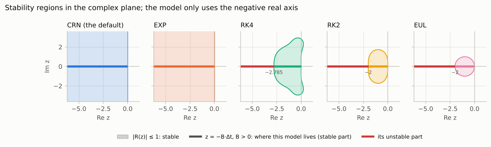

In the full model, A and B change during the day, and the other trees matter
too. They decide how closely each method follows the changing forcing: its
accuracy (section 7). Stability depends on the tall trees alone.

## 5. Every method, every version, every river

Each of the 30 published parameter sets was run with each method on its
river's calibration record, as a FORWARD run would run it. Each run was
compared with a fine-step solution of the same equation (96 steps per day, as
in [validation V6](../../validation/REPORT.md#v6)). The numbers are the RMS
difference in °C.

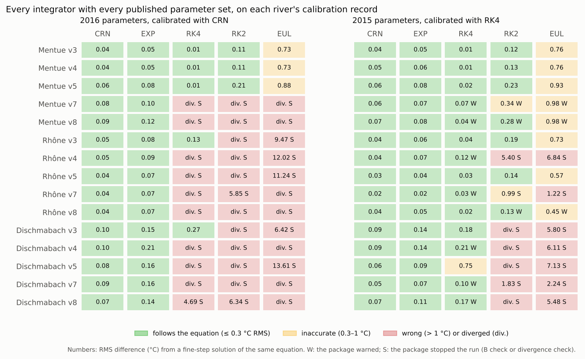

**Reading it.**

- **`CRN` and `EXP` followed the equation in every case**: `CRN` within
  0.02–0.10 °C RMS, `EXP` within 0.02–0.21 °C.
- **With the 2016 parameters (calibrated with `CRN`), the explicit methods
  mostly fail.** `RK4` followed the equation only where B stays below 2.785 on
  every day: Mentue versions 3–5, and version 3 of the Rhône and the
  Dischmabach. In the other 10 cases it diverged (9) or was 4.7 °C off. `RK2`
  and `EUL` failed wherever B goes above 2. The package stopped all of these
  runs. (Here a run has diverged when a temperature is not a number or above
  60 °C, the package's `max_plausible_twat`. [V2](../../validation/REPORT.md#v2)
  uses 100 °C, so it counts 8 divergences: there the Mentue's version 7, which
  peaks at 67 °C, is 1.7 °C off instead.)
- **With the 2015 parameters (calibrated with `RK4`), `RK4` followed the
  equation in 14 of 15 cases.** The package warned in 7 of them, because B was
  above 2.785 on 0.15–2.3% of days, but this did not matter: a difference could
  grow at most 26 times (section 9). The
  exception, Dischmabach version 5 (0.75 °C), is the subject of section 6.
- **Where it does not fail, `EUL` is still 0.45–0.98 °C off.** It is a
  first-order method, and the package's variant (the Fortran's) runs a day
  early (section 7).

The B series of the published parameter sets explains the pattern:

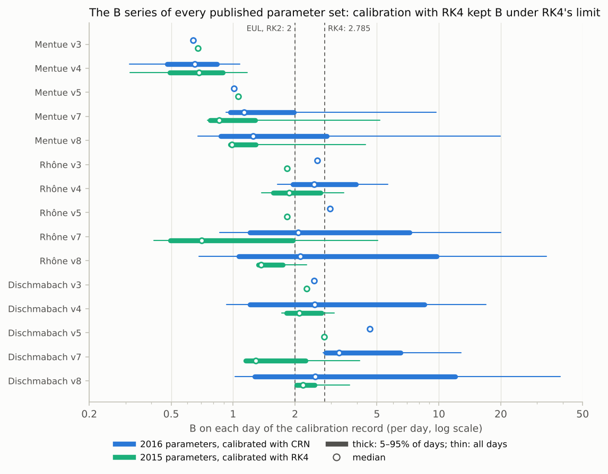

- **Calibration with `RK4` kept B under `RK4`'s limit.** For every 2015 set, B
  is above 2.785 on at most 2.0% of days, and its 99th percentile is never
  above 2.83. A calibration cannot settle on parameters that make its own
  method unstable, because they fit badly. So an `RK4` calibration stops at
  `RK4`'s limit, even where a `CRN` calibration of the same model chose a
  faster response. On the Dischmabach, version 5 has a3 = 2.768 (`RK4`, 0.6%
  under the limit) against 4.617 (`CRN`). Version 7 has a median B of 1.29
  against 3.28.

## 6. A calibration can learn its method's quirks

Take the Dischmabach, version 5, with the 2015 parameters: a3 = B = 2.768 on
every day, 0.6% under `RK4`'s limit (2.7853). There, `RK4`'s R is 0.974. The
equation's is exp(−2.768) = 0.063, and `CRN`'s is −0.161. One `RK4` step leaves
97% of a difference in place; the equation removes 94% of it.

With `RK4`, the parameters reproduce the published fit. Solved exactly, the
same equation with the same parameters fits much worse:

| Simulation | RMSE against the measurements | Mean error |
|---|---|---|
| 2015 parameters, `RK4` (as calibrated) | 0.70 °C | −0.02 °C |
| 2015 parameters, the equation solved exactly | 0.97 °C | −0.46 °C |
| 2016 parameters, `CRN` (as calibrated) | 0.74 °C | −0.04 °C |

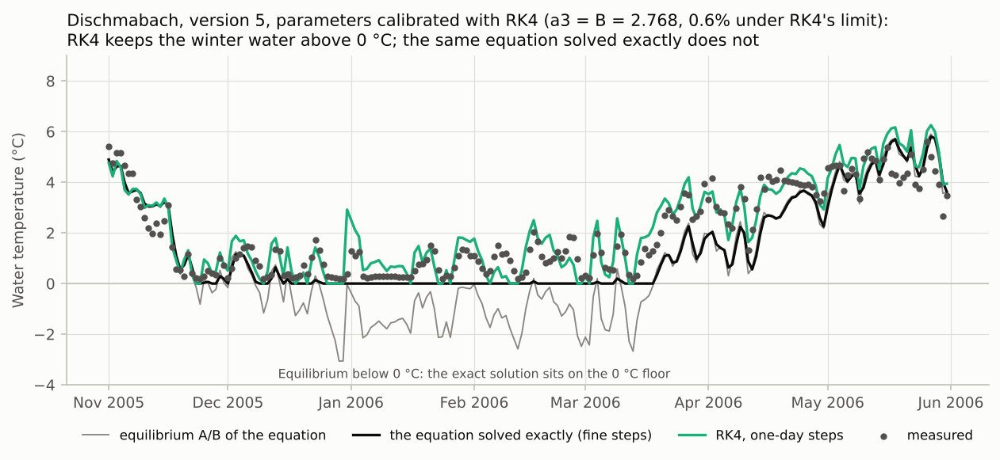

| Month | RMSE, `RK4` | RMSE, solved exactly | Days with the equilibrium below 0 °C |
|---|---|---|---|
| January | 0.56 °C | 0.99 °C | 77% |
| February | 0.59 °C | 1.21 °C | 83% |
| March | 0.74 °C | 1.64 °C | 38% |
| April | 0.76 °C | 1.49 °C | 1% |
| May to November | 0.54–0.94 °C | 0.53–0.93 °C | 0–4% |
| December | 0.70 °C | 0.74 °C | 41% |

**Reading it.**

- **The difference is in winter and early spring.** From May to November the
  two agree to within 0.05 °C RMSE in each month.
- **The equation puts the winter water at 0 °C.** In January and February its
  equilibrium A/B is below 0 °C on about 80% of days, so the exact solution
  sits on the 0 °C floor. The measurements do not: they average 0.95 °C in
  January and 1.14 °C in February.
- **`RK4` keeps the water above 0 °C.** With R = 0.974, a difference from
  equilibrium lasts for weeks: half of it is still there after 26 days. When
  the floor holds the water above its equilibrium, `RK4` carries that
  difference forward, and each day's change in the equilibrium still comes
  through almost in full.
- **So the calibration fitted the winter with a numerical effect.** These are
  `RK4` parameters in the strongest sense. They describe the equation as `RK4`
  solves it with a one-day step, not the equation itself. They cannot be run
  with another method, or carried over to conditions in which the effect
  differs.

**A warning sign:** a calibrated B (`a3`, for versions 3 and 5) just under an
explicit method's limit. The fit may depend on the method's behaviour there.
Calibrate again with `CRN`, and compare.

## 7. Stable is not the same as accurate

Even where they are stable, the methods differ in how closely they follow the
equation. Over the stable runs of section 5 (`CRN` and `EXP` always, the other
methods where no difference can grow):

| `integrator` | RMS difference from the fine-step solution |
|---|---|
| `CRN` | 0.02–0.10 °C (30 runs) |
| `EXP` | 0.02–0.21 °C (30 runs) |
| `RK4` | 0.01–0.27 °C (12 runs), and 0.75 °C for the case of section 6 |
| `RK2` | 0.11–0.23 °C (8 runs) |
| `EUL` | 0.57–0.93 °C (8 runs) |

A simple test shows where the differences come from. Let the equilibrium warm
steadily, by 0.02 °C a day, with B constant. The equation then lags behind
the equilibrium by 1/B days. Here is how much more each method lags, in hours
(negative: ahead):

| B (per day) | The equation lags by | `CRN` | `EXP` | `RK4` | `RK2` | `EUL` |
|---|---|---|---|---|---|---|
| 0.25 | 96 h | 0 | 0.5 | 0 | 0 | −24 |
| 0.5 | 48 h | 0 | 1.0 | 0 | 0 | −24 |
| 1 | 24 h | 0 | 2.0 | 0 | 0 | −24 |
| 1.5 | 16 h | 0 | 2.9 | 0 | 0 | −24 |
| 2.5 | 9.6 h | 0 | 4.5 | 0 | unstable | unstable |
| 5 | 4.8 h | 0 | 7.4 | unstable | unstable | unstable |
| 20 | 1.2 h | 0 | 10.8 | unstable | unstable | unstable |

- **`CRN`, `RK4` and `RK2` follow a steadily moving equilibrium exactly**,
  wherever they are stable; for `CRN` that is at every B. Their differences
  from the fine-step solution come from inputs that change speed within or
  between days, and from B changing with discharge.
- **`EXP` lags.** It uses the mean of the two days' inputs, so when B is large
  it trails the equilibrium by up to half a day. That is why it is a little
  further from the fine-step solution than `CRN` on the fast-responding
  rivers. A calibration absorbs this: calibrated with `EXP` instead of `CRN`,
  the validation RMSE changed by at most 0.027 °C
  ([V6](../../validation/REPORT.md#v6)).
- **`EUL` runs a day early.** The package's `EUL`, like the Fortran's, combines
  today's water temperature with tomorrow's inputs.

## 8. Other flows: stable on the record, unstable in a scenario

In versions 4, 7 and 8, B depends on flow, so stability does too. Here the
version 8 parameters calibrated with `RK4` (2015) are run with the recorded
discharge multiplied by 0.1 to 3. `Qmedia` stays at the calibration value, as
in any scenario run
([USER_GUIDE §6](../../USER_GUIDE.md#qmedia-keep-it-fixed-when-discharge-changes)).

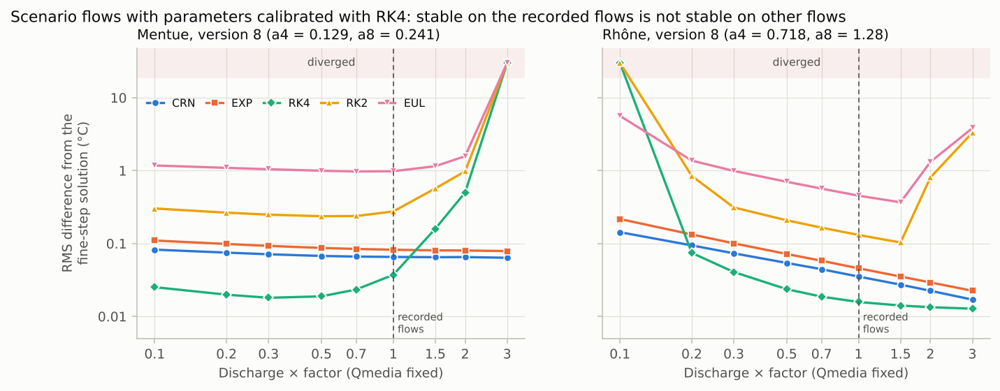

| Flow × | Mentue: largest B | Mentue `RK4` | Mentue `RK2` | Rhône: largest B | Rhône `RK4` | Rhône `RK2` |
|---|---|---|---|---|---|---|
| 0.1 | 1.52 | 0.03 | 0.30 | 3.58 | diverged, stopped | diverged, stopped |
| 0.2 | 1.58 | 0.02 | 0.26 | 2.43 | 0.07 | 0.84, warned |
| 0.5 | 2.68 | 0.02 | 0.24, warned | 1.91 | 0.02 | 0.21 |
| 1 (recorded) | 4.39 | 0.04, warned | 0.28, warned | 2.27 | 0.02 | 0.13, warned |
| 1.5 | 6.01 | 0.16, warned | 0.57, warned | 2.53 | 0.01 | 0.10, warned |
| 2 | 7.57 | 0.50, stopped | 0.98, stopped | 2.74 | 0.01 | 0.80, stopped |
| 3 | 10.55 | diverged, stopped | diverged, stopped | 3.06 | 0.01, warned | 3.32, stopped |

RMS difference from the fine-step solution, °C. `CRN` stayed within 0.14 °C and
`EXP` within 0.22 °C in every case (`output/scenario_flows.csv`).

**Reading it.**

- **On the recorded flows, `RK4` is fine**: within 0.04 °C (Mentue) and
  0.02 °C (Rhône) of the equation.
- **Mentue (a4 = 0.129): floods raise B.** With the flows doubled, `RK4` is
  0.50 °C off. B is above the limit on only 1.1% of days, but on consecutive
  days of a flood, so a difference can grow 110 times, and the package stops
  the run. With the flows tripled, `RK4` diverges.
- **Rhône (a4 = 0.718): low flows raise B.** At a tenth of the flow (a large
  abstraction, or a severe drought), `RK4` diverges. `RK2`, with its lower
  limit, goes wrong sooner. At twice the flow it is 0.80 °C off, and stopped (a
  difference can grow 3,000 times). At a fifth of the flow it is 0.84 °C off
  with only a warning: there a difference can grow only 11 times, but `RK2`
  barely damps so close to its limit (section 9).
- **`CRN` and `EXP` are unaffected.**

## 9. How the package protects you

Around the simulations it reports (FORWARD runs, the validation years,
sensitivity analyses), the package makes these checks
([docs/METHODS.md §15](../../docs/METHODS.md#15-automatic-checks)):

1. **Before: the B check** (`stability_report`, `warn_on_stability`). From the
   B series, it works out the share of days on which B is above the method's
   limit, and how much a difference can grow over a stretch of days (see
   below). If B is above the limit on any day, it warns. It stops the run if
   that happens on more than `stability_error_fraction` of the days (default
   10%), or if a difference can grow more than `stability_max_growth` times
   (default 100).
2. **After: the divergence check** (`check_numerical_divergence`). It stops a
   run with a temperature that is not a number, or is above
   `max_plausible_twat` (default 60 °C).
3. Choosing `RK4`, `RK2` or `EUL` prints a note that it is kept to reproduce
   the Fortran.

An unstable run does not always blow up. The 0 °C floor (`Tice_cover`) cuts
off every excursion below 0 °C, and that can turn an unstable run into
plausible-looking numbers:

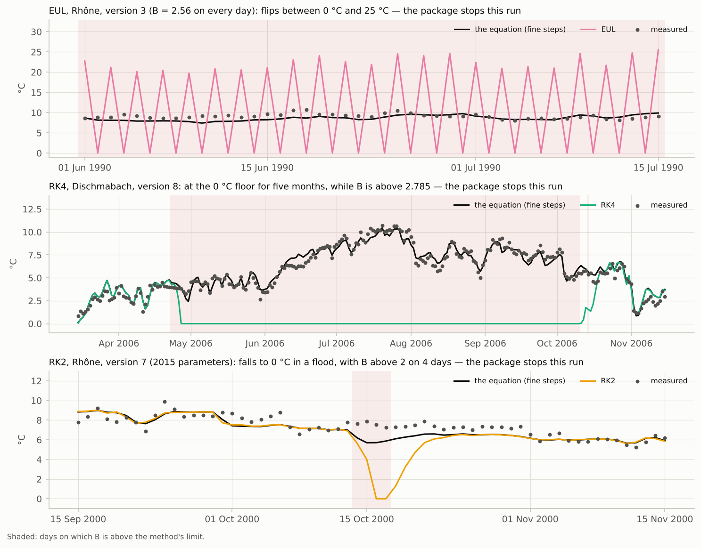

- **`EUL` above B = 2** grows with a zigzag (R < −1). The floor stops every
  downward swing, so on the Rhône it flips between 0 °C and about 25 °C
  instead of blowing up. Its average looks plausible. No temperature is above
  60 °C (the highest is 28.8 °C), so only the B check stops this run (B is
  above 2 on every day).
- **`RK4` above 2.785** grows without changing sign (R > 1). Going down, the
  floor holds it: the Dischmabach sits at 0 °C for five months, while
  snowmelt keeps B above the limit, and recovers in October. The highest
  temperature is 8.1 °C, so again only the B check stops this run (B is above
  the limit on 47% of days).
- **`RK2` in a flood.** On the Rhône (version 7, 2015 parameters), B is above
  2 on four days of the October 2000 flood. `RK2` falls to 0 °C and takes about
  a week to recover. Over the whole record, B is above 2 on only 4.2% of days,
  below the 10% threshold. But in the summer of 1995 it stays above 2 long
  enough for a difference to grow 800,000 times, so the package stops the
  run. Before it checked the growth, the package only warned. This run is
  0.99 °C RMS off the equation (and `EUL`, in the same case, 1.22 °C).

**Why the growth, and not only the share of days.** How wrong a run goes
depends on how much a difference can grow: on how many days in a row B stays
above the limit, and how far above it. The equation is linear, so the growth
over a stretch of days is the product of the daily factors R_j of section 3
(`step_amplification`). It follows from the B series before anything is
simulated (`largest_growth`), and `stability_report` returns it:

```python
report = stability_report(data)     # data: loaded as in section 2, with the integrator to check
print(report["max_growth"])         # how many times a difference can grow (1.0: never)
print(report["growth_stretch"])     # the first and last day of that stretch (indices)
```

Here are both measures for the 90 runs of the three explicit methods with the
30 published parameter sets:

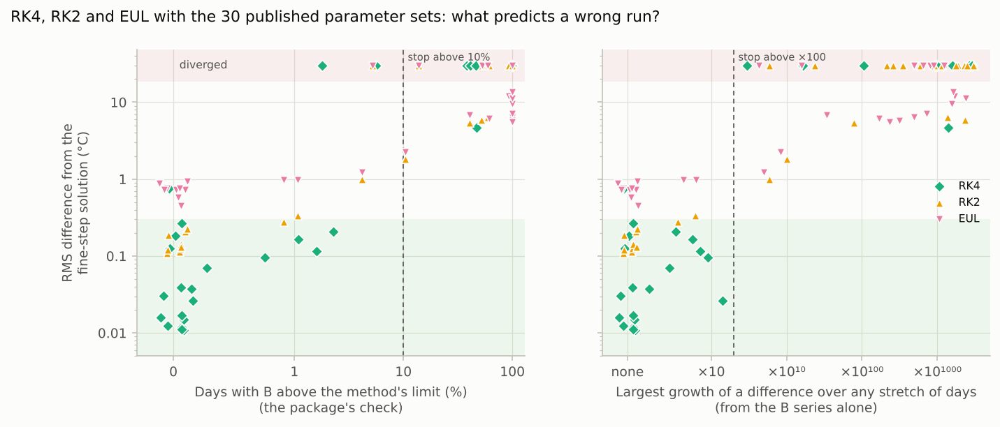

**Reading it.**

- **Left: the share of days.** Runs with B above the limit on 0.1–10% of days
  range from 0.03 °C off to diverged.
- **Right: the largest growth, from the B series alone.** Where no difference
  can grow more than 10 times, every `RK2` run, and every `RK4` run but the one
  of section 6, stayed within 0.34 °C of the equation. (`EUL`'s 0.45–0.98 °C
  there is its own inaccuracy, section 7.) Where a difference can grow more than
  1,000 times, 46 of 47 runs were more than 1 °C off or diverged; the other was
  0.99 °C off. The package stops a run above 100 times (the dashed line); the
  `RK4` runs that followed the equation could grow at most 26 times.
- **What the growth does not catch.** It measures instability, not accuracy.
  `EUL` is 0.45–0.98 °C off where it is stable, and the `RK4` calibration of
  section 6 has no growth at all. `RK2` barely damps close to its limit (its R
  is near 1). So on the Rhône at a fifth of the flow it is 0.84 °C off, while a
  difference can grow only 11 times, and the package only warns. These are
  reasons to use `CRN`, rather than to tighten the check.

## What to do

- **Keep `CRN`, the default.** `EXP` is just as safe. Use it as a second
  opinion.
- **Use `RK4`, `RK2` or `EUL` only to reproduce the Fortran**, with
  parameters calibrated with that method, on flows like those they were
  calibrated on.
- **Parameters belong to the method they were calibrated with.** The 2016
  parameters are `CRN` parameters, and the 2015 parameters `RK4` parameters. A
  FORWARD run given `paths.calibration_metadata` refuses another method.
- **Be wary of a calibrated B just under an explicit method's limit** (for
  example `a3` near 2.785 with `RK4`). Calibrate again with `CRN`, and compare.
- **Before a scenario with versions 4, 7 or 8, look at the B series of the
  scenario's inputs** (`compute_B_series`). With an explicit method,
  `stability_report` also gives the largest growth, and the package stops the
  run above `stability_max_growth`. In versions 3 and 5, flow does not change
  stability.
- **A negative B is impossible**: every method grows, and the package warns.
  Narrow the parameter bounds so that B stays positive (`a3` at least 0 for
  versions 3 and 5).

## Files

| File | What it holds |
|---|---|
| [`run.py`](run.py) | the analysis; draws every figure |
| `output/amplification_factors.csv` | R of each method, B the same every day (section 3) |
| `output/butcher_trees.csv`, `output/stability_function_coefficients.csv` | elementary weights of the trees, and the coefficients of R(z) (section 4) |
| `output/B_series_statistics.csv` | the B series of the 30 published parameter sets (sections 2 and 5) |
| `output/published_parameter_runs.csv` | every method with every parameter set: difference from the fine-step solution, RMSE, share of days above the limit, largest growth, days at 0 °C, the package's response (sections 5 and 9) |
| `output/dischmabach_v5_by_month.csv` | section 6 |
| `output/steady_warming_lag.csv` | section 7 |
| `output/scenario_flows.csv` | section 8 |
| `output/configs/` | the FORWARD settings file of every run |

## References

- Butcher, J. C. (2016). *Numerical Methods for Ordinary Differential
  Equations*, 3rd edition. Wiley.
- Hairer, E. and Wanner, G. (1974). On the Butcher group and general
  multi-value methods. *Computing*, 13, 1–15. (The paper that introduced
  B-series.)
- Hairer, E., Nørsett, S. P. and Wanner, G. (1993). *Solving Ordinary
  Differential Equations I: Nonstiff Problems*, 2nd edition. Springer.
  (Chapter II: Runge–Kutta methods and their order conditions.)
- Hairer, E. and Wanner, G. (1996). *Solving Ordinary Differential Equations
  II: Stiff and Differential-Algebraic Problems*, 2nd edition. Springer.
  (Chapter IV: stability functions, A- and L-stability.)
- Hairer, E., Lubich, C. and Wanner, G. (2006). *Geometric Numerical
  Integration*, 2nd edition. Springer. (Chapter III: B-series.)
- Hochbruck, M. and Ostermann, A. (2010). Exponential integrators. *Acta
  Numerica*, 19, 209–286.
- The published parameters: Piccolroaz et al. (2016) and Toffolon and
  Piccolroaz (2015), cited in
  [data/switzerland/README.md](../../data/switzerland/README.md).
