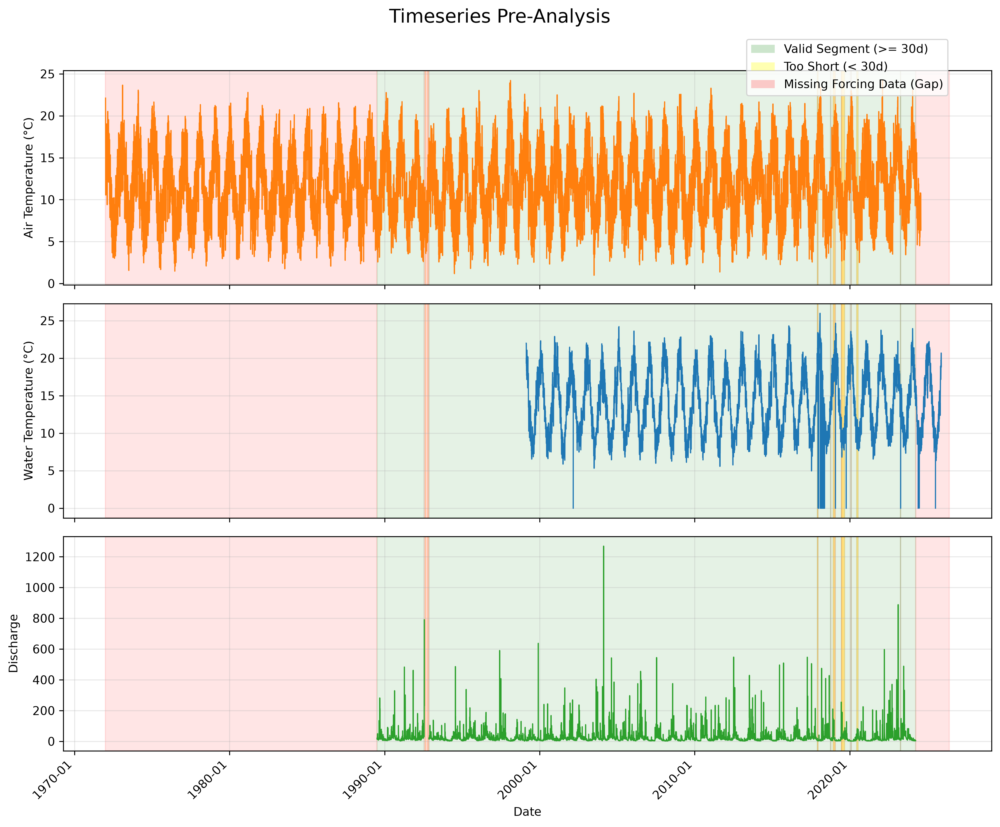
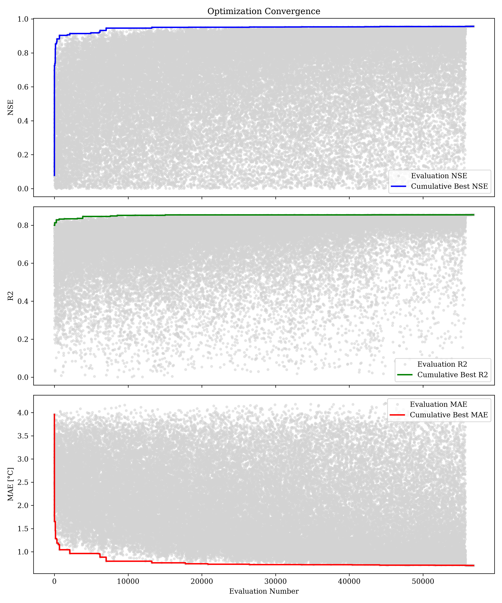
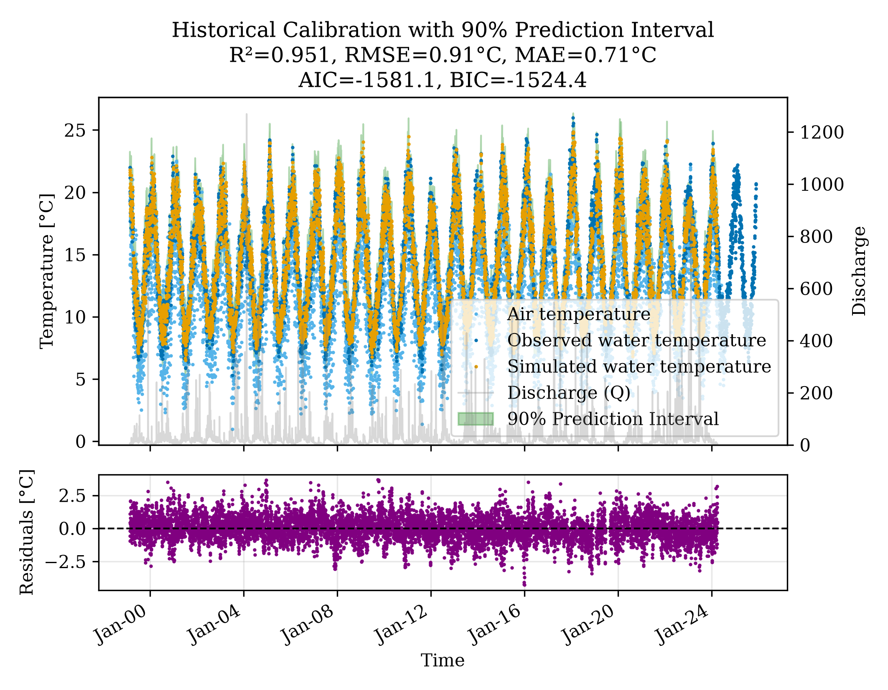
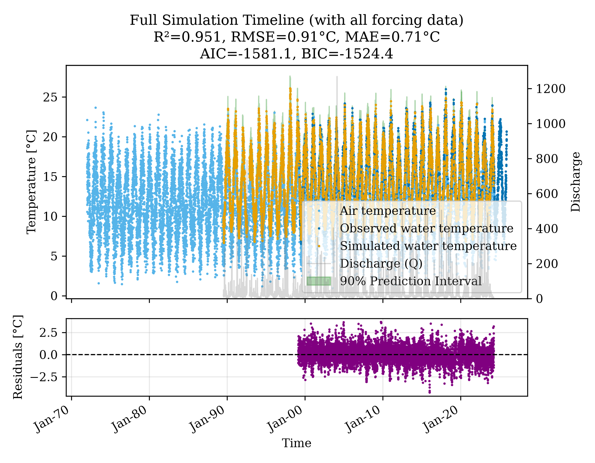
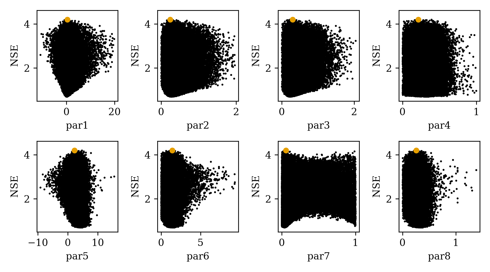
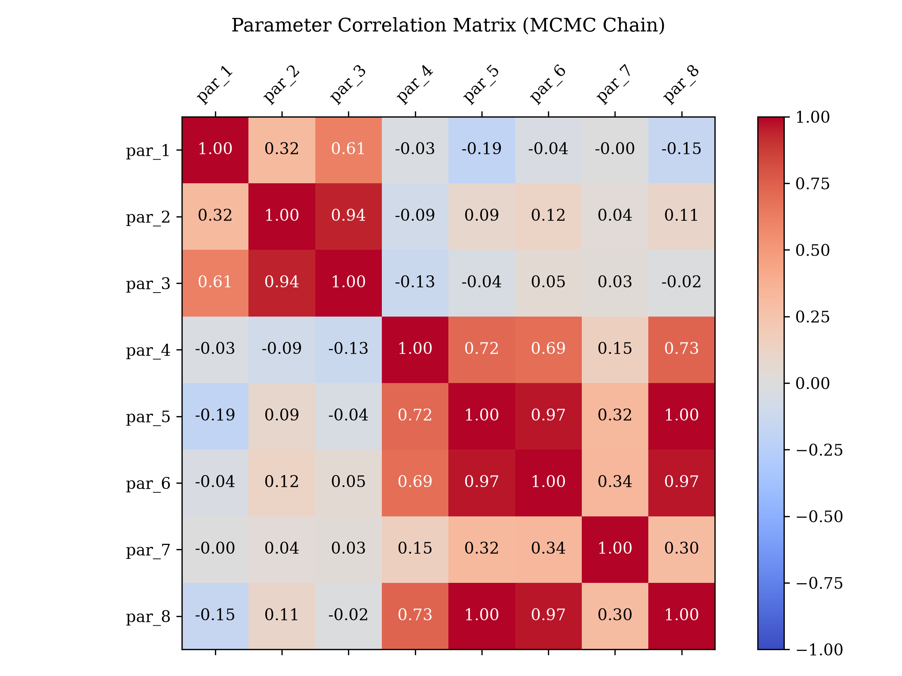
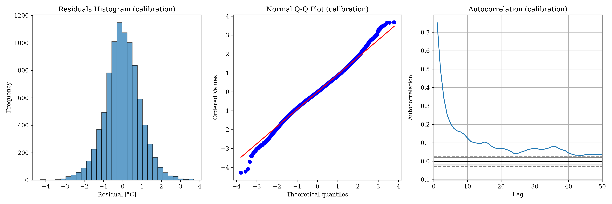
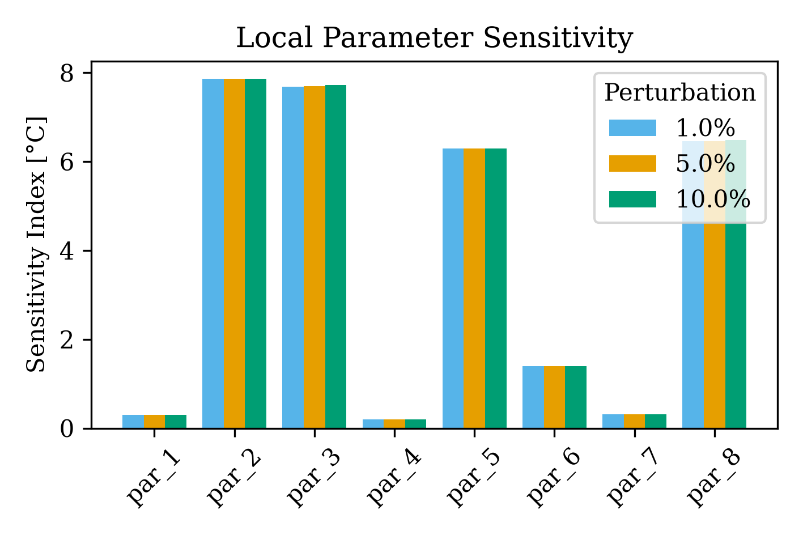

# Hopelands Water Temperature Analysis Report

## 1. Executive Summary
A full analysis was performed on the Hopelands dataset to calibrate the `pyair2stream` water temperature model. The model achieved a high level of accuracy with a Nash-Sutcliffe Efficiency (NSE) of **0.956218**, indicating a strong fit between observed and simulated water temperatures.

## 2. Dataset and Preprocessing
The analysis integrated three primary data sources:
- **Air Temperature**: Originally in Kelvin, converted to Celsius ($T_{Celsius} = T_{Kelvin} - 273.15$).
- **Water Temperature**: Mean daily observations, with outliers (< 0.1°C) excluded.
- **Discharge**: Daily flow observations.

### 2.1. Data Availability and Segment Analysis
The timeseries spans from 1972-01-01 to 2026-06-05.
- **T_air missing**: 3.4%
- **T_water missing**: 51.1%
- **Discharge missing**: 36.9%

Despite significant gaps, the **gap-tolerant** mode successfully identified valid segments for model calibration.

*Figure 1: Pre-analysis timeline showing data coverage and identified valid segments (green).*

## 3. Model Calibration (DE-MCMC)
The model was calibrated using a hybrid Differential Evolution (DE) and L-BFGS-B optimization strategy (200 particles, 5000 iterations), followed by Markov Chain Monte Carlo (MCMC) for uncertainty quantification.

### 3.1. Optimization Convergence

*Figure 2: Convergence of objective functions (NSE, R2, MAE) and parameter values during DE optimization.*

### 3.2. Performance Metrics
| Metric | Value |
|--------|-------|
| NSE    | 0.956218 |
| R²     | 0.9513 |
| RMSE   | 0.914  |
| MAE    | 0.705  |

*Figure 3: Observed vs. Modeled water temperature for the calibration period, including 90% prediction intervals.*

*Figure 4: Full simulation timeline showing predicted water temperatures even where observations are missing.*

### 3.3. Parameter Significance and Uncertainty
| Parameter | Mean | 95% CI Lower | 95% CI Upper | Significant |
|-----------|------|--------------|--------------|-------------|
| par_1 | 0.1398 | 0.0885 | 0.1946 | True |
| par_2 | 0.2760 | 0.2668 | 0.2844 | True |
| par_3 | 0.2304 | 0.2211 | 0.2390 | True |
| par_4 | 0.3494 | 0.3310 | 0.3686 | True |
| par_5 | 4.8216 | 4.5581 | 5.1017 | True |
| par_6 | 1.6600 | 1.5668 | 1.7608 | True |
| par_7 | 0.0368 | 0.0346 | 0.0389 | True |
| par_8 | 0.3775 | 0.3577 | 0.3989 | True |

*Figure 5: Dotty plots showing the distribution of parameter sets sampled during MCMC.*

*Figure 6: Correlation matrix between the 8 model parameters.*

### 3.4. Residual Diagnostics

*Figure 7: Q-Q plot and Autocorrelation Function (ACF) of the model residuals.*

## 4. Sensitivity Analysis
A local One-At-A-Time (OAT) sensitivity analysis was performed to evaluate the impact of each parameter on the simulated water temperature.

*Figure 8: Sensitivity index for each model parameter across different perturbation levels.*

## 5. Conclusion
The `pyair2stream` model is well-suited for the Hopelands station, providing a robust representation of water temperature dynamics even with fragmented discharge and temperature records. The high NSE and significant parameter estimates suggest that the model can be reliably used for future projections or gap-filling at this location.

---
*Report updated on 2025-06-29*
