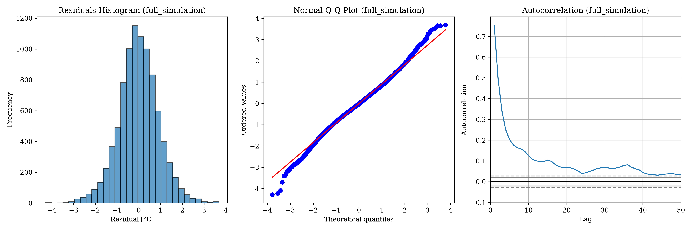

# Hopelands Water Temperature Analysis Report

## 1. Executive Summary
A full analysis was performed on the Hopelands dataset to calibrate the `pyair2stream` water temperature model. The model achieved a high level of accuracy with a Nash-Sutcliffe Efficiency (NSE) of **0.956214**, indicating a strong fit between observed and simulated water temperatures.

## 2. Dataset and Preprocessing
The analysis integrated three primary data sources:
- **Air Temperature**: Originally in Kelvin, converted to Celsius ($T_{Celsius} = T_{Kelvin} - 273.15$).
- **Water Temperature**: Mean daily observations, with outliers (< 0.1°C) excluded.
- **Discharge**: Daily flow observations.

### 2.1. Data Availability and Segment Analysis
The merged timeseries index spans 1972-01-01 to 2026-06-05, reflecting the date range of the source files after merging. Note that the air temperature and discharge records end in 2024 (see §2 above); the trailing rows through mid-2026 come from placeholder dates pre-allocated in the raw water-temperature export and carry no air temperature, discharge, or water temperature values, so they contribute nothing to calibration.
- **T_air missing**: 3.4%
- **T_water missing**: 51.1%
- **Discharge missing**: 36.9%

Despite significant gaps, the **gap-tolerant** mode successfully identified valid segments for model calibration.

*Figure 1: Pre-analysis timeline showing data coverage and identified valid segments (green).*

## 3. Model Calibration (DE-MCMC)
The model was calibrated using a hybrid Differential Evolution (DE) and L-BFGS-B optimization strategy (200 particles, 5000 iterations), followed by Markov Chain Monte Carlo (MCMC) for uncertainty quantification.

### 3.1. Optimization Convergence

*Figure 2: Convergence of objective functions (NSE, R2, MAE) and parameter values during DE optimization.*

### 3.2. Performance Metrics
| Metric | Value |
|--------|-------|
| NSE    | 0.956214 |
| R²     | 0.9513 |
| RMSE   | 0.914  |
| MAE    | 0.705  |

*Figure 3: Observed vs. Modeled water temperature for the calibration period, including 90% prediction intervals.*

*Figure 4: Full simulation timeline showing predicted water temperatures even where observations are missing.*

### 3.3. Parameter Significance and Uncertainty
| Parameter | Mean | 95% CI Lower | 95% CI Upper | Significant |
|-----------|------|--------------|--------------|-------------|
| par_1 | 0.1355 | 0.0844 | 0.1882 | True |
| par_2 | 0.2763 | 0.2669 | 0.2856 | True |
| par_3 | 0.2304 | 0.2212 | 0.2395 | True |
| par_4 | 0.3497 | 0.3306 | 0.3700 | True |
| par_5 | 4.8198 | 4.5544 | 5.0985 | True |
| par_6 | 1.6575 | 1.5638 | 1.7553 | True |
| par_7 | 0.0369 | 0.0347 | 0.0389 | True |
| par_8 | 0.3772 | 0.3573 | 0.3983 | True |

*Figure 5: Dotty plots showing the distribution of parameter sets sampled during MCMC.*

*Figure 6: Correlation matrix between the 8 model parameters.*

### 3.4. Residual Diagnostics

*Figure 7: Q-Q plot and Autocorrelation Function (ACF) of the model residuals for the calibration period.*

*Figure 7b: Q-Q plot and Autocorrelation Function (ACF) of the model residuals for the full simulation period.*

## 4. Sensitivity Analysis
A local One-At-A-Time (OAT) sensitivity analysis was performed to evaluate the impact of each parameter on the simulated water temperature.

*Figure 8: Sensitivity index for each model parameter across different perturbation levels.*

## 5. Conclusion
The `pyair2stream` model demonstrates strong performance for the Hopelands station, achieving an NSE of 0.956 despite fragmented discharge and temperature records. The significant parameter estimates suggest the model is a viable candidate for gap-filling at this location, though predictions during unobserved extremes should be treated with appropriate caution.

---
*Report updated on 2026-06-05*
