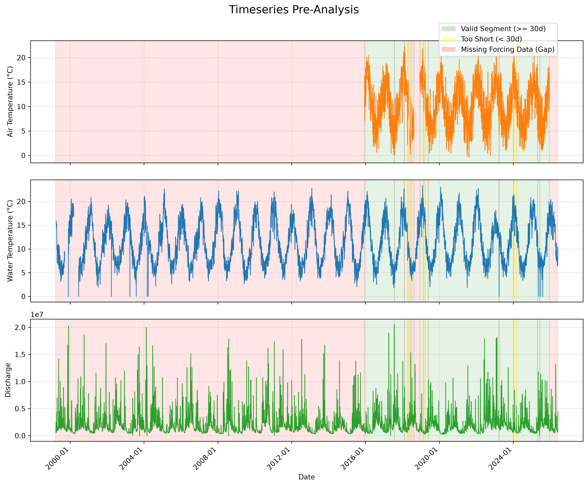
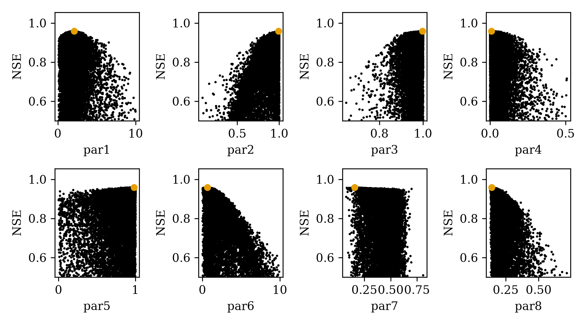
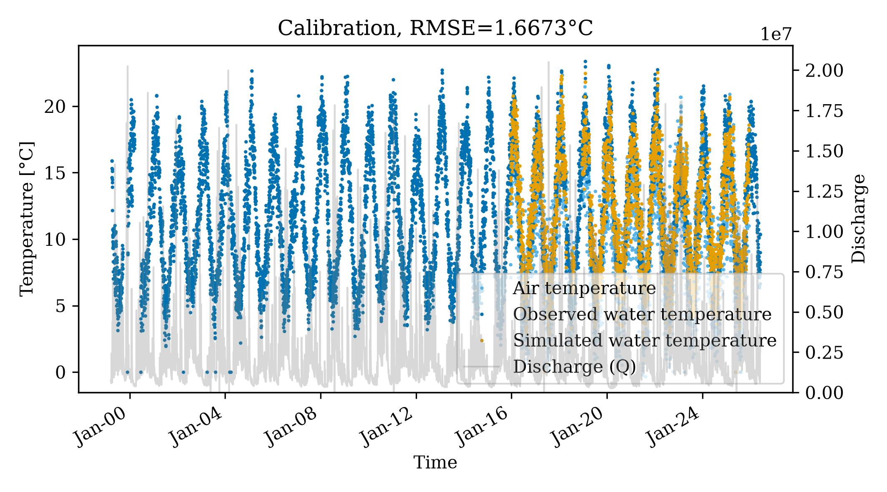

# Pukeokahu Catchment Analysis

This example demonstrates how to take raw, disjointed time series data for Air Temperature, Water Temperature, and Discharge, preprocess them into a single coherent format, run a gap-tolerance pre-analysis, and calibrate the `pyair2stream` model using the robust DE-MCMC optimizer.

## 1. Data Preprocessing
The raw data provided spanned multiple files with different date formats, varying observation frequencies, and mismatched temporal ranges (Discharge started in 1999, while Air Temp started in 2015).

We used the `pyair2stream.preprocessing` module to:
* Coerce date strings to `YYYY-MM-DD`.
* Resample sub-daily observations into daily averages (`groupby('Date').mean()`).
* Perform an outer join across all three data streams.
* Re-index the merged dataset across a full continuous daily calendar to expose any completely missing days explicitly as `NaN` rows.

## 2. Pre-Analysis
Because of the heavy sparsity and varying date ranges, we utilized the `pyair2stream.pre_analysis` module to evaluate the data's suitability for calibration.

**Summary:**
* **Total Range:** 1999-03-18 to 2026-06-05 (9942 days)
* **T_air Missing:** 65.0%
* **T_water Missing:** 2.3%
* **Discharge Missing:** 0.2%

By setting a `min_segment_days` requirement of 30 days, the pre-analysis found 11 contiguous valid segments (totalling 3350 days of viable forcing data).

The 11 valid segments contained **3,342 valid `T_water` observations**. For an 8-parameter model, this yields an excellent ratio of ~418 data points per fitting parameter.

*(Green indicates valid segments >= 30 days, yellow indicates too-short segments, and red indicates missing forcing data gaps).*

## 3. Calibration (DE-MCMC)
Because the dataset is fragmented across 11 segments, we explicitly enabled `gap_tolerant: true` in the `config.yaml` file.

During the physics solver integration, we encountered a `ZeroDivisionError` due to certain days in the dataset having a recorded Discharge of exactly `0.0`. This caused the model's intermediate variable `DD = (Q / Qmedia) ** p4` to trigger an exception. A safeguard was implemented in `model_numba.py` to clamp the division denominator.

We calibrated the 8-parameter version of the model using the `DE-MCMC` optimizer:
* **Pop. Size (particles):** 100
* **Max Generations (runs):** 2000
* **MCMC Walkers:** 32
* **MCMC Steps:** 1000

## 4. Results
The model calibration successfully completed and generated the predictive outputs.

### Parameter Uncertainty (Dotty Plots)
The MCMC chain evaluation produces dotty plots showing the convergence and uncertainty of the 8 parameters:

### Calibration Timeseries
The simulated temperatures match closely with the valid segments of observations:
