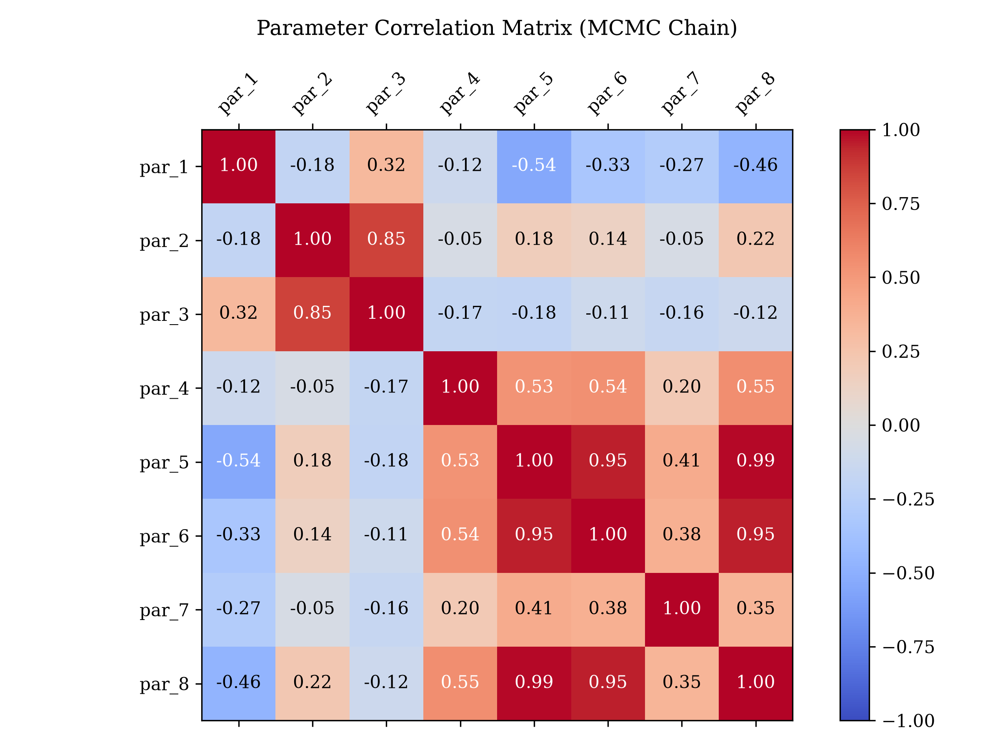
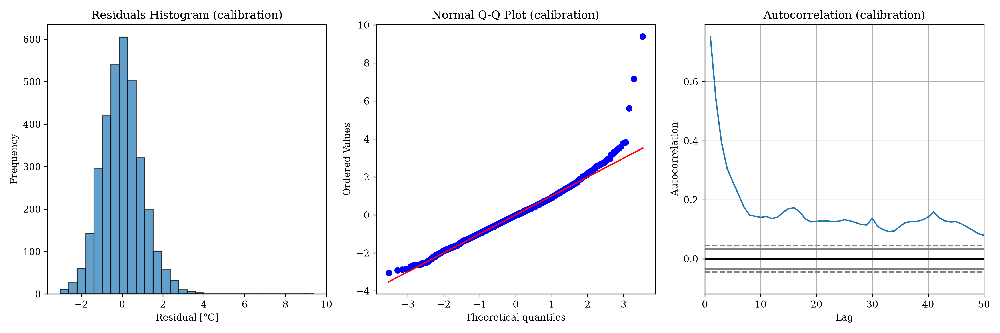
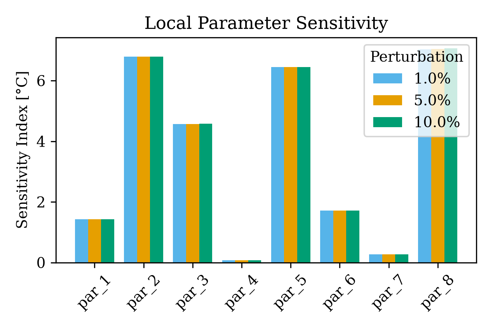

# Pukeokahu Catchment Analysis

Starting with raw, disjointed time series data for Air Temperature, Water Temperature, and Discharge, this walkthrough shows how to preprocess them into a single coherent format, run a gap-tolerance pre-analysis, and calibrate the `pyair2stream` model using the robust DE-MCMC optimizer.

## 1. Data Preprocessing & Pre-Analysis

The raw data provided spanned multiple files with different date formats, varying observation frequencies, and mismatched temporal ranges (Discharge started in 1999, while Air Temp started in 2015).

We used the `pyair2stream.preprocessing` module to merge and resample the data into a continuous daily calendar, exposing missing days as `NaN`.

Because of the heavy sparsity and varying date ranges, we utilized the `pyair2stream.pre_analysis` module to evaluate the data's suitability for calibration. The analysis highlighted:
* **Total Range:** 1999-03-18 to 2026-06-05 (9942 days)
* **Missing Data:** T_air (65.0%), T_water (2.3%), Discharge (0.3%)

By setting a `min_segment_days` requirement of 30 days, 12 contiguous valid segments were identified (totalling 3344 days of viable forcing data, containing 3336 valid `T_water` observations). For an 8-parameter model, this yields an excellent ratio of ~417 data points per fitting parameter.

*(Green indicates valid segments >= 30 days, yellow indicates too-short segments, and red indicates missing forcing data gaps).*

## 2. Calibration Setup

Because the dataset is fragmented across 12 segments, we explicitly enabled `gap_tolerant: true` in the `config.yaml` file. This allows the model to safely drop periods of missing data from the integration without distorting the physics.

We calibrated the 8-parameter version of the model using the `DE-MCMC` optimizer:
* **Pop. Size (particles):** 100
* **Max Generations (runs):** 2000
* **MCMC Walkers:** 32
* **MCMC Steps:** 1000

## 3. Results and Goodness of Fit

Calibration completed with the following goodness-of-fit metrics:

### Goodness of Fit Parameters
| Metric | Value |
|--------|-------|
| **NSE** | 0.9848 |
| **R²** | 0.9553 |
| **RMSE** | 1.0138 |
| **MAE** | 0.7775 |
| **AIC** | 102.38 |
| **BIC** | 150.84 |

### Model Fit Parameters (Significance)
The following optimal parameters were determined, with their 95% Confidence Intervals from the MCMC chain:

| Parameter | Mean | StdDev | 95% CI Lower | 95% CI Upper | Significant |
|-----------|------|--------|--------------|--------------|-------------|
| `p1` | -0.900 | 0.064 | -1.027 | -0.778 | Yes |
| `p2` | 0.388 | 0.009 | 0.370 | 0.407 | Yes |
| `p3` | 0.226 | 0.008 | 0.212 | 0.243 | Yes |
| `p4` | 0.178 | 0.019 | 0.141 | 0.215 | Yes |
| `p5` | 5.775 | 0.226 | 5.344 | 6.238 | Yes |
| `p6` | 2.398 | 0.100 | 2.207 | 2.599 | Yes |
| `p7` | 0.026 | 0.002 | 0.022 | 0.029 | Yes |
| `p8` | 0.576 | 0.021 | 0.537 | 0.617 | Yes |

All parameters are significantly different from zero.

*Note: The model output files in `examples/Pukeokahu/output` use "Rangitikei" in their filenames because Pukeokahu is located on the Rangitikei River, which is the internal identifier used in the configuration.*

## 4. Visualizations

### Calibration Timeseries
The simulated temperatures match closely with the observations across the valid segments.

### Parameter Uncertainty (Dotty Plots)
The MCMC chain evaluation produces dotty plots showing the convergence and uncertainty of the 8 parameters:

### Parameter Correlation
The pair-wise correlation distributions from the MCMC chain highlight potential equifinality and interactions between model parameters:

### Residual Diagnostics
Residuals show no obvious pattern of bias (see plot):

### Sensitivity Analysis
A Local One-At-A-Time (OAT) sensitivity analysis was conducted on the optimal parameter set by applying +/- 1%, 5%, and 10% perturbations.

The most sensitive parameters are `p8` (deep mixing / hyporheic exchange) and `p2` (air temperature forcing), followed by `p5` and `p3`.