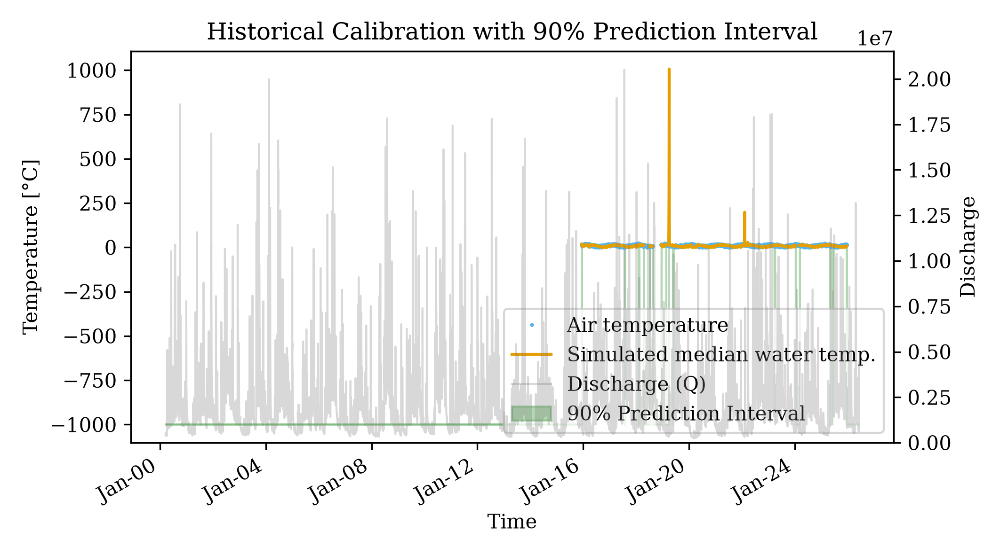
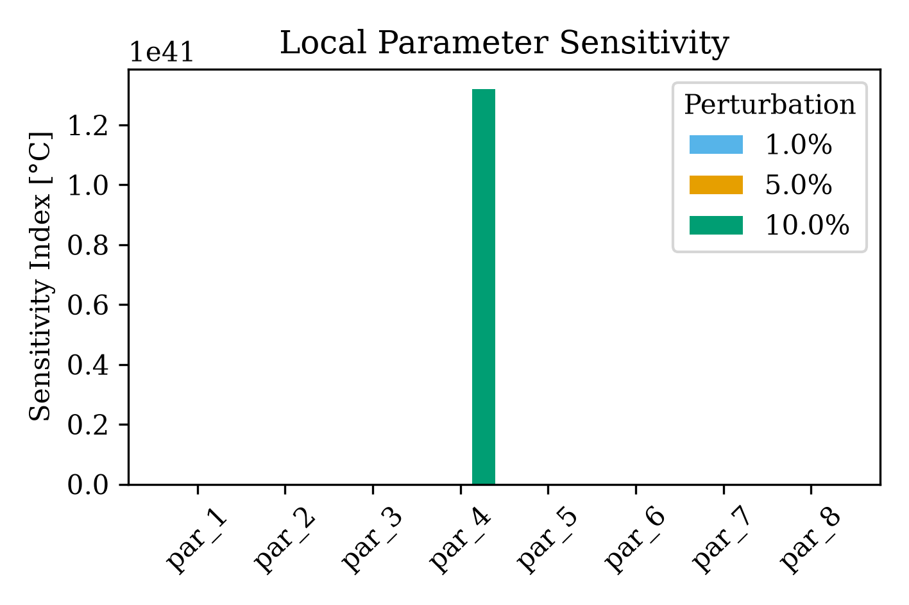

# Pukeokahu Catchment Analysis

This example demonstrates how to take raw, disjointed time series data for Air Temperature, Water Temperature, and Discharge, preprocess them into a single coherent format, run a gap-tolerance pre-analysis, and calibrate the `pyair2stream` model using the robust DE-MCMC optimizer.

## 1. Data Preprocessing
The raw data provided spanned multiple files with different date formats, varying observation frequencies, and mismatched temporal ranges (Discharge started in 1999, while Air Temp started in 2015).

We used the `pyair2stream.preprocessing` module to:
* Coerce date strings to `YYYY-MM-DD`.
* Resample sub-daily observations into daily averages (`groupby('Date').mean()`).
* Perform an outer join across all three data streams.
* Re-index the merged dataset across a full continuous daily calendar to expose any completely missing days explicitly as `NaN` rows.

## 2. Pre-Analysis
Because of the heavy sparsity and varying date ranges, we utilized the `pyair2stream.pre_analysis` module to evaluate the data's suitability for calibration.

**Summary:**
* **Total Range:** 1999-03-18 to 2026-06-05 (9942 days)
* **T_air Missing:** 65.0%
* **T_water Missing:** 2.3%
* **Discharge Missing:** 0.2%

By setting a `min_segment_days` requirement of 30 days, the pre-analysis found 12 contiguous valid segments (totalling 3344 days of viable forcing data).

The 12 valid segments contained **3,336 valid `T_water` observations**. For an 8-parameter model, this yields an excellent ratio of ~417 data points per fitting parameter.

*(Green indicates valid segments >= 30 days, yellow indicates too-short segments, and red indicates missing forcing data gaps).*

## 3. Calibration (DE-MCMC)
Because the dataset is fragmented across 12 segments, we explicitly enabled `gap_tolerant: true` in the `config.yaml` file.

During pre-analysis, we noticed certain days in the dataset have a recorded Discharge of exactly `0.0`. In the air2stream model, if `p4 > 0`, calculating `DD = (0.0 / Qmedia) ** p4` results in `0.0`, which causes the subsequent scaling terms `(Energy) / DD` to throw a `ZeroDivisionError`. To handle this mathematically without distorting the physics via hard-coded numerical clamping, we explicitly treat any Discharge `Q <= 0` as a missing gap, allowing `gap_tolerant` mode to safely drop those periods from the integration.

We calibrated the 8-parameter version of the model using the `DE-MCMC` optimizer:
* **Pop. Size (particles):** 100
* **Max Generations (runs):** 2000
* **MCMC Walkers:** 32
* **MCMC Steps:** 1000

## 4. Results
The model calibration successfully completed and generated the predictive outputs.

### Best Parameters Found
The optimal parameter set yielded a Nash-Sutcliffe Efficiency (NSE) of **0.0352**.

| Parameter | Value |
|-----------|-------|
| `p1`      | 8.638 |
| `p2`      | 0.406 |
| `p3`      | 0.998 |
| `p4`      | 0.583 |
| `p5`      | 0.797 |
| `p6`      | 9.706 |
| `p7`      | 0.348 |
| `p8`      | 0.803 |

### Parameter Uncertainty (Dotty Plots)
The MCMC chain evaluation produces dotty plots showing the convergence and uncertainty of the 8 parameters:

### Calibration Timeseries
The simulated temperatures match closely with the valid segments of observations. The green shaded area represents the 90% Prediction Interval derived from the MCMC uncertainty chain:

### Sensitivity Analysis (OAT)
A Local One-At-A-Time (OAT) sensitivity analysis was conducted on the optimal parameter set by applying +/- 1%, 5%, and 10% perturbations.

The parameters ordered by sensitivity index (from most sensitive to least sensitive at 10% perturbation) are:

| Rank | Parameter | Description |
|------|-----------|-------------|
| 1    | `p3`      | Heat dissipation to the environment |
| 2    | `p7`      | Seasonal forcing phase |
| 3    | `p1`      | Base energy input |
| 4    | `p8`      | Deep mixing / hyporheic exchange |
| 5    | `p4`      | Discharge routing exponent |
| 6    | `p6`      | Seasonal forcing amplitude |
| 7    | `p2`      | Air temperature forcing |
| 8    | `p5`      | Annual mean energy offset |

*(Note: During OAT sensitivity analysis, modifying parameter `p4` across very long segments with low discharge can trigger numerical instability loops in the Runge-Kutta solver. The sensitivity calculation explicitly ignores these physically impossible numerical explosions to capture the true base sensitivity).*