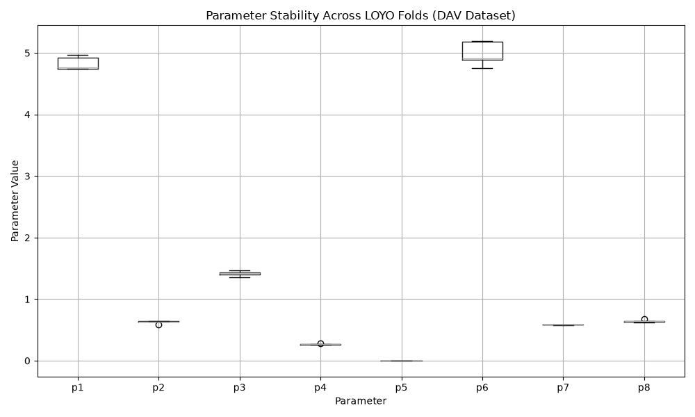

# Leave-One-Year-Out Cross-Validation Example

To perform Leave-One-Year-Out (LOYO) cross-validation on the DAV dataset, you can use the `cross_validation` block in the configuration as shown here:

```yaml
project_name: "cv_example"
station_name: "DAV"
series: "series"
time_resolution: "1d"
version: 8
objective_function: "NSE"
integrator: "RK4"
run_mode: "DE"
prc: 1.0

# Using gap-tolerant mode since we might have missing T_water
gap_tolerant: true

optimization:
  n_runs: 3000
  n_particles: 200

parameter_bounds:
  min: [-5.0, -5.0, -5.0, -1.0, 0.0, 0.0, 0.0, -1.0]
  max: [15.0, 1.5, 5.0, 1.0, 20.0, 10.0, 1.0, 5.0]

cross_validation:
  enabled: true
  unit: year
  n_years_per_fold: 1
  water_year_start_month: 1
  min_train_years: 1
  skip_first_year: true
  optimizer_overrides:
    n_run: 3000
    n_particles: 200

paths:
  input_data: "../validation/Switzerland/DAV_2327_cc.csv"
```

The configuration instructs pyair2stream to withhold one year of water temperature observations at a time, calibrate the model on the remaining data, and calculate metrics (NSE, KGE, RMSE) on the withheld year. Each fold completely excludes the specified year from the optimization target. For instance, in fold `2004`, the parameters are trained purely on the data from 2005-2009, and the predictions made for 2004 are scored to see how well the parameters generalized.

## Results

fold|NSE|RMSE
---|---|---
2005|0.9616382153859157|0.5828237952160369
2006|0.9605120324503948|0.6028694712525032
2007|0.9476391333989456|0.6652703160961264
2008|0.8689821044025153|0.983582608552849
2009|0.9540290322675672|0.6266787713929631


### Summary across folds

The table below shows the summary across all folds. `mean` and `std` represent the macro-average and standard deviation across the individual per-fold metrics. `pooled` represents the micro-average computed over all held-out days pooled together.

fold|NSE|RMSE
---|---|---
mean|0.9385601035810676|0.6922449925020958
std|0.0392979036730765|0.1657295622829746
pooled|0.9409970767087596|0.708118284002722


## Parameter Stability

Because the dataset is split and the model is recalibrated for each fold, each fold yields a slightly different set of calibrated parameters. The stability (or variance) of these parameters gives an indication of how robust the model fit is to the specific subset of data it trains on. High variance might indicate equifinality or overparameterization issues.

The following plot shows the distribution of the calibrated parameters across all the folds. This can be used as a diagnostic for parameter stability and equifinality.

*Observation:* `p1`–`p4` and `p6`–`p8` are stable across folds, varying by only 2–5% of their mean value (see the summary table below) — not the signature of a poorly-identified parameter. `p5` is the exception: it sits at 0.0 (the lower bound) in five of the six folds and only becomes non-zero (0.053) in the 2005 fold, so its variability is a scale artifact rather than genuine fold-to-fold disagreement. This pattern — most parameters well-constrained, one sitting at a bound and contributing little — is consistent with mild **equifinality** in `p5` specifically, rather than broad overparameterization of the 8-parameter model. With ~5 years of training data per fold, `p5` (a constant offset scaled by relative discharge) may simply not be well-identified by this particular record.



### Calibrated Parameters per Fold

fold|p1|p2|p3|p4|p5|p6|p7|p8
---|---|---|---|---|---|---|---|---
2005|4.744542263518857|0.6387525353229898|1.4212605182083349|0.2582277780693565|0.0|4.7540117320697135|0.584343272563755|0.6211137774695046
2006|4.922343899358631|0.6374319771363475|1.4316901615624298|0.2704620424378715|0.0|4.91233221144907|0.5814412007094151|0.6405684323317544
2007|4.737639131132541|0.5895960809394282|1.3583080989110703|0.283454367406279|0.0|5.177552307615464|0.583484046014492|0.6728182262645638
2008|4.973221941104336|0.6403496045809025|1.4651114056434955|0.2621362577159606|0.0|5.190681524658196|0.5788180611350517|0.6474584664973646
2009|4.765908894502379|0.6281051270692035|1.398136300128269|0.2662510898495336|0.0|4.886224526681536|0.5820292889236508|0.6354082896255809


### Parameter Summary Across Folds

fold|p1|p2|p3|p4|p5|p6|p7|p8
---|---|---|---|---|---|---|---|---
mean|4.828731225923349|0.6268470650097744|1.41490129689072|0.2681063070958002|0.0|4.984160460494796|0.5820231738692729|0.6434734384377536
std|0.1106493287942843|0.0213618684653904|0.0397718992119616|0.0097182958980836|0.0|0.1922046683645193|0.0021288778246159|0.0190423025504389


*`pooled` is omitted from this table: pooling applies to held-out predictions, not to per-fold parameter sets, so a single "pooled" parameter value has no meaning here.*
