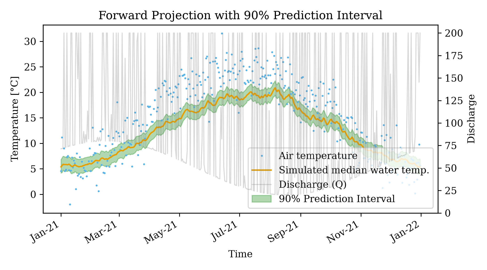

# Probabilistic Forward Prediction Intervals

This example demonstrates how to project future water temperatures probabilistically, using the parameter distributions and residual error ($\sigma$) derived during a `DE-MCMC` historical calibration.

## The Problem
By default, the `FORWARD` run mode in `pyair2stream` is deterministic. It accepts a single `parameters_forward` array and outputs exactly one predicted line. While useful, this ignores the parameter uncertainty (equifinality) and intrinsic data noise.

## The Solution
By providing the `MCMC_chain.csv` and the historical residual error ($\sigma$), `FORWARD` mode can now generate a robust 90% Prediction Interval encompassing future unmodeled noise and parameter variances.

## How to Run

1. Generate synthetic historical and future climate data:
```bash
python examples/forward_prediction_intervals/generate_data.py
```

2. Run the full calibration and projection pipeline:
```bash
python examples/forward_prediction_intervals/run_example.py
```

This script will:
1. Run `DE-MCMC` to calibrate against `historical_data.csv`.
2. Extract the best fit and calculate the historical standard deviation of residuals ($\sigma$).
3. Dynamically inject these into `config_forward.yaml`.
4. Run `FORWARD` mode to predict the `future_data.csv`.
5. Draw 500 samples from the converged MCMC parameter chain, add $\mathcal{N}(0, \sigma^2)$ Gaussian noise, and calculate the 5th, 50th, and 95th percentiles.
6. Generate the calibration and prediction plots with green prediction bounds!

## Example Output


