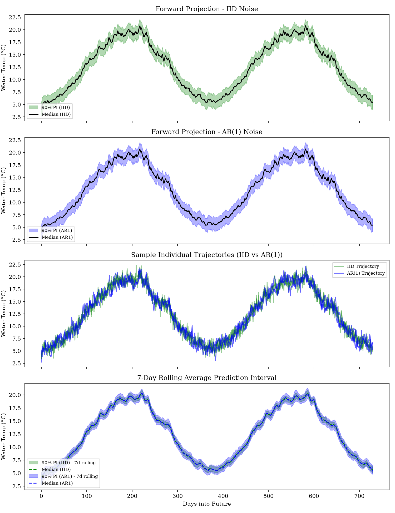
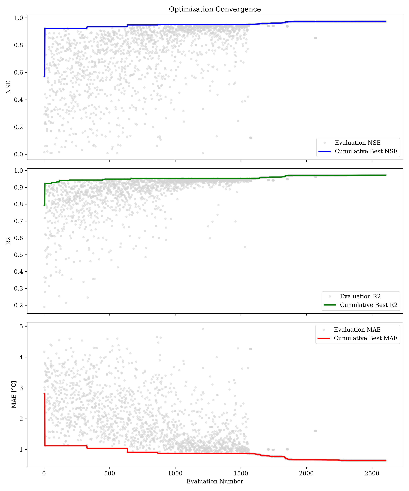
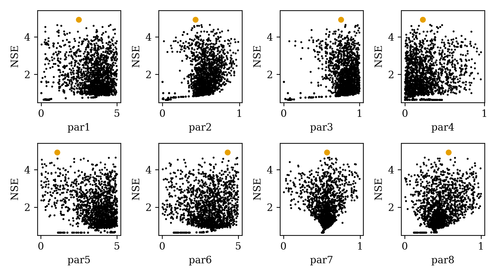
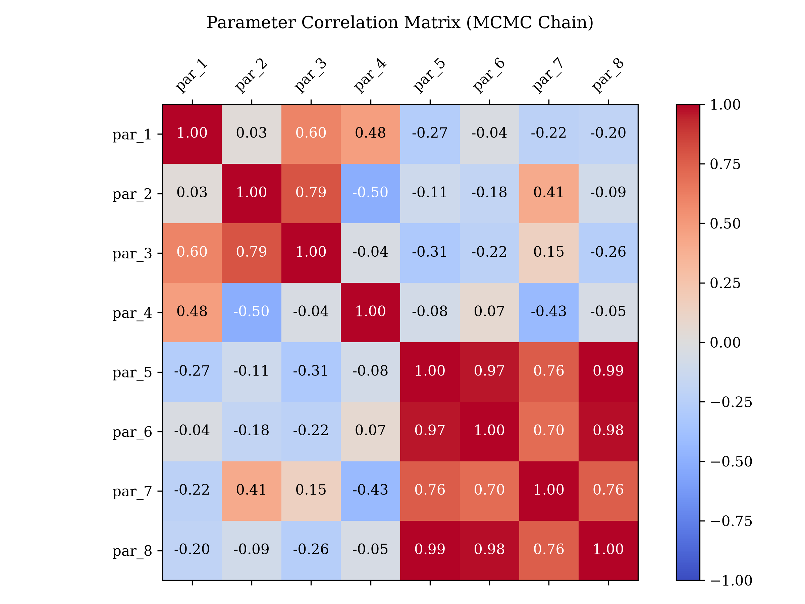

# Probabilistic Forward Prediction Intervals

This example demonstrates how to project future water temperatures probabilistically, using the parameter distributions and residual error ($\sigma$) derived during a `DE-MCMC` historical calibration.

## The Problem
By default, the `FORWARD` run mode in `pyair2stream` is deterministic. It accepts a single `parameters_forward` array and outputs exactly one predicted line. While useful, this ignores the parameter uncertainty (equifinality) and intrinsic data noise.

## The Solution
By providing the `MCMC_chain.csv` and the historical residual error ($\sigma$), `FORWARD` mode can generate a robust 90% Prediction Interval encompassing parameter uncertainty and observation noise.

This example showcases the two noise generation methods available:
* **IID (Independent and Identically Distributed):** Standard white noise. It assumes residuals have no memory.
* **AR(1) (Autoregressive lag-1):** Time-correlated noise. Environmental data like water temperature often has strong serial correlation, meaning if today is warmer than predicted, tomorrow is likely to be as well. AR(1) preserves this structure, typically resulting in wider and more realistic prediction bounds. `pyair2stream` automatically estimates the correlation coefficient ($\rho$) from the historical residuals and passes it to the projection run via a sidecar JSON file (`_meta.json`).

## How to Run

1. Generate synthetic historical (with AR(1) structured noise injected) and future climate data:
```bash
poetry run python examples/forward_prediction_intervals/generate_data.py
```

2. Run the full calibration and projection pipeline:
```bash
poetry run python examples/forward_prediction_intervals/run_example.py
```

This script will:
1. Run `DE-MCMC` to calibrate against `historical_data.csv`. This automatically calculates the $\rho$ autocorrelation and saves it to a sidecar file.
2. Extract the historical standard deviation of residuals ($\sigma$).
3. Dynamically inject these properties and run `FORWARD` mode twice: once forcing `noise_model: "iid"`, and once allowing `noise_model: "ar1"` (which automatically reads the sidecar file).
4. Draw 500 parameter samples, simulate, add the corresponding noise model realizations, and calculate percentiles.
5. Generate a side-by-side comparative plot of the IID vs AR(1) bounds.

## Example Output

Check `examples/forward_prediction_intervals/comparison_iid_vs_ar1.png` to see how the temporally-correlated structure of the AR(1) noise generates more representative bounds compared to standard white noise.

The generated plot features four panels that illustrate the practical difference between IID and AR(1) noise models:
1. **Forward Projection - IID Noise**: Shows the standard 90% Prediction Interval using white noise.
2. **Forward Projection - AR(1) Noise**: Shows the 90% Prediction Interval using autoregressive noise. Note that at a daily scale, the overall width of the interval is mathematically identical to the IID interval, because both models are calibrated to the exact same marginal variance ($\sigma^2$).
3. **Sample Individual Trajectories**: Overlays individual simulation traces. Here the structural difference becomes visible: the IID trace (green) oscillates rapidly day-to-day around the median, while the AR(1) trace (blue) exhibits realistic "memory", wandering away from the median for several days at a time (e.g., simulating a multi-day heatwave or cold snap).
4. **7-Day Rolling Average Prediction Interval**: This is the most crucial panel for understanding the real-world impact. When we calculate a 7-day rolling average of the envelopes, the rapid daily oscillations of the IID white noise cancel each other out, causing the green uncertainty bounds to shrink drastically. In contrast, because the AR(1) errors are temporally correlated, they do not perfectly cancel out over a week. The blue AR(1) bounds remain much wider, correctly preserving the uncertainty for time-averaged metrics (e.g., weekly compliance thresholds) which IID models dangerously underestimate.


## Additional Goodness of fit and model fit parameters
- Sigma: 0.8185108685637652
- Rho: 0.5910357316648412
- Best NSE: 0.9727516010328746
- Best R2: 0.9727516041586916
- Best MAE: 0.6463062429471895

### Best Parameters:
- par_1: 0.4021291550566604
- par_2: 0.0431781983923235
- par_3: 0.0603445120378626
- par_4: 0.4619397898649217
- par_5: 1.1496073864321397
- par_6: 0.7581240017948266
- par_7: 0.5008910497421541
- par_8: 0.1194132072963056


### Discussion of Results
The historical calibration run successfully quantified the parameter uncertainty and estimated the intrinsic observation noise.
- **Model Fit Parameters**: The calibration achieved excellent goodness-of-fit metrics, with an NSE of nearly 0.97 and an R² of 0.97. The Mean Absolute Error (MAE) is approx 0.65°C.
- **Error Structure**: The estimated residual standard deviation ($\sigma$) is ~0.82°C, closely matching our injected synthetic noise. The autocorrelation coefficient ($\rho$) is ~0.59, indicating significant daily memory in the water temperature residuals.

#### Visual Diagnostics
1. **Comparison Plot (`comparison_iid_vs_ar1.png`)**: This plot contrasts the prediction bounds produced using standard white noise vs. autoregressive noise. The AR(1) bounds realistically widen over multi-day periods when rolled/averaged, providing safer estimates for medium-term temperature thresholds.
2. **Convergence Plot (`convergence_DE-MCMC_NSE_Alpha.png`)**: Illustrates the MCMC chains converging on the posterior distributions for the 8 model parameters over 1000 steps.
3. **Dotty Plots (`dottyplots_DE-MCMC_NSE_Alpha.png`)**: Shows the objective function space across each parameter dimension, confirming which parameters are well-identified and highlighting equifinality.
4. **Parameter Correlation (`parameter_correlation_DE-MCMC_Alpha.png`)**: A pair-plot showing the posterior distributions of the parameters and their trade-offs.






