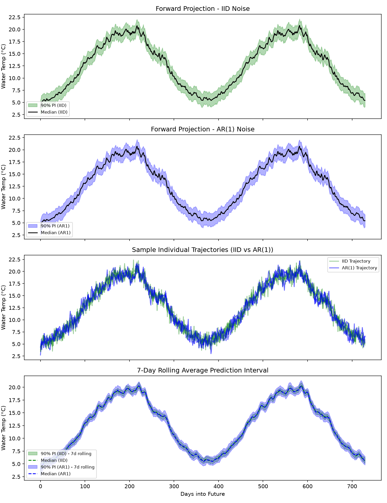
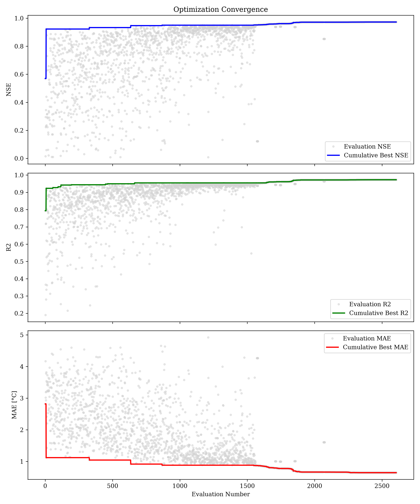
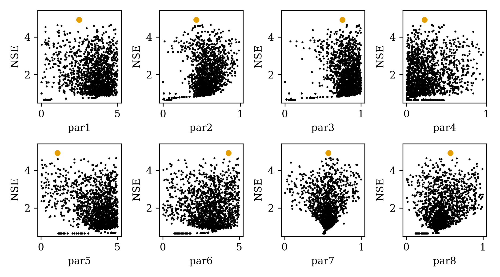
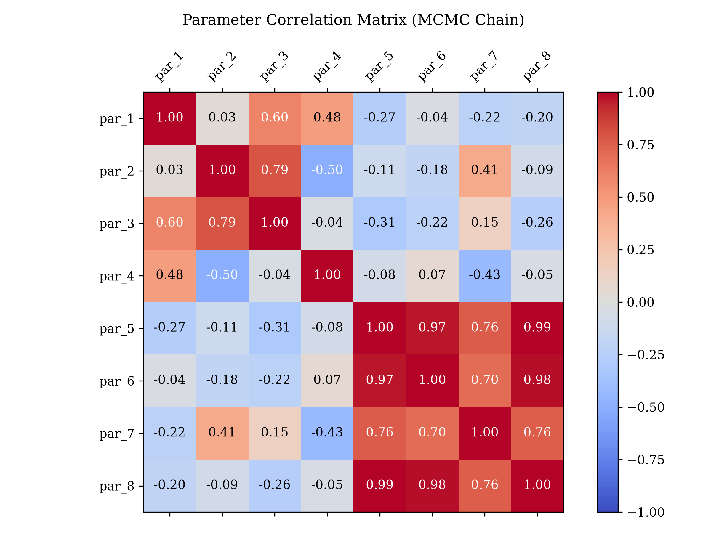

# Probabilistic Forward Prediction Intervals


This walkthrough shows how to probabilistically project future water temperatures by leveraging the parameter distributions and residual error ($\sigma$) derived during a `DE-MCMC` historical calibration.

## The Problem
By default, the `FORWARD` run mode in `pyair2stream` is deterministic. It accepts a single `parameters_forward` array and outputs exactly one predicted line. While useful, this ignores the parameter uncertainty (equifinality) and intrinsic data noise.

## The Solution
By providing the `MCMC_chain.csv` and the historical residual error ($\sigma$), `FORWARD` mode can generate a robust 90% Prediction Interval encompassing parameter uncertainty and observation noise.

This example showcases the two noise generation methods available:
* **IID (Independent and Identically Distributed):** Standard white noise. It assumes residuals have no memory.
* **AR(1) (Autoregressive lag-1):** Time-correlated noise. Environmental data like water temperature often has strong serial correlation, meaning if today is warmer than predicted, tomorrow is likely to be as well. AR(1) preserves this structure. On any single day it gives the same band width as IID (both use the same error size); the difference shows up in multi-day quantities such as weekly means. `pyair2stream` automatically estimates the correlation coefficient ($\rho$) from the historical residuals and passes it to the projection run via a sidecar JSON file (`_meta.json`).

## How to Run

1. Generate synthetic historical (with AR(1) structured noise injected) and future climate data:
```bash
python examples/forward_prediction_intervals/generate_data.py
```

2. Run the full calibration and projection pipeline:
```bash
python examples/forward_prediction_intervals/run_example.py
```

Add `--smoke` to run with a tiny DE population/MCMC chain instead of the real
calibration -- useful for a quick "does this still run end to end" check
(this is what CI runs); it does not produce meaningful results or figures.

This script will:
1. Run `DE-MCMC` to calibrate against `historical_data.csv`. This automatically calculates the $\rho$ autocorrelation and saves it to a sidecar file.
2. Extract the historical standard deviation of residuals ($\sigma$).
3. Dynamically inject these properties and run `FORWARD` mode twice: once forcing `noise_model: "iid"`, and once allowing `noise_model: "ar1"` (which automatically reads the sidecar file).
4. Draw 500 parameter samples, simulate, add the corresponding noise model realizations, and calculate percentiles.
5. Generate a side-by-side comparative plot of the IID vs AR(1) bounds.

## Example Output

Check `examples/forward_prediction_intervals/comparison_iid_vs_ar1.png` to compare the two noise models.

The generated plot features four panels that illustrate the practical difference between IID and AR(1) noise models:
1. **Forward Projection - IID Noise**: Shows the standard 90% Prediction Interval using white noise.
2. **Forward Projection - AR(1) Noise**: Shows the 90% Prediction Interval using autoregressive noise. Note that at a daily scale, the overall width of the interval is mathematically identical to the IID interval, because both models are calibrated to the exact same marginal variance ($\sigma^2$).
3. **Sample Individual Trajectories**: Overlays individual simulation traces. Here the structural difference becomes visible: the IID trace (green) oscillates rapidly day-to-day around the median, while the AR(1) trace (blue) exhibits realistic "memory", wandering away from the median for several days at a time (e.g., simulating a multi-day heatwave or cold snap).
4. **7-Day Rolling Average Prediction Interval**: When we calculate a 7-day rolling average of the envelopes, the rapid daily oscillations of the IID white noise cancel each other out, causing the green IID uncertainty bounds to shrink. In contrast, because the AR(1) errors are temporally correlated, they do not perfectly cancel out over a week. The blue AR(1) bounds remain wider, preserving the uncertainty margin for time-averaged thresholds.


### Discussion of Results
The historical calibration run yielded the parameter uncertainty and observation noise estimates.
- **Model Fit Parameters**: The calibration yielded an NSE of 0.9728 and a Mean Absolute Error (MAE) of 0.6463°C. (Older versions also listed an "R²" of 0.9728; that value was the NSE under another name. Current versions report R², the squared correlation, separately.)
- **Error Structure**: The estimated residual standard deviation ($\sigma$) is 0.8185°C, closely matching the injected synthetic noise. The autocorrelation coefficient ($\rho$) is 0.5910, indicating daily memory in the water temperature residuals.

#### Visual Diagnostics
1. **Comparison Plot (`comparison_iid_vs_ar1.png`)**: This plot contrasts the prediction bounds produced using standard white noise vs. autoregressive noise. When averaged over several days, the AR(1) bounds narrow much less than the IID bounds, which is realistic for multi-day temperature thresholds.
2. **Convergence Plot (`convergence_DE-MCMC_NSE_Alpha.png`)**: The NSE, R² and MAE of every parameter set tried during the DE calibration, with the best value so far. It should flatten out. (MCMC convergence is reported in the console and in `MCMC_chain_*_meta.json`.)
3. **Dotty Plots (`dottyplots_DE-MCMC_NSE_Alpha.png`)**: Shows the objective function space across each parameter dimension, confirming which parameters are well-identified and highlighting equifinality.
4. **Parameter Correlation (`parameter_correlation_DE-MCMC_Alpha.png`)**: The correlation between each pair of parameters in the MCMC sample; strong correlations show parameters that trade off against each other.






