# Gap Analysis Experiment Results

The following analysis examines the stability of parameter values when gaps are introduced into the `T_air` forcing data.

## Method
A baseline Differential Evolution (DE) optimization was run (`n_runs: 5000`, `n_particles: 500` in `run_gap_experiment.py`) using the complete DAV dataset from Switzerland. Various types of gaps were then systematically introduced to the `T_air` column (`NaN` injection), and the DE calibration was repeated to observe how equifinality and goodness-of-fit reacted to missing data.

## Results (earlier version)

The table below was produced by an earlier version of `pyair2stream` and is
kept for reference only. Its `NSE` and `R2` columns should be identical and are
not: at that time, gap-tolerant mode scored the NSE numerator and denominator on
slightly different sets of days (fixed since), which can inflate NSE, most of
all when there are many segments, as in the `random` scenario. Its `R2` column is the NSE of the scored series.

| Scenario | Missing T_air (%) | NSE | R2 | p1 | p2 | p3 | p4 | p5 | p6 | p7 | p8 |
| :--- | :--- | :--- | :--- | :--- | :--- | :--- | :--- | :--- | :--- | :--- | :--- |
| **baseline** | 0.00% | 0.9558 | 0.9558 | 4.794 | 0.629 | 1.410 | 0.270 | 0.000 | 4.912 | 0.582 | 0.637 |
| **few_short** | 0.59% | 0.9572 | 0.9560 | 4.792 | 0.621 | 1.401 | 0.271 | 0.000 | 4.945 | 0.582 | 0.641 |
| **many_short** | 2.35% | 0.9618 | 0.9573 | 4.910 | 0.625 | 1.430 | 0.255 | 0.000 | 5.183 | 0.579 | 0.651 |
| **few_long** | 2.35% | 0.9568 | 0.9542 | 4.815 | 0.620 | 1.405 | 0.271 | 0.000 | 4.963 | 0.580 | 0.641 |
| **many_long** | 5.87% | 0.9588 | 0.9521 | 4.791 | 0.604 | 1.381 | 0.279 | 0.000 | 5.129 | 0.579 | 0.659 |
| **random** | 4.97% | 0.9842 | 0.9610 | 4.719 | 0.702 | 1.515 | 0.257 | 0.000 | 4.495 | 0.581 | 0.575 |

## What still holds

- Parameters stay close to the gap-free baseline for the block-gap scenarios
  (within about 6%) and within about 12% for the `random` one, so the
  calibration is robust to a few percent of missing air temperature.
- **Scattered gaps remove far more data than their share suggests.** A check
  with the current version (5% of days removed at random, seeded; DE with
  `n_run: 300`, `n_particles: 15`) kept only 781 of 2,197 observed days for
  scoring, because few gap-free stretches reach `min_segment_days` (30). The NSE
  was 0.954, against 0.956 for the complete record. Check `gaps_summary.txt`
  for how much of your record is actually used.

## Scenario Visualizations

Each scenario below shows the same two diagnostics: the pre-analysis timeline and the full simulation.

### baseline
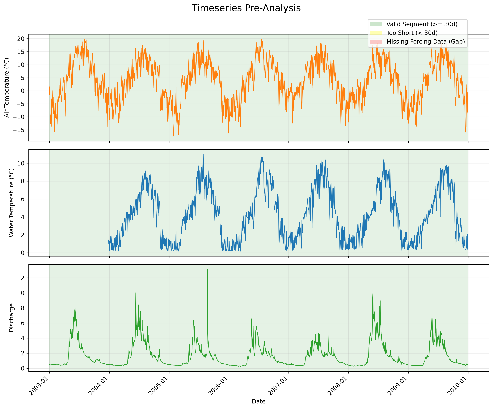
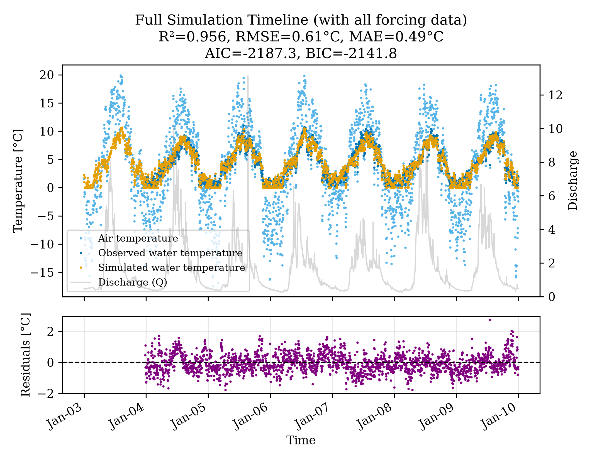

### few_short
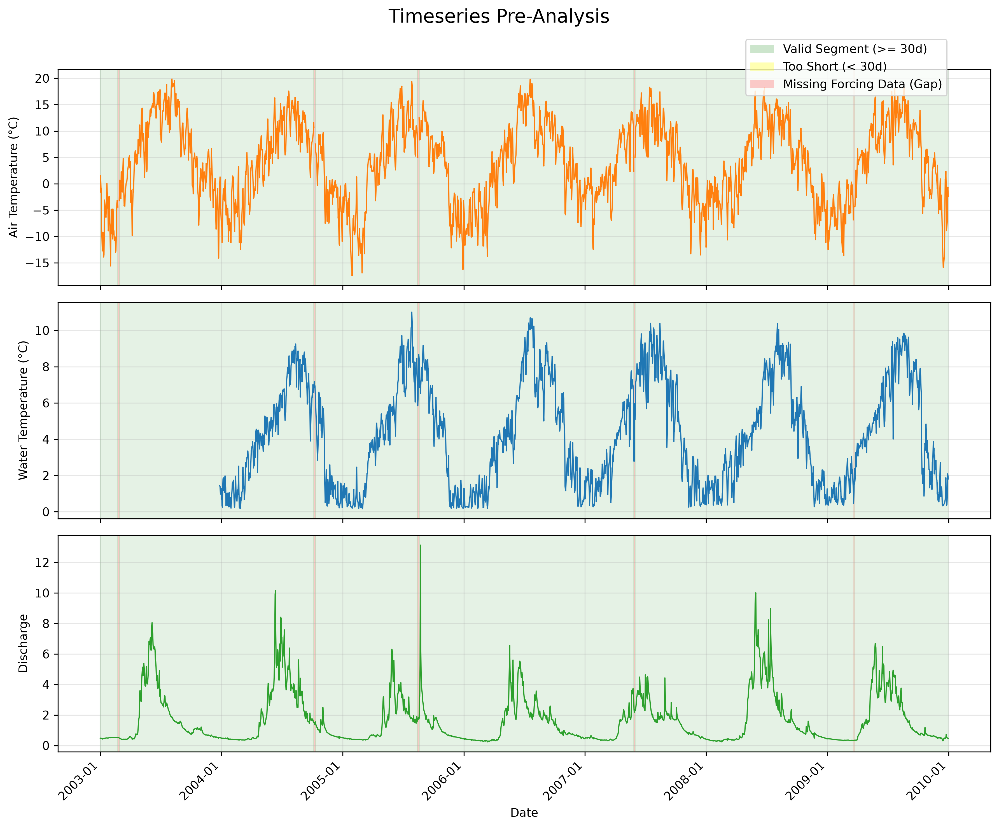
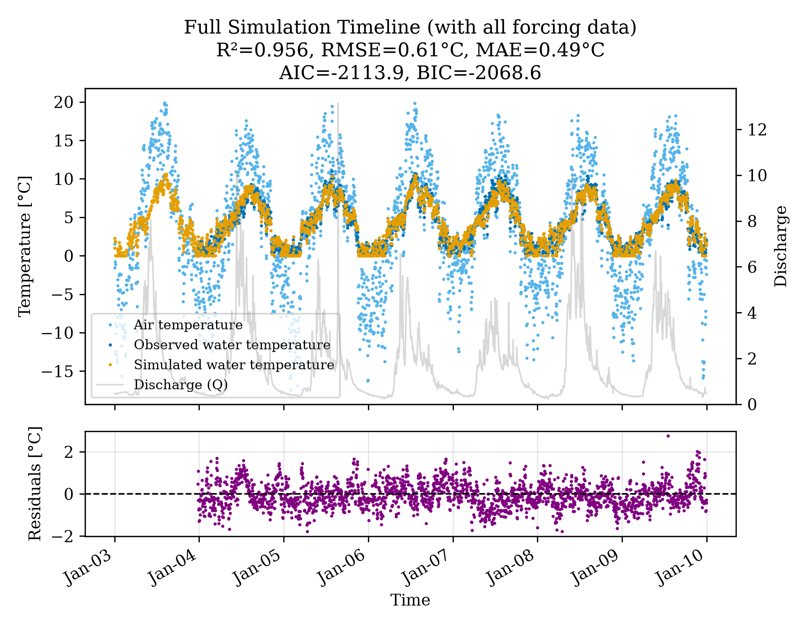

### many_short
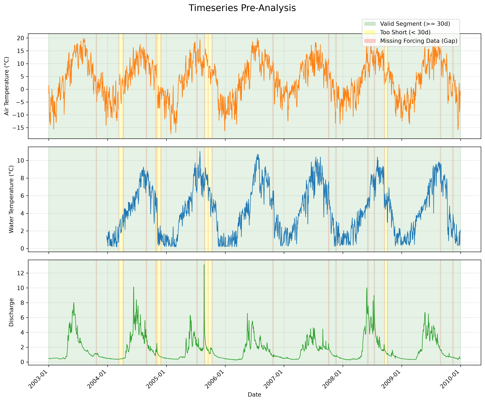
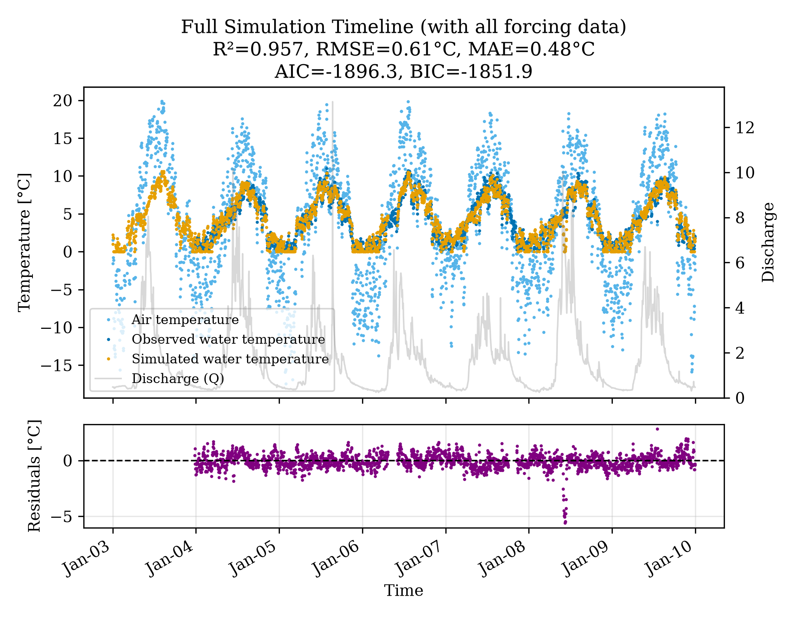

### few_long
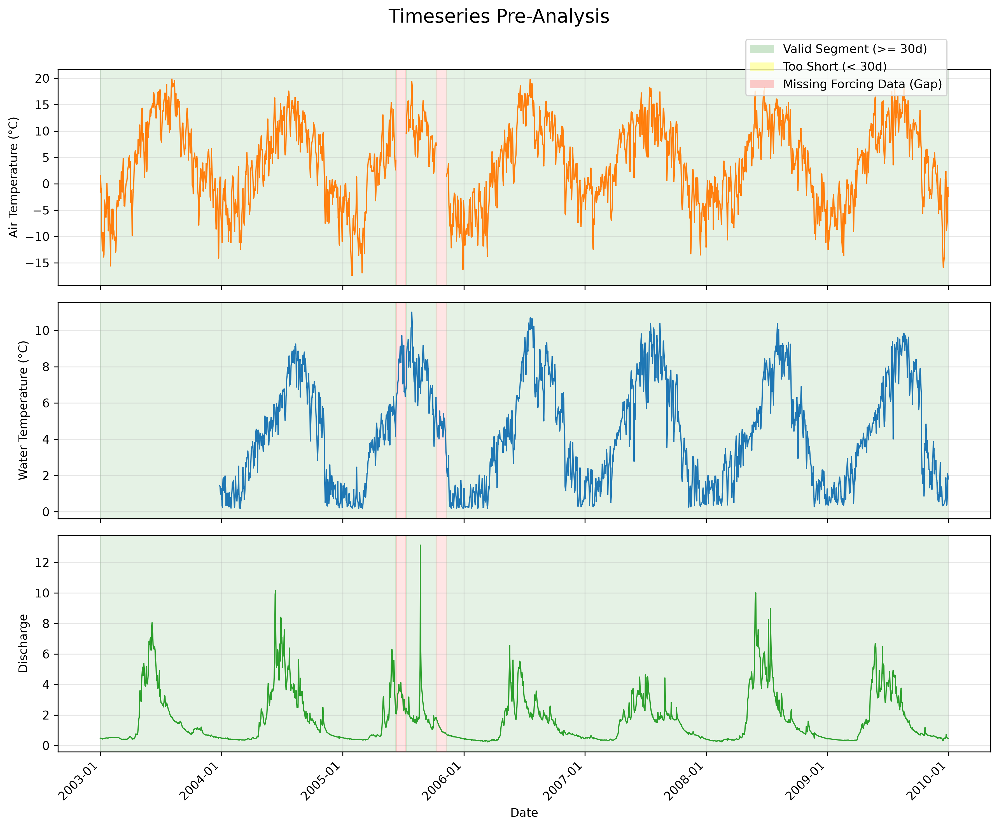
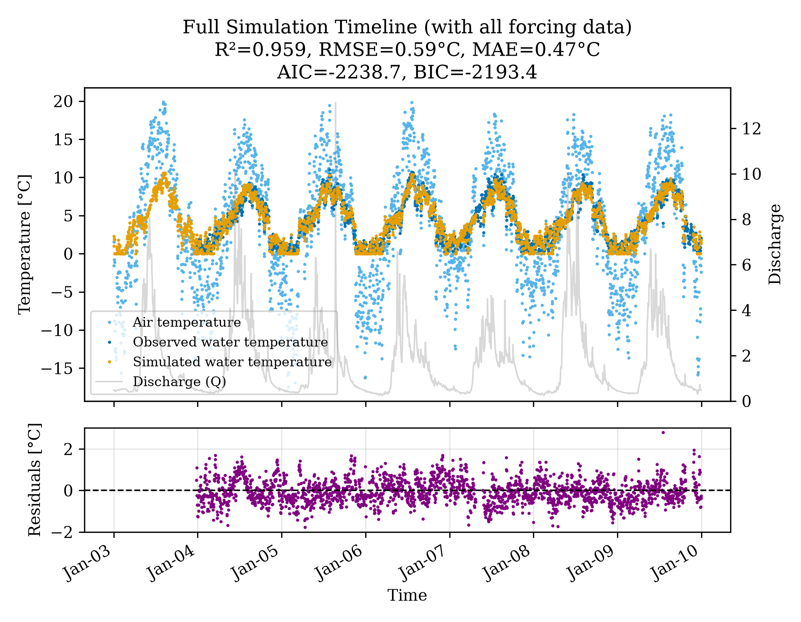

### many_long
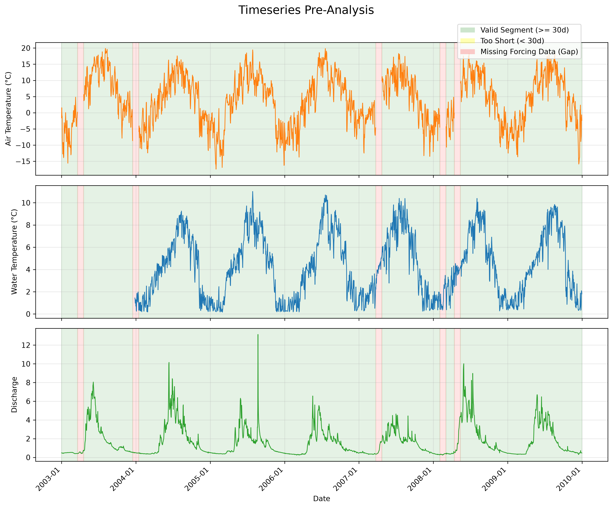
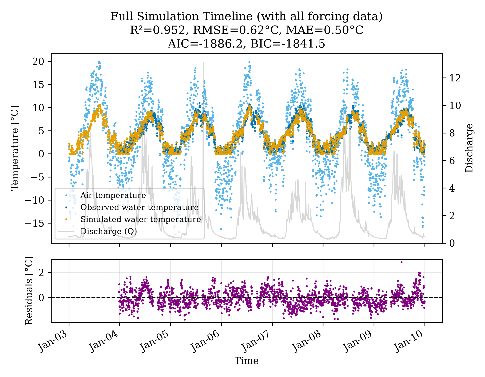

### random
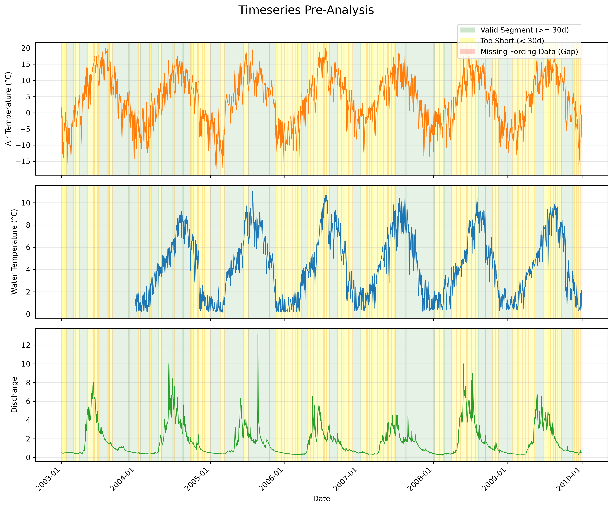
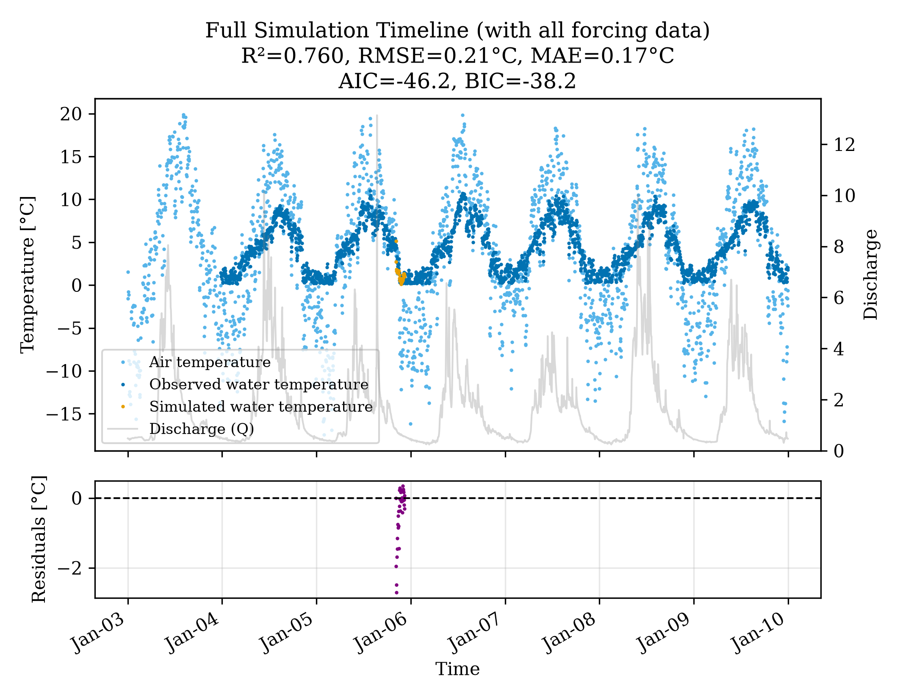
