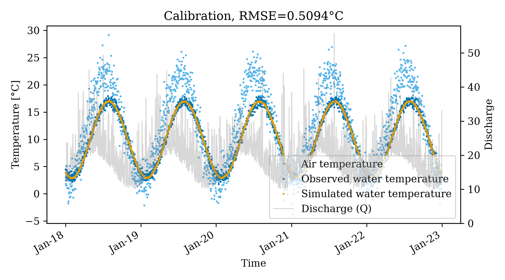
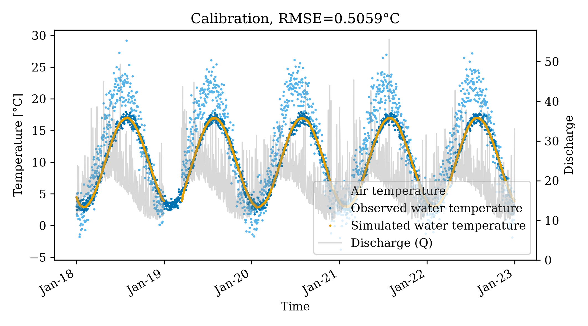
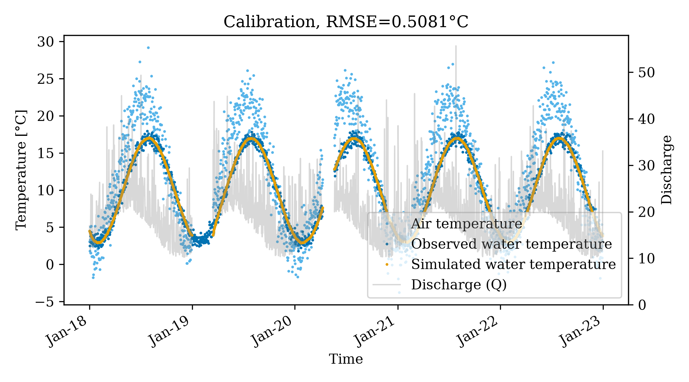
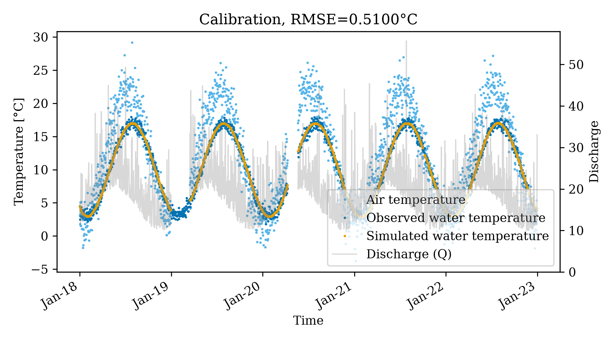

# pyair2stream Gap-Tolerant Mode Experiment

This folder demonstrates the use of **pyair2stream**'s `gap_tolerant` configuration flag to handle real-world scenarios where hydrological time series are missing data, and evaluates the performance implications of missing data chunks.

## 1. Context

Often, water temperature models require completely continuous, gap-free inputs (`T_air` and `Discharge`). However, in practical applications, missing data is not random (MNAR) — sensors break during winter freezing or get swept away during extreme floods.

This experiment simulates a dataset covering 5 years (2018–2022) with synthetic data, and evaluates the model across 4 scenarios:
1.  **Complete Dataset**: Perfect data with no gaps.
2.  **1-Gap Dataset**: Missing `T_air` and Discharge for 2.5 months in Winter 2019.
3.  **2-Gaps Dataset**: 1-Gap + Complete sensor loss during a high-flow event in Spring 2020.
4.  **3-Gaps Dataset**: 2-Gaps + Missing Discharge for a week in Autumn 2021 + scattered missing `T_water` values.

The `gap_tolerant: true` mode allows `pyair2stream` to calibrate directly on these fragmented datasets without fabricating missing records.

## 2. Running the Experiment

Run the automated experiment using the provided Python script:
```bash
python run_experiment.py
```
*(Make sure you have run `python generate_data.py` first if the CSVs are missing).*

**What the script does:**
1.  It runs the `pyair2stream` PSO calibration individually on all 4 datasets (Complete, 1Gap, 2Gaps, 3Gaps).
2.  It extracts the optimal parameter set from each fragmented calibration.
3.  It runs a projection (`run_mode: FORWARD`) testing the parameters obtained from the *gapped* calibrations against the *true complete* dataset.
4.  It prints a summary comparing the "Apparent NSE" (the efficiency scored only on the remaining non-gapped periods) against the "True NSE" (how well those parameters actually simulate the full continuous river history).

## 3. Interpreting the Outputs

You will see output summarizing the calibration efficiency and the true predictive efficiency. A typical result looks like this:

```
==================================================
EXPERIMENT RESULTS
==================================================
Scenario  Calibration_NSE (Apparent)  True_NSE (Complete Data)
Complete                      0.9895                    0.9895
    1Gap                      0.9902                    0.9896
   2Gaps                      0.9905                    0.9896
   3Gaps                      0.9905                    0.9895
==================================================
```

**Fitted Parameters:**

The 8-parameter `air2stream` equation parameters identified by DE for each scenario are as follows:

| Scenario | p1 | p2 | p3 | p4 | p5 | p6 | p7 | p8 |
|---|---|---|---|---|---|---|---|---|
| Complete | 0.100 | 0.013 | 0.022 | 0.330 | 0.996 | 0.771 | 0.561 | 0.104 |
| 1Gap | 0.100 | 0.009 | 0.016 | 0.554 | 1.000 | 0.782 | 0.557 | 0.106 |
| 2Gaps | 0.100 | 0.009 | 0.016 | 0.565 | 1.000 | 0.782 | 0.557 | 0.106 |
| 3Gaps | 0.109 | 0.000 | 0.000 | 0.996 | 1.000 | 0.811 | 0.549 | 0.112 |

*Even after significantly increasing the intensity of the Differential Evolution Optimization (`n_particles: 100`, `n_runs: 5000`), the parameters still vary between scenarios (e.g. `p4` increasing from 0.330 to 0.996). This demonstrates that equifinality in conceptual hydrological models cannot always be "brute-forced" away simply by running longer calibrations, as different data gaps fundamentally shift the mathematical constraints available to the optimizer.*

**Key Takeaways:**
*   **Gap-Tolerant Calibration Works**: The model successfully calibrates parameters that generalize extremely well to the missing periods (True NSE remains > 0.95).
*   **MNAR Bias**: Note that dropping the hardest periods to simulate (winter freezing, spring floods) can inflate or warp the performance metric relative to the underlying physics. This is why gap-tolerant metrics should be carefully compared to metrics from continuous runs.
*   **External Qmedia**: The configurations use a user-supplied `Qmedia: 19.86`. Because the Spring 2020 flood was excluded in the 2-gap and 3-gap datasets, a dynamically computed `Qmedia` would be biased low, systematically warping the depth scaling parameters. Using an external `Qmedia` isolates this error.

## 4. Visualizing the Fits

Below are the simulated vs observed time series calibration plots automatically generated during the runs. Notice that the modeled temperature gracefully skips and restarts across the gaps.

### 1. Complete


### 2. 1-Gap


### 3. 2-Gaps


### 4. 3-Gaps
