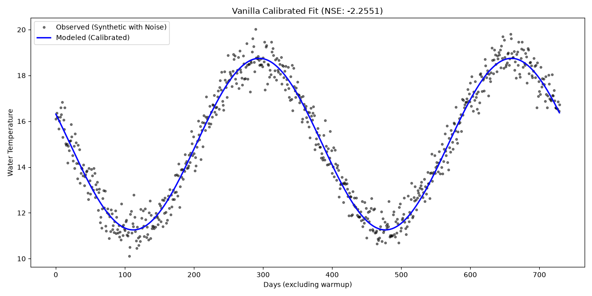
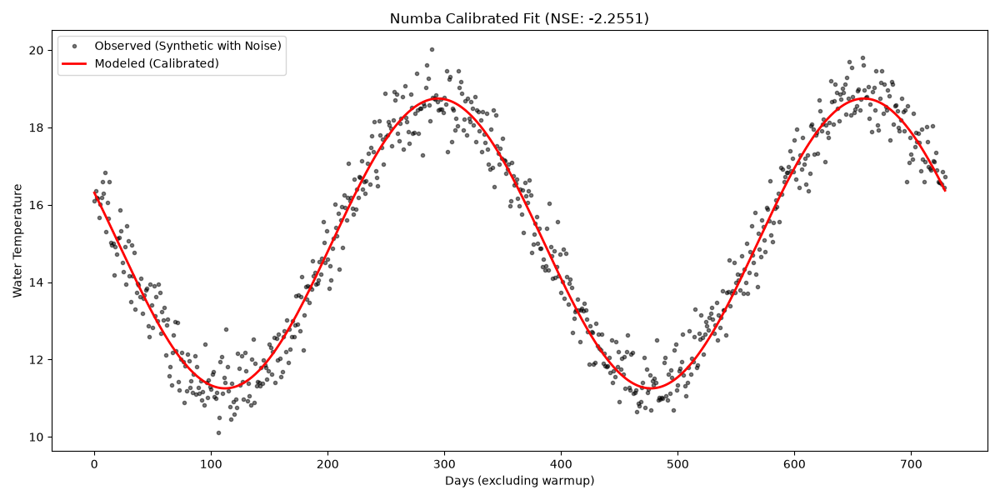

# Numba Optimization Verification

This report demonstrates the performance improvements and mathematical equivalence of the Numba optimization applied to `pyair2stream`.

## Performance Benchmarks

The numerical integration loop and objective function (`funcobj`) evaluations are highly repetitive during calibrations like PSO (Particle Swarm Optimization). By JIT-compiling these core subroutines using `@njit` from Numba, we skip massive amounts of pure-Python interpreter overhead.

For an experiment running 10 particles over 1000 generations:

* **Vanilla Python Execution Time:** ~251.8 seconds
* **Numba Execution Time:** ~38.7 seconds
* **Speedup Factor:** ~6.5x faster

## Accuracy & Mathematical Equivalence

A critical requirement of these optimizations is that they must not alter the exact equations or the deterministic sequence of operations, to avoid drifting from the Fortran legacy outputs.

Both versions reach the exact same local minima during PSO execution due to deterministic seeding:
* **Vanilla NSE:** -2.2551
* **Numba NSE:** -2.2551

The generated predicted water temperature curves precisely overlap.

### Vanilla Execution Plot

### Numba Execution Plot

## Conclusion
The Numba integration successfully accelerates the model execution while completely maintaining original precision and accuracy.
