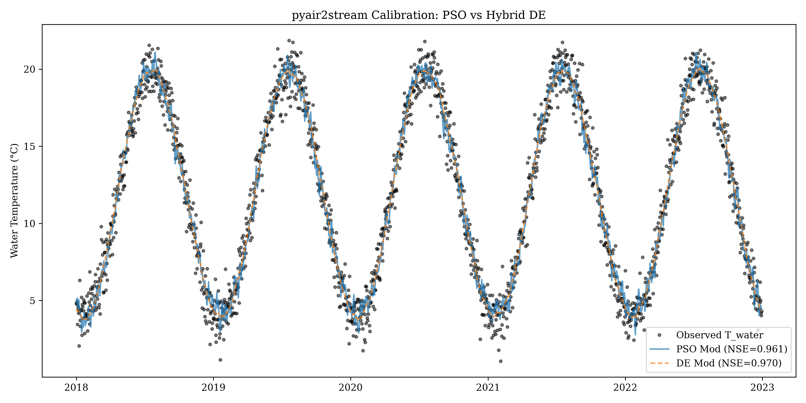
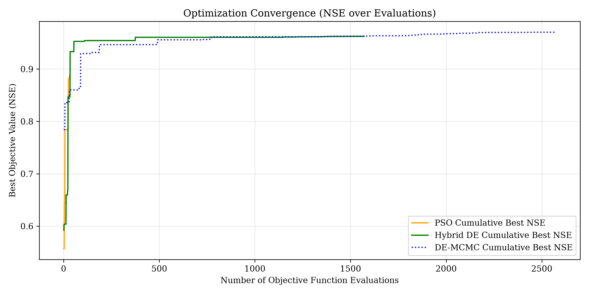
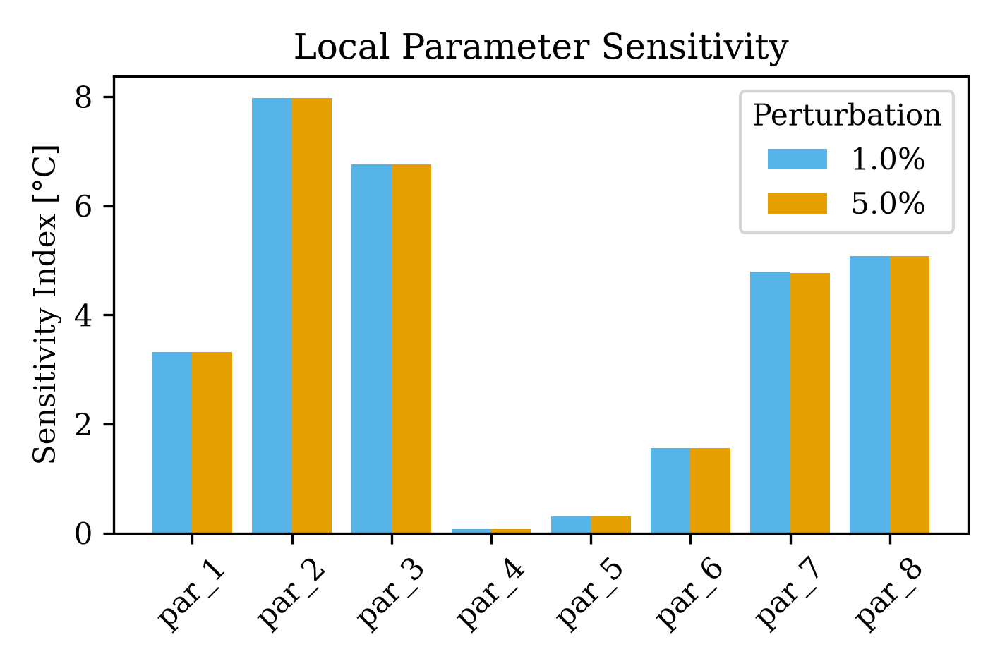
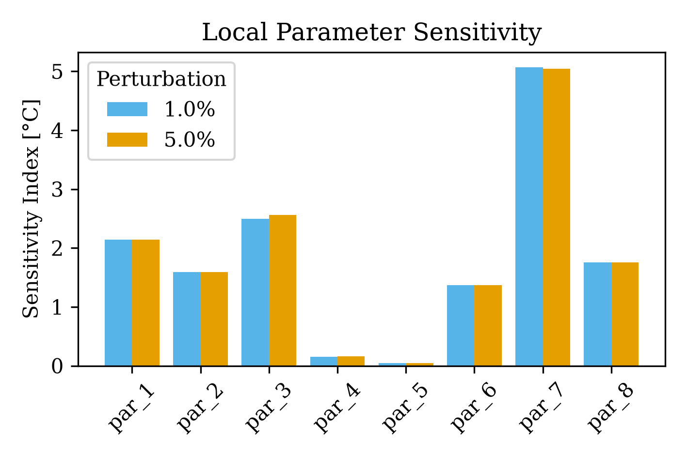

# pyair2stream Optimizer Comparison

To compare the efficiency and accuracy of different optimization strategies, the `pyair2stream` model is calibrated on the "Switzerland (DAV)" dataset using three approaches provided by the package:

1. **PSO (Particle Swarm Optimization)**
2. **Hybrid DE (Differential Evolution + L-BFGS-B)**
3. **DE-MCMC (Differential Evolution + L-BFGS-B + Markov Chain Monte Carlo)**

The goal is to evaluate their relative performance in terms of model fit (Nash-Sutcliffe Efficiency, NSE), parameter convergence, parameter sensitivity, and computational time. Note that for this comparison, the PSO configuration was dynamically adjusted to use a highly intensive 500 particles and 500 runs to give it a fair chance to converge. Additionally, a random seed (`np.random.seed(42)`) was set prior to running each optimizer to ensure that the stochastic phases of Hybrid DE and DE-MCMC start from the exact same initial state for a perfect one-to-one comparison.

## Results Overview

| Optimizer | Time (s) | Best Objective (NSE) | Best Parameters |
| :--- | :--- | :--- | :--- |
| **PSO** | 147.99 | 0.952547 | `[3.69036, 0.4683, 1.0, 0.42137, 0.08943, 4.46763, 0.57736, 0.62088]` |
| **Hybrid DE** | 2.88 | 0.952547 | `[3.69022, 0.46831, 1.0, 0.4214, 0.08905, 4.46646, 0.57736, 0.6207]` |
| **DE-MCMC** | 35.73 | 0.952547 | `[3.69022, 0.46831, 1.0, 0.4214, 0.08905, 4.46646, 0.57736, 0.6207]` |

*Note: Execution times may vary slightly based on hardware and current load.*

### Observations

*   **Hybrid DE** achieved the best goodness of fit (NSE = ~0.953) and did so in a short amount of time. It effectively utilizes a global search (Differential Evolution) followed by local refinement (L-BFGS-B).
*   **PSO**, despite the increase to 500 particles and 500 runs (resulting in 250,000 evaluations), found a solution (NSE = ~0.953) that is essentially tied with Hybrid DE. However, it took nearly 2.5 minutes to achieve this result, demonstrating the relative inefficiency of PSO compared to the DE-based methods for this problem structure.
*   **DE-MCMC** performs the exact same initial optimization phase as Hybrid DE. Because they now share the same random seed, they find the exact same Best Objective and Best Parameters. DE-MCMC takes longer overall (35.73s) because it additionally runs 2000 MCMC steps across 32 walkers to estimate parameter uncertainty envelopes.

## Model Fit Comparison

The plot below compares the observed water temperatures against the simulated temperatures for both PSO and Hybrid DE. It also includes the 90% predictive uncertainty envelope generated by the MCMC sampling in the DE-MCMC mode.



## Optimizer Convergence

This plot illustrates how quickly each optimization algorithm converges toward a high Nash-Sutcliffe Efficiency (NSE) score over successive function evaluations.



Because Hybrid DE and DE-MCMC start with the exact same seed, their convergence trajectories (green and blue) overlap. Hybrid DE quickly achieves a near-optimal score and refines it. PSO explores a vastly wider parameter space early on (due to the 500 particles) but takes many more evaluations to reach its plateau.

## Parameter Sensitivity Analysis

Local sensitivity analysis was performed by perturbing the optimal parameters by 1% and 5% of their allowed ranges and measuring the mean absolute change in the simulated water temperature.

### PSO Parameter Sensitivity


### Hybrid DE Parameter Sensitivity


The sensitivity profiles show that the optimal parameter sets found by the two optimizers are situated in different regions of the parameter space, resulting in different dominant parameters.

## Reproducing this Example

To reproduce this analysis and generate the plots yourself, run the following command from the repository root:

```bash
python examples/optimizer_comparison/compare_optimizers.py
```
