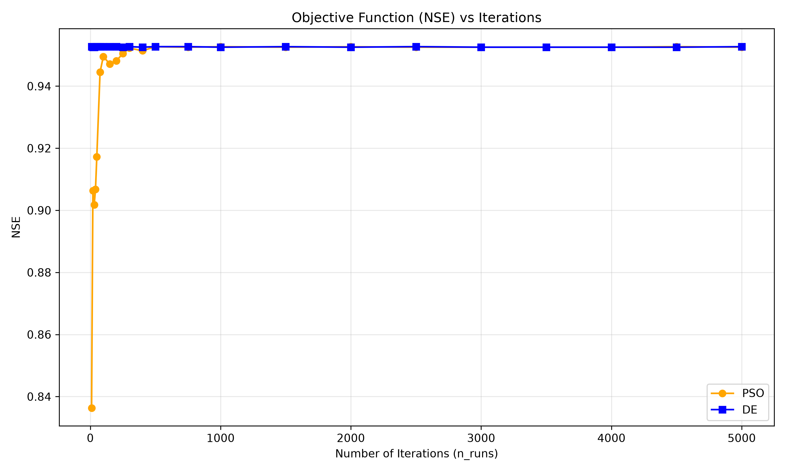
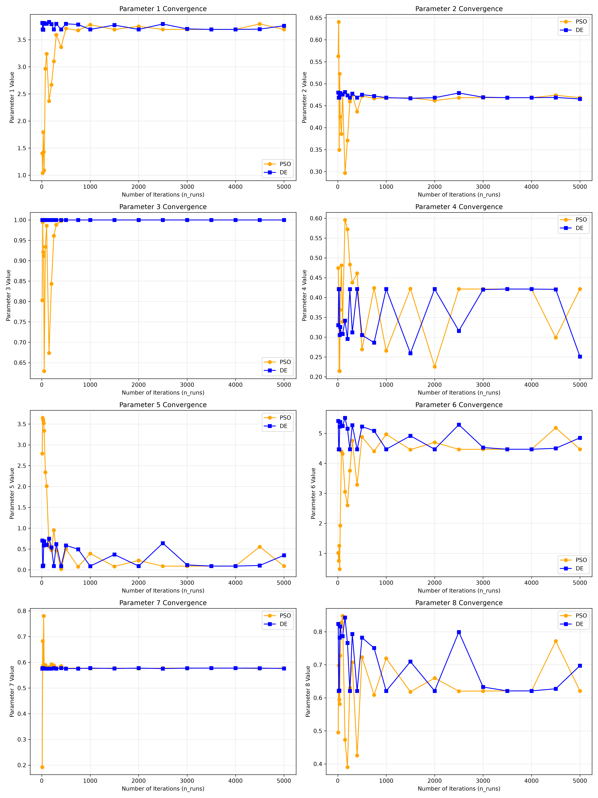
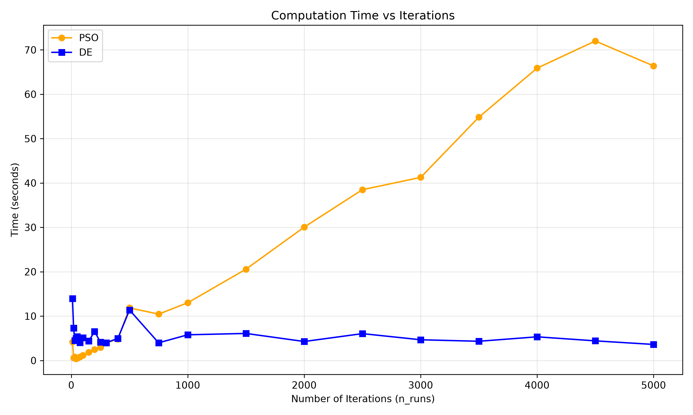

# Optimizer Convergence Report

This report evaluates the convergence behavior of two optimization algorithms available in `pyair2stream`:
1. **PSO** (Particle Swarm Optimization)
2. **DE** (Differential Evolution hybrid with L-BFGS-B polish)

## Overview
The algorithms were executed across increasing iteration counts (from 10 up to 5000), using 20 particles, to assess:
- **Parameter Convergence**: The stability and values of the model parameters.
- **Objective Function Convergence**: The goodness-of-fit measured by Nash-Sutcliffe Efficiency (NSE).
- **Computation Time**: The runtime required for each algorithm.

## Results & Discussion

### Objective Function Convergence (Goodness of Fit)

*Discussion*: The plot above shows how the objective function (NSE) improves as the number of iterations increases. DE consistently converges faster and reaches a higher NSE value with fewer iterations compared to PSO.

**Final Goodness Parameters (NSE) at 5000 iterations:**
- **PSO**: 0.95255
- **DE**: 0.95270

### Parameter Convergence (Model Fit Parameters)

*Discussion*: This plot displays the progression of the 8 parameter values as iterations increase. We can see how quickly the parameters stabilize. DE typically shows more stability at earlier iterations, whereas PSO takes longer to find the stable parameter space.

**Final Fit Parameters at 5000 iterations:**
- **PSO**: [3.69035, 0.4683, 1.0, 0.42137, 0.08957, 4.46781, 0.57736, 0.62092]
- **DE**: [3.75793, 0.46533, 1.0, 0.25121, 0.34812, 4.84927, 0.576, 0.69742]

### Computation Time

*Discussion*: The time taken by both optimizers scales roughly linearly with the number of iterations.

## Conclusion
Overall, DE is more efficient at finding optimal parameters for this configuration, reaching a higher NSE with better parameter stability at a similar computational cost compared to PSO.
