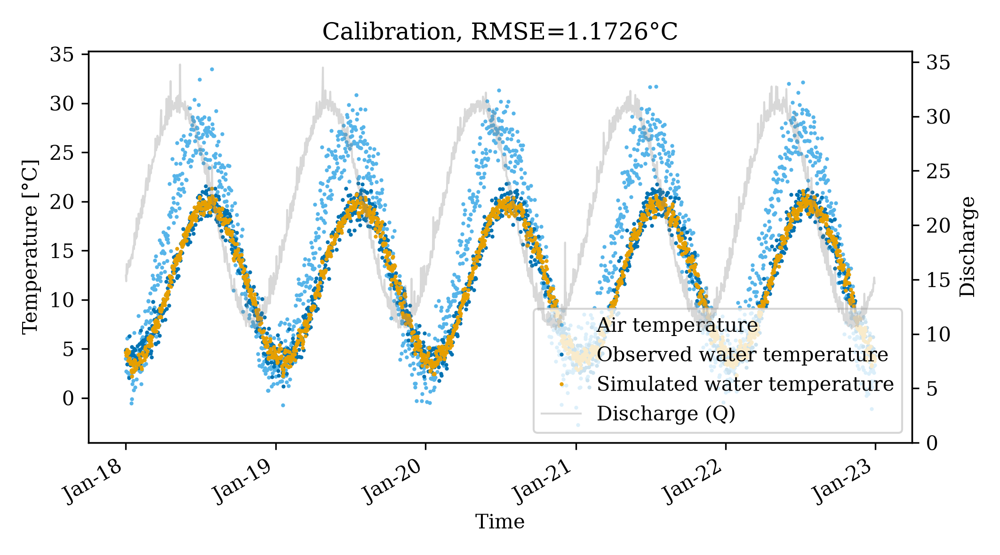
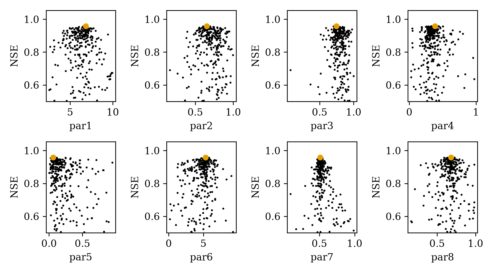
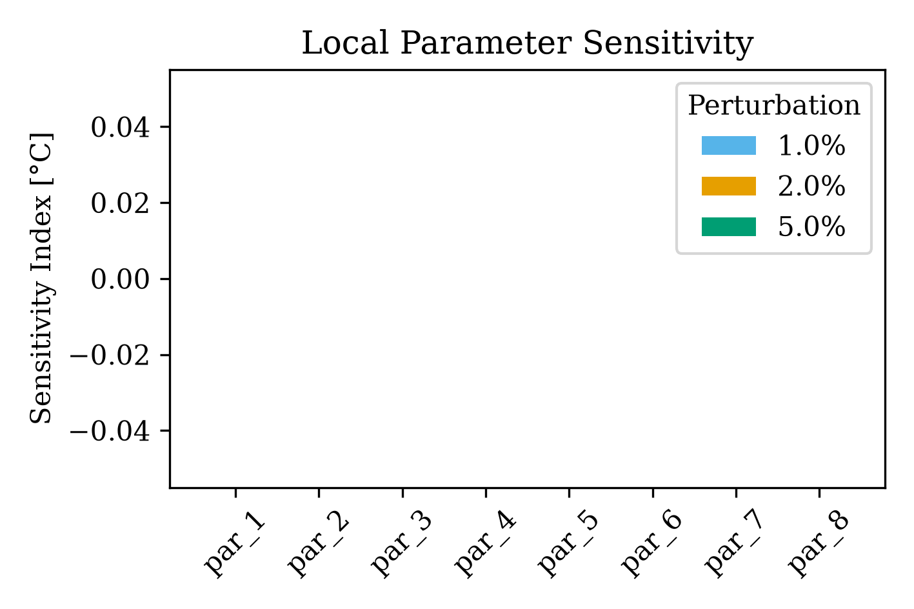

# pyair2stream Sensitivity Analysis Example

This example demonstrates how to use the built-in One-At-A-Time (OAT) local sensitivity analysis feature in `pyair2stream`.

## Setup and Execution

1.  **Generate Data:**
    Run the generation script to create synthetic time-series data.
    ```bash
    python examples/sensitivity_example/generate_data.py
    ```
    This creates `synthetic_data.csv`.

2.  **Run the Model:**
    Execute the model with the local configuration. The `config.yaml` is configured to run a calibration (PSO) followed by the sensitivity analysis.
    ```bash
    python -m pyair2stream.main --config examples/sensitivity_example/config.yaml
    ```

## Understanding the Configuration

The `config.yaml` includes two key flags:
*   `sensitivity_analysis: true`: Instructs the model to perform the OAT sensitivity analysis immediately after calibration.
*   `sensitivity_perturbations: [1.0, 2.0, 5.0]`: Defines the exact perturbation percentages to test. For each parameter, it will perturb the calibrated optimal value by +/- 1%, 2%, and 5% of its total valid range.

## Outputs

After running, the model automatically generates standard calibration visualizations alongside the new sensitivity analysis outputs.

### 1. Calibration Fit

This time-series plot compares the observed water temperatures (blue dots) against the simulated model predictions (orange dots), driven by air temperature (light blue) and river discharge (grey area).

### 2. Parameter Dotty Plots

These plots show the parameter space explored by the PSO algorithm. The x-axis represents the parameter value, and the y-axis represents the NSE efficiency score. The global optimum is marked with a large orange dot.

### 3. Sensitivity Analysis

A grouped bar chart visualizing the sensitivity index for each active parameter at different perturbation levels (1%, 2%, and 5%).
*   **Tall Bars:** Indicate parameters that are highly sensitive; a small change in their value causes a large change in the predicted water temperatures. These are well-constrained by the data.
*   **Short/Missing Bars:** Indicate insensitive parameters (e.g., `par_3`, `par_4`, `par_5`, `par_7` in version 8 equations where bounds might fix them or the equation ignores them). These are poorly constrained by the calibration data.

A detailed numerical breakdown is also exported to `sensitivity_PSO_NSE_River_Beta.csv`.
