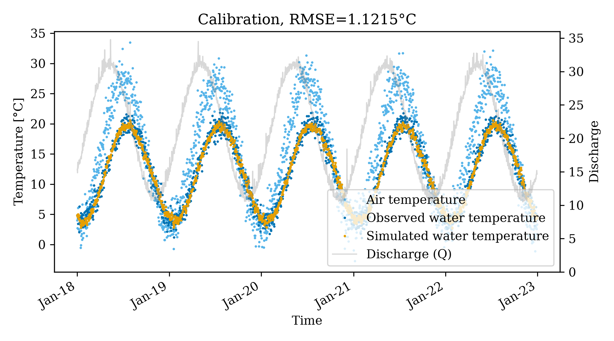
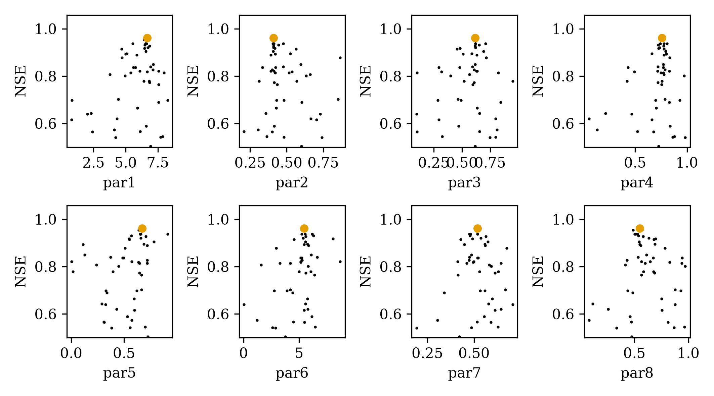
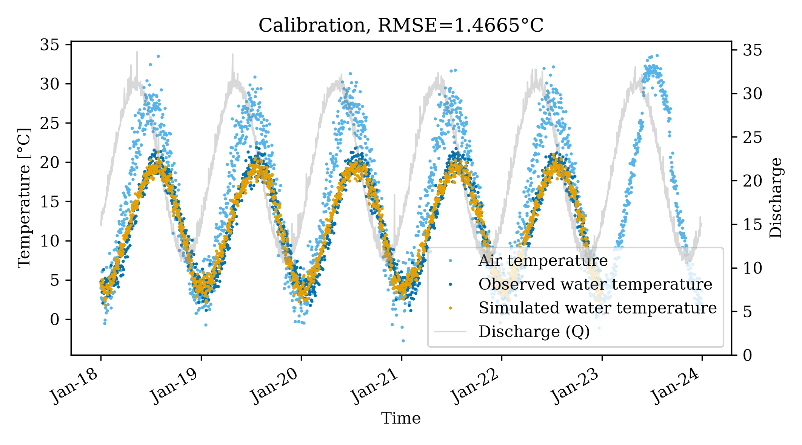
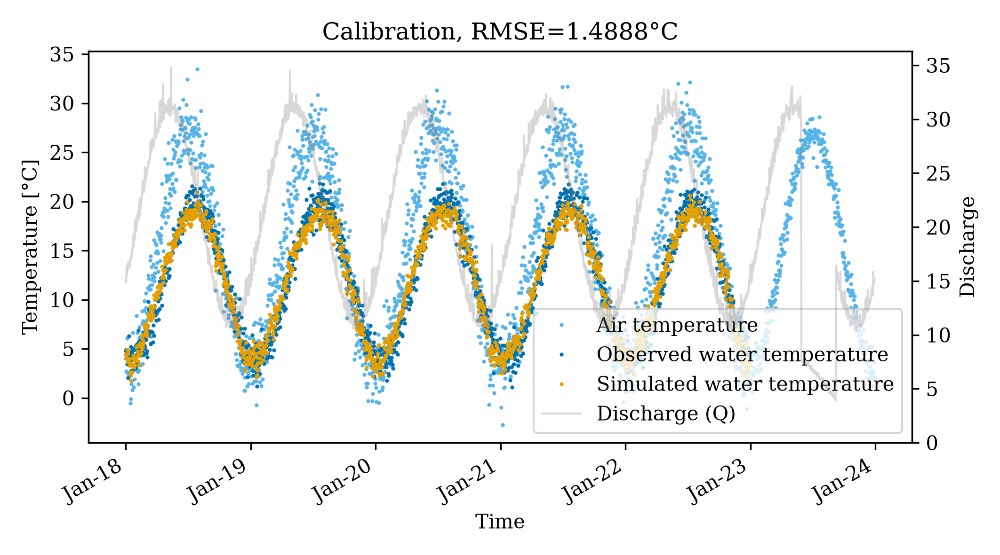

# pyair2stream Synthetic Calibration Example

This self-contained example demonstrates how to configure, calibrate, and interpret a river water temperature model using `pyair2stream`.

## Setup

1. **Dataset Generation:**
   The `generate_data.py` script utilizes `numpy` and `pandas` to generate 5 years of daily synthetic data. It accurately models:
   - **T_air (Air Temperature):** A seasonal sine wave plus normally distributed noise.
   - **Discharge:** A base river flow plus seasonal peaks with log-normal noise.
   - **T_water (Water Temperature):** A dampened, delayed response to air temperature. Crucially, the script inserts sentinels (`-999.0`) to emulate real-world missing data and clamps the minimum temperature near `0.0` to simulate ice-cover.

   *Run it manually to inspect the dataset:*
   ```bash
   python generate_data.py
   ```

2. **Configuration (`config.yaml`):**
   The configuration specifies:
   - **version: 8** (The 8-parameter equation involving discharge).
   - **objective_function: NSE** (Nash-Sutcliffe Efficiency).
   - **run_mode: PSO** (Particle Swarm Optimization across multiple cores).
   - **Paths** point directly to `synthetic_data.csv` and dump outputs to this specific folder.

## Running the Model Calibration

From the root of the repository, execute the standard entry point passing this folder's configuration:

```bash
python -m pyair2stream.main --config examples/synthetic_example/config.yaml
```

The model will parse the input, run 20 PSO particles over 20 iterations (utilizing parallel processing), compute the optimal 8 parameters, run a final forward calibration, and trigger the post-processing engine to visualize the results.

## Calibration Output Interpretation

The post-processing routine generates two core plots (available in both PNG and high-quality PDF formats):

### 1. Model Calibration Fit (`calibration_PSO_NSE_River_Alpha.png`)

- **Blue dots**: True observed water temperatures. Notice the gaps where the `-999.0` sentinel successfully triggered the algorithm to skip validation errors.
- **Light Blue dots**: The driving air temperature forcing the system.
- **Orange dots**: The model's predicted water temperature. A tight overlap against the blue dots signifies an accurate model.
- **Grey Line (Secondary Axis)**: The river flow Discharge (Q), allowing us to see periods of high or low river volume.

### 2. Parameter Optimization Dotty Plots (`dottyplots_PSO_NSE_River_Alpha.png`)

- These sub-panels plot every attempted parameter value (x-axis) across its bounds versus the resulting objective efficiency score (y-axis).
- The large **Orange dot** highlights the globally optimal value found for that specific parameter. This plot demonstrates how confident the PSO was in a parameter's optimal location (e.g., steep peaks indicate high sensitivity).

---

## Exploring Future Projections

Once you have calibrated a set of parameters, `pyair2stream` can operate in `FORWARD` mode to predict future water temperatures against hypothetical climate or flow scenarios.

### 1. Generating Scenarios
Run `run_projections.py` to generate two new synthetic datasets. These sets preserve the 5 years of historical context and append exactly 1 new year representing an extreme projection scenario:
1.  **Hot Summer Scenario:** Air temperature is drastically increased (+5 degrees) during the peak of summer (Day 150 to 250) but discharge remains normal.
2.  **Low Flow Summer Scenario:** Air temperature remains normal, but summer base flow discharge is heavily reduced (by 75%).

```bash
python examples/synthetic_example/run_projections.py
```

### 2. Running the Projections
We have created two specific YAML configuration files (`config_hot_summer.yaml` and `config_low_flow.yaml`) which specify `run_mode: "FORWARD"` and manually supply the 8 parameters derived during our earlier calibration.

```bash
python -m pyair2stream.main --config examples/synthetic_example/config_hot_summer.yaml
python -m pyair2stream.main --config examples/synthetic_example/config_low_flow.yaml
```

### Projection Outputs Interpretation

*(Note: The first ~5/6ths of these graphs are the historical data retained for context, the extreme change is visible on the far right in the final year).*

#### Hot Summer

Notice the **Light Blue dots** (Air Temperature) spiking drastically during the final summer band. The resulting **Orange dots** (Predicted Water Temperature) follow this spike closely, proving the model correctly identifies river temperature sensitivity to extreme local heating.

#### Low Flow Summer

Here, the air temperature forcing remains steady, but because the model equations dynamically factor in flow volume, the reduced thermal mass of the river during the low flow period (visible as a sudden dip in the **grey line**) causes the **Orange dots** to peak *higher* than normal base-line summer models. A shallower river heats up faster.
