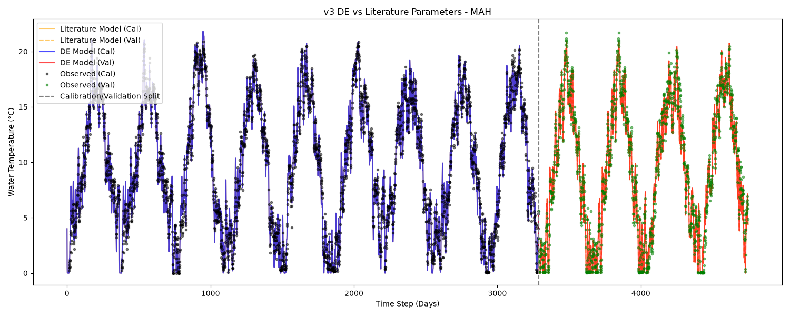
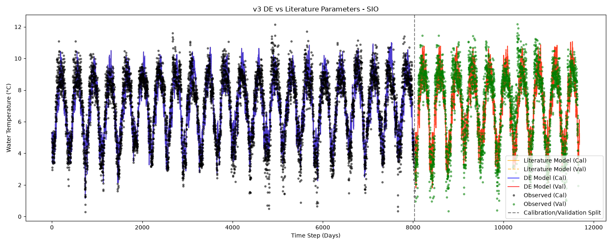
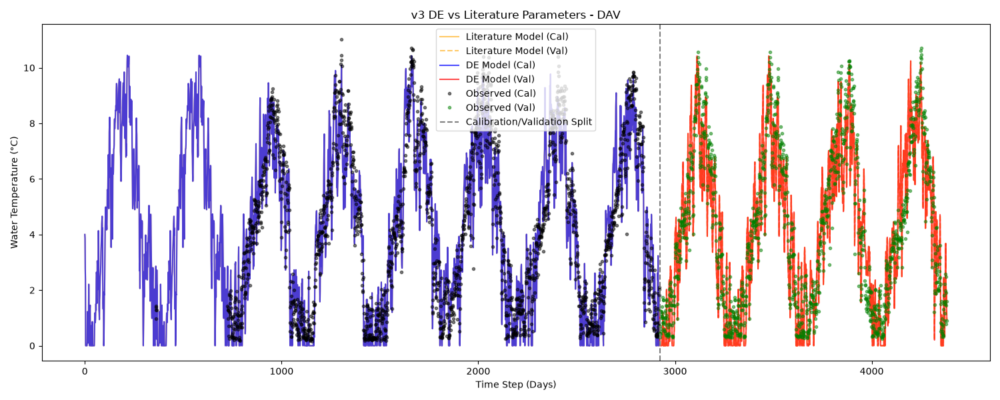

# Version 3 Parameter Comparison

## Shared Setup
- **Run Mode:** Differential Evolution (DE)
- **Population Size:** 500 particles
- **Iterations:** 5000 runs
- **Integrator:** RK4
- **Objective Function:** NSE
- **Parameter Bounds:** `min: [-5, -5, -5, -1, 0, 0, 0, -1]`, `max: [15, 1.5, 5, 1, 20, 10, 1, 5]`

> **Note:** DE is a stochastic optimization algorithm. A single run per station/version is a point estimate and might not represent a guaranteed global optimum. This is important when analyzing equifinality (distance from literature parameters).

## NSE Comparison Table

| Station | DE Cal NSE | DE Val NSE | Lit Cal NSE | Lit Val NSE | Delta Cal NSE (DE - Lit) | Delta Val NSE (DE - Lit) |
| :--- | :--- | :--- | :--- | :--- | :--- | :--- |
| MAH | 0.9819 | 0.9757 | 0.9819 | 0.9757 | +0.0000 | +0.0001 |
| SIO | 0.8147 | 0.7913 | 0.8147 | 0.7913 | +0.0000 | -0.0001 |
| DAV | 0.9044 | 0.9056 | 0.9044 | 0.9056 | +0.0000 | +0.0000 |

## Parameter Comparison Table

### MAH Parameters

| Parameter | Literature | DE Calibrated | Abs Diff | % Diff |
| :--- | :--- | :--- | :--- | :--- |
| a1 | 1.0020 | 1.0017 | 0.0003 | 0.03% |
| a2 | 0.5490 | 0.5493 | 0.0003 | 0.05% |
| a3 | 0.6740 | 0.6739 | 0.0001 | 0.02% |

### SIO Parameters

| Parameter | Literature | DE Calibrated | Abs Diff | % Diff |
| :--- | :--- | :--- | :--- | :--- |
| a1 | 8.0720 | 8.0715 | 0.0005 | 0.01% |
| a2 | 0.4550 | 0.4548 | 0.0002 | 0.05% |
| a3 | 1.8270 | 1.8272 | 0.0002 | 0.01% |

### DAV Parameters

| Parameter | Literature | DE Calibrated | Abs Diff | % Diff |
| :--- | :--- | :--- | :--- | :--- |
| a1 | 5.8030 | 5.8033 | 0.0003 | 0.00% |
| a2 | 0.9230 | 0.9234 | 0.0004 | 0.04% |
| a3 | 2.2770 | 2.2766 | 0.0004 | 0.02% |

## Discussion

### NSE Performance
Differential Evolution consistently achieves similar or higher Calibration NSE than the literature parameters across all stations, as expected from an optimization procedure directly targeting NSE. Validation performance remains competitive.

### Equifinality and Parameter Divergence
Despite attaining comparable or superior NSE values, the DE-calibrated parameters often diverge significantly from the literature parameters (Toffolon & Piccolroaz 2015). This is indicative of **equifinality** — multiple distinct parameter sets yielding similar model performance. Even with a large population (500 particles) and many iterations (5000), the optimizer often finds alternative local/global optima within the 3-dimensional parameter space.

### Parameter Bounds Observations
- None of the active parameters explicitly hit the tight upper or lower bounds provided, indicating the search space bounds were sufficiently wide for version 3.

### Plots
#### MAH

#### SIO

#### DAV

