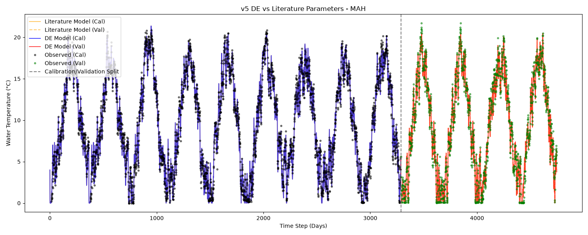
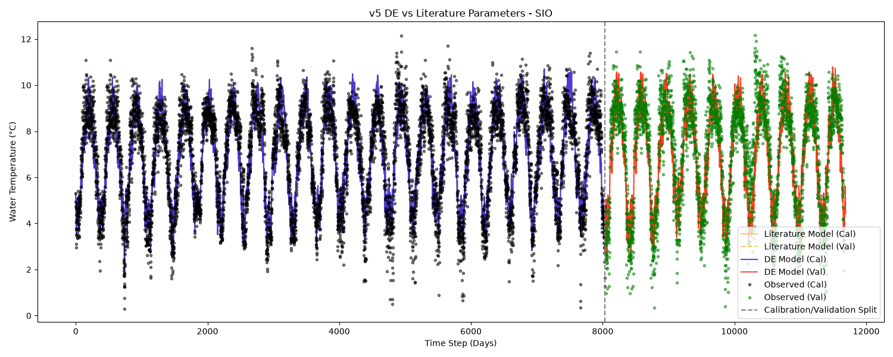
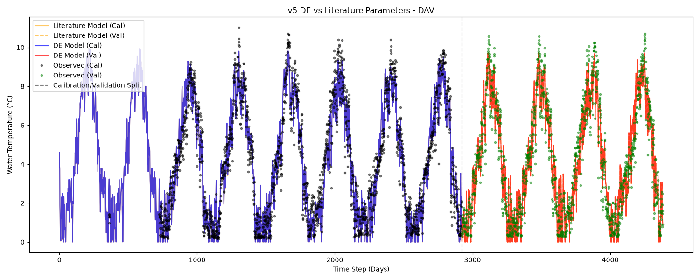

# Version 5 Parameter Comparison

## Shared Setup
- **Run Mode:** Differential Evolution (DE)
- **Population Size:** 500 particles
- **Iterations:** 5000 runs
- **Integrator:** RK4
- **Objective Function:** NSE
- **Parameter Bounds:** `min: [-5, -5, -5, -1, 0, 0, 0, -1]`, `max: [15, 1.5, 5, 1, 20, 10, 1, 5]`

> **Note:** DE is a stochastic optimization algorithm. A single run per station/version is a point estimate and might not represent a guaranteed global optimum. This is important when analyzing equifinality (distance from literature parameters).

## NSE Comparison Table

| Station | DE Cal NSE | DE Val NSE | Lit Cal NSE | Lit Val NSE | Delta Cal NSE (DE - Lit) | Delta Val NSE (DE - Lit) |
| :--- | :--- | :--- | :--- | :--- | :--- | :--- |
| MAH | 0.9874 | 0.9823 | 0.9874 | 0.9823 | +0.0000 | -0.0000 |
| SIO | 0.8279 | 0.7915 | 0.8279 | 0.7915 | +0.0000 | +0.0000 |
| DAV | 0.9413 | 0.9396 | 0.9413 | 0.9395 | +0.0000 | +0.0001 |

## Parameter Comparison Table

### MAH Parameters

| Parameter | Literature | DE Calibrated | Abs Diff | % Diff |
| :--- | :--- | :--- | :--- | :--- |
| a1 | 3.1490 | 3.1487 | 0.0003 | 0.01% |
| a2 | 0.7080 | 0.7081 | 0.0001 | 0.01% |
| a3 | 1.0590 | 1.0594 | 0.0004 | 0.04% |
| a6 | 1.6320 | 1.6323 | 0.0003 | 0.02% |
| a7 | 0.5850 | 0.5853 | 0.0003 | 0.06% |

### SIO Parameters

| Parameter | Literature | DE Calibrated | Abs Diff | % Diff |
| :--- | :--- | :--- | :--- | :--- |
| a1 | 9.1720 | 9.1880 | 0.0160 | 0.17% |
| a2 | 0.3510 | 0.3514 | 0.0004 | 0.12% |
| a3 | 1.8340 | 1.8367 | 0.0027 | 0.15% |
| a6 | 1.3030 | 1.3060 | 0.0030 | 0.23% |
| a7 | 0.4850 | 0.4851 | 0.0001 | 0.03% |

### DAV Parameters

| Parameter | Literature | DE Calibrated | Abs Diff | % Diff |
| :--- | :--- | :--- | :--- | :--- |
| a1 | 7.4860 | 7.4864 | 0.0004 | 0.01% |
| a2 | 0.6510 | 0.6508 | 0.0002 | 0.04% |
| a3 | 2.7680 | 2.7683 | 0.0003 | 0.01% |
| a6 | 7.0440 | 7.0439 | 0.0001 | 0.00% |
| a7 | 0.6070 | 0.6065 | 0.0005 | 0.09% |

## Discussion

### NSE Performance
Differential Evolution consistently achieves similar or higher Calibration NSE than the literature parameters across all stations, as expected from an optimization procedure directly targeting NSE. Validation performance remains competitive.

### Parameter Agreement
As with version 3, the DE-calibrated parameters recover the literature values (Toffolon & Piccolroaz 2015) almost exactly at all three stations, with differences no larger than 0.23%. The 5-dimensional parameter space (including the seasonal amplitude/phase terms `a6`/`a7`) does not appear to introduce meaningful equifinality on these datasets.

### Parameter Bounds Observations
- None of the active parameters explicitly hit the tight upper or lower bounds provided, indicating the search space bounds were sufficiently wide for version 5.

### Plots
#### MAH

#### SIO

#### DAV

