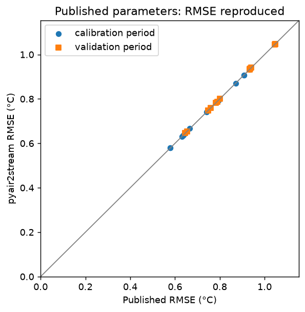
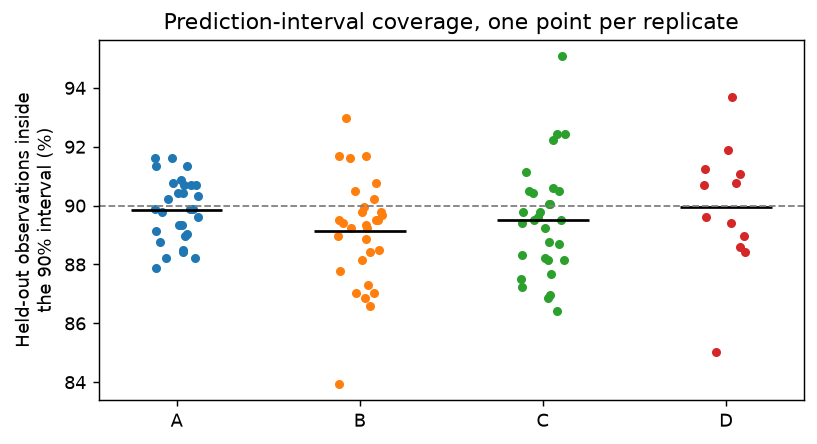
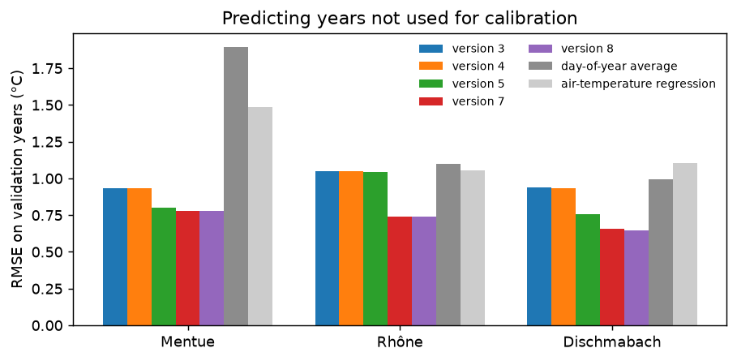
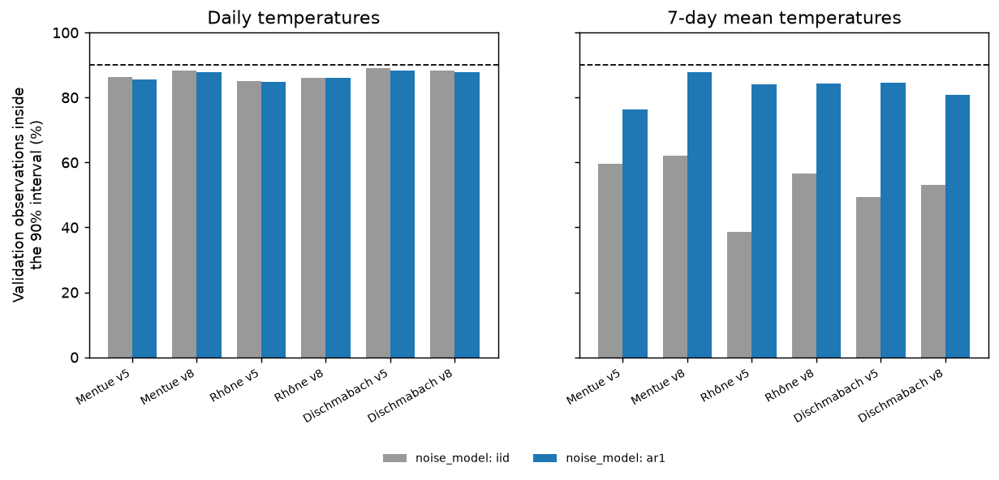

# pyair2stream validation report

Generated by `validation/run_all.py`. Each check states its question, method and pass criterion before its result. See `validation/README.md` for what each check covers and why.

## Summary

| Check | Question | Result |
|---|---|---|
| [V1](#v1) | Same results as the original Fortran | **PASS** |
| [V2](#v2) | Reproduces published results | **PASS** |
| [V3](#v3) | Calibration recovers a known truth | **PASS** |
| [V4](#v4) | Uncertainty intervals are calibrated | **PASS** |
| [V5](#v5) | Predicts real rivers in years it was not calibrated on | **FAIL** |
| [V6](#v6) | Numerical accuracy and warnings | **PASS** |
| [V7](#v7) | Missing data | **PASS** |
| [V8](#v8) | Workflow and scenario tools give exact answers | **PASS** |

## Environment

| | |
|---|---|
| Date | 2026-09-25 10:49 UTC |
| pyair2stream | 0.4.0, commit 8cbddd8 at the start of the run |
| Mode | full |
| Run time | 21.6 minutes |
| Python | 3.11.15 |
| Packages | numpy 2.4.6, scipy 1.17.1, pandas 3.0.6, emcee 3.1.6, numba 0.67.0 |
| Machine | Linux x86_64, 4 CPUs |

## V1

### Same results as the original Fortran

**Question.** Does pyair2stream compute the same daily water temperatures as the original Fortran air2stream when both are given real, variable inputs?

**Method.** The Fortran source (git submodule) is compiled with gfortran. For each model version and each integrator the Fortran implements, both programs simulate the Mentue calibration record (8 years of real air temperature and discharge) with the published parameters (Piccolroaz et al., 2016). Daily outputs are compared.

**Pass criterion.** On every day where both stay below 100 °C, they differ by at most 1e-05 °C; and they diverge (exceed it) on exactly the same days.

**Result: PASS.** All 20 version × integrator cases agree to within 5.0e-06 °C; in 4 cases (explicit integrators) both programs diverge on the same days with these parameters, which were calibrated with CRN (see V6).
(Run time 0.1 minutes.)

**Python vs Fortran, Mentue 2002-2009, published parameters** ([csv](results/V1_1.csv))

| version | integrator | days compared | days diverged (Python) | days diverged (Fortran) | same divergence days | max \|difference\| (°C) |
|---|---|---|---|---|---|---|
| 3 | EUL | 2922 | 0 | 0 | yes | 4.997e-06 |
| 3 | RK2 | 2922 | 0 | 0 | yes | 4.999e-06 |
| 3 | RK4 | 2922 | 0 | 0 | yes | 5e-06 |
| 3 | CRN | 2922 | 0 | 0 | yes | 4.996e-06 |
| 4 | EUL | 2922 | 0 | 0 | yes | 5e-06 |
| 4 | RK2 | 2922 | 0 | 0 | yes | 4.999e-06 |
| 4 | RK4 | 2922 | 0 | 0 | yes | 4.999e-06 |
| 4 | CRN | 2922 | 0 | 0 | yes | 5e-06 |
| 5 | EUL | 2922 | 0 | 0 | yes | 5e-06 |
| 5 | RK2 | 2922 | 0 | 0 | yes | 4.996e-06 |
| 5 | RK4 | 2922 | 0 | 0 | yes | 4.993e-06 |
| 5 | CRN | 2922 | 0 | 0 | yes | 4.999e-06 |
| 7 | EUL | 2922 | 0 | 0 | yes | 4.999e-06 |
| 7 | RK2 | 2920 | 2 | 2 | yes | 4.999e-06 |
| 7 | RK4 | 2922 | 0 | 0 | yes | 4.998e-06 |
| 7 | CRN | 2922 | 0 | 0 | yes | 5e-06 |
| 8 | EUL | 2921 | 1 | 1 | yes | 5e-06 |
| 8 | RK2 | 2662 | 260 | 260 | yes | 4.999e-06 |
| 8 | RK4 | 2849 | 73 | 73 | yes | 4.998e-06 |
| 8 | CRN | 2922 | 0 | 0 | yes | 4.997e-06 |

## V2

### Reproduces published results

**Question.** Given the published parameters, does pyair2stream reproduce the published model errors for every model version? Does its own calibration fit at least as well, and find the published parameters?

**Method.** Piccolroaz et al. (2016) calibrated every air2stream version (by RMSE, with the Crank-Nicolson scheme) on three Swiss rivers and published the parameters and the RMSE for the calibration and validation periods (data/switzerland/published/). (A) Each published parameter set is simulated with CRN and its RMSE computed. For the validation period the original program recomputed Qmedia from the validation data, so that is done here too; pyair2stream by default keeps the calibration Qmedia (reported separately). (B) Each version is recalibrated from scratch by DE (RMS objective, CRN, the authors' parameter ranges). (C) The recalibrated parameters are compared with the published ones. Where they differ, a local search (L-BFGS-B) is started from the published parameters to see whether their fit can be improved, and both parameter sets predict the validation years (with the calibration Qmedia).

**Pass criterion.** (A) all 30 published RMSE reproduced to within 0.001 °C. (B) DE calibration RMSE no worse than published + 0.002 °C in all 15 cases. (C) Wherever a recalibrated parameter differs from the published value by more than 1% of its range, the two parameter sets predict the validation years with RMSE within 0.01 °C of each other.

**Result: PASS.** (A) All 30 published RMSE values reproduced (largest difference 0.0005 °C). (B) DE matched or improved on the published calibration in 15 of 15 cases (mean difference -0.001 °C). (C) The recalibrated parameters match the published ones in 10 of 15 cases. Where they differ, the fits are within 0.012 °C of each other and the predictions for the validation years within 0.002 °C.
(Run time 1.2 minutes.)

**A. Published parameters: RMSE (°C)** ([csv](results/V2_1.csv))

| river | version | published cal | pyair2stream cal | published val | pyair2stream val | val, calibration Qmedia | max \|diff\| |
|---|---|---|---|---|---|---|---|
| Mentue | 3 | 0.793 | 0.7927 | 0.933 | 0.9328 | 0.9328 | 0.0003 |
| Mentue | 4 | 0.785 | 0.785 | 0.936 | 0.9363 | 0.9351 | 0.0003 |
| Mentue | 5 | 0.666 | 0.6664 | 0.8 | 0.8001 | 0.8001 | 0.0004 |
| Mentue | 7 | 0.637 | 0.6371 | 0.783 | 0.7827 | 0.7784 | 0.0003 |
| Mentue | 8 | 0.645 | 0.645 | 0.788 | 0.7879 | 0.7809 | 0.0001 |
| Rhône | 3 | 0.907 | 0.9072 | 1.048 | 1.048 | 1.048 | 0.0004 |
| Rhône | 4 | 0.907 | 0.9065 | 1.047 | 1.047 | 1.047 | 0.0005 |
| Rhône | 5 | 0.871 | 0.8707 | 1.046 | 1.046 | 1.046 | 0.0003 |
| Rhône | 7 | 0.579 | 0.5787 | 0.748 | 0.7479 | 0.7391 | 0.0003 |
| Rhône | 8 | 0.579 | 0.5792 | 0.748 | 0.7481 | 0.7392 | 0.0002 |
| Dischmabach | 3 | 0.937 | 0.9369 | 0.941 | 0.941 | 0.941 | 0.0001 |
| Dischmabach | 4 | 0.933 | 0.9328 | 0.934 | 0.9335 | 0.9336 | 0.0005 |
| Dischmabach | 5 | 0.741 | 0.7407 | 0.759 | 0.7587 | 0.7587 | 0.0003 |
| Dischmabach | 7 | 0.635 | 0.6349 | 0.653 | 0.6529 | 0.6591 | 0.0001 |
| Dischmabach | 8 | 0.632 | 0.6316 | 0.646 | 0.6457 | 0.6514 | 0.0004 |

**B. DE recalibration: calibration RMSE (°C)** ([csv](results/V2_2.csv))

| river | version | published cal RMSE | DE cal RMSE | difference | parameters at a bound |
|---|---|---|---|---|---|
| Mentue | 3 | 0.793 | 0.7927 | -0.0003 | none |
| Mentue | 4 | 0.785 | 0.785 | -0 | none |
| Mentue | 5 | 0.666 | 0.6664 | 0.0004 | none |
| Mentue | 7 | 0.637 | 0.6336 | -0.0034 | none |
| Mentue | 8 | 0.645 | 0.6331 | -0.0119 | none |
| Rhône | 3 | 0.907 | 0.9073 | 0.0003 | none |
| Rhône | 4 | 0.907 | 0.9065 | -0.0005 | none |
| Rhône | 5 | 0.871 | 0.8707 | -0.0003 | a1 |
| Rhône | 7 | 0.579 | 0.578 | -0.001 | none |
| Rhône | 8 | 0.579 | 0.5775 | -0.0015 | none |
| Dischmabach | 3 | 0.937 | 0.9369 | -0.0001 | none |
| Dischmabach | 4 | 0.933 | 0.9328 | -0.0002 | a2 |
| Dischmabach | 5 | 0.741 | 0.7407 | -0.0003 | a1 |
| Dischmabach | 7 | 0.635 | 0.6349 | -0.0001 | a5, a6 |
| Dischmabach | 8 | 0.632 | 0.6316 | -0.0004 | a5, a6 |

**C. Recalibrated vs published parameters: fit and predictions** ([csv](results/V2_3.csv))

| river | version | largest difference (% of range) | match | calibration RMSE, published | calibration RMSE, recalibrated | local search from published | seed 2 vs seed 1 (% of range) | validation RMSE, published | validation RMSE, recalibrated |
|---|---|---|---|---|---|---|---|---|---|
| Mentue | 3 | 0 | yes | 0.7927 | 0.7927 |  |  |  |  |
| Mentue | 4 | 0.02 | yes | 0.785 | 0.785 |  |  |  |  |
| Mentue | 5 | 0.01 | yes | 0.6664 | 0.6664 |  |  |  |  |
| Mentue | 7 | 5.36 | no | 0.6371 | 0.6336 | 0.6336 | 0 | 0.7784 | 0.7793 |
| Mentue | 8 | 11.73 | no | 0.645 | 0.6331 | 0.6331 | 0.01 | 0.7809 | 0.7791 |
| Rhône | 3 | 2.87 | no | 0.9072 | 0.9073 | 0.9072 | 2.88 | 1.048 | 1.048 |
| Rhône | 4 | 0.04 | yes | 0.9065 | 0.9065 |  |  |  |  |
| Rhône | 5 | 0 | yes | 0.8707 | 0.8707 |  |  |  |  |
| Rhône | 7 | 13.32 | no | 0.5787 | 0.578 | 0.578 | 0.01 | 0.7391 | 0.7396 |
| Rhône | 8 | 38.34 | no | 0.5792 | 0.5775 | 0.5778 | 0 | 0.7392 | 0.7395 |
| Dischmabach | 3 | 0.34 | yes | 0.9369 | 0.9369 |  |  |  |  |
| Dischmabach | 4 | 0 | yes | 0.9328 | 0.9328 |  |  |  |  |
| Dischmabach | 5 | 0.03 | yes | 0.7407 | 0.7407 |  |  |  |  |
| Dischmabach | 7 | 0 | yes | 0.6349 | 0.6349 |  |  |  |  |
| Dischmabach | 8 | 0 | yes | 0.6316 | 0.6316 |  |  |  |  |

**C. Parameter values, published and recalibrated (blank: not used by the version; 'NO': a parameter differs by more than 1% of its range)** ([csv](results/V2_4.csv))

| river | version | parameters | a1 | a2 | a3 | a4 | a5 | a6 | a7 | a8 | same as published |
|---|---|---|---|---|---|---|---|---|---|---|---|
| Mentue | 3 | published | 0.953 | 0.521 | 0.639 |  |  |  |  |  |  |
| Mentue | 3 | recalibrated | 0.953 | 0.521 | 0.639 |  |  |  |  |  | yes |
| Mentue | 4 | published | 0.898 | 0.482 | 0.593 | 0.200 |  |  |  |  |  |
| Mentue | 4 | recalibrated | 0.898 | 0.481 | 0.593 | 0.200 |  |  |  |  | yes |
| Mentue | 5 | published | 3.075 | 0.668 | 1.010 |  |  | 1.616 | 0.583 |  |  |
| Mentue | 5 | recalibrated | 3.074 | 0.668 | 1.010 |  |  | 1.615 | 0.583 |  | yes |
| Mentue | 7 | published | 0.999 | 0.772 | 0.905 |  | 3.487 | 2.312 | 0.598 | 0.361 |  |
| Mentue | 7 | recalibrated | 0.920 | 0.680 | 0.800 |  | 2.669 | 1.776 | 0.601 | 0.278 | NO |
| Mentue | 8 | published | 1.067 | 0.911 | 1.060 | -0.158 | 4.387 | 2.868 | 0.599 | 0.450 |  |
| Mentue | 8 | recalibrated | 0.890 | 0.654 | 0.770 | 0.066 | 2.552 | 1.695 | 0.601 | 0.266 | NO |
| Rhône | 3 | published | 11.366 | 0.635 | 2.565 |  |  |  |  |  |  |
| Rhône | 3 | recalibrated | 10.791 | 0.603 | 2.436 |  |  |  |  |  | NO |
| Rhône | 4 | published | 12.912 | 0.722 | 2.913 | -0.337 |  |  |  |  |  |
| Rhône | 4 | recalibrated | 12.921 | 0.722 | 2.915 | -0.337 |  |  |  |  | yes |
| Rhône | 5 | published | 15.000 | 0.551 | 2.966 |  |  | 2.257 | 0.491 |  |  |
| Rhône | 5 | recalibrated | 15.000 | 0.551 | 2.966 |  |  | 2.257 | 0.491 |  | yes |
| Rhône | 7 | published | 0.682 | 0.457 | 0.365 |  | 16.727 | 4.770 | 0.531 | 2.742 |  |
| Rhône | 7 | recalibrated | 0.596 | 0.390 | 0.313 |  | 14.063 | 4.016 | 0.529 | 2.311 | NO |
| Rhône | 8 | published | 0.560 | 0.509 | 0.374 | -0.191 | 19.220 | 5.435 | 0.530 | 3.139 |  |
| Rhône | 8 | recalibrated | 0.464 | 0.316 | 0.251 | 0.325 | 11.552 | 3.302 | 0.529 | 1.896 | NO |
| Dischmabach | 3 | published | 6.440 | 0.984 | 2.477 |  |  |  |  |  |  |
| Dischmabach | 3 | recalibrated | 6.508 | 0.995 | 2.504 |  |  |  |  |  | yes |
| Dischmabach | 4 | published | 9.906 | 1.500 | 3.785 | -0.725 |  |  |  |  |  |
| Dischmabach | 4 | recalibrated | 9.906 | 1.500 | 3.785 | -0.725 |  |  |  |  | yes |
| Dischmabach | 5 | published | 15.000 | 1.131 | 4.617 |  |  | 7.660 | 0.588 |  |  |
| Dischmabach | 5 | recalibrated | 15.000 | 1.133 | 4.620 |  |  | 7.663 | 0.588 |  | yes |
| Dischmabach | 7 | published | 9.108 | 1.107 | 2.552 |  | 0.000 | 10.000 | 0.582 | 1.295 |  |
| Dischmabach | 7 | recalibrated | 9.109 | 1.107 | 2.552 |  | 0.000 | 10.000 | 0.582 | 1.295 | yes |
| Dischmabach | 8 | published | 9.442 | 1.159 | 2.658 | -0.530 | 0.000 | 10.000 | 0.582 | 1.305 |  |
| Dischmabach | 8 | recalibrated | 9.442 | 1.159 | 2.658 | -0.530 | 0.000 | 10.000 | 0.582 | 1.305 | yes |

*Each point is one river, model version and period; all lie on the 1:1 line.*

> Where the parameters differ (Mentue version 7, Mentue version 8, Rhône version 3, Rhône version 7, Rhône version 8), the best fit lies in a long, flat valley along which the parameters trade off against each other: many combinations fit almost equally well, and an optimiser can stop at different points in it. For versions 7 and 8 the recalibration found a better fit than the published parameters, the same with a different random seed, and a local search started from the published parameters moves towards it: the published parameters were not at the best fit of the calibration data. The two sets predict the validation years equally well. Individual parameter values of these versions should therefore not be interpreted on their own (see also V4).

> With pyair2stream's default of keeping the calibration Qmedia for the validation period, validation RMSE differs from the published value by at most 0.009 °C (only versions 4, 7 and 8 use discharge).

> Some DE optima lie on the authors' parameter bounds (last column): the best fit would lie outside those ranges. The fit is still valid within the stated bounds.

## V3

### Calibration recovers a known truth

**Question.** When the data really come from the model, does calibration find it, so that predictions for other years match the truth?

**Method.** For model versions 3, 5 and 8, the 'true' parameters are the published Mentue parameters. The model generates daily water temperature from the real Mentue air temperature and discharge (2002-2012). Noise with standard deviation 0.5 °C is added, either independent (iid) or autocorrelated (AR(1), rho = 0.7). The model is calibrated by DE (NSE, CRN) on 2002-2009 and then run on 2010-2012, where it is compared with the noise-free truth. A mis-specified case calibrates version 3 on data made by version 8.

**Pass criterion.** For correctly specified cases, prediction error on 2010-2012 against the noise-free truth (RMSE) at most 0.1 °C, and calibration RMSE within 10% of the noise level.

**Result: PASS.** Correctly specified cases: prediction error against the truth 0.015-0.038 °C (noise level 0.5 °C). Mis-specified case (version 3 fitted to version-8 data): 0.517 °C.
(Run time 0.1 minutes.)

**Known-truth recovery, Mentue forcing** ([csv](results/V3_1.csv))

| true version | fitted version | noise | calibration RMSE vs noisy data | prediction RMSE vs truth, 2010-2012 | largest parameter error (%) | pass |
|---|---|---|---|---|---|---|
| 3 | 3 | iid | 0.496 | 0.024 | 1.8 | yes |
| 3 | 3 | ar1 | 0.511 | 0.022 | 2.6 | yes |
| 5 | 5 | iid | 0.501 | 0.015 | 2.4 | yes |
| 5 | 5 | ar1 | 0.47 | 0.035 | 5.8 | yes |
| 8 | 8 | iid | 0.509 | 0.029 | 12.9 | yes |
| 8 | 8 | ar1 | 0.492 | 0.038 | 16.1 | yes |
| 8 | 3 | iid | 0.792 | 0.517 |  |  |

> Parameter errors can be large for version 8 even when predictions are accurate: several parameter combinations produce almost the same temperatures (equifinality). Predictions, not individual parameter values, are what the model can be relied on for.

## V4

### Uncertainty intervals are calibrated

**Question.** Do the 90% prediction intervals contain about 90% of new observations, and do the parameter intervals contain the true parameters about 90% of the time?

**Method.** As V3, synthetic data are generated from known parameters on real Mentue forcing, with noise of 0.5 °C (iid, or AR(1) with rho = 0.7). Each replicate (a new noise draw) is calibrated with DE-MCMC (CRN, 32 walkers, run until converged, at most 20,000 steps) on 2002-2009. A FORWARD run then produces 90% prediction intervals for 2010-2012 from the chain, and the share of 2010-2012 observations inside them is recorded. The share of parameters whose 90% credible interval contains the true value is also recorded. Case C deliberately uses the wrong (iid) noise model on autocorrelated data.

**Pass criterion.** For the correctly specified cases (A, B, D): every run converges, and the mean held-out coverage of the 90% prediction interval is between 87% and 93%. For version 5 (A, B): pooled parameter-interval coverage at least 78%. Parameter coverage is reported, not required, for case C (wrong noise model, expected to be too narrow) and case D (see notes).

**Result: PASS.** A: prediction 90%, parameters 89%; B: prediction 89%, parameters 92%; C: prediction 90%, parameters 69%; D: prediction 90%, parameters 75%
(Run time 15.8 minutes.)

**Coverage of 90% intervals (means over replicates)** ([csv](results/V4_1.csv))

| case | replicates | converged | mean held-out coverage | range | mean calibration coverage | parameter coverage | mean steps | pass |
|---|---|---|---|---|---|---|---|---|
| A: version 5, iid noise, iid model | 30 | 30 | 89.9% | 88%-92% | 89.8% | 88.7% | 3266 | yes |
| B: version 5, AR(1) noise, ar1 model | 30 | 30 | 89.1% | 84%-93% | 90.0% | 92.0% | 3300 | yes |
| C: version 5, AR(1) noise, iid model (mis-specified) | 30 | 30 | 89.5% | 86%-95% | 89.8% | 68.7% | 3233 |  |
| D: version 8, AR(1) noise, ar1 model | 12 | 12 | 89.9% | 85%-94% | 90.1% | 75.0% | 5250 | yes |

**Parameter-interval coverage, by parameter** ([csv](results/V4_2.csv))

| parameter | A | B | C | D |
|---|---|---|---|---|
| a1 | 87% | 90% | 67% | 58% |
| a2 | 90% | 93% | 80% | 92% |
| a3 | 90% | 87% | 77% | 92% |
| a4 |  |  |  | 100% |
| a5 |  |  |  | 58% |
| a6 | 90% | 93% | 73% | 75% |
| a7 | 87% | 97% | 47% | 67% |
| a8 |  |  |  | 58% |

**Spread of estimates between replicates / posterior standard deviation (1 = calibrated)** ([csv](results/V4_3.csv))

| parameter | A | B | C | D |
|---|---|---|---|---|
| a1 | 0.99 | 1.08 | 1.89 | 1.53 |
| a2 | 0.9 | 1.01 | 1.15 | 1.15 |
| a3 | 0.94 | 1.02 | 1.35 | 1.27 |
| a4 |  |  |  | 0.86 |
| a5 |  |  |  | 1.6 |
| a6 | 0.96 | 1.01 | 1.69 | 1.5 |
| a7 | 0.99 | 0.99 | 2.6 | 1.4 |
| a8 |  |  |  | 1.59 |

**Sampler cross-check, case D: package sampler (DE move) vs stretch move** ([csv](results/V4_4.csv))

| replicate | steps (DE move) | steps (stretch move) | largest interval-end difference (share of interval width) |
|---|---|---|---|
| 0 | 6000 | 15000 | 0.05 |
| 1 | 4000 | 18000 | 0.023 |

**Parameter intervals from cross-validation (cross_validation.cross_validate, leave one year out), 12 replicates per version with AR(1) noise: share of 90% intervals containing the true value** ([csv](results/V4_5.csv))

| version | raw spread (fold mean +- 1.645 x std) | jackknife | MCMC (same replicates) | median width, jackknife / MCMC |
|---|---|---|---|---|
| 3 | 47% | 92% |  |  |
| 4 | 35% | 83% |  |  |
| 5 | 53% | 87% | 85% | 1.2 |
| 7 | 42% | 94% |  |  |
| 8 | 56% | 85% | 75% | 1.8 |

*Cases as in the table. Black line: mean over replicates. Dashed: the nominal 90%.*

> Version 8 parameter intervals (case D) contain the true value 75% of the time rather than 90%. For the parameters that miss most often (a1, a5, a6, a7, a8), the estimates vary 1.4-1.6 times as much between replicates as the posterior's own standard deviation. The sampler was cross-checked on two replicates with a different sampler (emcee's stretch move, table above): the interval ends agree to within 5% of the interval width. The same code gives calibrated intervals for version 5. The cause is version 8's parameters trading off against each other (several combinations fit almost equally well), which makes the posterior strongly non-Gaussian; Bayesian parameter intervals are then not guaranteed to have their nominal frequency coverage. Version 8's prediction intervals are unaffected. Do not quote version 8 parameter intervals as confidence statements; rely on predictions. (An earlier version of this check also required 78% parameter coverage for case D; it was not met, and the requirement was removed after this investigation.)

> Cross-validation's spread of the parameters between folds is not a confidence interval: the folds share most of their data, so the spread (fold mean +- 1.645 x std) contained the true values only 35%-56% of the time. The jackknife intervals in cv_results.csv scale the spread for that overlap; they contained the true values 83%-94% of the time across versions 3, 4, 5, 7, 8, so they are approximate 90% intervals, a little narrow for some versions. For version 8 they were closer to 90% than the MCMC parameter intervals on the same replicates (85% against 75%), and about 1.8 times as wide. With 12 replicates per version, each share is uncertain by several percentage points.

## V5

### Predicts real rivers in years it was not calibrated on

**Question.** Calibrated on some years of real data, how well does the model predict other years, compared with simple alternatives? And do its 90% prediction intervals contain about 90% of what was actually measured?

**Method.** Three Swiss rivers with different behaviour: the Mentue (small lowland river), the Rhône at Sion (large, glacier-fed and regulated by hydropower) and the Dischmabach (small alpine stream fed by snowmelt). Each is split as in Piccolroaz et al. (2016) into calibration and later validation years. (A) Each model version is calibrated by DE (NSE, CRN, the authors' parameter ranges) on the calibration years and then predicts the validation years. Two simple alternatives, fitted on the same calibration years, are scored the same way: the average water temperature for each day of the year (smoothed over a month), and a straight-line regression of water temperature on same-day air temperature. (B) For versions 5 and 8, DE-MCMC (32 walkers, run until converged, at most 20,000 steps) is run on the calibration years with each noise model, and a FORWARD run gives 90% prediction intervals for the validation years. The share of real observations inside them is recorded, for the whole year and for summer (June-August), when temperature limits are usually at stake.

**Pass criterion.** (A) In every river, every version predicts the validation years with a lower RMSE than both simple alternatives. (B) Every MCMC run converges, and the 90% interval contains between 85% and 95% of the validation observations.

**Result: FAIL.** (A) Validation RMSE of the best version vs the best simple alternative: Dischmabach 0.65 vs 0.99 °C; Mentue 0.78 vs 1.48 °C; Rhône 0.74 vs 1.06 °C. (B) 12 of 12 MCMC runs converged; 90% interval coverage of real validation data 85%-89% (summer 84%-97%).
(Run time 2.9 minutes.)

**A. Validation years: model versions and simple alternatives** ([csv](results/V5_1.csv))

| river | version | RMSE | NSE | KGE | bias | parameters at a bound |
|---|---|---|---|---|---|---|
| Mentue | 3 | 0.933 | 0.975 | 0.966 | -0.111 | none |
| Mentue | 4 | 0.935 | 0.975 | 0.968 | -0.108 | none |
| Mentue | 5 | 0.8 | 0.981 | 0.973 | -0.093 | none |
| Mentue | 7 | 0.779 | 0.982 | 0.971 | -0.054 | none |
| Mentue | 8 | 0.779 | 0.982 | 0.972 | -0.051 | none |
| Rhône | 3 | 1.047 | 0.792 | 0.833 | -0.053 | none |
| Rhône | 4 | 1.047 | 0.792 | 0.833 | -0.053 | none |
| Rhône | 5 | 1.046 | 0.793 | 0.83 | -0.082 | a1 |
| Rhône | 7 | 0.74 | 0.896 | 0.922 | -0.034 | none |
| Rhône | 8 | 0.739 | 0.897 | 0.923 | -0.037 | none |
| Dischmabach | 3 | 0.941 | 0.892 | 0.937 | -0.081 | none |
| Dischmabach | 4 | 0.934 | 0.894 | 0.938 | -0.083 | a2 |
| Dischmabach | 5 | 0.758 | 0.93 | 0.958 | -0.089 | a1 |
| Dischmabach | 7 | 0.659 | 0.947 | 0.952 | -0.179 | a5, a6 |
| Dischmabach | 8 | 0.647 | 0.949 | 0.956 | -0.159 | a5, a6 |
| Mentue | day-of-year average | 1.895 | 0.896 | 0.902 | 0.024 |  |
| Mentue | air-temperature regression | 1.483 | 0.936 | 0.955 | -0.145 |  |
| Rhône | day-of-year average | 1.101 | 0.77 | 0.783 | -0.168 |  |
| Rhône | air-temperature regression | 1.056 | 0.789 | 0.829 | -0.055 |  |
| Dischmabach | day-of-year average | 0.994 | 0.88 | 0.906 | -0.09 |  |
| Dischmabach | air-temperature regression | 1.105 | 0.851 | 0.913 | -0.074 |  |

**B. 90% prediction intervals on the validation years** ([csv](results/V5_2.csv))

| river | version | noise model | converged | steps | coverage | summer coverage (Jun-Aug) | 7-day mean coverage | mean width (°C) | calibration coverage |
|---|---|---|---|---|---|---|---|---|---|
| Mentue | 5 | iid | yes | 4000 | 86.4% | 97.1% | 59.6% | 2.19 | 89.4% |
| Mentue | 5 | ar1 | yes | 4000 | 85.7% | 96.4% | 76.3% | 2.19 | 90.0% |
| Mentue | 8 | iid | yes | 6000 | 88.4% | 94.6% | 62.2% | 2.08 | 89.9% |
| Mentue | 8 | ar1 | yes | 6000 | 87.9% | 93.8% | 87.8% | 2.08 | 90.0% |
| Rhône | 5 | iid | yes | 4000 | 85.0% | 91.3% | 38.7% | 2.86 | 90.3% |
| Rhône | 5 | ar1 | yes | 3000 | 84.9% | 89.3% | 84.1% | 2.86 | 90.2% |
| Rhône | 8 | iid | yes | 5000 | 86.1% | 90.2% | 56.6% | 1.9 | 90.1% |
| Rhône | 8 | ar1 | yes | 5000 | 86.0% | 89.3% | 84.3% | 1.9 | 90.3% |
| Dischmabach | 5 | iid | yes | 5000 | 89.1% | 86.2% | 49.4% | 2.43 | 90.2% |
| Dischmabach | 5 | ar1 | yes | 8000 | 88.4% | 83.7% | 84.6% | 2.45 | 90.6% |
| Dischmabach | 8 | iid | yes | 9000 | 88.2% | 92.0% | 53.2% | 2.08 | 89.4% |
| Dischmabach | 8 | ar1 | yes | 11000 | 87.8% | 88.8% | 80.8% | 2.09 | 89.8% |

*Lower is better. Grey bars: the two simple alternatives.*

*Dashed: the nominal 90%. For 7-day means only AR(1) noise comes close.*

> 7-day means: with iid noise the 90% intervals contained only 39%-62% of the observed 7-day mean temperatures; with AR(1) noise, 76%-88%. With iid noise the simulated day-to-day errors average out within a week, but real model errors persist for days. Use noise_model: ar1 whenever the quantity of interest spans several days (7-day means, runs of consecutive days), and treat even those intervals as somewhat narrow: real errors persist longer than the AR(1) model assumes.

> Daily coverage on the validation years (84.9%-89.1%) is a little below the 90% achieved on the calibration years, because the noise level is estimated from the calibration years and the model's errors are somewhat larger in years it has not seen. The intervals are therefore slightly optimistic for new years.

> Where a calibrated parameter sits on the edge of the authors' ranges (last column of table A), the best fit would lie outside that range; the fit is still valid within it.

> On real data the model is never exactly right, so interval coverage on real rivers tests the whole approach (model, noise model and data), not only the code. Coverage can differ between seasons because the model's errors are larger in some seasons.

## V6

### Numerical accuracy and warnings

**Question.** Are the numerical schemes solved correctly, how much do they differ on real data, does the package stop runs that go wrong, and would a different stable scheme change the calibrated model's predictions?

**Method.** (A) With constant air temperature and discharge the equation has an exact solution (a steady seasonal cycle). Each scheme, and a reference solver, is compared with it for versions 5 and 8 (published Mentue parameters). (B) On real forcing (three rivers, five versions, published parameters) each scheme is compared with the reference solver: the same equation solved with 96 small steps per day, with air temperature and discharge varying linearly within each day. The package's own checks (stability warning, divergence stop) are recorded for every run. (C) Versions 5 and 8 are calibrated (DE, NSE) on each river with each of the two always-stable schemes, CRN and EXP, and predict the validation years with the same scheme.

**Pass criterion.** (A) CRN, EXP, RK4 and RK2 within 0.01 °C of the exact solution; EUL, a first-order method, within 0.05 °C; the reference solver within 1e-06 °C. (B) Every run that diverges (temperatures not a number or above 60 °C) is stopped with an error. (C) CRN and EXP give validation RMSE within 0.05 °C of each other in every case.

**Result: PASS.** (A) Largest error against the exact solution: 0.033 °C (schemes), 2e-13 °C (reference). (B) CRN differs from the reference by 0.04-0.10 °C RMS on real forcing; 26 explicit-scheme runs diverged and all were stopped. (C) Calibrating with EXP instead of CRN changes validation RMSE by at most 0.027 °C.
(Run time 0.3 minutes.)

**A. Error against the exact solution** ([csv](results/V6_1.csv))

| test | scheme | max \|error\| (°C) |
|---|---|---|
| version 5 | CRN | 6.7e-07 |
| version 5 | EXP | 2.3e-03 |
| version 5 | RK4 | 8.1e-06 |
| version 5 | RK2 | 2.4e-04 |
| version 5 | EUL | 2.8e-02 |
| version 5 | reference (96 sub-steps/day) | 6.8e-14 |
| version 8 | CRN | 5.3e-07 |
| version 8 | EXP | 4.0e-03 |
| version 8 | RK4 | 2.8e-05 |
| version 8 | RK2 | 5.7e-04 |
| version 8 | EUL | 3.3e-02 |
| version 8 | reference (96 sub-steps/day) | 1.6e-13 |

**B. Real forcing, published parameters: difference from the reference solution** ([csv](results/V6_2.csv))

| river | version | scheme | RMS difference from reference (°C) | max \|difference\| (°C) | share of the model's error | package response |
|---|---|---|---|---|---|---|
| Mentue | 3 | CRN | 0.038 | 0.530 | 5% | none |
| Mentue | 3 | EXP | 0.048 | 0.536 | 6% | none |
| Mentue | 3 | RK4 | 0.011 | 0.303 | 1% | none |
| Mentue | 3 | RK2 | 0.109 | 0.580 | 14% | none |
| Mentue | 3 | EUL | 0.731 | 3.536 | 92% | none |
| Mentue | 4 | CRN | 0.043 | 0.564 | 6% | none |
| Mentue | 4 | EXP | 0.052 | 0.564 | 7% | none |
| Mentue | 4 | RK4 | 0.012 | 0.325 | 2% | none |
| Mentue | 4 | RK2 | 0.114 | 0.633 | 15% | none |
| Mentue | 4 | EUL | 0.727 | 3.420 | 93% | none |
| Mentue | 5 | CRN | 0.056 | 0.554 | 8% | none |
| Mentue | 5 | EXP | 0.075 | 0.585 | 11% | none |
| Mentue | 5 | RK4 | 0.015 | 0.275 | 2% | none |
| Mentue | 5 | RK2 | 0.206 | 1.120 | 31% | none |
| Mentue | 5 | EUL | 0.883 | 4.472 | 133% | none |
| Mentue | 7 | CRN | 0.077 | 0.847 | 12% | none |
| Mentue | 7 | EXP | 0.099 | 0.765 | 16% | none |
| Mentue | 7 | RK4 | diverged | diverged |  | stopped (diverged) |
| Mentue | 7 | RK2 | diverged | diverged |  | stopped (diverged) |
| Mentue | 7 | EUL | diverged | diverged |  | stopped (diverged) |
| Mentue | 8 | CRN | 0.090 | 0.880 | 14% | none |
| Mentue | 8 | EXP | 0.119 | 0.911 | 18% | none |
| Mentue | 8 | RK4 | diverged | diverged |  | stopped (diverged) |
| Mentue | 8 | RK2 | diverged | diverged |  | stopped (stability check) |
| Mentue | 8 | EUL | diverged | diverged |  | stopped (stability check) |
| Rhône | 3 | CRN | 0.050 | 0.277 | 5% | none |
| Rhône | 3 | EXP | 0.083 | 0.389 | 9% | none |
| Rhône | 3 | RK4 | 0.127 | 0.594 | 14% | none |
| Rhône | 3 | RK2 | diverged | diverged |  | stopped (stability check) |
| Rhône | 3 | EUL | 9.465 | 17.704 | 1044% | stopped (stability check) |
| Rhône | 4 | CRN | 0.052 | 0.323 | 6% | none |
| Rhône | 4 | EXP | 0.089 | 0.596 | 10% | none |
| Rhône | 4 | RK4 | diverged | diverged |  | stopped (stability check) |
| Rhône | 4 | RK2 | diverged | diverged |  | stopped (stability check) |
| Rhône | 4 | EUL | 12.024 | 37.019 | 1326% | stopped (stability check) |
| Rhône | 5 | CRN | 0.041 | 0.235 | 5% | none |
| Rhône | 5 | EXP | 0.072 | 0.339 | 8% | none |
| Rhône | 5 | RK4 | diverged | diverged |  | stopped (stability check) |
| Rhône | 5 | RK2 | diverged | diverged |  | stopped (stability check) |
| Rhône | 5 | EUL | 11.243 | 21.253 | 1291% | stopped (stability check) |
| Rhône | 7 | CRN | 0.042 | 0.341 | 7% | none |
| Rhône | 7 | EXP | 0.067 | 0.351 | 12% | none |
| Rhône | 7 | RK4 | diverged | diverged |  | stopped (stability check) |
| Rhône | 7 | RK2 | 5.846 | 16.879 | 1010% | stopped (stability check) |
| Rhône | 7 | EUL | diverged | diverged |  | stopped (stability check) |
| Rhône | 8 | CRN | 0.042 | 0.315 | 7% | none |
| Rhône | 8 | EXP | 0.069 | 0.312 | 12% | none |
| Rhône | 8 | RK4 | diverged | diverged |  | stopped (stability check) |
| Rhône | 8 | RK2 | diverged | diverged |  | stopped (stability check) |
| Rhône | 8 | EUL | diverged | diverged |  | stopped (stability check) |
| Dischmabach | 3 | CRN | 0.096 | 0.624 | 10% | none |
| Dischmabach | 3 | EXP | 0.153 | 0.629 | 16% | none |
| Dischmabach | 3 | RK4 | 0.268 | 2.601 | 29% | none |
| Dischmabach | 3 | RK2 | diverged | diverged |  | stopped (stability check) |
| Dischmabach | 3 | EUL | 6.425 | 15.553 | 686% | stopped (stability check) |
| Dischmabach | 4 | CRN | 0.101 | 0.583 | 11% | none |
| Dischmabach | 4 | EXP | 0.208 | 1.257 | 22% | none |
| Dischmabach | 4 | RK4 | diverged | diverged |  | stopped (stability check) |
| Dischmabach | 4 | RK2 | diverged | diverged |  | stopped (stability check) |
| Dischmabach | 4 | EUL | diverged | diverged |  | stopped (stability check) |
| Dischmabach | 5 | CRN | 0.085 | 0.571 | 11% | none |
| Dischmabach | 5 | EXP | 0.160 | 0.665 | 22% | none |
| Dischmabach | 5 | RK4 | diverged | diverged |  | stopped (stability check) |
| Dischmabach | 5 | RK2 | diverged | diverged |  | stopped (stability check) |
| Dischmabach | 5 | EUL | 13.606 | 35.224 | 1836% | stopped (stability check) |
| Dischmabach | 7 | CRN | 0.092 | 0.504 | 14% | none |
| Dischmabach | 7 | EXP | 0.161 | 0.647 | 25% | none |
| Dischmabach | 7 | RK4 | diverged | diverged |  | stopped (stability check) |
| Dischmabach | 7 | RK2 | diverged | diverged |  | stopped (stability check) |
| Dischmabach | 7 | EUL | diverged | diverged |  | stopped (stability check) |
| Dischmabach | 8 | CRN | 0.073 | 0.371 | 12% | none |
| Dischmabach | 8 | EXP | 0.141 | 0.692 | 22% | none |
| Dischmabach | 8 | RK4 | 4.690 | 10.569 | 742% | stopped (stability check) |
| Dischmabach | 8 | RK2 | 6.339 | 52.329 | 1003% | stopped (stability check) |
| Dischmabach | 8 | EUL | diverged | diverged |  | stopped (stability check) |

**C. Calibrated with CRN or EXP: validation RMSE (°C)** ([csv](results/V6_3.csv))

| river | version | CRN | EXP | difference (°C) |
|---|---|---|---|---|
| Mentue | 5 | 0.8 | 0.8 | 0 |
| Mentue | 8 | 0.779 | 0.779 | 0 |
| Rhône | 5 | 1.046 | 1.05 | 0.004 |
| Rhône | 8 | 0.739 | 0.741 | 0.002 |
| Dischmabach | 5 | 0.758 | 0.782 | 0.023 |
| Dischmabach | 8 | 0.647 | 0.674 | 0.027 |

> The difference between a scheme and the reference is not an error in the model's predictions: the parameters are calibrated with the scheme, and absorb its behaviour (part C). The published parameters were calibrated with CRN and are reproduced by CRN (V1, V2); they should not be run with another scheme. A FORWARD run given the calibration's calibration_metadata.json refuses a different version or scheme.

> RK4, RK2 and EUL are kept only to reproduce the original program. They are unstable when the model's decay rate B exceeds their limit (2.785 for RK4, 2 for RK2 and EUL), which the published Rhône and Dischmabach parameters do (a3 > 2), and they can be inaccurate even when stable (EUL by up to about 1 °C on the Mentue). The package prints a notice when one of them is selected.

## V7

### Missing data

**Question.** Do gaps in the water or air temperature record bias the calibrated model?

**Method.** Synthetic data as in V3 (version 5, published Mentue parameters, real Mentue air temperature and discharge, AR(1) noise of 0.5 °C). Before calibration, days are removed from the 2002-2009 record in typical patterns. Gaps in water temperature need no special handling: those days are simply not scored. Gaps in air temperature stop the model, so either gap-tolerant mode is used (the record is split into pieces, each restarted and its first 15 days not scored), or short gaps are filled by straight-line interpolation first. Each calibrated model (DE, NSE, CRN) then predicts 2010-2012 from complete forcing and is compared with the noise-free truth.

**Pass criterion.** Prediction error against the truth at most 0.15 °C for every gap pattern.

**Result: PASS.** Prediction error against the truth 0.032-0.059 °C across 9 gap patterns (noise level 0.5 °C). Scattered air-temperature gaps in gap-tolerant mode leave only 927 of 2922 days scored.
(Run time 0.1 minutes.)

**Effect of gaps on the calibrated model** ([csv](results/V7_1.csv))

| gap pattern (calibration years 2002-2009) | mode | water temperatures available | days scored in calibration | prediction RMSE vs truth, 2010-2012 (°C) |
|---|---|---|---|---|
| Water temperature: none missing | standard | 2922 | 2922 | 0.032 |
| Water temperature: 20% of days at random | standard | 2334 | 2334 | 0.033 |
| Water temperature: 50% of days at random | standard | 1472 | 1472 | 0.037 |
| Water temperature: one day a week | standard | 418 | 418 | 0.059 |
| Water temperature: every December-March | standard | 1953 | 1953 | 0.052 |
| Water temperature: all of 2005 | standard | 2557 | 2557 | 0.05 |
| Air temperature: 5% of days at random | gap-tolerant | 2922 | 927 | 0.038 |
| Air temperature: 60 days in summer 2005 | gap-tolerant | 2922 | 2832 | 0.049 |
| Air temperature: 5% of days at random, filled by interpolation | standard | 2922 | 2922 | 0.051 |

> Gap-tolerant mode drops every piece of record shorter than min_segment_days (30) and does not score the first warmup_drop_days (15) of each piece, so scattered one-day gaps in air temperature discard most of the record. Here the prediction stayed accurate because the synthetic data follow the model exactly; with real data, fewer scored days make the calibration less certain. Filling short air-temperature gaps by interpolation (or from a nearby station) keeps every day, at the cost of small errors in the filled values; use gap-tolerant mode for long gaps.

## V8

### Workflow and scenario tools give exact answers

**Question.** Does the documented workflow reproduce the calibration exactly, does a paired scenario comparison give the right answer, and do the threshold tools count correctly?

**Method.** (A) Version 8 is calibrated on the Mentue from the command line (DE, NSE, CRN), which writes calibration_metadata.json. FORWARD runs are then made from the command line with that file (as USER_GUIDE §12 describes), on the calibration and validation years, and their output is compared with the calibration's own output. (B) For version 5 (and 3) the model's response to a constant change in air temperature dTa is known exactly: water temperature changes by a2/a3 x dTa on every day. Version 5 is calibrated by DE-MCMC on the Mentue; two FORWARD runs with prediction intervals are made on 2010-2012, one with the real air temperature and one with it raised by 1 °C, the second reusing the first's parameter draws; their paired difference (scenario.paired_difference_from_files) is compared, draw by draw, with that draw's a2/a3. Both noise models are tested. The ice floor is disabled (Tice_cover -100) so the exact answer holds on every day. (C) scenario.aggregate and scenario.exceedance are applied to a saved ensemble and compared with an independent calculation written with pandas.

**Pass criterion.** (A) FORWARD output equals the calibration output to within 1e-06 °C. (B) Every draw's paired difference equals its a2/a3 to within 0.0001 °C on every day, for both noise models (the residual noise cancels). (C) No disagreements.

**Result: PASS.** (A) FORWARD reproduces the calibration output to 0e+00 °C. (B) Paired differences equal the exact effect to 1e-14 °C for every draw and day. (C) 0 disagreements in 32000 comparisons.
(Run time 1.2 minutes.)

**A. Command-line workflow: FORWARD vs calibration output** ([csv](results/V8_1.csv))

| period | days | max \|FORWARD - calibration output\| (°C) |
|---|---|---|
| calibration | 2922 | 0.0e+00 |
| validation | 1096 | 0.0e+00 |

**B. Paired +1 °C air-temperature scenario vs the exact effect** ([csv](results/V8_2.csv))

| noise model | draws | days | effect a2/a3 (°C), 5-95% of draws | max \|paired difference - a2/a3\| (°C) |
|---|---|---|---|---|
| iid | 200 | 1096 | 0.541-0.563 | 1.1e-14 |
| ar1 | 200 | 1096 | 0.541-0.563 | 1.1e-14 |

**C. Threshold tools vs an independent calculation** ([csv](results/V8_3.csv))

| tool | cases | disagreements |
|---|---|---|
| aggregate (7-day means) | 31400 | 0 |
| exceedance, runs of at least 1 day(s) | 200 | 0 |
| exceedance, runs of at least 3 day(s) | 200 | 0 |
| exceedance, runs of at least 7 day(s) | 200 | 0 |

> Part B also shows that the residual noise cancels in a paired difference: its spread is the parameter uncertainty of the effect only. This assumes the model's error on a given day would be the same under both scenarios.
