# pyair2stream validation report

Generated by `validation/run_all.py`. This page summarises each check; its full report (question, method, pass criterion, figures, tables and what the result means) is linked below it. See `validation/README.md` for why each check matters.

## Summary

| Check | Question | Result | Full report |
|---|---|---|---|
| [V1](#v1) | Same results as the original Fortran | **PASS** | [reports/V1.md](reports/V1.md) |
| [V2](#v2) | Reproduces published results | **PASS** | [reports/V2.md](reports/V2.md) |
| [V3](#v3) | Calibration recovers a known truth | **PASS** | [reports/V3.md](reports/V3.md) |
| [V4](#v4) | Uncertainty intervals are calibrated | **PASS** | [reports/V4.md](reports/V4.md) |
| [V5](#v5) | Predicts real rivers in years it was not calibrated on | **FAIL** | [reports/V5.md](reports/V5.md) |
| [V6](#v6) | Numerical accuracy and warnings | **PASS** | [reports/V6.md](reports/V6.md) |
| [V7](#v7) | Missing data | **PASS** | [reports/V7.md](reports/V7.md) |
| [V8](#v8) | Workflow and scenario tools give exact answers | **PASS** | [reports/V8.md](reports/V8.md) |
| [V9](#v9) | Probabilities that a limit was exceeded | **FAIL** | [reports/V9.md](reports/V9.md) |
| [V10](#v10) | Predicting warmer or lower-flow years than those calibrated on | **FAIL** | [reports/V10.md](reports/V10.md) |
| [V11](#v11) | Cross-validated check and correction of yearly statistics | **PASS** | [reports/V11.md](reports/V11.md) |
| [V12](#v12) | Cross-validation design: what is hidden, and from which years | **PASS** | [reports/V12.md](reports/V12.md) |
| [V13](#v13) | Reproduces the 2015 published results | **PASS** | [reports/V13.md](reports/V13.md) |
| [V14](#v14) | Prediction intervals on the hottest days | **FAIL** | [reports/V14.md](reports/V14.md) |
| [V15](#v15) | Reproduces an independent group's published simulations (British Columbia) | **PASS** | [reports/V15.md](reports/V15.md) |
| [V16](#v16) | How many years of data a calibration needs | **PASS** | [reports/V16.md](reports/V16.md) |
| [V17](#v17) | Is the model better than a simple regression? | **PASS** | [reports/V17.md](reports/V17.md) |

## Environment

| | |
|---|---|
| Date | 2026-10-09 03:14 UTC |
| pyair2stream | 0.5.0, commit 4cef240 at the start of the run |
| Mode | full |
| Run time | 1.1 minutes |
| Python | 3.11.15 |
| Packages | numpy 2.4.6, scipy 1.17.1, pandas 3.0.6, emcee 3.1.6, numba 0.68.0 |
| Machine | Linux x86_64, 4 CPUs |
| Other checks | V1, V2, V3: run of 2026-10-08 23:09 UTC (pyair2stream 0.5.0, commit 54bc6df at the start of the run, full mode) · V4: run of 2026-10-09 00:33 UTC (pyair2stream 0.5.0, commit 4bf3843 at the start of the run, full mode) · V5, V6, V7, V8, V9, V10, V11: run of 2026-10-09 01:08 UTC (pyair2stream 0.5.0, commit 46b9d02 at the start of the run, full mode) · V12, V13, V14: run of 2026-10-09 01:27 UTC (pyair2stream 0.5.0, commit 66372cd at the start of the run, full mode) · V15: run of 2026-10-08 22:13 UTC (pyair2stream 0.5.0, commit e48e3c4 at the start of the run, full mode) · V16: run of 2026-10-09 03:11 UTC (pyair2stream 0.5.0, commit bfa941c at the start of the run, full mode) |

## V1

### Same results as the original Fortran

**Question.** Does pyair2stream compute the same daily water temperatures as the original Fortran air2stream when both are given real, variable inputs? And does it compute the same calibration score, from the same weekly and monthly averages, including when the record has gaps?

**Result: PASS.**

(A) All 20 version × integrator cases agree to within 5.0e-06 °C; in 4 cases (explicit integrators) both programs diverge on the same days with these parameters, which were calibrated with CRN (see V6). (B) In all 99 combinations of river, record, objective, time resolution and prc, both programs score the same weeks or months and give the same score (largest difference 5e-07) and averages (largest difference 5e-06 °C), with and without gaps.

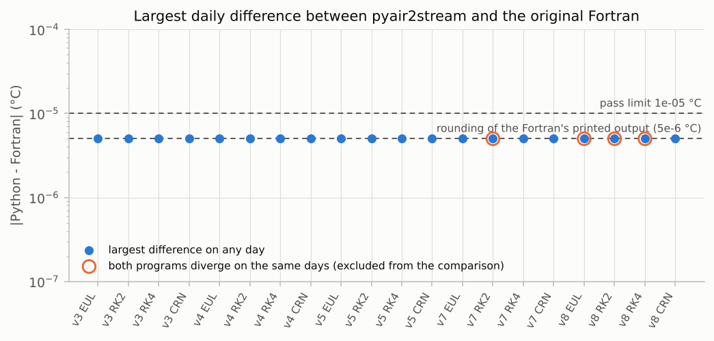

*Every model version and scheme agrees with the Fortran to the last digit the Fortran prints.*

**Full report: [reports/V1.md](reports/V1.md)**

## V2

### Reproduces published results

**Question.** Given the published parameters, does pyair2stream reproduce the published model errors for every model version? Does its own calibration fit at least as well, and find the published parameters? Do the published parameters lie inside pyair2stream's uncertainty intervals?

**Result: PASS.**

- (A) All 30 published RMSE values reproduced (largest difference 0.0005 °C).
- (B) DE matched or improved on the published calibration in 15 of 15 cases (mean difference -0.001 °C).
- (C) The recalibrated parameters match the published ones in 10 of 15 cases. Where they differ, the fits are within 0.012 °C of each other and the predictions for the validation years within 0.002 °C. The original program, scoring both sets itself, gives the same RMSE as pyair2stream (largest difference 0.000005 °C); where the parameters differ, it finds the recalibrated parameters the better fit in 4 of 5 cases, a tie (within 0.0001 °C) in 1.
- (D) The original program, run as distributed, reproduced the published parameters in all 3 runs in 7 of 15 cases; elsewhere its own runs differ from each other.
- (E) The published parameters are Crank-Nicolson parameters: with RK4 they diverge in 8 of 15 cases and give a different error in the rest. Calibrating with RK4 returns parameters within 1% of range of the published ones in 3 of 15 cases.
- (F) The published values lie inside pyair2stream's 90% intervals for 68 of 81 parameter values (cross-validation jackknife) and 76 of 81 (MCMC, converged runs); 76 of 81 lie inside at least one.

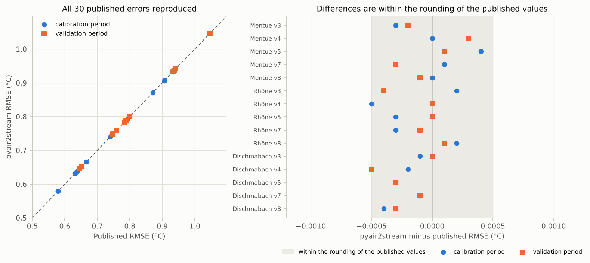

*Left: each point is one river, model version and period; all lie on the 1:1 line. Right: the differences, all within the rounding of the published three-decimal values (shaded).*

**Full report: [reports/V2.md](reports/V2.md)**

## V3

### Calibration recovers a known truth

**Question.** When the data really come from the model, does calibration find it, so that predictions for other years match the truth?

**Result: PASS.**

Correctly specified cases: prediction error against the truth 0.015-0.038 °C (noise level 0.5 °C). Mis-specified case (version 3 fitted to version-8 data): 0.517 °C.

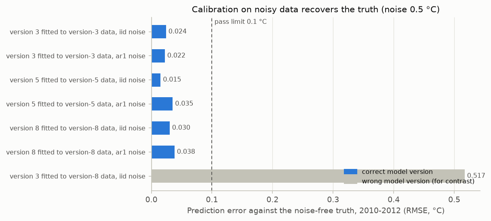

*With the correct model version, predictions for years not used in calibration are within a few hundredths of a degree of the truth, although the data had 0.5 °C of noise. The wrong version (grey) is shown for contrast.*

**Full report: [reports/V3.md](reports/V3.md)**

## V4

### Uncertainty intervals are calibrated

**Question.** Do the 90% prediction intervals contain about 90% of new observations, and do the parameter intervals contain the true parameters about 90% of the time?

**Result: PASS.**

A: prediction 90%, parameters 87%; B: prediction 89%, parameters 93%; C: prediction 89%, parameters 67%; D: prediction 90%, parameters 74%; E: prediction 89%, parameters 97%; F: prediction 90%, parameters 93%; G: prediction 89%, parameters 97%; H: prediction 90%, parameters 98%; I: prediction 90%, parameters 89%; J: prediction 91%, parameters 76%; K: prediction 89%, parameters 91%. At every level tested (50%, 80%, 90%, 95%, 99%), the correctly specified cases' mean prediction coverage was within 1.3 points of the level (largest difference: case B, 50% interval, 48.7%)

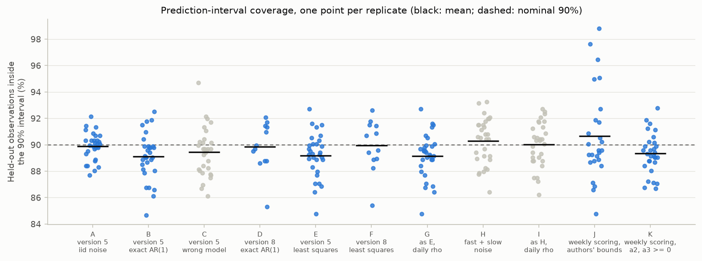

*Each point is one synthetic data set. Mean coverage is at the nominal 90% in every case, including the deliberately wrong noise model (grey): for single days the noise model hardly matters.*

**Full report: [reports/V4.md](reports/V4.md)**

## V5

### Predicts real rivers in years it was not calibrated on

**Question.** Calibrated on some years of real data, how well does the model predict other years, compared with simple alternatives? And do its 90% prediction intervals contain about 90% of what was actually measured?

**Result: FAIL.**

(A) Validation RMSE of the best version vs the best simple alternative: Dischmabach 0.65 vs 0.99 °C; Mentue 0.78 vs 1.48 °C; Rhône 0.74 vs 1.06 °C. (B) 24 of 24 MCMC runs converged; 90% interval coverage of real validation data 84.7%-89.6% (summer 83%-98%). Default error model at each level, share of validation days inside the interval: 50% interval 42.8%-52.9%; 80% interval 74.7%-79.4%; 90% interval 85.4%-89.3%; 95% interval 91.0%-95.1%; 99% interval 94.9%-99.5%. Outside the accepted range: Mentue version 5, 95% interval 91.4%; Mentue version 5, 99% interval 96.1%; Mentue version 8, 99% interval 96.5%; Rhône version 5, 95% interval 91.3%; Rhône version 5, 99% interval 96.8%; Rhône version 8, 95% interval 91.0%; Rhône version 8, 99% interval 94.9%. Outside the accepted 85%-95%: Rhône version 5 (iid noise) 84.91%; Rhône version 5 (AR(1), least squares, daily rho) 84.72%.

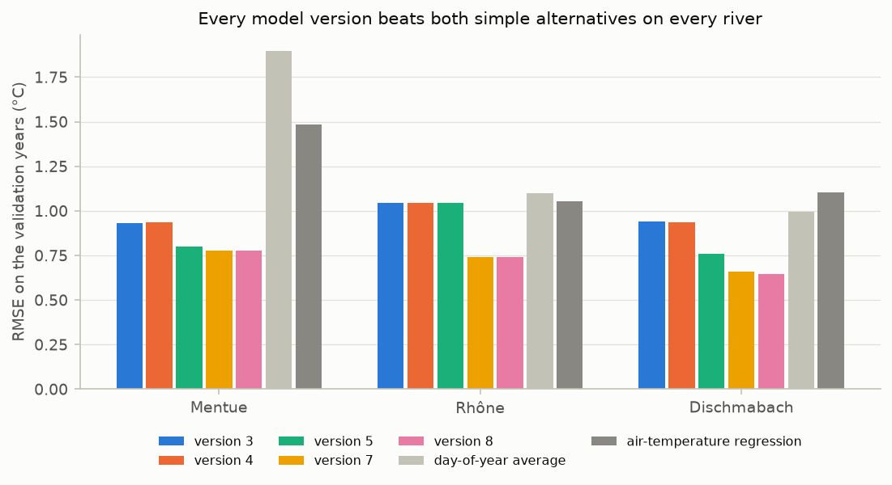

*Prediction error on years not used for calibration (lower is better). Coloured: the five model versions; grey: the two simple alternatives.*

**Full report: [reports/V5.md](reports/V5.md)**

## V6

### Numerical accuracy and warnings

**Question.** Are the numerical schemes solved correctly, how much do they differ on real data, does the package stop runs that go wrong, and would a different stable scheme change the calibrated model's predictions?

**Result: PASS.**

- (A) Largest error against the exact solution: 0.033 °C (schemes), 2e-13 °C (reference).
- (B) CRN differs from the reference by 0.04-0.10 °C RMS on real forcing; 26 explicit-scheme runs diverged and all were stopped.
- (C) Calibrating with EXP instead of CRN changes validation RMSE by at most 0.023 °C.

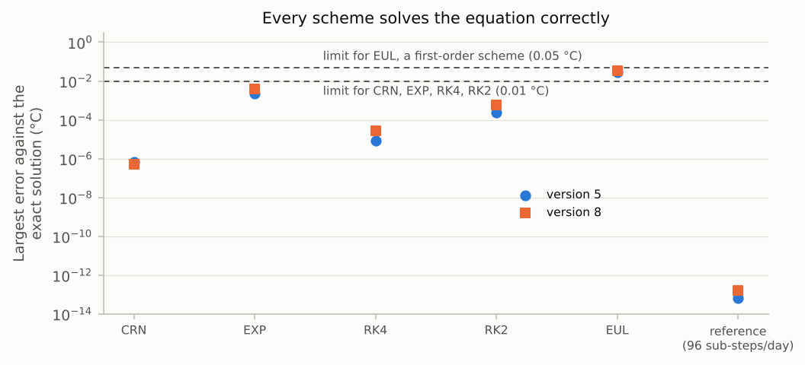

*Largest error of each scheme against the exact solution (log scale). All are within their limits; the reference solver used in part B is exact to rounding.*

**Full report: [reports/V6.md](reports/V6.md)**

## V7

### Missing data

**Question.** Do gaps in the water or air temperature record bias the calibrated model?

**Result: PASS.**

Prediction error against the truth 0.032-0.061 °C across 9 gap patterns (noise level 0.5 °C). Scattered air-temperature gaps in gap-tolerant mode leave only 927 of 2922 days scored.

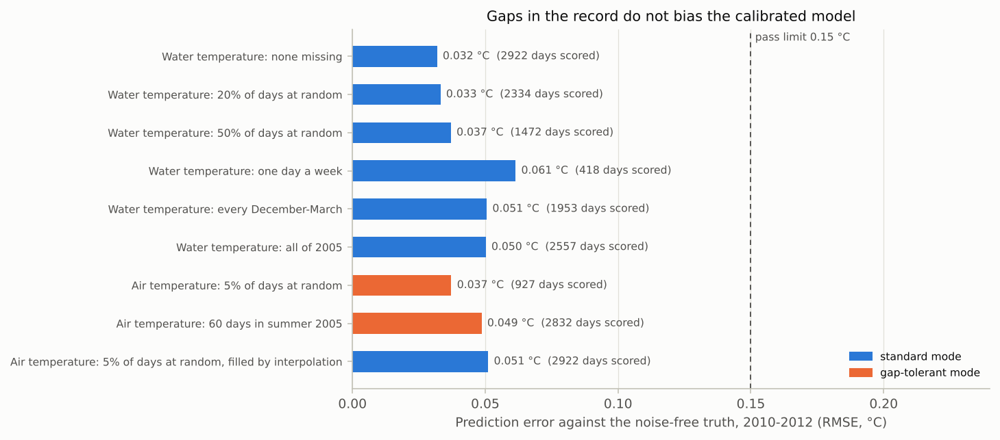

*Prediction error for each gap pattern, with the number of days left to score in calibration. All are well within the limit; scattered air-temperature gaps in gap-tolerant mode leave far fewer days to score.*

**Full report: [reports/V7.md](reports/V7.md)**

## V8

### Workflow and scenario tools give exact answers

**Question.** Does the documented workflow reproduce the calibration exactly, does a paired scenario comparison give the right answer, and do the threshold tools count correctly?

**Result: PASS.**

- (A) FORWARD reproduces the calibration output to 0e+00 °C.
- (B) Paired differences equal the exact effect to 1e-14 °C for every draw and day.
- (C) 0 disagreements in 32000 comparisons.

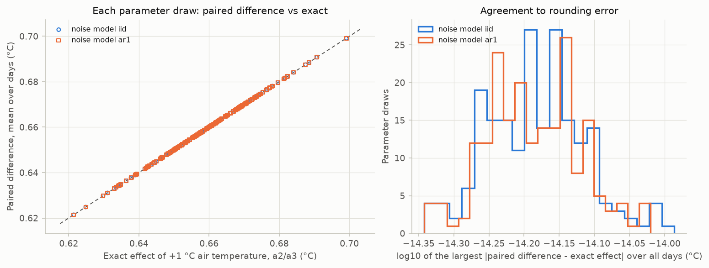

*Left: every draw's paired difference lies on the 1:1 line with its exact effect. Right: the largest disagreement on any day is at the level of computer rounding (about 1e-14 °C); the random error added to each draw cancels exactly.*

**Full report: [reports/V8.md](reports/V8.md)**

## V9

### Probabilities that a limit was exceeded

**Question.** When the package says there is a given chance that a yearly statistic (the highest daily mean, the highest 7-day mean, or the number of days above a threshold) exceeded a limit, does that happen as often as it says? And on real rivers, are these probabilities better than going by how often the limit was exceeded in past years?

**Result: FAIL.**

- (A) Synthetic data with AR(1) noise: the 90% ranges contained the measured yearly statistic 83%-96% of the time across versions and statistics, and the 50% ranges 36%-58%; the 80% and 95% ranges 78%-86% and 94%-98%. With fast + slow noise, 90% ranges held: weekly rho (default) 90%-94%; rho from consecutive days 80%-88%.
- (B) Real rivers, years not used for calibration, default settings: Brier skill score against the past-years alternative -0.01 to 0.43 (above 0: better); the 90% ranges contained the measured statistic in 80%-93% of river-years. With rho from consecutive days: 53%-87%.
- (C) With the correction from cross-validation of the calibration years, the 90% ranges contained the measured statistic in 73%-93% of river-years, and the Brier skill score was 0.11 to 0.50.

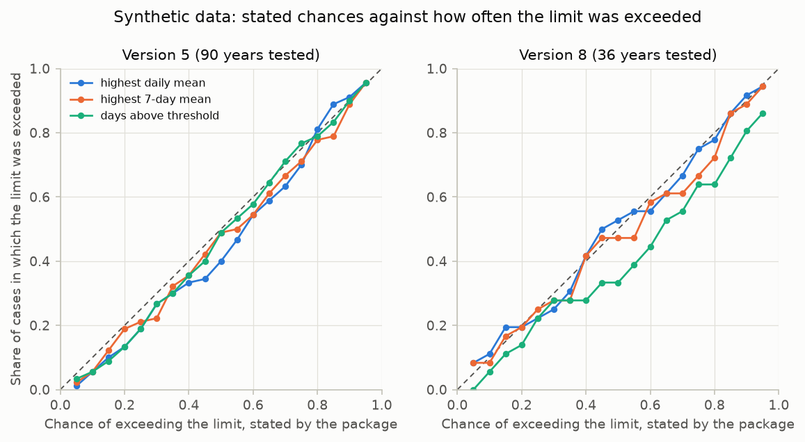

*For limits set at every level of the package's predicted distribution, the share of cases in which the measured statistic exceeded the limit, against the chance the package stated. Points on the dashed diagonal mean the stated chances are right.*

**Full report: [reports/V9.md](reports/V9.md)**

## V10

### Predicting warmer or lower-flow years than those calibrated on

**Question.** Calibrated only on the coolest (or highest-flow) years of a record, does the model still predict the warmest (or lowest-flow) years, when temperature limits are usually at stake? How much does extrapolating cost, and do the 90% intervals still hold?

**Result: FAIL.**

Calibrated on the opposite third of the years, the model predicted the warmest and the lowest-flow years better than both simple alternatives in 10 of 12 cases; extrapolating changed the RMSE by -0.02 to +0.07 °C compared with calibrating on the middle years, and the 90% intervals contained 84.7%-91.7% of the test years' measurements (MCMC did not converge within 20,000 steps for Rhône version 5, warm split, calibrated on the differential years (no intervals; counted as not meeting the criterion)).

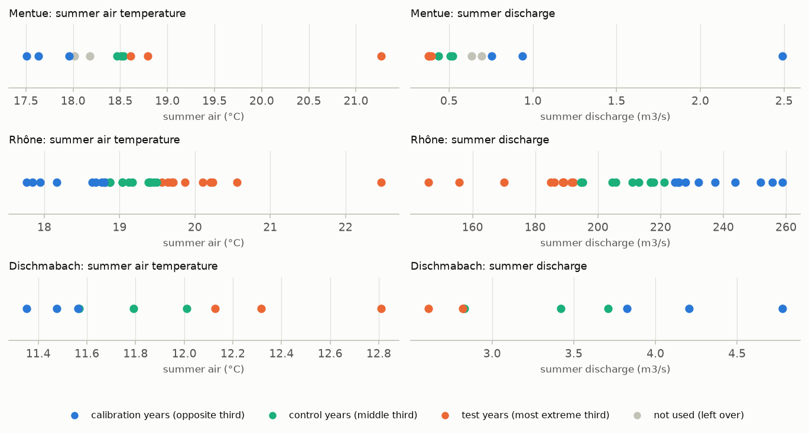

*The years of each river by summer air temperature (left) and summer discharge (right), and their role.*

**Full report: [reports/V10.md](reports/V10.md)**

## V11

### Cross-validated check and correction of yearly statistics

**Question.** Over many years not used for calibration, how often do the predicted ranges of yearly statistics (highest daily mean, highest 7-day mean, days above a threshold) contain the measured value? When they do not, why? And does the package's correction, estimated from other held-out years only, make the stated ranges hold?

**Result: PASS.**

Over 48 held-out river-years per version, the uncorrected 90% ranges held in 73%-92% of years (version 8: 79%-92%); after the cross-validated correction, in 85%-94% (version 8: 85%-94%), and the mean PIT moved from 0.31-0.52 to 0.48-0.50 (0.5: unbiased). 9 of 18 river, version and statistic combinations had a bias whose 95% confidence interval excludes zero. After the correction, the 80% ranges held in 75%-85%, the 95% ranges in 92%-100% and the 99% ranges in 100%-100% of held-out years.

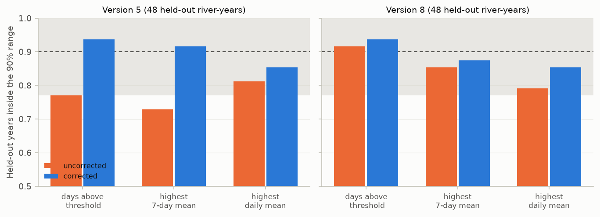

*Share of held-out years whose measured statistic lies inside the predicted 90% range, before (orange) and after (blue) the cross-validated correction. Dashed: 90%; shaded: the range expected by chance for this number of years.*

**Full report: [reports/V11.md](reports/V11.md)**

## V12

### Cross-validation design: what is hidden, and from which years

**Question.** Cross-validation hides a held-out year's measured water temperatures but keeps its air temperature and discharge, the model's inputs, from which the year is predicted. Would it report anything different if the inputs were hidden from the calibration too, if a buffer of days around the year were also left out, or if only earlier years were used for calibration?

**Result: PASS.**

Over 96 held-out river-years, hiding the inputs during calibration changed no year's RMSE by more than 0.007 °C (another optimizer seed alone: 0.007 °C), and the share of days inside the 90% interval from 90.1% to 90.1%; a 60-day buffer changed no year's RMSE by more than 0.008 °C. Calibrating on earlier years only gave, on its 78 years, an RMSE of 0.787 °C against 0.785 °C, 90% intervals that held on 87.1% of days against 89.6%, and a training-year sigma of 0.69 °C against 0.75 °C.

*Left: change in each held-out year's RMSE when the optimizer seed changes, when the year's inputs are hidden during calibration (against gap-tolerant mode with the inputs kept), with a 60-day buffer, and when only earlier years are used (shaded: ±0.05 °C). Right: share of held-out days inside the 90% interval, default against forward only, on the same years.*

**Full report: [reports/V12.md](reports/V12.md)**

## V13

### Reproduces the 2015 published results

**Question.** The first air2stream paper (Toffolon and Piccolroaz, 2015) published its own parameters and errors for the same three Swiss rivers, for versions 3, 4, 5, 7 and 8. Given those parameters, does pyair2stream reproduce the published errors, and with which numerical scheme? Does its own calibration with that scheme fit at least as well?

**Result: PASS.**

(A) With RK4, 15 of 15 parameter sets reproduce both published RMSE values within their rounding (largest difference 0.0058 °C); with Crank-Nicolson the differences reach 0.323 °C. (B) DE with RK4 fits the calibration years at least as well as the published parameters in 15 of 15 cases, and returns the published parameters (each within 1% of its range) in 15 of 15.

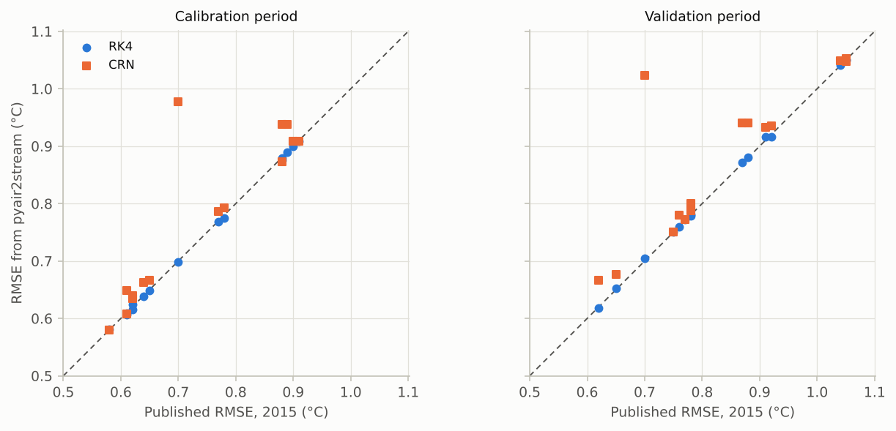

*RMSE of the 2015 published parameters computed by pyair2stream against the published values, with RK4 (blue) and Crank-Nicolson (orange). On the dashed line they agree.*

**Full report: [reports/V13.md](reports/V13.md)**

## V14

### Prediction intervals on the hottest days

**Question.** Limits are breached on the hottest days. In years the model was not calibrated on, do the prediction intervals hold on the days predicted to be hottest, and on the days with the hottest air, as well as they do on average?

**Result: FAIL.**

Share of held-out daily measurements inside the 90% interval, pooled over the rivers: version 5: all days 89.9%, hottest 10% by prediction 84.1%, by air temperature 83.0%, summer 90.4%; version 8: all days 90.3%, hottest 10% by prediction 90.6%, by air temperature 91.3%, summer 91.9%. On the hottest days chosen by their measured temperature, the measurement lay above the 90% interval on 23.1%, 15.8% and below it on 0.1%, 1.1% of days (version 5, 8); a perfect model gives 14.5% above and 0.4% below, 21.5% above and 0.4% below on the days it would choose this way (5% each on fairly chosen days).

*Share of held-out daily measurements inside the interval at each stated level, by subset of days. On the grey diagonal the interval holds. Days chosen by their measured temperature (dashed) are a biased selection: even a perfect model (dotted) departs from the diagonal there.*

**Full report: [reports/V14.md](reports/V14.md)**

## V15

### Reproduces an independent group's published simulations (British Columbia)

**Question.** Callahan and Moore (2025) calibrated air2stream's 8-parameter version for 23 streams in British Columbia and published their parameters, inputs and simulated water temperatures. Given the same parameters and inputs, does pyair2stream compute the same daily water temperatures? Do the published errors, including those of the 2021 heat dome and the 2022 autumn drought, follow? Does pyair2stream's own calibration fit at least as well?

**Result: PASS.**

- (A) Of 46 published series (23 stations, two periods), the 45 whose record starts on 1 January are reproduced to within 0.00013 °C on every day. Station 08GA077's calibration record starts on 2012-11-01: with its dates, pyair2stream's simulation differs from the published one by up to 3.29 °C; read by row as if it started on 1 January, as the original program reads it, it is reproduced to within 0.00001 °C. The published simulation of that period therefore has its seasonal term 10 months out of phase.
- (C) DE fits the calibration years at least as well as the published parameters at 23 of 23 stations (mean difference -0.089 °C), and returns the published parameters (each within 1% of its range) at 0 of 23.
- (D) The published values lie inside pyair2stream's 90% parameter intervals for 115 of 128 (MCMC, converged runs) and 49 of 184 (jackknife); 132 of 184 lie inside at least one.

![Left: largest difference between pyair2stream's simulation and each published simulation, with the published parameters (dashed: 0.001 °C). Blue: records starting on 1 January. Orange: the record that does not, run with its dates (filled) and read by row from 1 January as the original program reads it (open). Right: RMSE in the paper's heat-dome and drought windows, published simulation against pyair2stream's; a point off the line is the misread record, run by pyair2stream with its correct dates.](figures/V15_british_columbia.png)

*Left: largest difference between pyair2stream's simulation and each published simulation, with the published parameters (dashed: 0.001 °C). Blue: records starting on 1 January. Orange: the record that does not, run with its dates (filled) and read by row from 1 January as the original program reads it (open). Right: RMSE in the paper's heat-dome and drought windows, published simulation against pyair2stream's; a point off the line is the misread record, run by pyair2stream with its correct dates.*

**Full report: [reports/V15.md](reports/V15.md)**

## V16

### How many years of data a calibration needs

**Question.** How long must a record be before the calibrated model predicts other years about as well as a calibration on a long record does?

**Result: PASS.**

Version 8, median RMSE on the later years: Dischmabach 1 year 0.69 (worst 0.75); 3 years 0.65; whole period 0.65 · Mentue 1 year 0.82 (worst 0.85); 3 years 0.79; whole period 0.78 · Rhône 1 year 0.80 (worst 0.91); 3 years 0.77; whole period 0.74 °C. With 3 or more years, version 8's median was within +0.034 °C of the whole period's (worst single placement +0.08 °C).

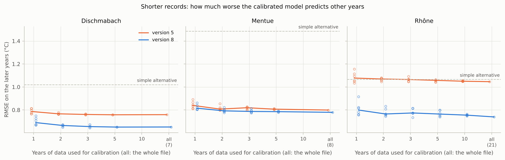

*Each circle is one calibration on a window of consecutive years; the line joins the medians (blue: version 8; orange: version 5). Grey dashed: the best simple alternative, fitted on the same years (median). Every calibration predicts the same later years.*

**Full report: [reports/V16.md](reports/V16.md)**

## V17

### Is the model better than a simple regression?

**Question.** Does air2stream predict years it was not calibrated on better than regressions of water temperature on air temperature, fitted on the same years?

**Result: PASS.**

Switzerland: version 8 beat every regression on 3 of 3 rivers; median daily RMSE 0.74 °C against 0.89 °C for the best regression; British Columbia: version 8 beat every regression on 20 of 23 rivers; median daily RMSE 0.96 °C against 1.17 °C for the best regression.

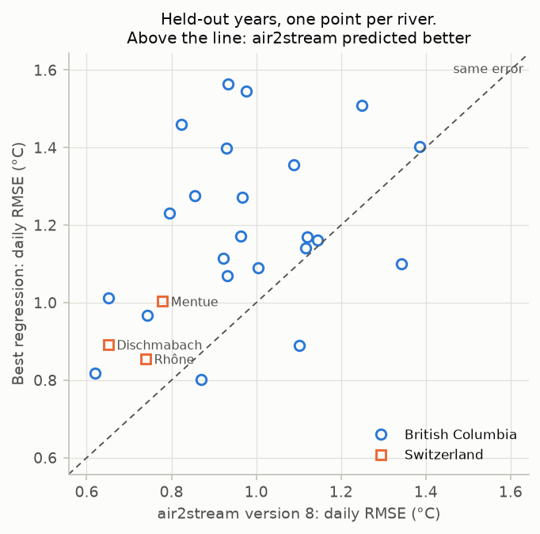

*Daily RMSE on the held-out years: air2stream version 8 (across) against the regression that did best on that river (up). Points above the dashed line: air2stream predicted better.*

**Full report: [reports/V17.md](reports/V17.md)**
