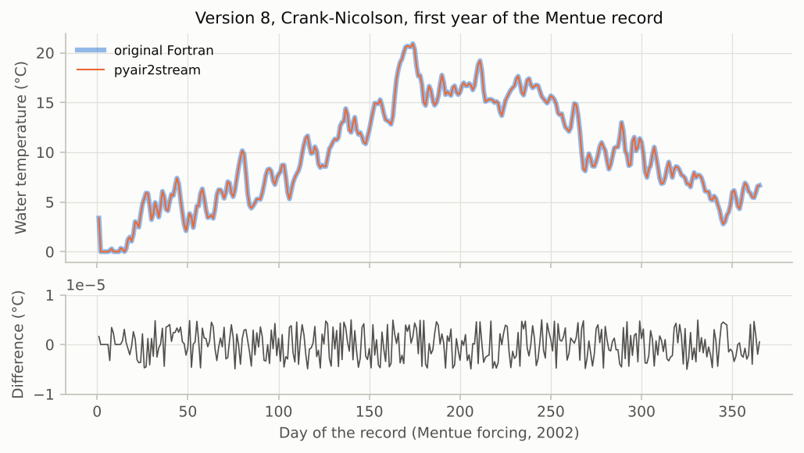
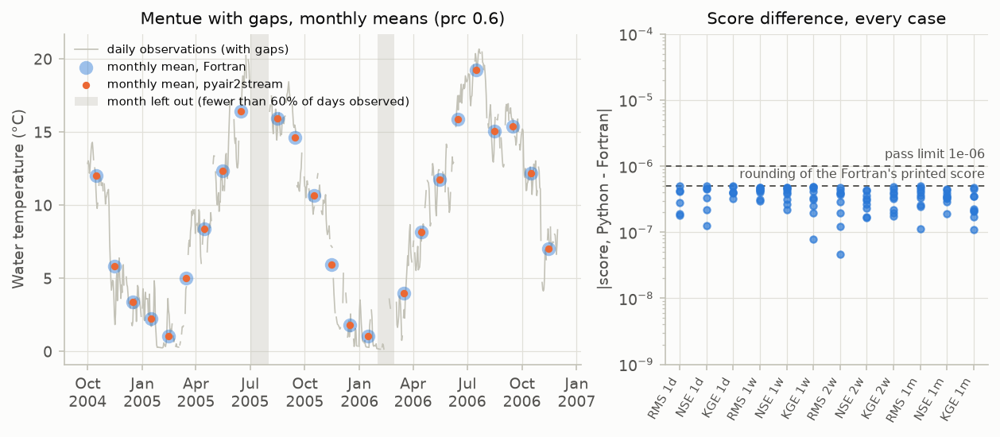

# V1. Same results as the original Fortran

[Validation summary](../REPORT.md) · pyair2stream 0.4.2, commit 7da512e, 2026-10-05 15:45 UTC · run time 0.2 minutes

**Result: PASS.**

(A) All 20 version × integrator cases agree to within 5.0e-06 °C; in 4 cases (explicit integrators) both programs diverge on the same days with these parameters, which were calibrated with CRN (see V6). (B) In all 99 combinations of river, record, objective, time resolution and prc, both programs score the same weeks or months and give the same score (largest difference 5e-07) and averages (largest difference 5e-06 °C), with and without gaps.

## Question

Does pyair2stream compute the same daily water temperatures as the original Fortran air2stream when both are given real, variable inputs? And does it compute the same calibration score, from the same weekly and monthly averages, including when the record has gaps?

## Method

The Fortran source (git submodule) is compiled with gfortran.

- (A) For each model version and each integrator the Fortran implements, both programs simulate the Mentue calibration record (8 years of real air temperature and discharge) with the published parameters (Piccolroaz et al., 2016). Daily outputs are compared.
- (B) For each river, both programs score the published version 8 parameters (FORWARD mode) on the calibration and validation records, with each objective (RMS, NSE, KGE) and time resolution (daily, 1 week, 2 weeks, 1 month). This is done on the records as distributed and on copies with deliberate gaps in the water temperature (15% of days at random, ten days in a row, a whole month, a month with 55% of its days and one with 70%), with the share of days a week or month needs (prc) set to 0.6 and 0.9. Each program reads the same values from its own input format. The scores and the weekly or monthly averages each program writes are compared.

## Pass criterion

(A) On every day where both stay below 100 °C, they differ by at most 1e-05 °C; and they diverge (exceed it) on exactly the same days. (B) In every case the same weeks or months are scored, the scores differ by at most 1e-06 and the averages by at most 1e-05 °C (the precision of the Fortran's printed output).

## Results

### A. Python and Fortran, day by day

Both programs simulated the same eight years of real Mentue forcing with the published parameters. The figures show the largest daily difference in each case and, for the full model with the default scheme, the two simulations themselves.

*Every model version and scheme agrees with the Fortran to the last digit the Fortran prints.*

*The two simulations lie on top of each other; their difference (lower panel) is below 0.00001 °C every day.*

**A. Python vs Fortran, Mentue 2002-2009, published parameters** ([csv](../results/V1_1.csv))

| version | integrator | days compared | days diverged (Python) | days diverged (Fortran) | same divergence days | max \|difference\| (°C) |
|---|---|---|---|---|---|---|
| 3 | EUL | 2922 | 0 | 0 | yes | 4.997e-06 |
| 3 | RK2 | 2922 | 0 | 0 | yes | 4.999e-06 |
| 3 | RK4 | 2922 | 0 | 0 | yes | 5e-06 |
| 3 | CRN | 2922 | 0 | 0 | yes | 4.996e-06 |
| 4 | EUL | 2922 | 0 | 0 | yes | 5e-06 |
| 4 | RK2 | 2922 | 0 | 0 | yes | 4.999e-06 |
| 4 | RK4 | 2922 | 0 | 0 | yes | 4.999e-06 |
| 4 | CRN | 2922 | 0 | 0 | yes | 5e-06 |
| 5 | EUL | 2922 | 0 | 0 | yes | 5e-06 |
| 5 | RK2 | 2922 | 0 | 0 | yes | 4.996e-06 |
| 5 | RK4 | 2922 | 0 | 0 | yes | 4.993e-06 |
| 5 | CRN | 2922 | 0 | 0 | yes | 4.999e-06 |
| 7 | EUL | 2922 | 0 | 0 | yes | 4.999e-06 |
| 7 | RK2 | 2920 | 2 | 2 | yes | 4.999e-06 |
| 7 | RK4 | 2922 | 0 | 0 | yes | 4.998e-06 |
| 7 | CRN | 2922 | 0 | 0 | yes | 5e-06 |
| 8 | EUL | 2921 | 1 | 1 | yes | 5e-06 |
| 8 | RK2 | 2662 | 260 | 260 | yes | 4.999e-06 |
| 8 | RK4 | 2849 | 73 | 73 | yes | 4.998e-06 |
| 8 | CRN | 2922 | 0 | 0 | yes | 4.997e-06 |

### B. Scores and weekly and monthly averages

Calibration maximises a score computed from daily values or from weekly or monthly averages. A week or month is averaged only if at least the share prc of its days have an observation; otherwise it is left out. Both programs scored the same parameters on the same data, with and without deliberate gaps. 'Blocks scored' counts the days, weeks or months that enter the score.

*Left: with gaps in the record, both programs average the same months and leave out the same ones (shaded). Right: the largest difference in the score, for every river, record and prc, is within the rounding of the Fortran's printed output.*

**B. Scores and averages, pyair2stream vs Fortran (published version 8 parameters)** ([csv](../results/V1_2.csv))

| river | record | objective | time resolution | prc | calibration: blocks scored | calibration: score, Fortran | calibration: score, pyair2stream | validation: blocks scored | validation: score, Fortran | validation: score, pyair2stream | same weeks or months scored | largest score difference | largest average difference (°C) |
|---|---|---|---|---|---|---|---|---|---|---|---|---|---|
| Mentue | as distributed | RMS | 1d |  | 2907 | -0.645 | -0.645 | 1095 | -0.7879 | -0.7879 | yes | 1.924e-07 | 4.994e-06 |
| Mentue | as distributed | RMS | 1w | 0.6 | 415 | -0.4931 | -0.4931 | 156 | -0.6101 | -0.6101 | yes | 4.403e-07 | 4.994e-06 |
| Mentue | as distributed | RMS | 2w | 0.6 | 208 | -0.4218 | -0.4218 | 78 | -0.5223 | -0.5223 | yes | 4.326e-07 | 4.926e-06 |
| Mentue | as distributed | RMS | 1m | 0.6 | 95 | -0.3642 | -0.3642 | 36 | -0.4402 | -0.4402 | yes | 3.309e-07 | 4.976e-06 |
| Mentue | as distributed | NSE | 1d |  | 2907 | 0.9875 | 0.9875 | 1095 | 0.982 | 0.982 | yes | 4.587e-07 | 4.994e-06 |
| Mentue | as distributed | NSE | 1w | 0.6 | 415 | 0.9925 | 0.9925 | 156 | 0.9889 | 0.9889 | yes | 3.111e-07 | 4.994e-06 |
| Mentue | as distributed | NSE | 2w | 0.6 | 208 | 0.9944 | 0.9944 | 78 | 0.9916 | 0.9916 | yes | 1.682e-07 | 4.926e-06 |
| Mentue | as distributed | NSE | 1m | 0.6 | 95 | 0.9956 | 0.9956 | 36 | 0.9937 | 0.9937 | yes | 3.547e-07 | 4.976e-06 |
| Mentue | as distributed | KGE | 1d |  | 2907 | 0.9927 | 0.9927 | 1095 | 0.9622 | 0.9622 | yes | 3.998e-07 | 4.994e-06 |
| Mentue | as distributed | KGE | 1w | 0.6 | 415 | 0.9925 | 0.9925 | 156 | 0.9592 | 0.9592 | yes | 4.85e-07 | 4.994e-06 |
| Mentue | as distributed | KGE | 2w | 0.6 | 208 | 0.991 | 0.991 | 78 | 0.9592 | 0.9592 | yes | 1.969e-07 | 4.926e-06 |
| Mentue | as distributed | KGE | 1m | 0.6 | 95 | 0.9936 | 0.9936 | 36 | 0.957 | 0.957 | yes | 1.717e-07 | 4.976e-06 |
| Mentue | with gaps | RMS | 1d |  | 2418 | -0.6451 | -0.6451 | 919 | -0.8052 | -0.8052 | yes | 2.77e-07 | 4.994e-06 |
| Mentue | with gaps | RMS | 1w | 0.6 | 369 | -0.507 | -0.507 | 140 | -0.6334 | -0.6334 | yes | 4.709e-07 | 4.996e-06 |
| Mentue | with gaps | RMS | 1w | 0.9 | 137 | -0.4998 | -0.4998 | 52 | -0.6387 | -0.6387 | yes | 4.425e-07 | 4.954e-06 |
| Mentue | with gaps | RMS | 2w | 0.6 | 196 | -0.4236 | -0.4236 | 74 | -0.5288 | -0.5288 | yes | 3.858e-07 | 4.978e-06 |
| Mentue | with gaps | RMS | 2w | 0.9 | 72 | -0.4048 | -0.4048 | 32 | -0.522 | -0.522 | yes | 4.618e-08 | 4.775e-06 |
| Mentue | with gaps | RMS | 1m | 0.6 | 91 | -0.3661 | -0.3661 | 35 | -0.4426 | -0.4426 | yes | 1.131e-07 | 5e-06 |
| Mentue | with gaps | RMS | 1m | 0.9 | 29 | -0.3876 | -0.3876 | 12 | -0.4622 | -0.4622 | yes | 2.581e-07 | 4.954e-06 |
| Mentue | with gaps | NSE | 1d |  | 2418 | 0.9874 | 0.9874 | 919 | 0.9808 | 0.9808 | yes | 2.179e-07 | 4.994e-06 |
| Mentue | with gaps | NSE | 1w | 0.6 | 369 | 0.9918 | 0.9918 | 140 | 0.9876 | 0.9876 | yes | 3.84e-07 | 4.996e-06 |
| Mentue | with gaps | NSE | 1w | 0.9 | 137 | 0.9927 | 0.9927 | 52 | 0.9881 | 0.9881 | yes | 2.639e-07 | 4.954e-06 |
| Mentue | with gaps | NSE | 2w | 0.6 | 196 | 0.9942 | 0.9942 | 74 | 0.9912 | 0.9912 | yes | 4.229e-07 | 4.978e-06 |
| Mentue | with gaps | NSE | 2w | 0.9 | 72 | 0.9949 | 0.9949 | 32 | 0.9912 | 0.9912 | yes | 2.291e-07 | 4.775e-06 |
| Mentue | with gaps | NSE | 1m | 0.6 | 91 | 0.9954 | 0.9954 | 35 | 0.9935 | 0.9935 | yes | 3.866e-07 | 5e-06 |
| Mentue | with gaps | NSE | 1m | 0.9 | 29 | 0.9951 | 0.9951 | 12 | 0.9917 | 0.9917 | yes | 3.347e-07 | 4.954e-06 |
| Mentue | with gaps | KGE | 1d |  | 2418 | 0.9932 | 0.9932 | 919 | 0.9586 | 0.9586 | yes | 4.956e-07 | 4.994e-06 |
| Mentue | with gaps | KGE | 1w | 0.6 | 369 | 0.9941 | 0.9941 | 140 | 0.9565 | 0.9565 | yes | 4.148e-07 | 4.996e-06 |
| Mentue | with gaps | KGE | 1w | 0.9 | 137 | 0.9937 | 0.9937 | 52 | 0.9595 | 0.9595 | yes | 1.944e-07 | 4.954e-06 |
| Mentue | with gaps | KGE | 2w | 0.6 | 196 | 0.9931 | 0.9931 | 74 | 0.9557 | 0.9557 | yes | 4.889e-07 | 4.978e-06 |
| Mentue | with gaps | KGE | 2w | 0.9 | 72 | 0.9935 | 0.9935 | 32 | 0.9613 | 0.9613 | yes | 4.453e-07 | 4.775e-06 |
| Mentue | with gaps | KGE | 1m | 0.6 | 91 | 0.995 | 0.995 | 35 | 0.9532 | 0.9532 | yes | 2.07e-07 | 5e-06 |
| Mentue | with gaps | KGE | 1m | 0.9 | 29 | 0.9917 | 0.9917 | 12 | 0.9515 | 0.9515 | yes | 2.145e-07 | 4.954e-06 |
| Rhône | as distributed | RMS | 1d |  | 7671 | -0.5792 | -0.5792 | 3260 | -0.7481 | -0.7481 | yes | 4.305e-07 | 5e-06 |
| Rhône | as distributed | RMS | 1w | 0.6 | 1096 | -0.4484 | -0.4484 | 466 | -0.6178 | -0.6178 | yes | 2.933e-07 | 4.999e-06 |
| Rhône | as distributed | RMS | 2w | 0.6 | 548 | -0.409 | -0.409 | 233 | -0.5742 | -0.5742 | yes | 3.906e-07 | 4.995e-06 |
| Rhône | as distributed | RMS | 1m | 0.6 | 252 | -0.3621 | -0.3621 | 107 | -0.5225 | -0.5225 | yes | 2.464e-07 | 4.991e-06 |
| Rhône | as distributed | NSE | 1d |  | 7671 | 0.9247 | 0.9247 | 3260 | 0.8941 | 0.8941 | yes | 1.265e-07 | 5e-06 |
| Rhône | as distributed | NSE | 1w | 0.6 | 1096 | 0.9513 | 0.9513 | 466 | 0.9214 | 0.9214 | yes | 4.634e-07 | 4.999e-06 |
| Rhône | as distributed | NSE | 2w | 0.6 | 548 | 0.9582 | 0.9582 | 233 | 0.9296 | 0.9296 | yes | 3.027e-07 | 4.995e-06 |
| Rhône | as distributed | NSE | 1m | 0.6 | 252 | 0.9654 | 0.9654 | 107 | 0.9369 | 0.9369 | yes | 4.447e-07 | 4.991e-06 |
| Rhône | as distributed | KGE | 1d |  | 7671 | 0.9459 | 0.9459 | 3260 | 0.9011 | 0.9011 | yes | 3.217e-07 | 5e-06 |
| Rhône | as distributed | KGE | 1w | 0.6 | 1096 | 0.9668 | 0.9668 | 466 | 0.9243 | 0.9243 | yes | 3.121e-07 | 4.999e-06 |
| Rhône | as distributed | KGE | 2w | 0.6 | 548 | 0.9718 | 0.9718 | 233 | 0.9304 | 0.9304 | yes | 3.366e-07 | 4.995e-06 |
| Rhône | as distributed | KGE | 1m | 0.6 | 252 | 0.9761 | 0.9761 | 107 | 0.9383 | 0.9383 | yes | 1.106e-07 | 4.991e-06 |
| Rhône | with gaps | RMS | 1d |  | 6476 | -0.5793 | -0.5793 | 2719 | -0.748 | -0.748 | yes | 4.96e-07 | 5e-06 |
| Rhône | with gaps | RMS | 1w | 0.6 | 1003 | -0.4508 | -0.4508 | 416 | -0.6094 | -0.6094 | yes | 4.228e-07 | 4.997e-06 |
| Rhône | with gaps | RMS | 1w | 0.9 | 361 | -0.4274 | -0.4274 | 148 | -0.51 | -0.51 | yes | 4.05e-07 | 4.99e-06 |
| Rhône | with gaps | RMS | 2w | 0.6 | 533 | -0.4114 | -0.4114 | 223 | -0.5716 | -0.5716 | yes | 1.964e-07 | 4.989e-06 |
| Rhône | with gaps | RMS | 2w | 0.9 | 203 | -0.3784 | -0.3784 | 88 | -0.5062 | -0.5062 | yes | 2.877e-07 | 4.981e-06 |
| Rhône | with gaps | RMS | 1m | 0.6 | 249 | -0.3687 | -0.3687 | 105 | -0.5259 | -0.5259 | yes | 3.604e-07 | 5e-06 |
| Rhône | with gaps | RMS | 1m | 0.9 | 80 | -0.3498 | -0.3498 | 35 | -0.4821 | -0.4821 | yes | 4.987e-07 | 4.935e-06 |
| Rhône | with gaps | NSE | 1d |  | 6476 | 0.925 | 0.925 | 2719 | 0.8955 | 0.8955 | yes | 3.341e-07 | 5e-06 |
| Rhône | with gaps | NSE | 1w | 0.6 | 1003 | 0.9508 | 0.9508 | 416 | 0.9237 | 0.9237 | yes | 4.757e-07 | 4.997e-06 |
| Rhône | with gaps | NSE | 1w | 0.9 | 361 | 0.9572 | 0.9572 | 148 | 0.9509 | 0.9509 | yes | 4.341e-07 | 4.99e-06 |
| Rhône | with gaps | NSE | 2w | 0.6 | 533 | 0.9577 | 0.9577 | 223 | 0.9317 | 0.9317 | yes | 1.648e-07 | 4.989e-06 |
| Rhône | with gaps | NSE | 2w | 0.9 | 203 | 0.9648 | 0.9648 | 88 | 0.946 | 0.946 | yes | 4.374e-07 | 4.981e-06 |
| Rhône | with gaps | NSE | 1m | 0.6 | 249 | 0.9642 | 0.9642 | 105 | 0.9365 | 0.9365 | yes | 2.856e-07 | 5e-06 |
| Rhône | with gaps | NSE | 1m | 0.9 | 80 | 0.9668 | 0.9668 | 35 | 0.9474 | 0.9474 | yes | 1.904e-07 | 4.935e-06 |
| Rhône | with gaps | KGE | 1d |  | 6476 | 0.9474 | 0.9474 | 2719 | 0.9 | 0.9 | yes | 4.065e-07 | 5e-06 |
| Rhône | with gaps | KGE | 1w | 0.6 | 1003 | 0.9672 | 0.9672 | 416 | 0.9231 | 0.9231 | yes | 4.68e-07 | 4.997e-06 |
| Rhône | with gaps | KGE | 1w | 0.9 | 361 | 0.976 | 0.976 | 148 | 0.9227 | 0.9227 | yes | 3.327e-07 | 4.99e-06 |
| Rhône | with gaps | KGE | 2w | 0.6 | 533 | 0.9725 | 0.9725 | 223 | 0.9246 | 0.9246 | yes | 3.77e-07 | 4.989e-06 |
| Rhône | with gaps | KGE | 2w | 0.9 | 203 | 0.9808 | 0.9808 | 88 | 0.9367 | 0.9367 | yes | 2.211e-07 | 4.981e-06 |
| Rhône | with gaps | KGE | 1m | 0.6 | 249 | 0.976 | 0.976 | 105 | 0.9371 | 0.9371 | yes | 3.499e-07 | 5e-06 |
| Rhône | with gaps | KGE | 1m | 0.9 | 80 | 0.9824 | 0.9824 | 35 | 0.9122 | 0.9122 | yes | 4.696e-07 | 4.935e-06 |
| Dischmabach | as distributed | RMS | 1d |  | 2197 | -0.6316 | -0.6316 | 1095 | -0.6457 | -0.6457 | yes | 1.789e-07 | 4.998e-06 |
| Dischmabach | as distributed | RMS | 1w | 0.6 | 313 | -0.488 | -0.488 | 156 | -0.5121 | -0.5121 | yes | 4.78e-07 | 4.992e-06 |
| Dischmabach | as distributed | RMS | 2w | 0.6 | 157 | -0.4234 | -0.4234 | 78 | -0.4439 | -0.4439 | yes | 4.694e-07 | 4.996e-06 |
| Dischmabach | as distributed | RMS | 1m | 0.6 | 72 | -0.3629 | -0.3629 | 36 | -0.3877 | -0.3877 | yes | 4.742e-07 | 4.981e-06 |
| Dischmabach | as distributed | NSE | 1d |  | 2197 | 0.9519 | 0.9519 | 1095 | 0.9492 | 0.9492 | yes | 4.431e-07 | 4.998e-06 |
| Dischmabach | as distributed | NSE | 1w | 0.6 | 313 | 0.9698 | 0.9698 | 156 | 0.9664 | 0.9664 | yes | 4.057e-07 | 4.992e-06 |
| Dischmabach | as distributed | NSE | 2w | 0.6 | 157 | 0.9767 | 0.9767 | 78 | 0.9738 | 0.9738 | yes | 3.231e-07 | 4.996e-06 |
| Dischmabach | as distributed | NSE | 1m | 0.6 | 72 | 0.9821 | 0.9821 | 36 | 0.979 | 0.979 | yes | 3.468e-07 | 4.981e-06 |
| Dischmabach | as distributed | KGE | 1d |  | 2197 | 0.9731 | 0.9731 | 1095 | 0.9594 | 0.9594 | yes | 4.893e-07 | 4.998e-06 |
| Dischmabach | as distributed | KGE | 1w | 0.6 | 313 | 0.9803 | 0.9803 | 156 | 0.9629 | 0.9629 | yes | 2.497e-07 | 4.992e-06 |
| Dischmabach | as distributed | KGE | 2w | 0.6 | 157 | 0.9831 | 0.9831 | 78 | 0.9646 | 0.9646 | yes | 3.247e-07 | 4.996e-06 |
| Dischmabach | as distributed | KGE | 1m | 0.6 | 72 | 0.9848 | 0.9848 | 36 | 0.9657 | 0.9657 | yes | 2.271e-07 | 4.981e-06 |
| Dischmabach | with gaps | RMS | 1d |  | 1831 | -0.6322 | -0.6322 | 919 | -0.6384 | -0.6384 | yes | 4.076e-07 | 4.998e-06 |
| Dischmabach | with gaps | RMS | 1w | 0.6 | 277 | -0.4934 | -0.4934 | 140 | -0.5242 | -0.5242 | yes | 3.166e-07 | 4.994e-06 |
| Dischmabach | with gaps | RMS | 1w | 0.9 | 110 | -0.4756 | -0.4756 | 52 | -0.4833 | -0.4833 | yes | 4.666e-07 | 4.972e-06 |
| Dischmabach | with gaps | RMS | 2w | 0.6 | 147 | -0.4335 | -0.4335 | 74 | -0.4426 | -0.4426 | yes | 1.207e-07 | 4.996e-06 |
| Dischmabach | with gaps | RMS | 2w | 0.9 | 53 | -0.3637 | -0.3637 | 32 | -0.4022 | -0.4022 | yes | 3.683e-07 | 4.996e-06 |
| Dischmabach | with gaps | RMS | 1m | 0.6 | 69 | -0.3699 | -0.3699 | 35 | -0.3767 | -0.3767 | yes | 4.023e-07 | 5e-06 |
| Dischmabach | with gaps | RMS | 1m | 0.9 | 26 | -0.3612 | -0.3612 | 12 | -0.3138 | -0.3138 | yes | 4.344e-07 | 4.956e-06 |
| Dischmabach | with gaps | NSE | 1d |  | 1831 | 0.9504 | 0.9504 | 919 | 0.9479 | 0.9479 | yes | 4.949e-07 | 4.998e-06 |
| Dischmabach | with gaps | NSE | 1w | 0.6 | 277 | 0.9676 | 0.9676 | 140 | 0.9627 | 0.9627 | yes | 4.727e-07 | 4.994e-06 |
| Dischmabach | with gaps | NSE | 1w | 0.9 | 110 | 0.9731 | 0.9731 | 52 | 0.9703 | 0.9703 | yes | 2.205e-07 | 4.972e-06 |
| Dischmabach | with gaps | NSE | 2w | 0.6 | 147 | 0.9749 | 0.9749 | 74 | 0.9721 | 0.9721 | yes | 3.633e-07 | 4.996e-06 |
| Dischmabach | with gaps | NSE | 2w | 0.9 | 53 | 0.9828 | 0.9828 | 32 | 0.9757 | 0.9757 | yes | 2.658e-07 | 4.996e-06 |
| Dischmabach | with gaps | NSE | 1m | 0.6 | 69 | 0.9807 | 0.9807 | 35 | 0.9789 | 0.9789 | yes | 4.372e-07 | 5e-06 |
| Dischmabach | with gaps | NSE | 1m | 0.9 | 26 | 0.9809 | 0.9809 | 12 | 0.9817 | 0.9817 | yes | 3.233e-07 | 4.956e-06 |
| Dischmabach | with gaps | KGE | 1d |  | 1831 | 0.9718 | 0.9718 | 919 | 0.9575 | 0.9575 | yes | 3.928e-07 | 4.998e-06 |
| Dischmabach | with gaps | KGE | 1w | 0.6 | 277 | 0.9767 | 0.9767 | 140 | 0.9576 | 0.9576 | yes | 4.873e-07 | 4.994e-06 |
| Dischmabach | with gaps | KGE | 1w | 0.9 | 110 | 0.9661 | 0.9661 | 52 | 0.9563 | 0.9563 | yes | 7.926e-08 | 4.972e-06 |
| Dischmabach | with gaps | KGE | 2w | 0.6 | 147 | 0.9825 | 0.9825 | 74 | 0.962 | 0.962 | yes | 1.751e-07 | 4.996e-06 |
| Dischmabach | with gaps | KGE | 2w | 0.9 | 53 | 0.9793 | 0.9793 | 32 | 0.9459 | 0.9459 | yes | 4.062e-07 | 4.996e-06 |
| Dischmabach | with gaps | KGE | 1m | 0.6 | 69 | 0.984 | 0.984 | 35 | 0.9636 | 0.9636 | yes | 4.548e-07 | 5e-06 |
| Dischmabach | with gaps | KGE | 1m | 0.9 | 26 | 0.9817 | 0.9817 | 12 | 0.9782 | 0.9782 | yes | 3.542e-07 | 4.956e-06 |

## What this means

Part B: the two programs agree on which weeks and months have enough data, on their averages and on the score, so a calibration at weekly or monthly resolution optimises the same quantity in both. (A week or month without any observation is never scored in either.)
