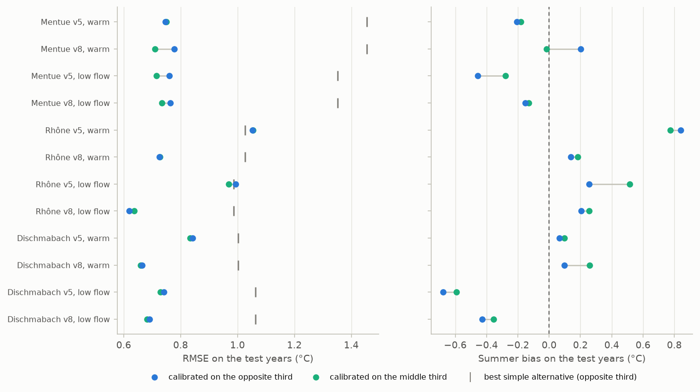
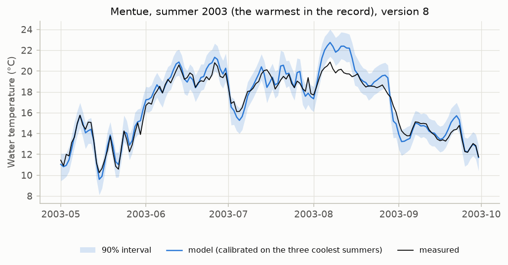

# V10. Predicting warmer or lower-flow years than those calibrated on

[Validation summary](../REPORT.md) · pyair2stream 0.5.0, commit 5fc7dcb, 2026-10-06 03:58 UTC · run time 7.1 minutes

**Result: FAIL.**

Calibrated on the opposite third of the years, the model predicted the warmest and the lowest-flow years better than both simple alternatives in 10 of 12 cases; extrapolating changed the RMSE by -0.02 to +0.07 °C compared with calibrating on the middle years, and the 90% intervals contained 83.6%-92.2% of the test years' measurements.

## Question

Calibrated only on the coolest (or highest-flow) years of a record, does the model still predict the warmest (or lowest-flow) years, when temperature limits are usually at stake? How much does extrapolating cost, and do the 90% intervals still hold?

## Method

Differential split-sample test (Klemeš, 1986). For each Swiss river the calibration and validation files are joined into one continuous record, and the years with at least 80% of their summer (June-August) water temperatures measured are ranked twice: by summer air temperature and by summer discharge. The record is divided into thirds. The most extreme third (warmest, or lowest-flow) is predicted (test years) from two calibrations of equal length: on the opposite third (coolest, or highest-flow: the differential calibration) and on the middle third (the control). A calibration uses the whole continuous forcing but only the water temperatures of its own years, with Qmedia the mean discharge of those years. Each calibration is DE-MCMC with the default settings, followed by a FORWARD run with 90% prediction intervals over the whole record; versions 5 and 8. The two simple alternatives of V5 (day-of-year average and air-temperature regression) are fitted on the same years.

## Pass criterion

For every river, version and split, calibrated on the opposite third, the model predicts the test years with a lower RMSE than both simple alternatives fitted on the same years, and its 90% intervals contain at least 80% of the test years' measurements. (The criterion for intervals is lower than V5's 85% because these years lie outside the calibration conditions by design; the cost of extrapolating is reported, not judged. An MCMC run that does not converge gives no intervals, and its case does not meet the criterion.)

## Results

### Which years were used

Each point is a year. The test years (the most extreme third) are predicted from a calibration on the opposite third (differential) and, for comparison, on the middle third (control).

*The years of each river by summer air temperature (left) and summer discharge (right), and their role.*

### Results

RMSE over all days of the test years; summer bias is the mean of simulated minus measured temperature in June-August of the test years (negative: the model is too cool). The cost of extrapolating is the RMSE from the differential calibration minus the RMSE from the control.

*Prediction error and summer bias on the warmest (or lowest-flow) years, from a calibration on the opposite third of the years (blue) and on the middle third (aqua). The grey tick is the better of the two simple alternatives fitted on the opposite third.*

*The 2003 heatwave summer on the Mentue, predicted by a model calibrated only on the three coolest summers of the record (2007, 2008, 2011).*

**Differential split-sample test** ([csv](../results/V10_1.csv))

| river | version | split | MCMC converged | test years | calibrated on (differential) | control years | RMSE, control (°C) | RMSE, differential (°C) | cost of extrapolating (°C) | summer bias, control (°C) | summer bias, differential (°C) | best simple alternative, differential years (RMSE °C) | best simple alternative, control years (RMSE °C) | 90% interval coverage, differential | summer coverage, differential | 90% interval coverage, control | differential, coverage at 50%, 80%, 90%, 95%, 99% | pass |
|---|---|---|---|---|---|---|---|---|---|---|---|---|---|---|---|---|---|---|
| Mentue | 5 | warm | yes | 2003, 2009, 2012 | 2007, 2008, 2011 | 2005, 2006, 2010 | 0.749 | 0.747 | -0.002 | -0.18 | -0.21 | air-temperature regression 1.455 | air-temperature regression 1.446 | 90.9% | 95.7% | 86.8% | 56.9% / 84.7% / 90.9% / 94.0% / 97.6% | yes |
| Mentue | 8 | warm | yes | 2003, 2009, 2012 | 2007, 2008, 2011 | 2005, 2006, 2010 | 0.71 | 0.779 | 0.069 | -0.02 | 0.2 | air-temperature regression 1.455 | air-temperature regression 1.446 | 90.0% | 89.9% | 85.8% | 56.0% / 82.8% / 90.0% / 94.0% / 97.2% | yes |
| Mentue | 5 | low flow | yes | 2003, 2009, 2011 | 2006, 2007, 2008 | 2004, 2005, 2010 | 0.715 | 0.761 | 0.046 | -0.28 | -0.46 | air-temperature regression 1.352 | air-temperature regression 1.343 | 91.6% | 91.7% | 87.5% | 51.2% / 80.7% / 91.6% / 95.6% / 98.6% | yes |
| Mentue | 8 | low flow | yes | 2003, 2009, 2011 | 2006, 2007, 2008 | 2004, 2005, 2010 | 0.734 | 0.764 | 0.03 | -0.13 | -0.15 | air-temperature regression 1.352 | air-temperature regression 1.343 | 92.2% | 93.5% | 85.8% | 53.8% / 81.7% / 92.2% / 96.2% / 98.2% | yes |
| Rhône | 5 | warm | yes | 1991, 1994, 1998, 2003, 2006, 2008, 2009, 2010, 2012, 2013 | 1984, 1985, 1986, 1987, 1988, 1989, 1990, 1996, 1997, 2007 | 1992, 1993, 1995, 1999, 2000, 2001, 2002, 2004, 2005, 2011 | 1.054 | 1.053 | -0.001 | 0.77 | 0.84 | day-of-year average 1.026 | day-of-year average 1.025 | 83.6% | 76.2% | 83.1% | 41.9% / 72.6% / 83.6% / 89.8% / 96.9% | no |
| Rhône | 8 | warm | yes | 1991, 1994, 1998, 2003, 2006, 2008, 2009, 2010, 2012, 2013 | 1984, 1985, 1986, 1987, 1988, 1989, 1990, 1996, 1997, 2007 | 1992, 1993, 1995, 1999, 2000, 2001, 2002, 2004, 2005, 2011 | 0.728 | 0.726 | -0.002 | 0.18 | 0.14 | day-of-year average 1.026 | day-of-year average 1.025 | 87.4% | 89.7% | 86.5% | 49.9% / 78.7% / 87.4% / 92.0% / 95.4% | yes |
| Rhône | 5 | low flow | yes | 1989, 1990, 1996, 1997, 1998, 2000, 2004, 2005, 2006, 2011 | 1986, 1987, 1988, 1994, 1995, 1999, 2001, 2003, 2009, 2012 | 1984, 1985, 1991, 1992, 1993, 2002, 2007, 2008, 2010, 2013 | 0.97 | 0.994 | 0.024 | 0.52 | 0.25 | day-of-year average 0.987 | day-of-year average 0.957 | 84.4% | 88.3% | 89.8% | 46.8% / 74.6% / 84.4% / 90.1% / 96.1% | no |
| Rhône | 8 | low flow | yes | 1989, 1990, 1996, 1997, 1998, 2000, 2004, 2005, 2006, 2011 | 1986, 1987, 1988, 1994, 1995, 1999, 2001, 2003, 2009, 2012 | 1984, 1985, 1991, 1992, 1993, 2002, 2007, 2008, 2010, 2013 | 0.636 | 0.619 | -0.017 | 0.25 | 0.2 | day-of-year average 0.987 | day-of-year average 0.957 | 89.3% | 86.8% | 92.7% | 51.6% / 79.6% / 89.3% / 94.0% / 98.3% | yes |
| Dischmabach | 5 | warm | yes | 2006, 2009, 2012 | 2004, 2005, 2011 | 2007, 2008, 2010 | 0.833 | 0.842 | 0.009 | 0.1 | 0.07 | day-of-year average 1.003 | day-of-year average 1.018 | 87.5% | 83.0% | 87.4% | 44.5% / 77.0% / 87.5% / 92.0% / 95.8% | yes |
| Dischmabach | 8 | warm | yes | 2006, 2009, 2012 | 2004, 2005, 2011 | 2007, 2008, 2010 | 0.659 | 0.665 | 0.006 | 0.26 | 0.1 | day-of-year average 1.003 | day-of-year average 1.018 | 90.9% | 95.3% | 88.9% | 50.4% / 81.7% / 90.9% / 95.1% / 99.2% | yes |
| Dischmabach | 5 | low flow | yes | 2005, 2007, 2011 | 2004, 2008, 2010 | 2006, 2009, 2012 | 0.729 | 0.742 | 0.013 | -0.59 | -0.68 | air-temperature regression 1.063 | air-temperature regression 1.081 | 91.0% | 84.8% | 95.4% | 52.8% / 81.5% / 91.0% / 95.8% / 99.7% | yes |
| Dischmabach | 8 | low flow | yes | 2005, 2007, 2011 | 2004, 2008, 2010 | 2006, 2009, 2012 | 0.683 | 0.69 | 0.007 | -0.36 | -0.43 | air-temperature regression 1.063 | air-temperature regression 1.081 | 86.1% | 84.1% | 86.5% | 45.9% / 74.7% / 86.1% / 93.4% / 98.4% | yes |

## What this means

Where the model did not beat the simple alternatives: Rhône version 5, warm split (calibrated on the middle years it did not either); Rhône version 5, low flow split (calibrated on the middle years it did not either). Where it fails whichever years it is calibrated on, the cause is the model version on that river, not extrapolation: compare the RMSE of the two calibrations, and the versions in V5.

Summer bias on the test years ranged from -0.68 to +0.84 °C after extrapolating, against -0.59 to +0.77 °C from the control calibrations; the largest was +0.84 °C (Rhône, version 5, warm split). A model that is too warm in the season of a limit overstates the chance that a warm-water limit was exceeded, and one that is too cool understates it; check the bias in that season on your own data (USER_GUIDE §9).

The cost of extrapolating ranged from -0.02 to +0.07 °C of RMSE (small in every case); a single extreme period can still be missed: in the Mentue's 2003 heatwave (figure), the highest daily temperature of August from the model calibrated on the three coolest summers was 1.9 °C above the measured one.

With three to ten years per third, these results describe these rivers and years; they are evidence about how the model extrapolates, not a guarantee for other rivers or larger changes.
