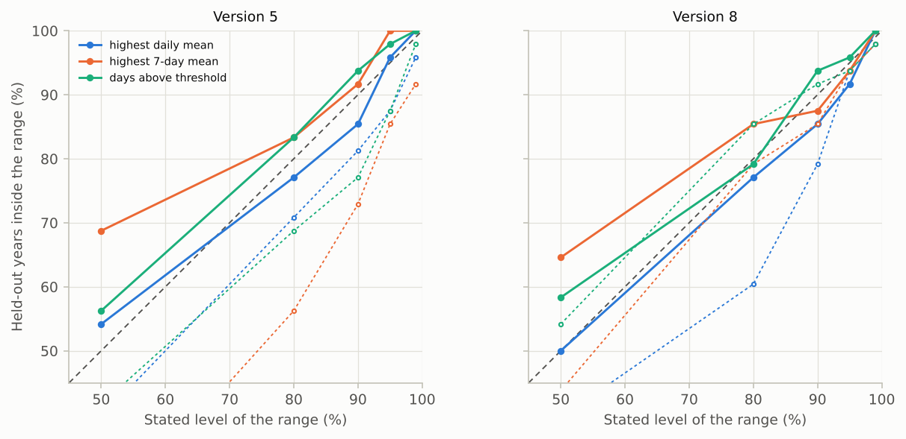

# V11. Cross-validated check and correction of yearly statistics

[Validation summary](../REPORT.md) · pyair2stream 0.5.1, commit 995f691, 2026-10-10 01:30 UTC · run time 6.1 minutes

**Result: PASS.**

Over 48 held-out river-years per version, the uncorrected 90% ranges held in 73%-92% of years (version 8: 79%-92%); after the cross-validated correction, in 85%-94% (version 8: 85%-94%), and the mean PIT moved from 0.31-0.52 to 0.48-0.50 (0.5: unbiased). 9 of 18 river, version and statistic combinations had a bias whose 95% confidence interval excludes zero. After the correction, the 80% ranges held in 77%-85%, the 95% ranges in 92%-100% and the 99% ranges in 100%-100% of held-out years.

## Question

Over many years not used for calibration, how often do the predicted ranges of yearly statistics (highest daily mean, highest 7-day mean, days above a threshold) contain the measured value? When they do not, why? And does the package's correction, estimated from other held-out years only, make the stated ranges hold?

## Method

For each Swiss river, the calibration and validation files are joined into one record (Mentue 2002-2012, Dischmabach 2003-2012, Rhône 1984-2013), and the package's leave-one-year-out cross-validation (run_mode DE, every year but the first held out once, Qmedia fixed) is run for versions 5 and 8. Its check of yearly statistics (cross_validation.check_yearly_statistics, the outputs cv_yearly_statistics*.csv) makes 1000 simulations of each held-out year from that fold's calibrated parameters plus AR(1) error with the sigma and rho of its training years, computes each statistic over the days that were measured, and records where the measured value falls among the simulations (the PIT; ties split at random). A year counts if at least 80% of June-September was measured; the threshold is the 90th percentile of the measured temperatures. Then each held-out year is corrected with scenario.correct_statistic, using the deviations (measured minus predicted median) of the other held-out years of the same river and version only, and its PIT is recorded again. Parameter uncertainty is not included (one parameter set per fold), so the ranges are slightly narrower than a FORWARD run from a DE-MCMC chain gives.

## Pass criterion

After correction, for each version and statistic, pooled over the three rivers, the share of held-out years whose measured value lies inside the central 80%, 90% and 95% ranges is within the range expected by chance at each level (central 99% binomial range). The uncorrected ranges, and the 50% and 99% ranges, are reported, not judged.

## Results

### Coverage of the predicted ranges, before and after the correction

Each held-out year of each river gives one value per statistic. The uncorrected ranges are those a FORWARD run would give from the fold's calibration; the corrected ones shift each year's simulations by the mean deviation of the other held-out years, with its uncertainty.

*Share of held-out years whose measured statistic lies inside the predicted 90% range, before (orange) and after (blue) the cross-validated correction. Dashed: 90%; shaded: the range expected by chance for this number of years.*

*Share of held-out years whose measured statistic lies inside the predicted range, for each stated level: corrected (solid) and uncorrected (dotted). On the dashed diagonal the ranges hold at every level.*

**Pooled over the three rivers** ([csv](../results/V11_1.csv))

| version | statistic | years | inside 50% range | inside 50% range, corrected | accepted (50%) | inside 90% range | inside 90% range, corrected | accepted (90%) | mean PIT | mean PIT, corrected |
|---|---|---|---|---|---|---|---|---|---|---|
| 5 | days above threshold | 48 | 42% | 56% | 31%-69% | 77% | 94% | 77%-100% | 0.41 | 0.5 |
| 5 | highest 7-day mean | 48 | 23% | 69% | 31%-69% | 73% | 92% | 77%-100% | 0.31 | 0.5 |
| 5 | highest daily mean | 48 | 40% | 54% | 31%-69% | 81% | 85% | 77%-100% | 0.4 | 0.49 |
| 8 | days above threshold | 48 | 54% | 58% | 31%-69% | 92% | 94% | 77%-100% | 0.52 | 0.48 |
| 8 | highest 7-day mean | 48 | 44% | 65% | 31%-69% | 85% | 88% | 77%-100% | 0.38 | 0.49 |
| 8 | highest daily mean | 48 | 40% | 50% | 31%-69% | 79% | 85% | 77%-100% | 0.51 | 0.49 |

**Pooled over the three rivers, at each level: share of held-out years inside the range** ([csv](../results/V11_2.csv))

| version | statistic | level | years | uncorrected | corrected | accepted |
|---|---|---|---|---|---|---|
| 5 | days above threshold | 50% | 48 | 42% | 56% | not judged |
| 5 | days above threshold | 80% | 48 | 69% | 83% | 65%-94% |
| 5 | days above threshold | 90% | 48 | 77% | 94% | 77%-100% |
| 5 | days above threshold | 95% | 48 | 88% | 98% | 85%-100% |
| 5 | days above threshold | 99% | 48 | 98% | 100% | not judged |
| 5 | highest 7-day mean | 50% | 48 | 23% | 69% | not judged |
| 5 | highest 7-day mean | 80% | 48 | 56% | 83% | 65%-94% |
| 5 | highest 7-day mean | 90% | 48 | 73% | 92% | 77%-100% |
| 5 | highest 7-day mean | 95% | 48 | 85% | 100% | 85%-100% |
| 5 | highest 7-day mean | 99% | 48 | 92% | 100% | not judged |
| 5 | highest daily mean | 50% | 48 | 40% | 54% | not judged |
| 5 | highest daily mean | 80% | 48 | 71% | 77% | 65%-94% |
| 5 | highest daily mean | 90% | 48 | 81% | 85% | 77%-100% |
| 5 | highest daily mean | 95% | 48 | 88% | 96% | 85%-100% |
| 5 | highest daily mean | 99% | 48 | 96% | 100% | not judged |
| 8 | days above threshold | 50% | 48 | 54% | 58% | not judged |
| 8 | days above threshold | 80% | 48 | 85% | 79% | 65%-94% |
| 8 | days above threshold | 90% | 48 | 92% | 94% | 77%-100% |
| 8 | days above threshold | 95% | 48 | 94% | 96% | 85%-100% |
| 8 | days above threshold | 99% | 48 | 98% | 100% | not judged |
| 8 | highest 7-day mean | 50% | 48 | 44% | 65% | not judged |
| 8 | highest 7-day mean | 80% | 48 | 79% | 85% | 65%-94% |
| 8 | highest 7-day mean | 90% | 48 | 85% | 88% | 77%-100% |
| 8 | highest 7-day mean | 95% | 48 | 94% | 94% | 85%-100% |
| 8 | highest 7-day mean | 99% | 48 | 98% | 100% | not judged |
| 8 | highest daily mean | 50% | 48 | 40% | 50% | not judged |
| 8 | highest daily mean | 80% | 48 | 60% | 77% | 65%-94% |
| 8 | highest daily mean | 90% | 48 | 79% | 85% | 77%-100% |
| 8 | highest daily mean | 95% | 48 | 94% | 92% | 85%-100% |
| 8 | highest daily mean | 99% | 48 | 98% | 100% | not judged |

**By river: bias of the predicted median (measured minus median) and coverage** ([csv](../results/V11_3.csv))

| version | river | statistic | years | measured minus predicted median, mean | 95% CI | bias | inside 90% range | inside 90% range, corrected |
|---|---|---|---|---|---|---|---|---|
| 5 | Dischmabach | days above threshold | 9 | +10.89 days | +4.23 to +17.55 | yes | 7 of 9 | 9 of 9 |
| 5 | Dischmabach | highest 7-day mean | 9 | +0.53 °C | +0.25 to +0.81 | yes | 8 of 9 | 8 of 9 |
| 5 | Dischmabach | highest daily mean | 9 | +0.46 °C | +0.12 to +0.80 | yes | 9 of 9 | 8 of 9 |
| 5 | Mentue | days above threshold | 10 | +0.10 days | -4.77 to +4.97 | no | 8 of 10 | 8 of 10 |
| 5 | Mentue | highest 7-day mean | 10 | -0.15 °C | -0.52 to +0.22 | no | 9 of 10 | 8 of 10 |
| 5 | Mentue | highest daily mean | 10 | -0.21 °C | -0.58 to +0.16 | no | 8 of 10 | 8 of 10 |
| 5 | Rhône | days above threshold | 29 | -19.52 days | -27.59 to -11.44 | yes | 22 of 29 | 28 of 29 |
| 5 | Rhône | highest 7-day mean | 29 | -0.93 °C | -1.13 to -0.73 | yes | 18 of 29 | 28 of 29 |
| 5 | Rhône | highest daily mean | 29 | -0.47 °C | -0.74 to -0.21 | yes | 22 of 29 | 25 of 29 |
| 8 | Dischmabach | days above threshold | 9 | +4.56 days | -0.65 to +9.76 | no | 7 of 9 | 9 of 9 |
| 8 | Dischmabach | highest 7-day mean | 9 | +0.15 °C | -0.07 to +0.37 | no | 9 of 9 | 8 of 9 |
| 8 | Dischmabach | highest daily mean | 9 | -0.01 °C | -0.31 to +0.28 | no | 9 of 9 | 9 of 9 |
| 8 | Mentue | days above threshold | 10 | -1.30 days | -4.74 to +2.14 | no | 9 of 10 | 9 of 10 |
| 8 | Mentue | highest 7-day mean | 10 | -0.64 °C | -1.00 to -0.29 | yes | 7 of 10 | 9 of 10 |
| 8 | Mentue | highest daily mean | 10 | -0.80 °C | -1.14 to -0.45 | yes | 6 of 10 | 8 of 10 |
| 8 | Rhône | days above threshold | 29 | +2.03 days | -3.64 to +7.71 | no | 28 of 29 | 27 of 29 |
| 8 | Rhône | highest 7-day mean | 29 | -0.14 °C | -0.27 to +0.00 | no | 25 of 29 | 25 of 29 |
| 8 | Rhône | highest daily mean | 29 | +0.28 °C | +0.09 to +0.46 | yes | 23 of 29 | 24 of 29 |

**Daily values and 7-day means at each level, pooled over the held-out years (reported, not judged; V5 judges daily coverage)** ([csv](../results/V11_4.csv))

| version | level | days inside | 7-day means inside | days |
|---|---|---|---|---|
| 5 | 50% | 51.5% | 53.1% | 17504 |
| 5 | 80% | 81.0% | 84.1% | 17504 |
| 5 | 90% | 90.0% | 92.7% | 17504 |
| 5 | 95% | 94.4% | 96.2% | 17504 |
| 5 | 99% | 98.2% | 99.1% | 17504 |
| 8 | 50% | 53.7% | 58.8% | 17504 |
| 8 | 80% | 81.8% | 87.4% | 17504 |
| 8 | 90% | 90.2% | 93.5% | 17504 |
| 8 | 95% | 94.5% | 96.4% | 17504 |
| 8 | 99% | 98.0% | 98.5% | 17504 |

## What this means

Why the uncorrected ranges can fail: the model's error on the hottest days is not its typical error. Where the simulated peak is systematically too high or too low (see the table by river), adding random error of the typical size cannot move the predicted range to the measured value. This is a property of the fitted model at a site, not of the calculation, which V9 part A shows is right when the model is right. The check finds it from the data available, and the correction removes the average bias, with its uncertainty, using years other than the one predicted.

The check needs years: with n held-out years the coverage it reports is uncertain by about ±sqrt(0.09/n) (one standard deviation: ±0.13 for 5 years, ±0.07 for 20), and the correction is uncertain by its standard error, which the corrected range includes. Daily and 7-day ranges are not affected: V5 and V10 show they hold.
