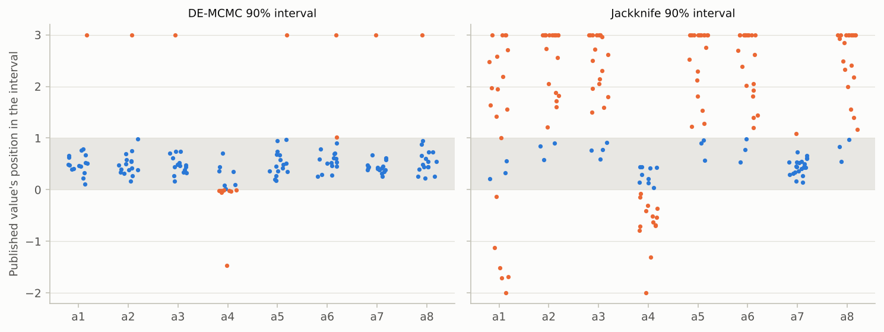

# V15. Reproduces an independent group's published simulations (British Columbia)

[Validation summary](../REPORT.md) · pyair2stream 0.5.1, commit 995f691, 2026-10-10 03:51 UTC · run time 50.2 minutes

**Result: PASS.**

- (A) Of 46 published series (23 stations, two periods), the 45 whose record starts on 1 January are reproduced to within 0.00013 °C on every day. Station 08GA077's calibration record starts on 2012-11-01: with its dates, pyair2stream's simulation differs from the published one by up to 3.29 °C; read by row as if it started on 1 January, as the original program reads it, it is reproduced to within 0.00001 °C. The published simulation of that period therefore has its seasonal term 10 months out of phase.
- (C) DE fits the calibration years at least as well as the published parameters at 23 of 23 stations (mean difference -0.088 °C), and returns the published parameters (each within 1% of its range) at 0 of 23.
- (D) The published values lie inside pyair2stream's 90% parameter intervals for 122 of 136 (MCMC, converged runs) and 50 of 184 (jackknife); 133 of 184 lie inside at least one.

## Question

Callahan and Moore (2025) calibrated air2stream's 8-parameter version for 23 streams in British Columbia and published their parameters, inputs and simulated water temperatures. Given the same parameters and inputs, does pyair2stream compute the same daily water temperatures? Do the published errors, including those of the 2021 heat dome and the 2022 autumn drought, follow? Does pyair2stream's own calibration fit at least as well?

## Method

The published dataset (Moore and Callahan, 2024, https://doi.org/10.5281/zenodo.14502248, CC BY 4.0; data/british_columbia/, files unchanged) gives, for each of 23 Water Survey of Canada stations, daily ERA5 air temperature, discharge, measured water temperature and the water temperature simulated by the 8-parameter version, for the calibration (to 2020) and validation (2021 to 31 October 2022) periods, and the calibrated parameters.

- (A) Each station and period is simulated by pyair2stream with the published parameters (Crank-Nicolson, the period's own mean discharge as Qmedia, as the original program computes it) and compared day by day with the published simulation. A record that does not start on 1 January is also run as the original program reads it: by row, as if it started on 1 January.
- (B) RMSE and mean bias error (MBE, simulated minus measured) are computed for each period and for the paper's two windows, as in its scripts: 25 June to 2 July (heat dome) and 1 September to 31 October (autumn drought), by day of year, over the calibration years and 2021 (heat dome) or 2022 (drought).
- (C) Each station is calibrated by DE (RMS objective, Crank-Nicolson, the authors' parameter ranges of V2, which contain every published parameter) on its calibration years, from the first 1 January, and the fit and the parameters compared with the published ones on the same days.
- (D) How far can the parameters move and still fit these data? As in V2 part F, each station's calibration years give two 90% intervals for every parameter around the same least-squares estimator: the jackknife interval from leave-one-year-out cross-validation (every year but the first held out once), and the DE-MCMC credible interval with the least-squares likelihood widened for the autocorrelation of the errors (32 walkers, run until converged, at most 100000 steps). Whether each published value lies inside them is recorded.

## Pass criterion

- (A) Every published series whose record starts on 1 January is reproduced to within 0.001 °C on every day, and a record that does not is reproduced to within 0.001 °C when read as the original program reads it.
- (C) DE fits every calibration period no worse than the published parameters (their RMSE + 0.002 °C). (B), (D), the parameter values found in
- (C) and the effect of a misread record are reported.

## Results

### A. The published simulations, day by day

Largest absolute difference, over every day of the period, between pyair2stream's simulation with the published parameters and the published simulation.

![Left: largest difference between pyair2stream's simulation and each published simulation, with the published parameters (dashed: 0.001 °C). Blue: records starting on 1 January. Orange: the record that does not, run with its dates (filled) and read by row from 1 January as the original program reads it (open). Right: RMSE in the paper's heat-dome and drought windows, published simulation against pyair2stream's; a point off the line is the misread record, run by pyair2stream with its correct dates.](../figures/V15_british_columbia.png)

*Left: largest difference between pyair2stream's simulation and each published simulation, with the published parameters (dashed: 0.001 °C). Blue: records starting on 1 January. Orange: the record that does not, run with its dates (filled) and read by row from 1 January as the original program reads it (open). Right: RMSE in the paper's heat-dome and drought windows, published simulation against pyair2stream's; a point off the line is the misread record, run by pyair2stream with its correct dates.*

**A. Published series reproduced** ([csv](../results/V15_1.csv))

| station | regime | regulation | period | first day | days | measured | largest difference | largest difference, read from 1 January |
|---|---|---|---|---|---|---|---|---|
| 07EA004 | snow | unregulated | calibration | 2011-01-01 | 3653 | 3591 | 1.17e-05 |  |
| 07EA004 | snow | unregulated | validation | 2021-01-01 | 669 | 668 | 1.02e-05 |  |
| 07EB002 | snow | unregulated | calibration | 2011-01-01 | 3653 | 1639 | 2.51e-05 |  |
| 07EB002 | snow | unregulated | validation | 2021-01-01 | 669 | 280 | 2.40e-05 |  |
| 08CG001 | snow | unregulated | calibration | 2016-01-01 | 1827 | 1313 | 1.02e-05 |  |
| 08CG001 | snow | unregulated | validation | 2021-01-01 | 669 | 521 | 1.09e-05 |  |
| 08FF001 | glacial/hybrid | unregulated | calibration | 2014-01-01 | 2557 | 2330 | 1.05e-05 |  |
| 08FF001 | glacial/hybrid | unregulated | validation | 2021-01-01 | 669 | 488 | 1.07e-05 |  |
| 08FF003 | hybrid | unregulated | calibration | 2014-01-01 | 2557 | 2417 | 9.42e-06 |  |
| 08FF003 | hybrid | unregulated | validation | 2021-01-01 | 669 | 668 | 9.36e-06 |  |
| 08GA077 | hybrid | unregulated | calibration | 2012-11-01 | 2983 | 2267 | 3.29e+00 | 1.07e-05 |
| 08GA077 | hybrid | unregulated | validation | 2021-01-01 | 669 | 618 | 1.16e-05 |  |
| 08HA002 | rain | regulated | calibration | 2011-01-01 | 3653 | 2939 | 3.23e-05 |  |
| 08HA002 | rain | regulated | validation | 2021-01-01 | 669 | 668 | 3.22e-05 |  |
| 08HA011 | rain | regulated | calibration | 2015-01-01 | 2192 | 1621 | 1.48e-05 |  |
| 08HA011 | rain | regulated | validation | 2021-01-01 | 669 | 524 | 1.54e-05 |  |
| 08HA069 | rain | unregulated | calibration | 2014-01-01 | 2557 | 2431 | 2.33e-05 |  |
| 08HA069 | rain | unregulated | validation | 2021-01-01 | 669 | 557 | 1.26e-04 |  |
| 08HA070 | rain | unregulated | calibration | 2016-01-01 | 1827 | 1820 | 1.99e-05 |  |
| 08HA070 | rain | unregulated | validation | 2021-01-01 | 669 | 500 | 2.25e-05 |  |
| 08HB023 | rain | regulated | calibration | 2016-01-01 | 1827 | 1724 | 2.26e-05 |  |
| 08HB023 | rain | regulated | validation | 2021-01-01 | 669 | 666 | 2.17e-05 |  |
| 08JA017 | snow | regulated | calibration | 2011-01-01 | 3653 | 3530 | 1.68e-05 |  |
| 08JA017 | snow | regulated | validation | 2021-01-01 | 669 | 547 | 1.29e-05 |  |
| 08JB008 | snow | regulated | calibration | 2016-01-01 | 1827 | 1553 | 1.13e-05 |  |
| 08JB008 | snow | regulated | validation | 2021-01-01 | 669 | 668 | 1.54e-05 |  |
| 08KB001 | snow | unregulated | calibration | 2011-01-01 | 3653 | 3147 | 3.48e-05 |  |
| 08KB001 | snow | unregulated | validation | 2021-01-01 | 669 | 533 | 3.18e-05 |  |
| 08KH006 | snow | unregulated | calibration | 2011-01-01 | 3653 | 2626 | 1.32e-05 |  |
| 08KH006 | snow | unregulated | validation | 2021-01-01 | 669 | 667 | 1.35e-05 |  |
| 08LB078 | snow | regulated | calibration | 2016-01-01 | 1827 | 1815 | 2.81e-05 |  |
| 08LB078 | snow | regulated | validation | 2021-01-01 | 669 | 667 | 2.70e-05 |  |
| 08LE031 | snow | unregulated | calibration | 2011-01-01 | 3653 | 2898 | 3.21e-05 |  |
| 08LE031 | snow | unregulated | validation | 2021-01-01 | 669 | 652 | 3.17e-05 |  |
| 08LF051 | snow | unregulated | calibration | 2011-01-01 | 3653 | 3439 | 2.74e-05 |  |
| 08LF051 | snow | unregulated | validation | 2021-01-01 | 669 | 667 | 3.02e-05 |  |
| 08MF040 | snow | regulated | calibration | 2011-01-01 | 3653 | 3353 | 2.63e-05 |  |
| 08MF040 | snow | regulated | validation | 2021-01-01 | 669 | 656 | 2.50e-05 |  |
| 08NE074 | snow | unregulated | calibration | 2013-01-01 | 2922 | 2450 | 9.59e-06 |  |
| 08NE074 | snow | unregulated | validation | 2021-01-01 | 669 | 669 | 8.05e-06 |  |
| 08NG065 | snow | unregulated | calibration | 2011-01-01 | 3653 | 2533 | 1.61e-05 |  |
| 08NG065 | snow | unregulated | validation | 2021-01-01 | 669 | 660 | 1.63e-05 |  |
| 08NH118 | glacial/hybrid | regulated | calibration | 2011-01-01 | 3653 | 3073 | 1.76e-05 |  |
| 08NH118 | glacial/hybrid | regulated | validation | 2021-01-01 | 669 | 667 | 1.61e-05 |  |
| 08NK002 | snow | unregulated | calibration | 2011-01-01 | 3653 | 2454 | 1.09e-05 |  |
| 08NK002 | snow | unregulated | validation | 2021-01-01 | 669 | 668 | 1.03e-05 |  |

### B. The published errors, including the heat dome and the drought

RMSE and MBE (°C) of the published series and of pyair2stream's, against the measurements. The windows follow the paper's scripts. pyair2stream's errors for a record that does not start on 1 January are those of the record run with its correct dates, so the means are also given without it. The paper's own summary statistics are not compared here (its text could not be retrieved automatically); these are computed from its published data.

**B. Mean over stations** ([csv](../results/V15_2.csv))

| period | records | stations | mean RMSE, published series | mean RMSE, pyair2stream | heat dome, mean RMSE (published) | heat dome, mean RMSE (pyair2stream) | drought, mean RMSE (published) | drought, mean RMSE (pyair2stream) |
|---|---|---|---|---|---|---|---|---|
| calibration | all records | 23 | 0.914 | 0.945 | 0.958 | 1.02 | 0.854 | 0.861 |
| calibration | records starting on 1 January | 22 | 0.916 | 0.916 | 0.972 | 0.972 | 0.85 | 0.85 |
| validation | all records | 23 | 1.052 | 1.052 | 1.42 | 1.42 | 1.069 | 1.069 |

**B. By station and period** ([csv](../results/V15_3.csv))

| station | period | RMSE published | RMSE pyair2stream | MBE published | MBE pyair2stream | heat dome: RMSE published | heat dome: RMSE pyair2stream | autumn drought: RMSE published | autumn drought: RMSE pyair2stream |
|---|---|---|---|---|---|---|---|---|---|
| 07EA004 | calibration | 0.852 | 0.852 | -0.020 | -0.020 | 0.961 | 0.961 | 0.833 | 0.833 |
| 07EA004 | validation | 0.908 | 0.908 | 0.034 | 0.034 | 1.378 | 1.378 | 1.079 | 1.079 |
| 07EB002 | calibration | 0.800 | 0.800 | 0.000 | 0.000 | 0.785 | 0.785 | 0.763 | 0.763 |
| 07EB002 | validation | 0.874 | 0.874 | 0.588 | 0.588 | 0.938 | 0.938 | 0.830 | 0.830 |
| 08CG001 | calibration | 0.670 | 0.670 | 0.002 | 0.002 | 0.854 | 0.854 | 0.601 | 0.601 |
| 08CG001 | validation | 1.194 | 1.194 | -0.430 | -0.430 | 0.739 | 0.739 | 1.362 | 1.362 |
| 08FF001 | calibration | 0.855 | 0.855 | -0.049 | -0.049 | 0.767 | 0.767 | 0.791 | 0.791 |
| 08FF001 | validation | 1.108 | 1.108 | -0.295 | -0.295 | 0.933 | 0.933 | 0.866 | 0.866 |
| 08FF003 | calibration | 0.748 | 0.748 | -0.017 | -0.017 | 0.591 | 0.591 | 0.840 | 0.840 |
| 08FF003 | validation | 0.957 | 0.957 | 0.335 | 0.335 | 1.526 | 1.526 | 0.737 | 0.737 |
| 08GA077 | calibration | 0.862 | 1.584 | -0.007 | -0.032 | 0.639 | 2.061 | 0.947 | 1.124 |
| 08GA077 | validation | 1.441 | 1.441 | 0.202 | 0.202 | 3.341 | 3.341 | 1.195 | 1.195 |
| 08HA002 | calibration | 0.869 | 0.869 | -0.006 | -0.006 | 0.883 | 0.883 | 0.724 | 0.724 |
| 08HA002 | validation | 1.089 | 1.089 | 0.182 | 0.182 | 1.302 | 1.302 | 0.536 | 0.536 |
| 08HA011 | calibration | 0.935 | 0.935 | 0.006 | 0.006 | 0.973 | 0.973 | 1.059 | 1.059 |
| 08HA011 | validation | 1.319 | 1.319 | 0.482 | 0.482 | 1.869 | 1.869 | 0.997 | 0.997 |
| 08HA069 | calibration | 0.705 | 0.705 | 0.003 | 0.003 | 0.696 | 0.696 | 0.611 | 0.611 |
| 08HA069 | validation | 0.755 | 0.755 | 0.493 | 0.493 | 2.082 | 2.082 | 0.842 | 0.842 |
| 08HA070 | calibration | 0.601 | 0.601 | 0.003 | 0.003 | 0.551 | 0.551 | 0.651 | 0.651 |
| 08HA070 | validation | 0.814 | 0.814 | 0.243 | 0.243 | 0.761 | 0.761 | 1.633 | 1.633 |
| 08HB023 | calibration | 0.880 | 0.880 | 0.001 | 0.001 | 0.808 | 0.808 | 0.861 | 0.861 |
| 08HB023 | validation | 0.955 | 0.955 | -0.457 | -0.457 | 0.844 | 0.844 | 0.915 | 0.915 |
| 08JA017 | calibration | 1.258 | 1.258 | -0.208 | -0.208 | 1.745 | 1.745 | 0.811 | 0.811 |
| 08JA017 | validation | 1.193 | 1.193 | -0.243 | -0.243 | 1.516 | 1.516 | 1.101 | 1.101 |
| 08JB008 | calibration | 1.275 | 1.275 | -0.230 | -0.230 | 0.984 | 0.984 | 0.858 | 0.858 |
| 08JB008 | validation | 1.407 | 1.407 | -0.275 | -0.275 | 3.173 | 3.173 | 1.717 | 1.717 |
| 08KB001 | calibration | 0.886 | 0.886 | -0.044 | -0.044 | 1.112 | 1.112 | 0.686 | 0.686 |
| 08KB001 | validation | 0.934 | 0.934 | 0.055 | 0.055 | 1.378 | 1.378 | 0.582 | 0.582 |
| 08KH006 | calibration | 1.151 | 1.151 | -0.073 | -0.073 | 1.904 | 1.904 | 0.932 | 0.932 |
| 08KH006 | validation | 1.175 | 1.175 | 0.168 | 0.168 | 2.621 | 2.621 | 0.957 | 0.957 |
| 08LB078 | calibration | 0.869 | 0.869 | -0.042 | -0.042 | 0.554 | 0.554 | 0.994 | 0.994 |
| 08LB078 | validation | 0.976 | 0.976 | -0.240 | -0.240 | 0.864 | 0.864 | 0.856 | 0.856 |
| 08LE031 | calibration | 1.119 | 1.119 | -0.058 | -0.058 | 1.093 | 1.093 | 1.073 | 1.073 |
| 08LE031 | validation | 1.114 | 1.114 | 0.083 | 0.083 | 1.060 | 1.060 | 0.535 | 0.535 |
| 08LF051 | calibration | 1.113 | 1.113 | -0.048 | -0.048 | 1.365 | 1.365 | 0.910 | 0.910 |
| 08LF051 | validation | 1.262 | 1.262 | -0.671 | -0.671 | 1.238 | 1.238 | 1.495 | 1.495 |
| 08MF040 | calibration | 1.085 | 1.085 | -0.198 | -0.198 | 1.138 | 1.138 | 0.861 | 0.861 |
| 08MF040 | validation | 0.896 | 0.896 | -0.087 | -0.087 | 1.609 | 1.609 | 1.005 | 1.005 |
| 08NE074 | calibration | 0.836 | 0.836 | -0.032 | -0.032 | 0.609 | 0.609 | 1.008 | 1.008 |
| 08NE074 | validation | 0.888 | 0.888 | 0.309 | 0.309 | 0.383 | 0.383 | 1.701 | 1.701 |
| 08NG065 | calibration | 0.978 | 0.978 | -0.036 | -0.036 | 0.944 | 0.944 | 1.216 | 1.216 |
| 08NG065 | validation | 1.028 | 1.028 | 0.059 | 0.059 | 1.727 | 1.727 | 1.612 | 1.612 |
| 08NH118 | calibration | 0.829 | 0.829 | 0.001 | 0.001 | 1.445 | 1.445 | 0.681 | 0.681 |
| 08NH118 | validation | 1.118 | 1.118 | 0.615 | 0.615 | 0.362 | 0.362 | 1.067 | 1.067 |
| 08NK002 | calibration | 0.840 | 0.840 | -0.015 | -0.015 | 0.627 | 0.627 | 0.926 | 0.926 |
| 08NK002 | validation | 0.795 | 0.795 | 0.110 | 0.110 | 1.005 | 1.005 | 0.963 | 0.963 |

### C. Calibration by pyair2stream

DE with the RMS objective on each station's calibration years (from the first 1 January), compared with the published parameters on the same days, with the validation RMSE of the DE parameters. 'Same parameters': every parameter within 1% of its range of the published value.

**C. DE calibration (RMSE in °C) and parameters** ([csv](../results/V15_4.csv))

| station | calibration from | published parameters, calibration RMSE | DE, calibration RMSE | DE minus published | published, validation RMSE | DE, validation RMSE | largest parameter difference (% of range) | same parameters | a1 | a2 | a3 | a4 | a5 | a6 | a7 | a8 |
|---|---|---|---|---|---|---|---|---|---|---|---|---|---|---|---|---|
| 07EA004 | 2011-01-01 | 0.8522 | 0.8475 | -0.0047 | 0.9078 | 0.9419 | 14.5 | no | 0.518 | 0.393 | 0.422 | -1.000 | 0.154 | 2.878 | 0.562 | 0.330 |
| 07EB002 | 2011-01-01 | 0.7998 | 0.7375 | -0.0623 | 0.8739 | 0.7650 | 61.6 | no | 0.022 | 0.061 | 0.076 | 0.129 | 0.122 | 0.446 | 0.600 | 0.067 |
| 08CG001 | 2016-01-01 | 0.6697 | 0.6550 | -0.0148 | 1.1945 | 1.1737 | 33.2 | no | -0.095 | 0.332 | 0.429 | -1.000 | 4.071 | 2.264 | 0.517 | 0.744 |
| 08FF001 | 2014-01-01 | 0.8553 | 0.8464 | -0.0089 | 1.1079 | 1.0922 | 45.6 | no | -0.548 | 0.412 | 0.372 | -0.543 | 4.122 | 2.751 | 0.605 | 0.685 |
| 08FF003 | 2014-01-01 | 0.7476 | 0.7026 | -0.0450 | 0.9567 | 0.8946 | 62.9 | no | -0.157 | 0.114 | 0.121 | 0.661 | 0.852 | 0.537 | 0.663 | 0.181 |
| 08GA077 | 2013-01-01 | 1.5852 | 0.8415 | -0.7437 | 1.4412 | 0.9624 | 55.0 | no | 0.393 | 0.148 | 0.249 | -0.273 | 0.569 | 0.496 | 0.715 | 0.125 |
| 08HA002 | 2011-01-01 | 0.8687 | 0.7209 | -0.1478 | 1.0886 | 0.7619 | 96.5 | no | 0.156 | 0.040 | 0.040 | 0.405 | 0.416 | 0.240 | 0.604 | 0.040 |
| 08HA011 | 2015-01-01 | 0.9345 | 0.8837 | -0.0508 | 1.3191 | 1.1955 | 95.7 | no | 0.187 | 0.054 | 0.059 | 0.824 | 0.734 | 0.417 | 0.598 | 0.068 |
| 08HA069 | 2014-01-01 | 0.7050 | 0.6384 | -0.0666 | 0.7554 | 0.5708 | 93.1 | no | 0.065 | 0.061 | 0.079 | 0.157 | 0.307 | 0.137 | 0.759 | 0.049 |
| 08HA070 | 2016-01-01 | 0.6012 | 0.5873 | -0.0140 | 0.8143 | 0.7408 | 38.6 | no | 0.482 | 0.211 | 0.303 | -0.295 | 2.902 | 1.353 | 0.667 | 0.382 |
| 08HB023 | 2016-01-01 | 0.8796 | 0.8186 | -0.0609 | 0.9552 | 0.9931 | 67.6 | no | 0.093 | 0.165 | 0.150 | 0.575 | 1.023 | 0.664 | 0.590 | 0.116 |
| 08JA017 | 2011-01-01 | 1.2579 | 1.1444 | -0.1135 | 1.1935 | 0.9401 | 78.6 | no | 0.157 | 0.038 | 0.045 | 0.239 | 0.000 | 0.073 | 0.605 | 0.004 |
| 08JB008 | 2016-01-01 | 1.2749 | 1.2400 | -0.0349 | 1.4075 | 1.2485 | 62.3 | no | 0.556 | 0.157 | 0.170 | -0.323 | 0.211 | 0.916 | 0.622 | 0.045 |
| 08KB001 | 2011-01-01 | 0.8864 | 0.8141 | -0.0723 | 0.9336 | 0.9720 | 27.7 | no | -0.528 | 0.167 | 0.117 | -0.437 | 0.678 | 0.759 | 0.598 | 0.137 |
| 08KH006 | 2011-01-01 | 1.1511 | 1.0548 | -0.0963 | 1.1751 | 1.0807 | 59.4 | no | 0.196 | 0.062 | 0.075 | -0.344 | 0.063 | 0.276 | 0.664 | 0.024 |
| 08LB078 | 2016-01-01 | 0.8689 | 0.8492 | -0.0197 | 0.9759 | 0.9617 | 59.5 | no | 1.413 | 0.250 | 0.484 | -0.201 | 1.191 | 2.650 | 0.598 | 0.206 |
| 08LE031 | 2011-01-01 | 1.1193 | 1.0074 | -0.1120 | 1.1137 | 1.0172 | 44.7 | no | 0.199 | 0.061 | 0.072 | -0.079 | 0.228 | 0.403 | 0.667 | 0.037 |
| 08LF051 | 2011-01-01 | 1.1133 | 1.0047 | -0.1086 | 1.2621 | 1.3110 | 81.0 | no | 0.173 | 0.034 | 0.048 | -0.200 | 0.007 | 0.148 | 0.637 | 0.008 |
| 08MF040 | 2011-01-01 | 1.0847 | 0.9492 | -0.1355 | 0.8963 | 0.9497 | 30.5 | no | -0.112 | 0.096 | 0.103 | -0.735 | 0.207 | 0.337 | 0.588 | 0.041 |
| 08NE074 | 2013-01-01 | 0.8357 | 0.8150 | -0.0207 | 0.8877 | 0.8510 | 29.9 | no | 1.031 | 0.315 | 0.496 | -0.478 | 1.279 | 1.053 | 0.631 | 0.298 |
| 08NG065 | 2011-01-01 | 0.9778 | 0.9196 | -0.0582 | 1.0277 | 0.9810 | 39.3 | no | 1.003 | 0.190 | 0.252 | -0.443 | 0.000 | 1.485 | 0.521 | 0.167 |
| 08NH118 | 2011-01-01 | 0.8295 | 0.7899 | -0.0396 | 1.1180 | 1.1122 | 77.1 | no | 0.196 | 0.022 | 0.036 | 0.551 | 0.592 | 0.298 | 0.642 | 0.071 |
| 08NK002 | 2011-01-01 | 0.8404 | 0.8404 | +0.0000 | 0.7949 | 0.7947 | 1.3 | no | 2.200 | 0.588 | 0.803 | -0.982 | 4.811 | 5.730 | 0.570 | 1.075 |

### D. Do the published parameters lie inside pyair2stream's uncertainty intervals?

Two 90% intervals for every parameter, from the same calibration years and least-squares estimator: the DE-MCMC credible interval (the range of values whose fit is close to the best, widened because the daily errors are correlated) and the jackknife interval from leave-one-year-out cross-validation (how far the best fit moves when each year is left out, scaled to a confidence interval). V4 tests both against a known truth. Counting rules as in V2 part F: a value on a bound of the parameter range counts as inside an interval reaching to within 1% of the range of that bound, and an MCMC run that did not converge gives no interval.

*Where each station's published parameter value lies in pyair2stream's 90% interval for that parameter (0: lower end, 1: upper end; shaded: inside). Orange: outside; values beyond the plotted range are drawn at its edge.*

**D. Published parameters and 90% intervals: summary by station** ([csv](../results/V15_5.csv))

| station | MCMC converged (steps) | longest autocorrelation time (steps) | largest split-Rhat | published inside MCMC interval | cross-validation folds | published inside jackknife interval | inside at least one |
|---|---|---|---|---|---|---|---|
| 07EA004 | yes (11000) | 69 | 1.010 | 8 of 8 | 9 | 8 of 8 | 8 of 8 |
| 07EB002 | yes (20000) | 116 | 1.010 | 8 of 8 | 9 | 1 of 8 | 8 of 8 |
| 08CG001 | yes (13000) | 89 | 1.009 | 8 of 8 | 4 | 3 of 8 | 8 of 8 |
| 08FF001 | yes (10000) | 65 | 1.009 | 8 of 8 | 6 | 2 of 8 | 8 of 8 |
| 08FF003 | NO (100000) | 567 | 1.013 | not converged | 6 | 1 of 8 | 1 of 8 |
| 08GA077 | yes (59000) | 142 | 1.009 | 7 of 8 | 7 | 7 of 8 | 8 of 8 |
| 08HA002 | yes (32000) | 175 | 1.009 | 1 of 8 | 9 | 1 of 8 | 1 of 8 |
| 08HA011 | yes (56000) | 97 | 1.009 | 7 of 8 | 5 | 1 of 8 | 7 of 8 |
| 08HA069 | NO (100000) | 644 | 1.030 | not converged | 6 | 1 of 8 | 1 of 8 |
| 08HA070 | yes (10000) | 60 | 1.010 | 8 of 8 | 4 | 1 of 8 | 8 of 8 |
| 08HB023 | yes (20000) | 128 | 1.009 | 8 of 8 | 4 | 2 of 8 | 8 of 8 |
| 08JA017 | NO (100000) |  | 2.219 | not converged | 9 | 1 of 8 | 1 of 8 |
| 08JB008 | yes (11000) | 74 | 1.010 | 8 of 8 | 4 | 1 of 8 | 8 of 8 |
| 08KB001 | yes (31000) | 201 | 1.010 | 7 of 8 | 9 | 1 of 8 | 7 of 8 |
| 08KH006 | NO (100000) | 643 | 1.014 | not converged | 8 | 2 of 8 | 2 of 8 |
| 08LB078 | yes (11000) | 60 | 1.009 | 8 of 8 | 4 | 2 of 8 | 8 of 8 |
| 08LE031 | yes (56000) | 518 | 1.010 | 7 of 8 | 9 | 1 of 8 | 7 of 8 |
| 08LF051 | NO (100000) |  | 2.080 | not converged | 9 | 1 of 8 | 1 of 8 |
| 08MF040 | NO (100000) | 681 | 1.012 | not converged | 9 | 2 of 8 | 2 of 8 |
| 08NE074 | yes (14000) | 98 | 1.009 | 7 of 8 | 7 | 1 of 8 | 7 of 8 |
| 08NG065 | yes (17000) | 133 | 1.010 | 8 of 8 | 7 | 0 of 8 | 8 of 8 |
| 08NH118 | yes (17000) | 80 | 1.009 | 7 of 8 | 9 | 2 of 8 | 8 of 8 |
| 08NK002 | yes (9000) | 55 | 1.010 | 7 of 8 | 7 | 8 of 8 | 8 of 8 |

**D. Published parameters and 90% intervals, by parameter** ([csv](../results/V15_6.csv))

| station | parameter | published | pyair2stream best fit | MCMC 90% interval | published inside (MCMC) | jackknife 90% interval | published inside (jackknife) |
|---|---|---|---|---|---|---|---|
| 07EA004 | a1 | 0.309 | 0.518 | -0.637 to 0.593 | yes | -0.020 to 0.971 | yes |
| 07EA004 | a2 | 0.496 | 0.393 | 0.340 to 0.749 | yes | 0.227 to 0.544 | yes |
| 07EA004 | a3 | 0.483 | 0.422 | 0.294 to 0.668 | yes | 0.266 to 0.550 | yes |
| 07EA004 | a4 | -0.998 | -1.000 | -0.990 to -0.468 | yes | -1.235 to -0.673 | yes |
| 07EA004 | a5 | 0.775 | 0.154 | 0.180 to 3.096 | yes | -0.530 to 0.908 | yes |
| 07EA004 | a6 | 4.328 | 2.878 | 2.464 to 9.105 | yes | 0.365 to 5.458 | yes |
| 07EA004 | a7 | 0.562 | 0.562 | 0.552 to 0.575 | yes | 0.557 to 0.567 | yes |
| 07EA004 | a8 | 0.538 | 0.330 | 0.314 to 1.191 | yes | 0.029 to 0.644 | yes |
| 07EB002 | a1 | -0.317 | 0.022 | -1.398 to 1.222 | yes | -0.049 to 0.108 | no |
| 07EB002 | a2 | 0.282 | 0.061 | 0.152 to 0.558 | yes | 0.013 to 0.111 | no |
| 07EB002 | a3 | 0.232 | 0.076 | 0.082 to 0.637 | yes | 0.036 to 0.121 | no |
| 07EB002 | a4 | -0.827 | 0.129 | -0.965 to 0.429 | yes | -0.449 to 0.585 | no |
| 07EB002 | a5 | 2.517 | 0.122 | 0.846 to 5.531 | yes | -0.281 to 0.497 | no |
| 07EB002 | a6 | 6.609 | 0.446 | 3.138 to 9.811 | yes | -0.733 to 1.573 | no |
| 07EB002 | a7 | 0.600 | 0.600 | 0.586 to 0.622 | yes | 0.581 to 0.624 | yes |
| 07EB002 | a8 | 1.008 | 0.067 | 0.481 to 1.658 | yes | -0.107 to 0.231 | no |
| 08CG001 | a1 | -0.854 | -0.095 | -1.640 to 0.025 | yes | -0.265 to 0.085 | no |
| 08CG001 | a2 | 0.505 | 0.332 | 0.274 to 0.673 | yes | 0.167 to 0.446 | no |
| 08CG001 | a3 | 0.581 | 0.429 | 0.323 to 0.848 | yes | 0.035 to 0.743 | yes |
| 08CG001 | a4 | -0.999 | -1.000 | -0.996 to -0.773 | yes | -1.338 to -0.568 | yes |
| 08CG001 | a5 | 10.278 | 4.071 | 3.526 to 15.225 | yes | 0.494 to 6.880 | no |
| 08CG001 | a6 | 5.588 | 2.264 | 1.773 to 8.041 | yes | 0.195 to 3.946 | no |
| 08CG001 | a7 | 0.524 | 0.517 | 0.503 to 0.533 | yes | 0.485 to 0.547 | yes |
| 08CG001 | a8 | 1.800 | 0.744 | 0.632 to 2.583 | yes | 0.150 to 1.208 | no |
| 08FF001 | a1 | -1.700 | -0.548 | -3.661 to -0.530 | yes | -1.458 to 0.405 | no |
| 08FF001 | a2 | 0.911 | 0.412 | 0.531 to 1.323 | yes | 0.251 to 0.572 | no |
| 08FF001 | a3 | 0.748 | 0.372 | 0.391 to 1.141 | yes | 0.186 to 0.560 | no |
| 08FF001 | a4 | -0.896 | -0.543 | -0.976 to -0.004 | yes | -1.020 to -0.072 | yes |
| 08FF001 | a5 | 11.104 | 4.122 | 5.858 to 16.085 | yes | 1.907 to 6.233 | no |
| 08FF001 | a6 | 7.311 | 2.751 | 3.804 to 9.778 | yes | 1.268 to 4.211 | no |
| 08FF001 | a7 | 0.603 | 0.605 | 0.589 to 0.620 | yes | 0.586 to 0.625 | yes |
| 08FF001 | a8 | 1.812 | 0.685 | 0.963 to 2.535 | yes | 0.340 to 1.018 | no |
| 08FF003 | a1 | -1.003 | -0.157 | -1.066 to -0.117 | not converged | -0.372 to 0.044 | no |
| 08FF003 | a2 | 0.834 | 0.114 | 0.120 to 0.907 | not converged | 0.043 to 0.194 | no |
| 08FF003 | a3 | 0.879 | 0.121 | 0.125 to 0.969 | not converged | 0.046 to 0.206 | no |
| 08FF003 | a4 | -0.597 | 0.661 | -0.720 to 0.783 | not converged | 0.106 to 1.219 | no |
| 08FF003 | a5 | 9.217 | 0.852 | 0.872 to 9.943 | not converged | -0.081 to 1.916 | no |
| 08FF003 | a6 | 6.817 | 0.537 | 0.566 to 7.395 | not converged | -0.141 to 1.322 | no |
| 08FF003 | a7 | 0.649 | 0.663 | 0.640 to 0.679 | not converged | 0.642 to 0.681 | yes |
| 08FF003 | a8 | 1.921 | 0.181 | 0.190 to 2.082 | not converged | 0.005 to 0.383 | no |
| 08GA077 | a1 | 2.023 | 0.393 | 0.731 to 4.676 | yes | -1.128 to 2.004 | no |
| 08GA077 | a2 | 0.719 | 0.148 | 0.433 to 1.291 | yes | -0.516 to 0.857 | yes |
| 08GA077 | a3 | 1.180 | 0.249 | 0.693 to 2.205 | yes | -0.800 to 1.365 | yes |
| 08GA077 | a4 | -1.000 | -0.273 | -0.993 to -0.566 | yes | -2.199 to 1.830 | yes |
| 08GA077 | a5 | 8.746 | 0.569 | 3.593 to 15.068 | yes | -7.562 to 9.517 | yes |
| 08GA077 | a6 | 6.000 | 0.496 | 2.765 to 9.647 | yes | -4.676 to 6.233 | yes |
| 08GA077 | a7 | 0.831 | 0.715 | 0.644 to 0.705 | no | 0.431 to 1.095 | yes |
| 08GA077 | a8 | 1.603 | 0.125 | 0.718 to 2.699 | yes | -1.288 to 1.673 | yes |
| 08HA002 | a1 | 1.443 | 0.156 | 0.121 to 0.324 | no | 0.017 to 0.303 | no |
| 08HA002 | a2 | 0.267 | 0.040 | 0.032 to 0.068 | no | 0.026 to 0.049 | no |
| 08HA002 | a3 | 0.261 | 0.040 | 0.031 to 0.067 | no | 0.022 to 0.053 | no |
| 08HA002 | a4 | -0.462 | 0.405 | 0.145 to 0.559 | no | 0.267 to 0.621 | no |
| 08HA002 | a5 | 17.018 | 0.416 | 0.274 to 1.575 | no | 0.058 to 0.696 | no |
| 08HA002 | a6 | 9.894 | 0.240 | 0.157 to 0.898 | no | 0.045 to 0.389 | no |
| 08HA002 | a7 | 0.615 | 0.604 | 0.588 to 0.631 | yes | 0.564 to 0.640 | yes |
| 08HA002 | a8 | 1.461 | 0.040 | 0.029 to 0.142 | no | 0.013 to 0.062 | no |
| 08HA011 | a1 | 2.174 | 0.187 | 0.542 to 4.102 | yes | -0.191 to 0.561 | no |
| 08HA011 | a2 | 0.581 | 0.054 | 0.256 to 0.857 | yes | 0.016 to 0.090 | no |
| 08HA011 | a3 | 0.636 | 0.059 | 0.271 to 0.967 | yes | 0.008 to 0.109 | no |
| 08HA011 | a4 | 0.022 | 0.824 | -0.249 to 0.522 | yes | 0.547 to 1.217 | no |
| 08HA011 | a5 | 17.846 | 0.734 | 8.644 to 18.390 | yes | -1.684 to 3.641 | no |
| 08HA011 | a6 | 9.992 | 0.417 | 4.822 to 9.879 | no | -0.815 to 1.943 | no |
| 08HA011 | a7 | 0.613 | 0.598 | 0.598 to 0.635 | yes | 0.556 to 0.634 | yes |
| 08HA011 | a8 | 1.573 | 0.068 | 0.765 to 1.684 | yes | -0.114 to 0.286 | no |
| 08HA069 | a1 | 0.194 | 0.065 | -0.072 to 0.586 | not converged | 0.029 to 0.093 | no |
| 08HA069 | a2 | 0.448 | 0.061 | 0.089 to 0.493 | not converged | 0.007 to 0.132 | no |
| 08HA069 | a3 | 0.540 | 0.079 | 0.112 to 0.616 | not converged | 0.015 to 0.163 | no |
| 08HA069 | a4 | -0.403 | 0.157 | -0.461 to 0.083 | not converged | -0.132 to 0.400 | no |
| 08HA069 | a5 | 18.932 | 0.307 | 1.022 to 18.113 | not converged | -1.467 to 2.598 | no |
| 08HA069 | a6 | 8.196 | 0.137 | 0.428 to 7.789 | not converged | -0.647 to 1.137 | no |
| 08HA069 | a7 | 0.665 | 0.759 | 0.657 to 0.715 | not converged | 0.579 to 0.897 | yes |
| 08HA069 | a8 | 2.604 | 0.049 | 0.149 to 2.518 | not converged | -0.208 to 0.378 | no |
| 08HA070 | a1 | 0.987 | 0.482 | 0.422 to 2.955 | yes | 0.189 to 0.699 | no |
| 08HA070 | a2 | 0.512 | 0.211 | 0.405 to 1.044 | yes | 0.093 to 0.337 | no |
| 08HA070 | a3 | 0.717 | 0.303 | 0.565 to 1.512 | yes | 0.172 to 0.438 | no |
| 08HA070 | a4 | -0.626 | -0.295 | -0.938 to -0.495 | yes | -0.558 to -0.081 | no |
| 08HA070 | a5 | 10.620 | 2.902 | 7.337 to 19.539 | yes | -1.702 to 7.901 | no |
| 08HA070 | a6 | 4.908 | 1.353 | 3.396 to 9.273 | yes | -0.546 to 3.353 | no |
| 08HA070 | a7 | 0.657 | 0.667 | 0.638 to 0.682 | yes | 0.607 to 0.723 | yes |
| 08HA070 | a8 | 1.375 | 0.382 | 0.959 to 2.541 | yes | -0.137 to 0.943 | no |
| 08HB023 | a1 | -0.117 | 0.093 | -0.997 to 0.912 | yes | -0.248 to 0.380 | yes |
| 08HB023 | a2 | 0.763 | 0.165 | 0.327 to 1.200 | yes | 0.041 to 0.281 | no |
| 08HB023 | a3 | 0.632 | 0.150 | 0.276 to 1.036 | yes | 0.051 to 0.239 | no |
| 08HB023 | a4 | -0.523 | 0.575 | -0.926 to 0.201 | yes | -0.014 to 1.227 | no |
| 08HB023 | a5 | 11.990 | 1.023 | 3.393 to 16.193 | yes | -2.733 to 5.391 | no |
| 08HB023 | a6 | 7.428 | 0.664 | 2.125 to 9.718 | yes | -1.462 to 3.157 | no |
| 08HB023 | a7 | 0.589 | 0.590 | 0.578 to 0.606 | yes | 0.553 to 0.619 | yes |
| 08HB023 | a8 | 1.236 | 0.116 | 0.366 to 1.684 | yes | -0.225 to 0.508 | no |
| 08JA017 | a1 | 2.322 | 0.157 | 0.209 to 3.345 | not converged | 0.052 to 0.293 | no |
| 08JA017 | a2 | 0.288 | 0.038 | 0.050 to 0.464 | not converged | 0.024 to 0.058 | no |
| 08JA017 | a3 | 0.403 | 0.045 | 0.062 to 0.587 | not converged | 0.026 to 0.072 | no |
| 08JA017 | a4 | -1.000 | 0.239 | -0.970 to 0.558 | not converged | -0.315 to 0.680 | no |
| 08JA017 | a5 | 4.304 | 0.000 | 0.017 to 7.440 | not converged | -0.006 to 0.009 | no |
| 08JA017 | a6 | 7.935 | 0.073 | 0.197 to 9.848 | not converged | -0.068 to 0.241 | no |
| 08JA017 | a7 | 0.621 | 0.605 | 0.603 to 0.673 | not converged | 0.514 to 0.727 | yes |
| 08JA017 | a8 | 0.728 | 0.004 | 0.013 to 1.018 | not converged | -0.005 to 0.015 | no |
| 08JB008 | a1 | 2.108 | 0.556 | 0.758 to 3.423 | yes | -0.037 to 1.063 | no |
| 08JB008 | a2 | 0.498 | 0.157 | 0.274 to 0.863 | yes | 0.028 to 0.286 | no |
| 08JB008 | a3 | 0.570 | 0.170 | 0.304 to 0.912 | yes | 0.012 to 0.322 | no |
| 08JB008 | a4 | -0.970 | -0.323 | -0.982 to -0.022 | yes | -0.717 to 0.109 | no |
| 08JB008 | a5 | 2.745 | 0.211 | 1.355 to 5.324 | yes | -1.369 to 1.984 | no |
| 08JB008 | a6 | 7.143 | 0.916 | 4.085 to 9.849 | yes | -3.198 to 5.397 | no |
| 08JB008 | a7 | 0.614 | 0.622 | 0.599 to 0.630 | yes | 0.545 to 0.712 | yes |
| 08JB008 | a8 | 0.483 | 0.045 | 0.268 to 0.814 | yes | -0.259 to 0.379 | no |
| 08KB001 | a1 | -1.527 | -0.528 | -1.662 to -0.411 | yes | -0.689 to -0.367 | no |
| 08KB001 | a2 | 0.346 | 0.167 | 0.155 to 0.350 | yes | 0.134 to 0.200 | no |
| 08KB001 | a3 | 0.174 | 0.117 | 0.077 to 0.209 | yes | 0.100 to 0.135 | no |
| 08KB001 | a4 | -0.992 | -0.437 | -0.937 to 0.115 | no | -0.713 to -0.199 | no |
| 08KB001 | a5 | 2.741 | 0.678 | 0.581 to 2.813 | yes | 0.296 to 1.066 | no |
| 08KB001 | a6 | 3.175 | 0.759 | 0.639 to 3.437 | yes | 0.131 to 1.408 | no |
| 08KB001 | a7 | 0.591 | 0.598 | 0.577 to 0.621 | yes | 0.579 to 0.617 | yes |
| 08KB001 | a8 | 0.526 | 0.137 | 0.122 to 0.546 | yes | 0.055 to 0.220 | no |
| 08KH006 | a1 | 1.022 | 0.196 | 0.183 to 0.752 | not converged | -0.000 to 0.412 | no |
| 08KH006 | a2 | 0.321 | 0.062 | 0.067 to 0.219 | not converged | 0.023 to 0.094 | no |
| 08KH006 | a3 | 0.330 | 0.075 | 0.080 to 0.235 | not converged | 0.033 to 0.113 | no |
| 08KH006 | a4 | -0.989 | -0.344 | -0.965 to -0.245 | not converged | -1.051 to 0.429 | yes |
| 08KH006 | a5 | 4.296 | 0.063 | 0.091 to 2.216 | not converged | -0.112 to 0.193 | no |
| 08KH006 | a6 | 6.214 | 0.276 | 0.359 to 3.315 | not converged | -0.078 to 0.623 | no |
| 08KH006 | a7 | 0.628 | 0.664 | 0.627 to 0.672 | not converged | 0.617 to 0.696 | yes |
| 08KH006 | a8 | 0.727 | 0.024 | 0.033 to 0.384 | not converged | -0.017 to 0.060 | no |
| 08LB078 | a1 | 3.448 | 1.413 | 1.844 to 5.159 | yes | 0.409 to 2.545 | no |
| 08LB078 | a2 | 0.581 | 0.250 | 0.330 to 0.921 | yes | 0.110 to 0.404 | no |
| 08LB078 | a3 | 1.142 | 0.484 | 0.647 to 1.767 | yes | 0.207 to 0.794 | no |
| 08LB078 | a4 | -0.477 | -0.201 | -0.808 to -0.049 | yes | -1.488 to 0.893 | yes |
| 08LB078 | a5 | 4.749 | 1.191 | 1.722 to 6.174 | yes | 0.172 to 2.170 | no |
| 08LB078 | a6 | 8.598 | 2.650 | 4.077 to 9.808 | yes | 0.734 to 4.626 | no |
| 08LB078 | a7 | 0.595 | 0.598 | 0.585 to 0.612 | yes | 0.589 to 0.605 | yes |
| 08LB078 | a8 | 0.766 | 0.206 | 0.309 to 0.939 | yes | 0.048 to 0.357 | no |
| 08LE031 | a1 | 0.711 | 0.199 | 0.067 to 1.023 | yes | -0.015 to 0.429 | no |
| 08LE031 | a2 | 0.246 | 0.061 | 0.074 to 0.381 | yes | 0.026 to 0.098 | no |
| 08LE031 | a3 | 0.253 | 0.072 | 0.082 to 0.362 | yes | 0.030 to 0.116 | no |
| 08LE031 | a4 | -0.974 | -0.079 | -0.956 to 0.022 | no | -0.852 to 0.665 | no |
| 08LE031 | a5 | 3.370 | 0.228 | 0.377 to 7.578 | yes | -0.143 to 0.611 | no |
| 08LE031 | a6 | 3.814 | 0.403 | 0.569 to 7.699 | yes | -0.032 to 0.870 | no |
| 08LE031 | a7 | 0.650 | 0.667 | 0.635 to 0.693 | yes | 0.627 to 0.705 | yes |
| 08LE031 | a8 | 0.431 | 0.037 | 0.057 to 0.906 | yes | -0.010 to 0.086 | no |
| 08LF051 | a1 | 1.065 | 0.173 | 0.141 to 1.575 | not converged | 0.134 to 0.206 | no |
| 08LF051 | a2 | 0.255 | 0.034 | 0.038 to 0.355 | not converged | 0.024 to 0.046 | no |
| 08LF051 | a3 | 0.318 | 0.048 | 0.052 to 0.459 | not converged | 0.039 to 0.060 | no |
| 08LF051 | a4 | -1.000 | -0.200 | -0.982 to -0.045 | not converged | -0.575 to 0.020 | no |
| 08LF051 | a5 | 8.817 | 0.007 | 0.041 to 11.913 | not converged | -0.057 to 0.071 | no |
| 08LF051 | a6 | 8.244 | 0.148 | 0.155 to 9.822 | not converged | 0.075 to 0.168 | no |
| 08LF051 | a7 | 0.642 | 0.637 | 0.627 to 0.676 | not converged | 0.616 to 0.695 | yes |
| 08LF051 | a8 | 0.949 | 0.008 | 0.010 to 1.193 | not converged | -0.001 to 0.014 | no |
| 08MF040 | a1 | -0.702 | -0.112 | -1.774 to 0.012 | not converged | -0.288 to 0.081 | no |
| 08MF040 | a2 | 0.245 | 0.096 | 0.092 to 0.375 | not converged | 0.082 to 0.109 | no |
| 08MF040 | a3 | 0.192 | 0.103 | 0.084 to 0.280 | not converged | 0.082 to 0.122 | no |
| 08MF040 | a4 | -0.993 | -0.735 | -0.980 to -0.235 | not converged | -1.095 to -0.374 | yes |
| 08MF040 | a5 | 2.911 | 0.207 | 0.174 to 6.132 | not converged | -0.033 to 0.429 | no |
| 08MF040 | a6 | 3.390 | 0.337 | 0.267 to 6.743 | not converged | 0.109 to 0.569 | no |
| 08MF040 | a7 | 0.587 | 0.588 | 0.568 to 0.641 | not converged | 0.564 to 0.608 | yes |
| 08MF040 | a8 | 0.421 | 0.041 | 0.037 to 0.835 | not converged | 0.014 to 0.068 | no |
| 08NE074 | a1 | 2.554 | 1.031 | 1.114 to 3.288 | yes | 0.586 to 1.487 | no |
| 08NE074 | a2 | 0.831 | 0.315 | 0.364 to 0.985 | yes | 0.188 to 0.440 | no |
| 08NE074 | a3 | 1.277 | 0.496 | 0.569 to 1.523 | yes | 0.300 to 0.691 | no |
| 08NE074 | a4 | -0.985 | -0.478 | -0.983 to -0.484 | no | -0.688 to -0.264 | no |
| 08NE074 | a5 | 5.269 | 1.279 | 1.414 to 6.609 | yes | 0.384 to 2.156 | no |
| 08NE074 | a6 | 4.045 | 1.053 | 1.156 to 5.273 | yes | 0.381 to 1.738 | no |
| 08NE074 | a7 | 0.624 | 0.631 | 0.600 to 0.659 | yes | 0.589 to 0.669 | yes |
| 08NE074 | a8 | 1.097 | 0.298 | 0.347 to 1.368 | yes | 0.135 to 0.463 | no |
| 08NG065 | a1 | 2.500 | 1.003 | 0.948 to 2.929 | yes | 0.670 to 1.344 | no |
| 08NG065 | a2 | 0.468 | 0.190 | 0.208 to 0.580 | yes | 0.157 to 0.222 | no |
| 08NG065 | a3 | 0.575 | 0.252 | 0.253 to 0.712 | yes | 0.182 to 0.315 | no |
| 08NG065 | a4 | -1.000 | -0.443 | -0.981 to -0.336 | yes | -0.597 to -0.287 | no |
| 08NG065 | a5 | 1.393 | 0.000 | 0.061 to 3.735 | yes | 0.000 to 0.000 | no |
| 08NG065 | a6 | 5.418 | 1.485 | 1.551 to 7.872 | yes | 0.039 to 3.007 | no |
| 08NG065 | a7 | 0.536 | 0.521 | 0.512 to 0.554 | yes | 0.507 to 0.534 | no |
| 08NG065 | a8 | 0.677 | 0.167 | 0.207 to 1.061 | yes | 0.039 to 0.304 | no |
| 08NH118 | a1 | 1.766 | 0.196 | 0.104 to 4.272 | yes | -0.291 to 0.750 | no |
| 08NH118 | a2 | 0.227 | 0.022 | 0.139 to 0.360 | yes | -0.045 to 0.100 | no |
| 08NH118 | a3 | 0.342 | 0.036 | 0.132 to 0.683 | yes | -0.059 to 0.145 | no |
| 08NH118 | a4 | -0.990 | 0.551 | -0.929 to 0.838 | no | -2.121 to 3.085 | yes |
| 08NH118 | a5 | 13.673 | 0.592 | 8.544 to 19.147 | yes | -2.303 to 4.033 | no |
| 08NH118 | a6 | 7.300 | 0.298 | 4.654 to 9.844 | yes | -1.178 to 2.056 | no |
| 08NH118 | a7 | 0.640 | 0.642 | 0.626 to 0.658 | yes | 0.620 to 0.664 | yes |
| 08NH118 | a8 | 1.577 | 0.071 | 0.998 to 2.183 | yes | -0.268 to 0.474 | no |
| 08NK002 | a1 | 2.227 | 2.200 | 0.812 to 3.523 | yes | 0.981 to 3.238 | yes |
| 08NK002 | a2 | 0.596 | 0.588 | 0.444 to 1.001 | yes | 0.243 to 0.852 | yes |
| 08NK002 | a3 | 0.813 | 0.803 | 0.537 to 1.347 | yes | 0.390 to 1.101 | yes |
| 08NK002 | a4 | -0.992 | -0.982 | -0.986 to -0.308 | no | -1.520 to -0.323 | yes |
| 08NK002 | a5 | 4.926 | 4.811 | 3.504 to 11.536 | yes | 0.713 to 8.060 | yes |
| 08NK002 | a6 | 5.862 | 5.730 | 4.227 to 9.784 | yes | -0.683 to 11.549 | yes |
| 08NK002 | a7 | 0.570 | 0.570 | 0.556 to 0.597 | yes | 0.530 to 0.607 | yes |
| 08NK002 | a8 | 1.100 | 1.075 | 0.819 to 2.074 | yes | -0.016 to 2.037 | yes |

## What this means

Station 08GA077: its calibration record starts on 2012-11-01. The original program reads a record by row and assumes it starts on 1 January, so the published calibration of this station was made with the seasonal term 10 months out of phase, and its parameters compensate for that. Its validation record starts on 1 January, so there the same parameters were run with the seasonal term in phase. Calibrated by pyair2stream with the correct dates, the station fits its calibration years with RMSE 0.842 °C and predicts the validation years with 0.962 °C, against 1.441 °C for the published parameters. pyair2stream refuses a calibration record that does not start on 1 January, and takes the seasonal timing from the dates in other runs.

Parameters: pyair2stream's calibration returns the published parameter values at 0 of 23 stations, although it fits the same years at least as well at every station. Where DE-MCMC converged (17 stations), 122 of 136 published values lie inside its 90% intervals: there the published parameters fit the data about as well as the best fit does, and of the 14 outside, 7 lie within 2% of the range of a bound of the parameter ranges, where the published calibration stopped. The jackknife intervals at the same stations contain 42 of 136: they measure how far the best fit itself moves when a year is left out, so the published sets lie among the good fits but not where the least-squares estimator lands. At the other 6 stations the MCMC did not converge within 100000 steps: the parameters are too poorly determined by the data for their distribution to be sampled in that time, and only the jackknife is available (8 of 48 published values inside). Many parameter combinations fit these data almost equally well (equifinality), so individual parameter values should not be interpreted on their own; the predictions are what part A checks. The dataset does not record how the published calibration was made (objective, parameter ranges, optimiser and its settings).

Unlike V2 and V13, these results come from another group, other rivers and another climate, and the whole simulated series is compared day by day, so any difference in the equations, the numerical scheme, the discharge scaling or the handling of the first year would show. None does, apart from the misread record.
