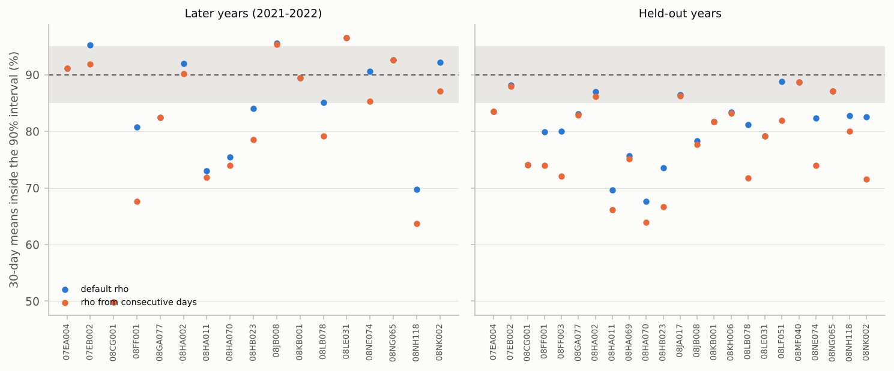

# V18. Prediction intervals on independent rivers (British Columbia)

[Validation summary](../REPORT.md) · pyair2stream 0.5.1, commit e1abcd6, 2026-10-10 13:28 UTC · run time 106.1 minutes

**Result: FAIL.**

- (A) DE-MCMC converged with both rho at 17 of 23 stations. In 2021-2022, pooled over those stations, the default intervals contained 50% 48.7%, 80% 76.7%, 90% 86.9%, 95% 92.0%, 99% 97.0% of measured days; 90% intervals contained 87.0% of 7-day means and 84.8% of 30-day means (rho from consecutive days: 86.1% and 81.9%).
- (B) Over 160 held-out years, the default intervals contained 50% 49.8%, 80% 76.8%, 90% 86.3%, 95% 91.5%, 99% 96.6% of days; 90% intervals contained 86.2% of 7-day means and 82.3% of 30-day means (rho from consecutive days: 85.5% and 79.5%). Corrected 90% ranges of yearly statistics held in 76%-85% of held-out years (uncorrected 75%-81%). Criteria not met:
- (A) days, 95% interval: 92.0% (accepted 92.5%-97.5%);
- (A) 30-day means, 90% interval: 84.8%;
- (B) days, 95% interval: 91.5% (accepted 92.5%-97.5%);
- (B) 7-day means, 95% interval: 91.5% (accepted 92.5%-97.5%);
- (B) 30-day means, 90% interval: 82.3% (accepted 85.0%-95.0%);
- (B) 30-day means, 95% interval: 88.8% (accepted 92.5%-97.5%);
- (B) highest daily mean, corrected 80% range: 69% (expected by chance 71%-88%);
- (B) highest daily mean, corrected 90% range: 81% (expected by chance 83%-96%);
- (B) days above threshold, corrected 80% range: 65% (expected by chance 71%-88%);
- (B) days above threshold, corrected 90% range: 76% (expected by chance 83%-96%);
- (B) days above threshold, corrected 95% range: 87% (expected by chance 90%-99%).

## Question

The rule that sets the error model's persistence (rho from week-to-week persistence, the default) was chosen and first tested on the three Swiss rivers. On 23 rivers it was not developed on, do the prediction intervals hold at their stated levels, for days, 7-day means and 30-day means, in later years never used for calibration and in years held out by cross-validation? Do the corrected ranges of yearly statistics hold? And does the default rho do better over several weeks than rho from consecutive days?

## Method

The 23 British Columbia streams of Callahan and Moore (2025; data/british_columbia/), version 8 (the version they published), each station's calibration years from the first 1 January, the RMS objective, Crank-Nicolson, the authors' parameter ranges and the calibration Qmedia, as in V15.

- (A) Later years: DE-MCMC with the default least-squares likelihood (32 walkers, run until converged, at most 100000 steps, as V15) on the calibration years, then a FORWARD run of 1000 series from the chain for 1 January 2021 to 31 October 2022 (including the June 2021 heat dome), with the chain's sigma and rho. The share of measured days inside the central 50, 80, 90, 95 and 99% ranges is recorded, and the same for 7-day and 30-day moving means (computed in each series; a mean counts if all its days were measured), for summer (June-August) and for the heat-dome days.
- (B) Held-out years: the package's leave-one-year-out cross-validation (run_mode DE, every year but the first held out once). Each held-out year gets 1000 simulations from its fold's parameters plus AR(1) error with the sigma and rho of the fold's training years (cross_validation.check_interval_coverage and check_yearly_statistics; parameter uncertainty not included), scored as in (A); the yearly statistics (highest daily mean, highest 7-day mean, days above the 90th percentile, in the four warmest months) are corrected with scenario.correct_statistic from the other held-out years of the same station only, as in V11. Both parts are run with rho_timescale 'weekly' (the default) and 'daily' (rho from consecutive days). In part B the folds' parameters are the same for both; only each fold's rho differs, recomputed from its training years with the package's own function and checked to reproduce the cross-validation's weekly value exactly. Shares are pooled over stations, weighted by the number of values.

## Pass criterion

Fixed before the check was first run. With the default rho:

- (A) for the stations whose DE-MCMC converged, pooled, the share of 2021-2022 days inside the interval is within the accepted range at 50%, 80%, 90%, 95% (a miss rate between half and 1.5 times the stated one, as V5), and the share of 7-day and of 30-day means inside the 90% interval is between 85% and 95%.
- (B) Pooled over every held-out year, days, 7-day and 30-day means inside the 80%, 90%, 95% intervals are within the accepted range, and for each yearly statistic the corrected share of years inside the central 80%, 90%, 95% ranges is within the central 99% binomial range (as V11).
- (C) For 30-day means, in both parts, the share inside the 90% interval is not further from 90% with the default rho than with rho from consecutive days (the default takes the larger of the two estimates, so where the day-to-day one is larger they are the same). The 99% intervals (shown too narrow in V5 and V11), single stations, unconverged stations, summer, the heat dome and the uncorrected yearly statistics are reported, not judged.

## Results

### A. Later years (2021-2022), from DE-MCMC on the calibration years

Share of measured values inside the central range at each level, pooled over the stations whose DE-MCMC converged with both rho, and the 90% coverage of each station. 7-day and 30-day means are moving means computed in each simulated series, counted where every day was measured. 2021 contains the June heat dome, the hottest week on record at many of these stations.

*British Columbia, 23 rivers not used to develop the error model: stated level against the share of measured values inside the interval, for days and for 7-day and 30-day means, with rho from weekly persistence (the default) and from consecutive days. Top: later years 2021-2022 (stations whose MCMC converged). Bottom: years held out by cross-validation. Dashed: stated = achieved; shaded: the accepted range.*

*Each station's share of 30-day means inside the 90% interval, with the default rho and with rho from consecutive days (shaded: 85-95%). Single stations have few independent months, so they scatter; the pooled shares are judged.*

**A. Pooled over converged stations** ([csv](../results/V18_1.csv))

| rho | values | n | 50% | 80% | 90% | 95% | 99% |
|---|---|---|---|---|---|---|---|
| weekly | days | 10117 | 48.7% | 76.7% | 86.9% | 92.0% | 97.0% |
| weekly | 7-day means | 9701 | 47.4% | 76.1% | 87.0% | 92.0% | 96.9% |
| weekly | 30-day means | 8439 | 41.7% | 73.1% | 84.8% | 90.4% | 95.2% |
| weekly | summer days | 3023 | 42.0% | 70.8% | 83.4% | 90.3% | 96.9% |
| weekly | heat-dome days | 136 | 35.3% | 66.2% | 81.6% | 89.0% | 97.8% |
| daily | days | 10117 | 48.5% | 76.3% | 86.7% | 91.9% | 97.0% |
| daily | 7-day means | 9701 | 46.4% | 74.7% | 86.1% | 91.5% | 96.4% |
| daily | 30-day means | 8439 | 39.2% | 68.8% | 81.9% | 88.6% | 93.8% |
| daily | summer days | 3023 | 41.4% | 70.5% | 83.4% | 90.1% | 96.7% |
| daily | heat-dome days | 136 | 34.6% | 67.6% | 80.9% | 88.2% | 98.5% |

**A. By station, 90% intervals** ([csv](../results/V18_2.csv))

| station | rho | converged (steps) | rho value | sigma (°C) | days inside 90% | 7-day means inside 90% | 30-day means inside 90% | summer days inside 90% | heat-dome days inside 90% | mean 90% width (°C) | median minus measured (°C) |
|---|---|---|---|---|---|---|---|---|---|---|---|
| 07EA004 | weekly | yes (11000) | 0.921 | 0.847 | 91% of 668 | 90% of 656 | 91% of 610 | 90% of 183 | 62% of 8 | 2.36 | 0.01 |
| 07EA004 | daily | yes (11000) | 0.921 | 0.847 | 91% of 668 | 90% of 656 | 91% of 610 | 90% of 183 | 62% of 8 | 2.36 | 0.01 |
| 07EB002 | weekly | yes (20000) | 0.947 | 0.737 | 91% of 280 | 95% of 241 | 95% of 147 | 84% of 135 | 88% of 8 | 2.66 | 0.39 |
| 07EB002 | daily | yes (27000) | 0.944 | 0.737 | 90% of 280 | 93% of 241 | 92% of 147 | 82% of 135 | 88% of 8 | 2.66 | 0.39 |
| 08CG001 | weekly | yes (13000) | 0.817 | 0.655 | 72% of 521 | 66% of 497 | 50% of 413 | 84% of 183 | 88% of 8 | 2.18 | -0.41 |
| 08CG001 | daily | yes (13000) | 0.817 | 0.655 | 72% of 521 | 66% of 497 | 50% of 413 | 84% of 183 | 88% of 8 | 2.18 | -0.41 |
| 08FF001 | weekly | yes (10000) | 0.907 | 0.846 | 85% of 488 | 86% of 470 | 81% of 401 | 89% of 182 | 100% of 8 | 2.9 | -0.43 |
| 08FF001 | daily | yes (10000) | 0.867 | 0.846 | 84% of 488 | 85% of 470 | 68% of 401 | 89% of 182 | 100% of 8 | 2.86 | -0.41 |
| 08FF003 | weekly | NO (100000) | 0.843 | 0.703 | 88% of 668 | 86% of 656 | 78% of 610 | 81% of 183 | 75% of 8 | 2.26 | 0.18 |
| 08FF003 | daily | NO (100000) | 0.797 | 0.703 | 87% of 668 | 84% of 656 | 76% of 610 | 78% of 183 | 88% of 8 | 2.24 | 0.18 |
| 08GA077 | weekly | yes (59000) | 0.929 | 0.842 | 88% of 618 | 87% of 551 | 82% of 417 | 86% of 182 | 88% of 8 | 2.88 | 0.42 |
| 08GA077 | daily | yes (59000) | 0.929 | 0.842 | 88% of 618 | 87% of 551 | 82% of 417 | 86% of 182 | 88% of 8 | 2.88 | 0.42 |
| 08HA002 | weekly | yes (32000) | 0.923 | 0.721 | 91% of 668 | 91% of 656 | 92% of 610 | 83% of 183 | 75% of 8 | 2.49 | 0.13 |
| 08HA002 | daily | yes (61000) | 0.915 | 0.721 | 91% of 668 | 91% of 656 | 90% of 610 | 84% of 183 | 75% of 8 | 2.46 | 0.13 |
| 08HA011 | weekly | yes (56000) | 0.902 | 0.884 | 75% of 524 | 74% of 506 | 73% of 437 | 57% of 183 | 62% of 8 | 3.09 | 0.5 |
| 08HA011 | daily | yes (35000) | 0.876 | 0.884 | 75% of 524 | 74% of 506 | 72% of 437 | 57% of 183 | 62% of 8 | 3.06 | 0.5 |
| 08HA069 | weekly | NO (100000) | 0.897 | 0.638 | 91% of 557 | 89% of 493 | 73% of 344 | 90% of 165 | 0% of 8 | 2.22 | 0.49 |
| 08HA069 | daily | NO (100000) | 0.897 | 0.638 | 91% of 557 | 89% of 493 | 73% of 344 | 90% of 165 | 0% of 8 | 2.22 | 0.49 |
| 08HA070 | weekly | yes (10000) | 0.913 | 0.587 | 81% of 500 | 80% of 476 | 75% of 407 | 84% of 154 | 75% of 8 | 2.07 | 0.25 |
| 08HA070 | daily | yes (17000) | 0.877 | 0.587 | 81% of 500 | 80% of 476 | 74% of 407 | 83% of 154 | 75% of 8 | 2.03 | 0.25 |
| 08HB023 | weekly | yes (20000) | 0.906 | 0.819 | 89% of 666 | 89% of 642 | 84% of 550 | 83% of 182 | 100% of 8 | 2.87 | -0.37 |
| 08HB023 | daily | yes (55000) | 0.882 | 0.819 | 90% of 666 | 88% of 642 | 79% of 550 | 86% of 182 | 100% of 8 | 2.85 | -0.36 |
| 08JA017 | weekly | NO (100000) | 0.964 | 1.144 | 94% of 547 | 95% of 529 | 99% of 460 | 82% of 183 | 62% of 8 | 3.85 | -0.5 |
| 08JA017 | daily | NO (100000) | 0.961 | 1.144 | 93% of 547 | 95% of 529 | 98% of 460 | 83% of 183 | 62% of 8 | 3.8 | -0.52 |
| 08JB008 | weekly | yes (11000) | 0.929 | 1.24 | 91% of 668 | 92% of 656 | 96% of 610 | 78% of 183 | 25% of 8 | 3.92 | -0.33 |
| 08JB008 | daily | yes (15000) | 0.922 | 1.24 | 90% of 668 | 91% of 656 | 95% of 610 | 77% of 183 | 25% of 8 | 3.87 | -0.35 |
| 08KB001 | weekly | yes (31000) | 0.952 | 0.814 | 91% of 533 | 91% of 497 | 89% of 397 | 85% of 178 | 75% of 8 | 2.49 | 0.02 |
| 08KB001 | daily | yes (31000) | 0.952 | 0.814 | 91% of 533 | 91% of 497 | 89% of 397 | 85% of 178 | 75% of 8 | 2.49 | 0.02 |
| 08KH006 | weekly | NO (100000) | 0.884 | 1.055 | 92% of 667 | 93% of 655 | 92% of 609 | 74% of 182 | 38% of 8 | 3.32 | 0.14 |
| 08KH006 | daily | NO (100000) | 0.884 | 1.055 | 92% of 667 | 93% of 655 | 92% of 609 | 74% of 182 | 38% of 8 | 3.32 | 0.14 |
| 08LB078 | weekly | yes (11000) | 0.91 | 0.849 | 87% of 667 | 87% of 655 | 85% of 609 | 89% of 182 | 100% of 8 | 2.77 | -0.22 |
| 08LB078 | daily | yes (11000) | 0.847 | 0.849 | 86% of 667 | 84% of 655 | 79% of 609 | 90% of 182 | 100% of 8 | 2.71 | -0.22 |
| 08LE031 | weekly | yes (56000) | 0.945 | 1.007 | 91% of 652 | 93% of 588 | 96% of 428 | 86% of 181 | 100% of 8 | 3.36 | 0.07 |
| 08LE031 | daily | yes (56000) | 0.945 | 1.007 | 91% of 652 | 93% of 588 | 96% of 428 | 86% of 181 | 100% of 8 | 3.36 | 0.07 |
| 08LF051 | weekly | NO (100000) | 0.957 | 1.005 | 86% of 667 | 85% of 655 | 83% of 609 | 87% of 182 | 100% of 8 | 3.51 | -0.69 |
| 08LF051 | daily | NO (100000) | 0.912 | 1.005 | 88% of 667 | 87% of 655 | 78% of 609 | 95% of 182 | 100% of 8 | 3.51 | -0.71 |
| 08MF040 | weekly | NO (100000) | 0.964 | 0.949 | 96% of 656 | 98% of 638 | 100% of 569 | 90% of 184 | 50% of 8 | 3.1 | -0.16 |
| 08MF040 | daily | NO (100000) | 0.964 | 0.949 | 96% of 656 | 98% of 638 | 100% of 569 | 90% of 184 | 50% of 8 | 3.1 | -0.16 |
| 08NE074 | weekly | yes (14000) | 0.875 | 0.815 | 89% of 669 | 93% of 663 | 91% of 640 | 89% of 184 | 100% of 8 | 2.61 | 0.31 |
| 08NE074 | daily | yes (13000) | 0.828 | 0.815 | 90% of 669 | 92% of 663 | 85% of 640 | 91% of 184 | 100% of 8 | 2.59 | 0.31 |
| 08NG065 | weekly | yes (17000) | 0.943 | 0.92 | 90% of 660 | 90% of 636 | 93% of 544 | 92% of 183 | 62% of 8 | 2.97 | 0.03 |
| 08NG065 | daily | yes (17000) | 0.943 | 0.92 | 90% of 660 | 90% of 636 | 93% of 544 | 92% of 183 | 62% of 8 | 2.97 | 0.03 |
| 08NH118 | weekly | yes (17000) | 0.943 | 0.79 | 78% of 667 | 77% of 655 | 70% of 609 | 69% of 182 | 100% of 8 | 2.71 | 0.59 |
| 08NH118 | daily | yes (29000) | 0.917 | 0.79 | 77% of 667 | 76% of 655 | 64% of 609 | 65% of 182 | 100% of 8 | 2.68 | 0.58 |
| 08NK002 | weekly | yes (9000) | 0.914 | 0.84 | 93% of 668 | 93% of 656 | 92% of 610 | 90% of 183 | 88% of 8 | 2.61 | 0.09 |
| 08NK002 | daily | yes (10000) | 0.853 | 0.84 | 92% of 668 | 90% of 656 | 87% of 610 | 90% of 183 | 75% of 8 | 2.56 | 0.1 |

**Accepted coverage (miss rate between half and 1.5 times the stated one)** ([csv](../results/V18_3.csv))

| level | accepted share inside | judged |
|---|---|---|
| 50% | 25.0%-75.0% | yes |
| 80% | 70.0%-90.0% | yes |
| 90% | 85.0%-95.0% | yes |
| 95% | 92.5%-97.5% | yes |
| 99% | 98.5%-99.5% | no (reported) |

### B. Held-out years of the calibration period (leave-one-year-out cross-validation)

The same shares for every year held out in turn, from each fold's parameters and its training years' sigma and rho (no parameter uncertainty, so slightly narrower than a FORWARD run's), and the yearly statistics before and after the correction estimated from the other held-out years of the station.

**B. Pooled over every held-out year** ([csv](../results/V18_4.csv))

| rho | values | n | 50% | 80% | 90% | 95% | 99% |
|---|---|---|---|---|---|---|---|
| weekly | days | 51576 | 49.8% | 76.8% | 86.3% | 91.5% | 96.6% |
| weekly | 7-day means | 49048 | 48.4% | 76.5% | 86.2% | 91.5% | 96.5% |
| weekly | 30-day means | 41478 | 41.9% | 71.4% | 82.3% | 88.8% | 94.8% |
| daily | days | 51576 | 49.8% | 76.9% | 86.2% | 91.5% | 96.7% |
| daily | 7-day means | 49048 | 47.6% | 75.6% | 85.5% | 91.0% | 96.2% |
| daily | 30-day means | 41478 | 40.0% | 68.3% | 79.5% | 86.7% | 93.7% |

**B. Yearly statistics, share of held-out years inside the central range** ([csv](../results/V18_5.csv))

| rho | statistic | years | 80%, uncorrected | 80%, corrected | 80%, expected by chance | 90%, uncorrected | 90%, corrected | 90%, expected by chance | 95%, uncorrected | 95%, corrected | 95%, expected by chance | mean PIT | mean PIT, corrected |
|---|---|---|---|---|---|---|---|---|---|---|---|---|---|
| weekly | highest daily mean | 135 | 65.9% | 68.9% | 71%-88% | 80.7% | 81.5% | 83%-96% | 85.2% | 93.3% | 90%-99% | 0.5 | 0.5 |
| weekly | highest 7-day mean | 135 | 69.6% | 72.6% | 71%-88% | 81.5% | 85.2% | 83%-96% | 85.9% | 95.6% | 90%-99% | 0.5 | 0.5 |
| weekly | days above threshold | 135 | 63.7% | 65.2% | 71%-88% | 74.8% | 75.6% | 83%-96% | 83.7% | 86.7% | 90%-99% | 0.55 | 0.48 |
| daily | highest daily mean | 135 | 64.4% | 68.1% | 71%-88% | 77.0% | 81.5% | 83%-96% | 83.7% | 90.4% | 90%-99% | 0.48 | 0.5 |
| daily | highest 7-day mean | 135 | 66.7% | 71.1% | 71%-88% | 78.5% | 83.0% | 83%-96% | 85.2% | 93.3% | 90%-99% | 0.49 | 0.5 |
| daily | days above threshold | 135 | 60.0% | 63.7% | 71%-88% | 71.9% | 74.8% | 83%-96% | 80.0% | 85.9% | 90%-99% | 0.55 | 0.48 |

**B. By station, 90% intervals** ([csv](../results/V18_6.csv))

| station | held-out years | mean rho (weekly) | days inside 90% (weekly) | 7-day means inside 90% (weekly) | 30-day means inside 90% (weekly) | mean rho (daily) | days inside 90% (daily) | 7-day means inside 90% (daily) | 30-day means inside 90% (daily) |
|---|---|---|---|---|---|---|---|---|---|
| 07EA004 | 9 | 0.922 | 88% | 87% | 83% | 0.922 | 88% | 87% | 83% |
| 07EB002 | 9 | 0.947 | 85% | 87% | 88% | 0.943 | 85% | 86% | 88% |
| 08CG001 | 4 | 0.808 | 87% | 86% | 74% | 0.808 | 87% | 86% | 74% |
| 08FF001 | 6 | 0.902 | 86% | 87% | 80% | 0.865 | 86% | 85% | 74% |
| 08FF003 | 6 | 0.842 | 87% | 89% | 80% | 0.795 | 87% | 86% | 72% |
| 08GA077 | 7 | 0.925 | 87% | 87% | 83% | 0.924 | 87% | 87% | 83% |
| 08HA002 | 9 | 0.922 | 89% | 89% | 87% | 0.914 | 89% | 89% | 86% |
| 08HA011 | 5 | 0.895 | 81% | 78% | 70% | 0.871 | 81% | 78% | 66% |
| 08HA069 | 6 | 0.896 | 86% | 86% | 76% | 0.895 | 86% | 86% | 75% |
| 08HA070 | 4 | 0.906 | 81% | 79% | 68% | 0.874 | 81% | 78% | 64% |
| 08HB023 | 4 | 0.903 | 80% | 80% | 74% | 0.878 | 80% | 79% | 67% |
| 08JA017 | 9 | 0.964 | 86% | 86% | 86% | 0.961 | 85% | 86% | 86% |
| 08JB008 | 4 | 0.925 | 84% | 83% | 78% | 0.92 | 85% | 82% | 78% |
| 08KB001 | 9 | 0.951 | 86% | 85% | 82% | 0.951 | 86% | 85% | 82% |
| 08KH006 | 8 | 0.882 | 87% | 86% | 83% | 0.881 | 87% | 86% | 83% |
| 08LB078 | 4 | 0.91 | 84% | 83% | 81% | 0.839 | 83% | 81% | 72% |
| 08LE031 | 9 | 0.944 | 83% | 82% | 79% | 0.944 | 83% | 82% | 79% |
| 08LF051 | 9 | 0.956 | 87% | 90% | 89% | 0.911 | 87% | 88% | 82% |
| 08MF040 | 9 | 0.963 | 88% | 89% | 89% | 0.963 | 88% | 89% | 89% |
| 08NE074 | 7 | 0.872 | 87% | 89% | 82% | 0.826 | 87% | 87% | 74% |
| 08NG065 | 7 | 0.943 | 89% | 89% | 87% | 0.943 | 89% | 89% | 87% |
| 08NH118 | 9 | 0.943 | 86% | 86% | 83% | 0.917 | 86% | 85% | 80% |
| 08NK002 | 7 | 0.91 | 87% | 88% | 83% | 0.849 | 87% | 87% | 72% |

### C. Why intervals miss: the errors of new periods against the error model

For each predicted period (part A: 2021-2022 at each station; part B: each held-out year), the RMSE of the best fit against the measurements, divided by the sigma the period was predicted with (from the calibration or training years), and the period's mean error divided by the standard deviation the error model (sigma, rho) gives the mean of that many days (z). If the error model described the new periods, the ratio would be about 1, and z would be about 1 in size (|z| > 2 in about 5% of periods). Added after the first full run to explain its result; not part of the criterion.

**C. Pooled** ([csv](../results/V18_7.csv))

| part | periods | held-out RMSE / sigma | 90% coverage this ratio alone gives | size of each period's mean error / what the error model allows (RMS of z) | periods with \|z\| > 2 |
|---|---|---|---|---|---|
| A. later years (2021-2022), converged stations | 17 | 1.14 | 85.1% | 2.13 | 7 of 17 (error model: about 5%) |
| B. held-out years | 160 | 1.11 | 86.1% | 1.97 | 43 of 160 (error model: about 5%) |

**C. By station, held-out years** ([csv](../results/V18_8.csv))

| station | held-out years | training sigma (°C) | held-out RMSE (°C) | held-out RMSE / sigma | yearly mean errors (°C) | SD the error model gives a yearly mean (°C) | RMS of z |
|---|---|---|---|---|---|---|---|
| 07EA004 | 9 | 0.846 | 0.889 | 1.05 | +0.22 -0.06 +0.33 -0.22 -0.47 +0.22 +0.18 -0.36 +0.08 | 0.22 | 1.26 |
| 07EB002 | 9 | 0.731 | 0.836 | 1.14 | +0.01 -0.53 -0.15 -0.16 -0.29 +0.45 +0.41 -0.17 +0.33 | 0.31 | 1.08 |
| 08CG001 | 4 | 0.647 | 0.717 | 1.13 | +0.14 +0.29 -0.30 +0.03 | 0.12 | 2.06 |
| 08FF001 | 6 | 0.84 | 0.936 | 1.09 | -0.03 -0.36 +0.08 +0.57 -0.56 -0.41 | 0.2 | 1.97 |
| 08FF003 | 6 | 0.698 | 0.755 | 1.09 | -0.30 -0.40 +0.40 +0.15 -0.24 +0.02 | 0.13 | 2.28 |
| 08GA077 | 7 | 0.827 | 0.917 | 1.11 | -0.07 -0.59 -0.28 +0.78 +0.31 -0.10 +0.20 | 0.23 | 1.88 |
| 08HA002 | 9 | 0.718 | 0.761 | 1.09 | +0.45 -0.17 +0.19 -0.22 -0.04 +0.27 -0.06 +0.04 -0.17 | 0.2 | 0.95 |
| 08HA011 | 5 | 0.866 | 1.039 | 1.28 | -0.16 +0.10 +0.31 +0.16 +0.24 | 0.23 | 0.83 |
| 08HA069 | 6 | 0.629 | 0.74 | 1.18 | -0.71 -0.49 +0.17 -0.01 +0.19 +0.54 | 0.14 | 3.21 |
| 08HA070 | 4 | 0.577 | 0.68 | 1.18 | +0.69 +0.03 -0.42 -0.44 | 0.13 | 3.73 |
| 08HB023 | 4 | 0.798 | 0.995 | 1.26 | +0.85 -0.41 -0.69 -0.28 | 0.19 | 3.38 |
| 08JA017 | 9 | 1.143 | 1.213 | 1.07 | -0.50 -0.45 -0.50 -0.81 -0.45 -0.12 +0.44 -0.25 -0.06 | 0.43 | 1.09 |
| 08JB008 | 4 | 1.214 | 1.535 | 1.24 | +1.01 +0.27 -1.10 -0.79 | 0.34 | 2.55 |
| 08KB001 | 9 | 0.808 | 0.888 | 1.11 | +0.39 +0.21 +0.43 -0.40 -0.72 +0.03 +0.17 -0.29 +0.16 | 0.27 | 1.4 |
| 08KH006 | 8 | 1.048 | 1.151 | 1.1 | -0.42 -0.11 -0.66 -0.43 +0.40 +0.47 -0.19 +0.42 | 0.23 | 1.86 |
| 08LB078 | 4 | 0.836 | 1.039 | 1.24 | +0.67 +0.01 -0.39 +0.28 | 0.2 | 2.06 |
| 08LE031 | 9 | 1 | 1.157 | 1.14 | +0.49 -0.78 -0.48 -0.90 -0.83 +1.13 -0.06 -0.27 +0.79 | 0.35 | 2.07 |
| 08LF051 | 9 | 0.999 | 1.081 | 1.07 | +0.49 -0.49 +0.04 -0.16 -0.27 +0.71 -0.26 -0.71 -0.27 | 0.35 | 1.33 |
| 08MF040 | 9 | 0.944 | 1.031 | 1.09 | -0.04 -0.52 +0.13 -0.45 -0.83 +0.09 +0.29 -0.26 +0.23 | 0.37 | 1.12 |
| 08NE074 | 7 | 0.812 | 0.854 | 1.05 | +0.17 -0.17 -0.69 +0.12 -0.07 -0.12 +0.48 | 0.16 | 2.14 |
| 08NG065 | 7 | 0.92 | 0.961 | 1.05 | +0.02 +0.19 -0.47 +0.52 +0.27 -0.06 -0.39 | 0.29 | 1.2 |
| 08NH118 | 9 | 0.788 | 0.906 | 1.1 | +1.01 -0.01 +0.29 +0.43 -1.00 -0.27 -0.42 -0.12 +0.58 | 0.24 | 2.42 |
| 08NK002 | 7 | 0.835 | 0.932 | 1.09 | -1.18 +0.42 -0.33 +0.44 +0.21 +0.18 +0.21 | 0.23 | 3.12 |

## What this means

The default rho is the larger of the day-to-day and week-to-week estimates. It was above the day-to-day value at 14 of 23 stations' calibrations (part A) and in 94 of 160 folds (part B); elsewhere the two error models are the same. The errors of these rivers persist more from one day to the next than those of the Swiss rivers (part A: day-to-day rho 0.80-0.96, against 0.70-0.86 there), so the rule changes less here.

Section C compares the errors of new periods with the error model. In the held-out years the daily errors were 1.11 times the size of the training years' residuals, which alone brings a 90% interval down to about 86%; and the size of each year's mean error was 2.0 times what the error model allows a yearly mean (43 of 160 years with |z| > 2, against about 5% expected). The model's error shifts from one year to the next by more than errors that persist for weeks produce. A single rho, however it is chosen, cannot describe that, and sigma estimated from the calibration years does not include it. On the Swiss rivers, on which the error model was developed, held-out daily 90% intervals held on 90% of days (V11).

These rivers played no part in choosing the error model. Over 30 days, 90% intervals held for 85% (later years) and 82% (held-out years) of means with the default rho, against 82% and 80% with rho from consecutive days. Daily values depend little on rho, because sigma sets their spread; means over several weeks depend on how long errors persist, which is what the default rho is chosen to describe.

At 6 stations the DE-MCMC did not converge within the step limit with at least one rho (V15 found the same: the data there do not pin down all eight parameters). A user would be told not to use those intervals; they are shown in the table by station but left out of the pooled shares. Part B needs no MCMC and includes every station.

Part A tests later years, as a prediction would be used; with the June 2021 heat dome, it also includes days warmer than any in the calibration years at many stations (V10). Part B tests many more years, each predicted from the others. Neither can test the parameter intervals themselves, which needs a known truth (V4).
