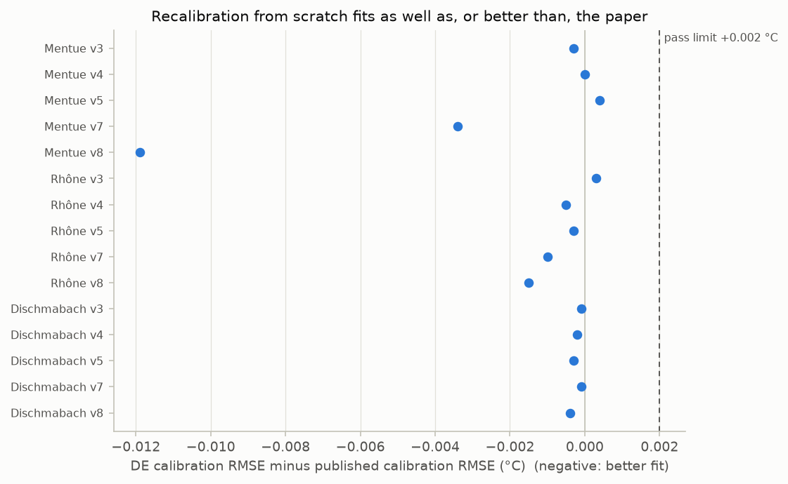
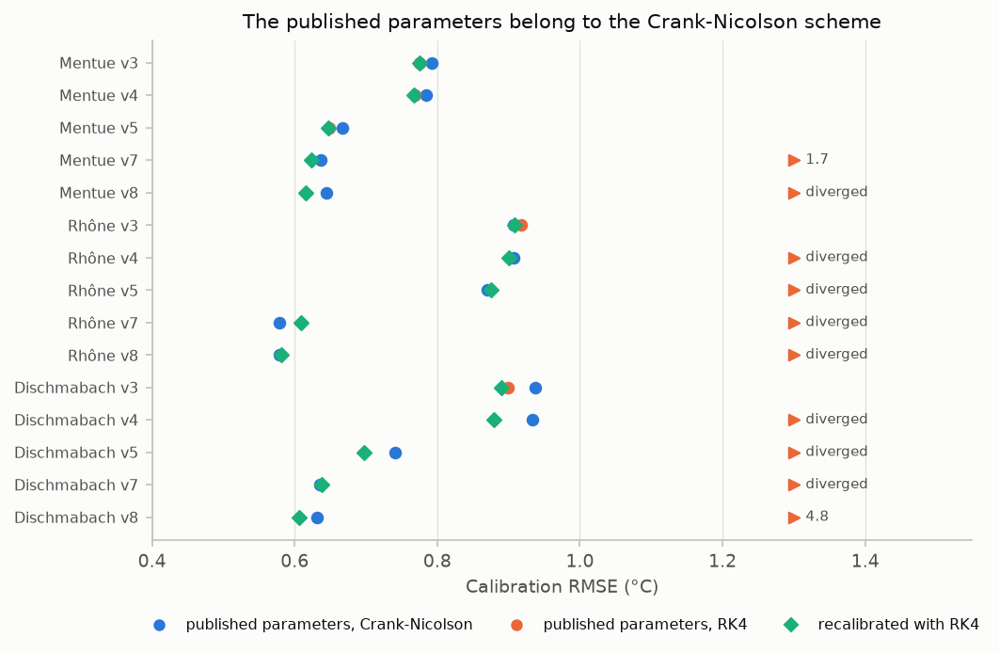

# V2. Reproduces published results

[Validation summary](../REPORT.md) · pyair2stream 0.5.0, commit 5fc7dcb, 2026-10-06 03:58 UTC · run time 30.7 minutes

**Result: PASS.**

- (A) All 30 published RMSE values reproduced (largest difference 0.0005 °C).
- (B) DE matched or improved on the published calibration in 15 of 15 cases (mean difference -0.001 °C).
- (C) The recalibrated parameters match the published ones in 10 of 15 cases. Where they differ, the fits are within 0.012 °C of each other and the predictions for the validation years within 0.002 °C. The original program, scoring both sets itself, gives the same RMSE as pyair2stream (largest difference 0.000005 °C); where the parameters differ, it finds the recalibrated parameters the better fit in 4 of 5 cases, a tie (within 0.0001 °C) in 1.
- (D) The original program, run as distributed, reproduced the published parameters in all 3 runs in 8 of 15 cases; elsewhere its own runs differ from each other.
- (E) The published parameters are Crank-Nicolson parameters: with RK4 they diverge in 8 of 15 cases and give a different error in the rest. Calibrating with RK4 returns parameters within 1% of range of the published ones in 3 of 15 cases.
- (F) The published values lie inside pyair2stream's 90% intervals for 67 of 81 parameter values (cross-validation jackknife) and 76 of 81 (MCMC, converged runs); 76 of 81 lie inside at least one.

## Question

Given the published parameters, does pyair2stream reproduce the published model errors for every model version? Does its own calibration fit at least as well, and find the published parameters? Do the published parameters lie inside pyair2stream's uncertainty intervals?

## Method

Piccolroaz et al. (2016) calibrated every air2stream version (by RMSE, with the Crank-Nicolson scheme) on three Swiss rivers and published the parameters and the RMSE for the calibration and validation periods (data/switzerland/published/).

- (A) Each published parameter set is simulated with CRN and its RMSE computed. For the validation period the original program recomputed Qmedia from the validation data, so that is done here too; pyair2stream by default keeps the calibration Qmedia (reported separately).
- (B) Each version is recalibrated from scratch by DE (RMS objective, CRN, the authors' parameter ranges).
- (C) The recalibrated parameters are compared with the published ones. Where they differ, a local search (L-BFGS-B) is started from the published parameters to see whether their fit can be improved, the fit is traced along the straight line between the two parameter sets, and both sets predict the validation years (with the calibration Qmedia). As an independent referee, the original Fortran program (FORWARD mode, with its own copy of the data) computes the calibration RMSE of both parameter sets.
- (D) The paper calibrated with Particle Swarm Optimisation (PSO). The original Fortran program is run in calibration mode exactly as distributed with its Swiss example (PSO, 500 particles, 500 iterations, c1 = c2 = 2, inertia 0.9 to 0.4, RMSE, Crank-Nicolson, the same parameter ranges; the paper itself does not state the swarm size or iterations), 3 times per river and version, since it seeds its random numbers from the clock. pyair2stream's PSO is run 3 times with the same settings on the Mentue only, to keep the run time down.
- (E) The same with the RK4 scheme instead of Crank-Nicolson (the original program's readme lists RK4 in its example): the published parameters are simulated with both schemes, each version is recalibrated by DE with RK4, the original program's PSO is run 3 times per case with RK4, and pyair2stream's PSO with RK4 for the Mentue's versions 7 and 8.
- (F) The published parameters are least-squares estimates (the paper minimised RMSE and used no error model), so they are compared with intervals around the same estimator, on the same calibration years, with the RMS objective, CRN, the authors' ranges and the calibration Qmedia: the jackknife interval from leave-one-year-out cross-validation (cross_validation.cross_validate), and the MCMC credible interval with the least-squares likelihood widened for the autocorrelation of the errors (likelihood: least_squares, 32 walkers, run until converged, at most 20,000 steps). V4 tests both kinds of interval against a known truth.

## Pass criterion

- (A) all 30 published RMSE reproduced to within 0.001 °C.
- (B) DE calibration RMSE no worse than published + 0.002 °C in all 15 cases.
- (C) Wherever a recalibrated parameter differs from the published value by more than 1% of its range, the two parameter sets predict the validation years with RMSE within 0.01 °C of each other; and, where gfortran is available, the original program computes the same calibration RMSE as pyair2stream for both parameter sets, to within 0.0001 °C. (D),
- (E) and
- (F) are descriptive.

## Results

### A. The published parameters give the published errors

Each published parameter set was run through pyair2stream on the same data. No optimiser is involved, so this tests the model equations, the solution scheme, the data handling and the error calculation directly.

*Left: each point is one river, model version and period; all lie on the 1:1 line. Right: the differences, all within the rounding of the published three-decimal values (shaded).*

**A. Published parameters: RMSE (°C)** ([csv](../results/V2_1.csv))

| river | version | published cal | pyair2stream cal | published val | pyair2stream val | val, calibration Qmedia | max \|diff\| |
|---|---|---|---|---|---|---|---|
| Mentue | 3 | 0.793 | 0.7927 | 0.933 | 0.9328 | 0.9328 | 0.0003 |
| Mentue | 4 | 0.785 | 0.785 | 0.936 | 0.9363 | 0.9351 | 0.0003 |
| Mentue | 5 | 0.666 | 0.6664 | 0.8 | 0.8001 | 0.8001 | 0.0004 |
| Mentue | 7 | 0.637 | 0.6371 | 0.783 | 0.7827 | 0.7784 | 0.0003 |
| Mentue | 8 | 0.645 | 0.645 | 0.788 | 0.7879 | 0.7809 | 0.0001 |
| Rhône | 3 | 0.907 | 0.9072 | 1.048 | 1.048 | 1.048 | 0.0004 |
| Rhône | 4 | 0.907 | 0.9065 | 1.047 | 1.047 | 1.047 | 0.0005 |
| Rhône | 5 | 0.871 | 0.8707 | 1.046 | 1.046 | 1.046 | 0.0003 |
| Rhône | 7 | 0.579 | 0.5787 | 0.748 | 0.7479 | 0.7391 | 0.0003 |
| Rhône | 8 | 0.579 | 0.5792 | 0.748 | 0.7481 | 0.7392 | 0.0002 |
| Dischmabach | 3 | 0.937 | 0.9369 | 0.941 | 0.941 | 0.941 | 0.0001 |
| Dischmabach | 4 | 0.933 | 0.9328 | 0.934 | 0.9335 | 0.9336 | 0.0005 |
| Dischmabach | 5 | 0.741 | 0.7407 | 0.759 | 0.7587 | 0.7587 | 0.0003 |
| Dischmabach | 7 | 0.635 | 0.6349 | 0.653 | 0.6529 | 0.6591 | 0.0001 |
| Dischmabach | 8 | 0.632 | 0.6316 | 0.646 | 0.6457 | 0.6514 | 0.0004 |

### B. Calibration from scratch fits at least as well

Each version was recalibrated from scratch with pyair2stream's default optimiser (DE) on the same calibration years, objective and parameter ranges as the paper.

*Calibration error of pyair2stream's own calibration (DE) minus the published calibration error. Every case is at or below zero apart from rounding; none is near the pass limit.*

**B. DE recalibration: calibration RMSE (°C)** ([csv](../results/V2_2.csv))

| river | version | published cal RMSE | DE cal RMSE | difference | parameters at a bound |
|---|---|---|---|---|---|
| Mentue | 3 | 0.793 | 0.7927 | -0.0003 | none |
| Mentue | 4 | 0.785 | 0.785 | -0 | none |
| Mentue | 5 | 0.666 | 0.6664 | 0.0004 | none |
| Mentue | 7 | 0.637 | 0.6336 | -0.0034 | none |
| Mentue | 8 | 0.645 | 0.6331 | -0.0119 | none |
| Rhône | 3 | 0.907 | 0.9073 | 0.0003 | none |
| Rhône | 4 | 0.907 | 0.9065 | -0.0005 | none |
| Rhône | 5 | 0.871 | 0.8707 | -0.0003 | a1 |
| Rhône | 7 | 0.579 | 0.578 | -0.001 | none |
| Rhône | 8 | 0.579 | 0.5775 | -0.0015 | none |
| Dischmabach | 3 | 0.937 | 0.9369 | -0.0001 | none |
| Dischmabach | 4 | 0.933 | 0.9328 | -0.0002 | a2 |
| Dischmabach | 5 | 0.741 | 0.7407 | -0.0003 | a1 |
| Dischmabach | 7 | 0.635 | 0.6349 | -0.0001 | a5, a6 |
| Dischmabach | 8 | 0.632 | 0.6316 | -0.0004 | a5, a6 |

### C. Recalibrated and published parameters

Where the recalibrated parameters differ from the published ones by more than 1% of a parameter's range, the figures show why: along the line between the two sets the fit hardly changes, and the two sets predict the validation years with the same overall error, although their predictions on individual days can differ. The original Fortran program, scoring both sets itself, agrees with pyair2stream's errors.

*RMSE along the straight line from the published parameters (left mark) to the recalibrated ones (right mark), relative to the published parameters; the y-axis covers the stretch between the two. The curves are almost flat: many parameter combinations fit nearly equally well (a 'flat valley'), which is why the two sets differ.*

*The case where the parameters differ most (Rhône, version 8, largest difference 38% of a parameter's range). On most days the two parameter sets predict almost the same temperature (typical difference 0.05 °C RMS; 100% of days within 0.2 °C), but on a few days they differ by up to 0.3 °C. Their errors over the validation years are equal (table C).*

**C. Recalibrated vs published parameters: fit and predictions** ([csv](../results/V2_3.csv))

| river | version | largest difference (% of range) | match | calibration RMSE, published | calibration RMSE, recalibrated | local search from published | seed 2 vs seed 1 (% of range) | validation RMSE, published | validation RMSE, recalibrated |
|---|---|---|---|---|---|---|---|---|---|
| Mentue | 3 | 0 | yes | 0.7927 | 0.7927 |  |  |  |  |
| Mentue | 4 | 0.02 | yes | 0.785 | 0.785 |  |  |  |  |
| Mentue | 5 | 0.01 | yes | 0.6664 | 0.6664 |  |  |  |  |
| Mentue | 7 | 5.36 | no | 0.6371 | 0.6336 | 0.6336 | 0 | 0.7784 | 0.7793 |
| Mentue | 8 | 11.73 | no | 0.645 | 0.6331 | 0.6331 | 0.01 | 0.7809 | 0.7791 |
| Rhône | 3 | 2.87 | no | 0.9072 | 0.9073 | 0.9072 | 2.88 | 1.048 | 1.048 |
| Rhône | 4 | 0.04 | yes | 0.9065 | 0.9065 |  |  |  |  |
| Rhône | 5 | 0 | yes | 0.8707 | 0.8707 |  |  |  |  |
| Rhône | 7 | 13.32 | no | 0.5787 | 0.578 | 0.578 | 0.01 | 0.7391 | 0.7396 |
| Rhône | 8 | 38.34 | no | 0.5792 | 0.5775 | 0.5778 | 0 | 0.7392 | 0.7395 |
| Dischmabach | 3 | 0.34 | yes | 0.9369 | 0.9369 |  |  |  |  |
| Dischmabach | 4 | 0 | yes | 0.9328 | 0.9328 |  |  |  |  |
| Dischmabach | 5 | 0.03 | yes | 0.7407 | 0.7407 |  |  |  |  |
| Dischmabach | 7 | 0 | yes | 0.6349 | 0.6349 |  |  |  |  |
| Dischmabach | 8 | 0 | yes | 0.6316 | 0.6316 |  |  |  |  |

**C. Parameter values, published and recalibrated (blank: not used by the version; 'NO': a parameter differs by more than 1% of its range)** ([csv](../results/V2_4.csv))

| river | version | parameters | a1 | a2 | a3 | a4 | a5 | a6 | a7 | a8 | same as published |
|---|---|---|---|---|---|---|---|---|---|---|---|
| Mentue | 3 | published | 0.953 | 0.521 | 0.639 |  |  |  |  |  |  |
| Mentue | 3 | recalibrated | 0.953 | 0.521 | 0.639 |  |  |  |  |  | yes |
| Mentue | 4 | published | 0.898 | 0.482 | 0.593 | 0.200 |  |  |  |  |  |
| Mentue | 4 | recalibrated | 0.898 | 0.481 | 0.593 | 0.200 |  |  |  |  | yes |
| Mentue | 5 | published | 3.075 | 0.668 | 1.010 |  |  | 1.616 | 0.583 |  |  |
| Mentue | 5 | recalibrated | 3.074 | 0.668 | 1.010 |  |  | 1.615 | 0.583 |  | yes |
| Mentue | 7 | published | 0.999 | 0.772 | 0.905 |  | 3.487 | 2.312 | 0.598 | 0.361 |  |
| Mentue | 7 | recalibrated | 0.920 | 0.680 | 0.800 |  | 2.669 | 1.776 | 0.601 | 0.278 | NO |
| Mentue | 8 | published | 1.067 | 0.911 | 1.060 | -0.158 | 4.387 | 2.868 | 0.599 | 0.450 |  |
| Mentue | 8 | recalibrated | 0.890 | 0.654 | 0.770 | 0.066 | 2.552 | 1.695 | 0.601 | 0.266 | NO |
| Rhône | 3 | published | 11.366 | 0.635 | 2.565 |  |  |  |  |  |  |
| Rhône | 3 | recalibrated | 10.791 | 0.603 | 2.436 |  |  |  |  |  | NO |
| Rhône | 4 | published | 12.912 | 0.722 | 2.913 | -0.337 |  |  |  |  |  |
| Rhône | 4 | recalibrated | 12.921 | 0.722 | 2.915 | -0.337 |  |  |  |  | yes |
| Rhône | 5 | published | 15.000 | 0.551 | 2.966 |  |  | 2.257 | 0.491 |  |  |
| Rhône | 5 | recalibrated | 15.000 | 0.551 | 2.966 |  |  | 2.257 | 0.491 |  | yes |
| Rhône | 7 | published | 0.682 | 0.457 | 0.365 |  | 16.727 | 4.770 | 0.531 | 2.742 |  |
| Rhône | 7 | recalibrated | 0.596 | 0.390 | 0.313 |  | 14.063 | 4.016 | 0.529 | 2.311 | NO |
| Rhône | 8 | published | 0.560 | 0.509 | 0.374 | -0.191 | 19.220 | 5.435 | 0.530 | 3.139 |  |
| Rhône | 8 | recalibrated | 0.464 | 0.316 | 0.251 | 0.325 | 11.552 | 3.302 | 0.529 | 1.896 | NO |
| Dischmabach | 3 | published | 6.440 | 0.984 | 2.477 |  |  |  |  |  |  |
| Dischmabach | 3 | recalibrated | 6.508 | 0.995 | 2.504 |  |  |  |  |  | yes |
| Dischmabach | 4 | published | 9.906 | 1.500 | 3.785 | -0.725 |  |  |  |  |  |
| Dischmabach | 4 | recalibrated | 9.906 | 1.500 | 3.785 | -0.725 |  |  |  |  | yes |
| Dischmabach | 5 | published | 15.000 | 1.131 | 4.617 |  |  | 7.660 | 0.588 |  |  |
| Dischmabach | 5 | recalibrated | 15.000 | 1.133 | 4.620 |  |  | 7.663 | 0.588 |  | yes |
| Dischmabach | 7 | published | 9.108 | 1.107 | 2.552 |  | 0.000 | 10.000 | 0.582 | 1.295 |  |
| Dischmabach | 7 | recalibrated | 9.109 | 1.107 | 2.552 |  | 0.000 | 10.000 | 0.582 | 1.295 | yes |
| Dischmabach | 8 | published | 9.442 | 1.159 | 2.658 | -0.530 | 0.000 | 10.000 | 0.582 | 1.305 |  |
| Dischmabach | 8 | recalibrated | 9.442 | 1.159 | 2.658 | -0.530 | 0.000 | 10.000 | 0.582 | 1.305 | yes |

**C. The original program as referee: calibration RMSE (°C) of the published and the recalibrated parameters, computed by the original Fortran program from its own copy of the data** ([csv](../results/V2_5.csv))

| river | version | parameters match | original program: published parameters | original program: recalibrated parameters | pyair2stream: recalibrated parameters | largest difference, pyair2stream vs original program | better fit, by the original program |
|---|---|---|---|---|---|---|---|
| Mentue | 3 | yes | 0.79267 | 0.79267 | 0.79267 | 0.000001 | tie |
| Mentue | 4 | yes | 0.78499 | 0.78499 | 0.78499 | 0.000004 | tie |
| Mentue | 5 | yes | 0.66642 | 0.66642 | 0.66642 | 0.000003 | tie |
| Mentue | 7 | no | 0.63715 | 0.63360 | 0.63360 | 0.000003 | recalibrated |
| Mentue | 8 | no | 0.64500 | 0.63312 | 0.63312 | 0.000004 | recalibrated |
| Rhône | 3 | no | 0.90723 | 0.90726 | 0.90726 | 0.000001 | tie |
| Rhône | 4 | yes | 0.90654 | 0.90654 | 0.90654 | 0.000001 | tie |
| Rhône | 5 | yes | 0.87069 | 0.87069 | 0.87069 | 0.000005 | tie |
| Rhône | 7 | no | 0.57868 | 0.57800 | 0.57800 | 0.000001 | recalibrated |
| Rhône | 8 | no | 0.57922 | 0.57745 | 0.57745 | 0.000004 | recalibrated |
| Dischmabach | 3 | yes | 0.93690 | 0.93690 | 0.93690 | 0.000004 | tie |
| Dischmabach | 4 | yes | 0.93281 | 0.93281 | 0.93281 | 0.000004 | tie |
| Dischmabach | 5 | yes | 0.74070 | 0.74070 | 0.74070 | 0.000002 | tie |
| Dischmabach | 7 | yes | 0.63493 | 0.63493 | 0.63493 | 0.000002 | tie |
| Dischmabach | 8 | yes | 0.63159 | 0.63159 | 0.63159 | 0.000004 | tie |

### D. The original calibration method, run as distributed

The original Fortran program seeds its random numbers from the clock, so each of its runs differs, and this part differs from one validation run to the next.

*Each mark is one calibration run with the original method (PSO, authors' settings), relative to the published fit (dashed line). Where the runs of the original program spread out, the published values are one such run; DE is repeatable and fits at least as well.*

**D. Calibration by the original method (PSO, authors' example settings): calibration RMSE (°C) of each run, and runs whose parameters are within 1% of their range of the published ones** ([csv](../results/V2_6.csv))

| river | version | published parameters | original program: RMSE of each run | original program: runs reproducing the published parameters | pyair2stream PSO: RMSE of each run | pyair2stream PSO: runs reproducing the published parameters | pyair2stream DE |
|---|---|---|---|---|---|---|---|
| Mentue | 3 | 0.7927 | 0.7927, 0.7927, 0.7927 | 3 of 3 | 0.7927, 0.7927, 0.7927 | 3 of 3 | 0.7927 |
| Mentue | 4 | 0.785 | 0.7850, 0.7850, 0.7850 | 3 of 3 | 0.7850, 0.7850, 0.7850 | 3 of 3 | 0.785 |
| Mentue | 5 | 0.6664 | 0.6664, 0.6665, 0.6664 | 3 of 3 | 0.6664, 0.6664, 0.6665 | 3 of 3 | 0.6664 |
| Mentue | 7 | 0.6371 | 0.6528, 0.6371, 0.6459 | 1 of 3 | 0.6559, 0.6392, 0.6582 | 0 of 3 | 0.6336 |
| Mentue | 8 | 0.645 | 0.6609, 0.6624, 0.6581 | 0 of 3 | 0.6654, 0.6576, 0.6589 | 0 of 3 | 0.6331 |
| Rhône | 3 | 0.9072 | 0.9072, 0.9072, 0.9072 | 3 of 3 |  |  | 0.9073 |
| Rhône | 4 | 0.9065 | 0.9065, 0.9065, 0.9065 | 3 of 3 |  |  | 0.9065 |
| Rhône | 5 | 0.8707 | 0.8707, 0.8708, 0.8707 | 0 of 3 |  |  | 0.8707 |
| Rhône | 7 | 0.5787 | 0.5797, 0.5795, 0.5784 | 0 of 3 |  |  | 0.578 |
| Rhône | 8 | 0.5792 | 0.5843, 0.5812, 0.5794 | 0 of 3 |  |  | 0.5775 |
| Dischmabach | 3 | 0.9369 | 0.9369, 0.9369, 0.9369 | 3 of 3 |  |  | 0.9369 |
| Dischmabach | 4 | 0.9328 | 0.9328, 0.9328, 0.9328 | 3 of 3 |  |  | 0.9328 |
| Dischmabach | 5 | 0.7407 | 0.7407, 0.7407, 0.7407 | 3 of 3 |  |  | 0.7407 |
| Dischmabach | 7 | 0.6349 | 0.6352, 0.6349, 0.6349 | 2 of 3 |  |  | 0.6349 |
| Dischmabach | 8 | 0.6316 | 0.6316, 0.6316, 0.6324 | 1 of 3 |  |  | 0.6316 |

**D. Parameter values of every run, where any run differs from the published parameters** ([csv](../results/V2_7.csv))

| river | version | parameters | a1 | a2 | a3 | a4 | a5 | a6 | a7 | a8 | calibration RMSE |
|---|---|---|---|---|---|---|---|---|---|---|---|
| Mentue | 7 | published | 0.999 | 0.772 | 0.905 |  | 3.487 | 2.312 | 0.598 | 0.361 | 0.6371 |
| Mentue | 7 | original program (Fortran PSO), run 1 | 0.725 | 0.829 | 0.948 |  | 5.102 | 3.233 | 0.591 | 0.525 | 0.6528 |
| Mentue | 7 | original program (Fortran PSO), run 2 | 0.967 | 0.770 | 0.901 |  | 3.500 | 2.306 | 0.598 | 0.361 | 0.6371 |
| Mentue | 7 | original program (Fortran PSO), run 3 | 1.167 | 0.878 | 1.031 |  | 4.272 | 2.865 | 0.598 | 0.441 | 0.6459 |
| Mentue | 7 | pyair2stream PSO, run 1 | 1.087 | 0.949 | 1.104 |  | 5.313 | 3.519 | 0.594 | 0.542 | 0.6559 |
| Mentue | 7 | pyair2stream PSO, run 2 | 0.994 | 0.789 | 0.924 |  | 3.766 | 2.494 | 0.600 | 0.388 | 0.6392 |
| Mentue | 7 | pyair2stream PSO, run 3 | 0.978 | 0.962 | 1.108 |  | 5.514 | 3.625 | 0.594 | 0.564 | 0.6582 |
| Mentue | 7 | pyair2stream DE | 0.920 | 0.680 | 0.800 |  | 2.669 | 1.776 | 0.601 | 0.278 | 0.6336 |
| Mentue | 8 | published | 1.067 | 0.911 | 1.060 | -0.158 | 4.387 | 2.868 | 0.599 | 0.450 | 0.6450 |
| Mentue | 8 | original program (Fortran PSO), run 1 | 1.211 | 1.122 | 1.298 | -0.285 | 6.129 | 3.994 | 0.596 | 0.625 | 0.6609 |
| Mentue | 8 | original program (Fortran PSO), run 2 | 1.229 | 1.113 | 1.287 | -0.301 | 6.398 | 4.202 | 0.595 | 0.657 | 0.6624 |
| Mentue | 8 | original program (Fortran PSO), run 3 | 1.213 | 1.085 | 1.255 | -0.264 | 5.735 | 3.761 | 0.596 | 0.593 | 0.6581 |
| Mentue | 8 | pyair2stream PSO, run 1 | 1.444 | 1.206 | 1.407 | -0.371 | 6.238 | 4.150 | 0.597 | 0.642 | 0.6654 |
| Mentue | 8 | pyair2stream PSO, run 2 | 1.319 | 1.071 | 1.249 | -0.251 | 5.706 | 3.793 | 0.596 | 0.587 | 0.6576 |
| Mentue | 8 | pyair2stream PSO, run 3 | 1.126 | 1.064 | 1.228 | -0.257 | 6.068 | 3.950 | 0.595 | 0.621 | 0.6589 |
| Mentue | 8 | pyair2stream DE | 0.890 | 0.654 | 0.770 | 0.066 | 2.552 | 1.695 | 0.601 | 0.266 | 0.6331 |
| Rhône | 5 | published | 15.000 | 0.551 | 2.966 |  |  | 2.257 | 0.491 |  | 0.8707 |
| Rhône | 5 | original program (Fortran PSO), run 1 | 14.525 | 0.535 | 2.874 |  |  | 2.177 | 0.490 |  | 0.8707 |
| Rhône | 5 | original program (Fortran PSO), run 2 | 14.073 | 0.519 | 2.785 |  |  | 2.108 | 0.490 |  | 0.8708 |
| Rhône | 5 | original program (Fortran PSO), run 3 | 14.187 | 0.522 | 2.806 |  |  | 2.128 | 0.491 |  | 0.8707 |
| Rhône | 5 | pyair2stream DE | 15.000 | 0.551 | 2.966 |  |  | 2.257 | 0.491 |  | 0.8707 |
| Rhône | 7 | published | 0.682 | 0.457 | 0.365 |  | 16.727 | 4.770 | 0.531 | 2.742 | 0.5787 |
| Rhône | 7 | original program (Fortran PSO), run 1 | 0.522 | 0.508 | 0.371 |  | 19.462 | 5.482 | 0.530 | 3.168 | 0.5797 |
| Rhône | 7 | original program (Fortran PSO), run 2 | 0.679 | 0.499 | 0.385 |  | 18.652 | 5.315 | 0.530 | 3.055 | 0.5795 |
| Rhône | 7 | original program (Fortran PSO), run 3 | 0.860 | 0.430 | 0.370 |  | 15.044 | 4.427 | 0.530 | 2.492 | 0.5784 |
| Rhône | 7 | pyair2stream DE | 0.596 | 0.390 | 0.313 |  | 14.063 | 4.016 | 0.529 | 2.311 | 0.5780 |
| Rhône | 8 | published | 0.560 | 0.509 | 0.374 | -0.191 | 19.220 | 5.435 | 0.530 | 3.139 | 0.5792 |
| Rhône | 8 | original program (Fortran PSO), run 1 | 2.814 | 0.694 | 0.796 | -0.606 | 19.951 | 6.425 | 0.531 | 3.446 | 0.5843 |
| Rhône | 8 | original program (Fortran PSO), run 2 | 1.778 | 0.621 | 0.612 | -0.405 | 19.983 | 6.050 | 0.529 | 3.358 | 0.5812 |
| Rhône | 8 | original program (Fortran PSO), run 3 | 0.898 | 0.513 | 0.418 | -0.114 | 18.596 | 5.476 | 0.530 | 3.072 | 0.5794 |
| Rhône | 8 | pyair2stream DE | 0.464 | 0.316 | 0.251 | 0.325 | 11.552 | 3.302 | 0.529 | 1.896 | 0.5775 |
| Dischmabach | 7 | published | 9.108 | 1.107 | 2.552 |  | 0.000 | 10.000 | 0.582 | 1.295 | 0.6349 |
| Dischmabach | 7 | original program (Fortran PSO), run 1 | 8.239 | 1.002 | 2.302 |  | 0.002 | 9.064 | 0.582 | 1.178 | 0.6352 |
| Dischmabach | 7 | original program (Fortran PSO), run 2 | 9.109 | 1.108 | 2.552 |  | 0.000 | 10.000 | 0.582 | 1.295 | 0.6349 |
| Dischmabach | 7 | original program (Fortran PSO), run 3 | 9.115 | 1.108 | 2.554 |  | 0.000 | 10.000 | 0.582 | 1.295 | 0.6349 |
| Dischmabach | 7 | pyair2stream DE | 9.109 | 1.107 | 2.552 |  | 0.000 | 10.000 | 0.582 | 1.295 | 0.6349 |
| Dischmabach | 8 | published | 9.442 | 1.159 | 2.658 | -0.530 | 0.000 | 10.000 | 0.582 | 1.305 | 0.6316 |
| Dischmabach | 8 | original program (Fortran PSO), run 1 | 9.457 | 1.161 | 2.663 | -0.531 | 0.000 | 10.000 | 0.582 | 1.305 | 0.6316 |
| Dischmabach | 8 | original program (Fortran PSO), run 2 | 9.307 | 1.138 | 2.608 | -0.506 | 0.002 | 9.993 | 0.582 | 1.305 | 0.6316 |
| Dischmabach | 8 | original program (Fortran PSO), run 3 | 8.447 | 1.036 | 2.367 | -0.451 | 0.002 | 9.093 | 0.582 | 1.190 | 0.6324 |
| Dischmabach | 8 | pyair2stream DE | 9.442 | 1.159 | 2.658 | -0.530 | 0.000 | 10.000 | 0.582 | 1.305 | 0.6316 |

### E. The scheme matters: RK4 instead of Crank-Nicolson

The original program's readme lists the RK4 scheme in its example; the paper states Crank-Nicolson.

*The published parameters reproduce the paper's errors only with Crank-Nicolson (blue). With RK4 (orange) they diverge or fit worse; RK4 needs its own calibration (aqua).*

**E. With the RK4 scheme: the published parameters scored with each scheme, and recalibration with RK4 (RMSE in °C)** ([csv](../results/V2_8.csv))

| river | version | published parameters, RMSE with CRN | published parameters, RMSE with RK4 | DE with RK4: RMSE | DE with RK4: largest difference from published (% of range) | original program, PSO with RK4: RMSE of each run | original program, PSO with RK4: runs reproducing the published parameters | pyair2stream PSO with RK4: RMSE of each run | pyair2stream PSO with RK4: runs reproducing the published parameters |
|---|---|---|---|---|---|---|---|---|---|
| Mentue | 3 | 0.7927 | 0.7755 | 0.775 | 0.4 | 0.7750, 0.7750, 0.7750 | 3 of 3 |  |  |
| Mentue | 4 | 0.7850 | 0.7683 | 0.7677 | 0.6 | 0.7677, 0.7677, 0.7677 | 3 of 3 |  |  |
| Mentue | 5 | 0.6664 | 0.6484 | 0.6476 | 0.6 | 0.6477, 0.6476, 0.6476 | 3 of 3 |  |  |
| Mentue | 7 | 0.6371 | 1.7291 | 0.6236 | 11.2 | 0.6267, 0.6236, 0.6236 | 0 of 3 | 0.6236, 0.6236, 0.6236 | 0 of 3 |
| Mentue | 8 | 0.6450 | diverged | 0.6152 | 14.4 | 0.6153, 0.6155, 0.6153 | 0 of 3 | 0.6152, 0.6155, 0.6155 | 0 of 3 |
| Rhône | 3 | 0.9072 | 0.9177 | 0.9084 | 16.5 | 0.9084, 0.9084, 0.9084 | 0 of 3 |  |  |
| Rhône | 4 | 0.9065 | diverged | 0.9 | 18 | 0.9000, 0.9006, 0.9000 | 0 of 3 |  |  |
| Rhône | 5 | 0.8707 | diverged | 0.8755 | 29.1 | 0.8755, 0.8755, 0.8755 | 0 of 3 |  |  |
| Rhône | 7 | 0.5787 | diverged | 0.6093 | 65.2 | 0.6394, 0.6568, 0.6524 | 0 of 3 |  |  |
| Rhône | 8 | 0.5792 | diverged | 0.581 | 57.5 | 0.6012, 0.5885, 0.6072 | 0 of 3 |  |  |
| Dischmabach | 3 | 0.9369 | 0.8990 | 0.8904 | 3.2 | 0.8904, 0.8904, 0.8904 | 0 of 3 |  |  |
| Dischmabach | 4 | 0.9328 | diverged | 0.8793 | 28.9 | 0.8793, 0.8793, 0.8793 | 0 of 3 |  |  |
| Dischmabach | 5 | 0.7407 | diverged | 0.6978 | 37.6 | 0.6978, 0.6978, 0.6978 | 0 of 3 |  |  |
| Dischmabach | 7 | 0.6349 | diverged | 0.6377 | 69.2 | 0.6401, 0.6379, 0.6419 | 0 of 3 |  |  |
| Dischmabach | 8 | 0.6316 | 4.7963 | 0.6057 | 50.9 | 0.6063, 0.6057, 0.6057 | 0 of 3 |  |  |

**E. Mentue: parameter values from calibration with RK4** ([csv](../results/V2_9.csv))

| river | version | parameters | a1 | a2 | a3 | a4 | a5 | a6 | a7 | a8 | calibration RMSE | largest difference from published (% of range) |
|---|---|---|---|---|---|---|---|---|---|---|---|---|
| Mentue | 3 | published | 0.953 | 0.521 | 0.639 |  |  |  |  |  | 0.7927 |  |
| Mentue | 3 | DE with RK4 | 1.002 | 0.549 | 0.674 |  |  |  |  |  | 0.7750 | 0.4 |
| Mentue | 3 | original program (Fortran PSO) with RK4, run 1 | 1.002 | 0.549 | 0.674 |  |  |  |  |  | 0.7750 | 0.4 |
| Mentue | 3 | original program (Fortran PSO) with RK4, run 2 | 1.002 | 0.549 | 0.674 |  |  |  |  |  | 0.7750 | 0.4 |
| Mentue | 3 | original program (Fortran PSO) with RK4, run 3 | 1.002 | 0.549 | 0.674 |  |  |  |  |  | 0.7750 | 0.4 |
| Mentue | 4 | published | 0.898 | 0.482 | 0.593 | 0.200 |  |  |  |  | 0.7850 |  |
| Mentue | 4 | DE with RK4 | 0.935 | 0.504 | 0.620 | 0.212 |  |  |  |  | 0.7677 | 0.6 |
| Mentue | 4 | original program (Fortran PSO) with RK4, run 1 | 0.935 | 0.504 | 0.620 | 0.212 |  |  |  |  | 0.7677 | 0.6 |
| Mentue | 4 | original program (Fortran PSO) with RK4, run 2 | 0.935 | 0.504 | 0.620 | 0.212 |  |  |  |  | 0.7677 | 0.6 |
| Mentue | 4 | original program (Fortran PSO) with RK4, run 3 | 0.935 | 0.504 | 0.620 | 0.212 |  |  |  |  | 0.7677 | 0.6 |
| Mentue | 5 | published | 3.075 | 0.668 | 1.010 |  |  | 1.616 | 0.583 |  | 0.6664 |  |
| Mentue | 5 | DE with RK4 | 3.149 | 0.708 | 1.059 |  |  | 1.632 | 0.585 |  | 0.6476 | 0.6 |
| Mentue | 5 | original program (Fortran PSO) with RK4, run 1 | 3.238 | 0.720 | 1.081 |  |  | 1.689 | 0.585 |  | 0.6477 | 0.8 |
| Mentue | 5 | original program (Fortran PSO) with RK4, run 2 | 3.125 | 0.704 | 1.053 |  |  | 1.618 | 0.585 |  | 0.6476 | 0.6 |
| Mentue | 5 | original program (Fortran PSO) with RK4, run 3 | 3.168 | 0.710 | 1.064 |  |  | 1.644 | 0.585 |  | 0.6476 | 0.6 |
| Mentue | 7 | published | 0.999 | 0.772 | 0.905 |  | 3.487 | 2.312 | 0.598 | 0.361 | 0.6371 |  |
| Mentue | 7 | DE with RK4 | 0.912 | 0.623 | 0.741 |  | 1.764 | 1.189 | 0.607 | 0.182 | 0.6236 | 11.2 |
| Mentue | 7 | original program (Fortran PSO) with RK4, run 1 | 1.099 | 0.688 | 0.826 |  | 1.666 | 1.168 | 0.611 | 0.171 | 0.6267 | 11.4 |
| Mentue | 7 | original program (Fortran PSO) with RK4, run 2 | 0.910 | 0.622 | 0.740 |  | 1.765 | 1.189 | 0.607 | 0.182 | 0.6236 | 11.2 |
| Mentue | 7 | original program (Fortran PSO) with RK4, run 3 | 0.920 | 0.623 | 0.742 |  | 1.740 | 1.176 | 0.607 | 0.180 | 0.6236 | 11.4 |
| Mentue | 7 | pyair2stream PSO with RK4, run 1 | 0.938 | 0.632 | 0.753 |  | 1.747 | 1.184 | 0.608 | 0.180 | 0.6236 | 11.3 |
| Mentue | 7 | pyair2stream PSO with RK4, run 2 | 0.925 | 0.626 | 0.744 |  | 1.735 | 1.174 | 0.608 | 0.179 | 0.6236 | 11.4 |
| Mentue | 7 | pyair2stream PSO with RK4, run 3 | 0.927 | 0.627 | 0.746 |  | 1.739 | 1.178 | 0.608 | 0.179 | 0.6236 | 11.3 |
| Mentue | 8 | published | 1.067 | 0.911 | 1.060 | -0.158 | 4.387 | 2.868 | 0.599 | 0.450 | 0.6450 |  |
| Mentue | 8 | DE with RK4 | 0.890 | 0.650 | 0.766 | 0.129 | 2.324 | 1.539 | 0.603 | 0.242 | 0.6152 | 14.4 |
| Mentue | 8 | original program (Fortran PSO) with RK4, run 1 | 0.925 | 0.654 | 0.774 | 0.130 | 2.309 | 1.544 | 0.603 | 0.240 | 0.6153 | 14.4 |
| Mentue | 8 | original program (Fortran PSO) with RK4, run 2 | 0.849 | 0.661 | 0.776 | 0.137 | 2.516 | 1.645 | 0.602 | 0.260 | 0.6155 | 14.8 |
| Mentue | 8 | original program (Fortran PSO) with RK4, run 3 | 0.887 | 0.661 | 0.778 | 0.132 | 2.414 | 1.594 | 0.603 | 0.250 | 0.6153 | 14.5 |
| Mentue | 8 | pyair2stream PSO with RK4, run 1 | 0.904 | 0.651 | 0.769 | 0.127 | 2.293 | 1.523 | 0.604 | 0.239 | 0.6152 | 14.2 |
| Mentue | 8 | pyair2stream PSO with RK4, run 2 | 0.924 | 0.649 | 0.768 | 0.120 | 2.162 | 1.443 | 0.605 | 0.226 | 0.6155 | 14.3 |
| Mentue | 8 | pyair2stream PSO with RK4, run 3 | 0.950 | 0.659 | 0.781 | 0.119 | 2.208 | 1.484 | 0.605 | 0.230 | 0.6155 | 13.9 |

### F. Do the published values lie inside pyair2stream's uncertainty intervals?

The paper's parameters are least-squares estimates: they minimise the RMSE on the calibration years. So each recalibrated parameter is given two 90% intervals around the same estimator. The cross-validation jackknife interval shows how far the least-squares value moves when the calibration is repeated without each year in turn, scaled to a confidence interval. The MCMC interval is the range of values whose fit is close to the least-squares fit, widened because the model's daily errors are correlated from day to day (fewer independent observations than days). V4 tests both kinds of interval against a known truth. A published value outside both intervals is not where a least-squares calibration on these data lands; part C shows why that can happen without the published parameters predicting any worse. Two counting rules: a published value on a bound of the authors' parameter range (column 'on a bound') counts as inside an interval that reaches to within 1% of the range of that bound, because the range cuts the distribution off there and a 5-95% interval then stops just short of the bound; and an MCMC run that did not converge gives no usable interval and is not counted (faded bar in the figure).

*Mentue: each row is a model version, each panel a parameter. Bars: 90% intervals from MCMC with the least-squares likelihood (blue) and from the cross-validation jackknife (orange), both around the least-squares estimate as in the paper; dot: pyair2stream's best fit; diamond: the published value. A faded blue bar marks an MCMC run that did not converge.*

*Rhône: each row is a model version, each panel a parameter. Bars: 90% intervals from MCMC with the least-squares likelihood (blue) and from the cross-validation jackknife (orange), both around the least-squares estimate as in the paper; dot: pyair2stream's best fit; diamond: the published value. A faded blue bar marks an MCMC run that did not converge.*

*Dischmabach: each row is a model version, each panel a parameter. Bars: 90% intervals from MCMC with the least-squares likelihood (blue) and from the cross-validation jackknife (orange), both around the least-squares estimate as in the paper; dot: pyair2stream's best fit; diamond: the published value. A faded blue bar marks an MCMC run that did not converge.*

**F. Published parameters and 90% intervals: summary by river and version** ([csv](../results/V2_10.csv))

| river | version | parameters | MCMC converged (steps) | published inside MCMC interval | cross-validation folds | published inside jackknife interval |
|---|---|---|---|---|---|---|
| Mentue | 3 | 3 | yes (2000) | 3 of 3 | 6 | 3 of 3 |
| Mentue | 4 | 4 | yes (3000) | 4 of 4 | 6 | 4 of 4 |
| Mentue | 5 | 5 | yes (4000) | 5 of 5 | 6 | 5 of 5 |
| Mentue | 7 | 7 | yes (7000) | 7 of 7 | 6 | 6 of 7 |
| Mentue | 8 | 8 | yes (6000) | 3 of 8 | 6 | 1 of 8 |
| Rhône | 3 | 3 | yes (2000) | 3 of 3 | 19 | 3 of 3 |
| Rhône | 4 | 4 | yes (4000) | 4 of 4 | 19 | 4 of 4 |
| Rhône | 5 | 5 | yes (7000) | 5 of 5 | 19 | 5 of 5 |
| Rhône | 7 | 7 | yes (6000) | 7 of 7 | 19 | 7 of 7 |
| Rhône | 8 | 8 | yes (9000) | 8 of 8 | 19 | 2 of 8 |
| Dischmabach | 3 | 3 | yes (3000) | 3 of 3 | 5 | 3 of 3 |
| Dischmabach | 4 | 4 | yes (11000) | 4 of 4 | 5 | 4 of 4 |
| Dischmabach | 5 | 5 | yes (5000) | 5 of 5 | 5 | 5 of 5 |
| Dischmabach | 7 | 7 | yes (8000) | 7 of 7 | 5 | 7 of 7 |
| Dischmabach | 8 | 8 | yes (8000) | 8 of 8 | 5 | 8 of 8 |

**F. Published parameters and 90% intervals, by parameter** ([csv](../results/V2_11.csv))

| river | version | parameter | published | pyair2stream best fit | on a bound | MCMC 90% interval | published inside (MCMC) | jackknife 90% interval | published inside (jackknife) |
|---|---|---|---|---|---|---|---|---|---|
| Mentue | 3 | a1 | 0.953 | 0.953 |  | 0.808 to 1.179 | yes | 0.688 to 1.207 | yes |
| Mentue | 3 | a2 | 0.521 | 0.521 |  | 0.465 to 0.617 | yes | 0.401 to 0.636 | yes |
| Mentue | 3 | a3 | 0.639 | 0.639 |  | 0.569 to 0.758 | yes | 0.490 to 0.783 | yes |
| Mentue | 4 | a1 | 0.898 | 0.898 |  | 0.761 to 1.121 | yes | 0.652 to 1.137 | yes |
| Mentue | 4 | a2 | 0.482 | 0.481 |  | 0.425 to 0.579 | yes | 0.374 to 0.587 | yes |
| Mentue | 4 | a3 | 0.593 | 0.593 |  | 0.524 to 0.714 | yes | 0.458 to 0.725 | yes |
| Mentue | 4 | a4 | 0.200 | 0.200 |  | 0.047 to 0.347 | yes | 0.115 to 0.268 | yes |
| Mentue | 5 | a1 | 3.075 | 3.074 |  | 2.472 to 4.304 | yes | 2.415 to 3.742 | yes |
| Mentue | 5 | a2 | 0.668 | 0.668 |  | 0.589 to 0.853 | yes | 0.564 to 0.765 | yes |
| Mentue | 5 | a3 | 1.010 | 1.010 |  | 0.879 to 1.318 | yes | 0.844 to 1.169 | yes |
| Mentue | 5 | a6 | 1.616 | 1.615 |  | 1.193 to 2.414 | yes | 1.105 to 2.145 | yes |
| Mentue | 5 | a7 | 0.583 | 0.583 |  | 0.571 to 0.599 | yes | 0.561 to 0.604 | yes |
| Mentue | 7 | a1 | 0.999 | 0.920 |  | 0.638 to 1.311 | yes | 0.697 to 1.106 | yes |
| Mentue | 7 | a2 | 0.772 | 0.680 |  | 0.617 to 0.847 | yes | 0.574 to 0.777 | yes |
| Mentue | 7 | a3 | 0.905 | 0.800 |  | 0.723 to 0.997 | yes | 0.679 to 0.910 | yes |
| Mentue | 7 | a5 | 3.487 | 2.669 |  | 2.077 to 4.070 | yes | 1.855 to 3.559 | yes |
| Mentue | 7 | a6 | 2.312 | 1.776 |  | 1.402 to 2.669 | yes | 1.008 to 2.597 | yes |
| Mentue | 7 | a7 | 0.598 | 0.601 |  | 0.590 to 0.613 | yes | 0.588 to 0.613 | yes |
| Mentue | 7 | a8 | 0.361 | 0.278 |  | 0.218 to 0.420 | yes | 0.199 to 0.361 | no |
| Mentue | 8 | a1 | 1.067 | 0.890 |  | 0.630 to 1.321 | yes | 0.737 to 1.017 | no |
| Mentue | 8 | a2 | 0.911 | 0.654 |  | 0.590 to 0.882 | no | 0.562 to 0.748 | no |
| Mentue | 8 | a3 | 1.060 | 0.770 |  | 0.692 to 1.037 | no | 0.671 to 0.870 | no |
| Mentue | 8 | a4 | -0.158 | 0.066 |  | -0.192 to 0.206 | yes | -0.158 to 0.254 | no |
| Mentue | 8 | a5 | 4.387 | 2.552 |  | 2.025 to 4.161 | no | 1.764 to 3.463 | no |
| Mentue | 8 | a6 | 2.868 | 1.695 |  | 1.365 to 2.756 | no | 1.012 to 2.464 | no |
| Mentue | 8 | a7 | 0.599 | 0.601 |  | 0.590 to 0.613 | yes | 0.588 to 0.613 | yes |
| Mentue | 8 | a8 | 0.450 | 0.266 |  | 0.213 to 0.429 | no | 0.190 to 0.352 | no |
| Rhône | 3 | a1 | 11.366 | 10.791 |  | 7.479 to 14.755 | yes | 8.958 to 13.723 | yes |
| Rhône | 3 | a2 | 0.635 | 0.603 |  | 0.421 to 0.852 | yes | 0.498 to 0.769 | yes |
| Rhône | 3 | a3 | 2.565 | 2.436 |  | 1.698 to 3.349 | yes | 2.010 to 3.108 | yes |
| Rhône | 4 | a1 | 12.912 | 12.921 |  | 7.744 to 14.784 | yes | 8.462 to 17.860 | yes |
| Rhône | 4 | a2 | 0.722 | 0.722 |  | 0.436 to 0.857 | yes | 0.473 to 0.998 | yes |
| Rhône | 4 | a3 | 2.913 | 2.915 |  | 1.755 to 3.361 | yes | 1.894 to 4.044 | yes |
| Rhône | 4 | a4 | -0.337 | -0.337 |  | -0.855 to 0.715 | yes | -0.595 to -0.098 | yes |
| Rhône | 5 | a1 | 15.000 | 15.000 | yes | 8.930 to 14.833 | yes | 13.155 to 16.656 | yes |
| Rhône | 5 | a2 | 0.551 | 0.551 |  | 0.336 to 0.692 | yes | 0.457 to 0.639 | yes |
| Rhône | 5 | a3 | 2.966 | 2.966 |  | 1.813 to 3.093 | yes | 2.582 to 3.313 | yes |
| Rhône | 5 | a6 | 2.257 | 2.257 |  | 0.693 to 2.631 | yes | 1.836 to 2.654 | yes |
| Rhône | 5 | a7 | 0.491 | 0.491 |  | 0.401 to 0.521 | yes | 0.475 to 0.506 | yes |
| Rhône | 7 | a1 | 0.682 | 0.596 |  | -0.264 to 2.125 | yes | -0.009 to 1.212 | yes |
| Rhône | 7 | a2 | 0.457 | 0.390 |  | 0.344 to 0.581 | yes | 0.277 to 0.508 | yes |
| Rhône | 7 | a3 | 0.365 | 0.313 |  | 0.180 to 0.645 | yes | 0.190 to 0.439 | yes |
| Rhône | 7 | a5 | 16.727 | 14.063 |  | 11.616 to 19.590 | yes | 9.587 to 18.773 | yes |
| Rhône | 7 | a6 | 4.770 | 4.016 |  | 3.300 to 5.858 | yes | 2.783 to 5.325 | yes |
| Rhône | 7 | a7 | 0.531 | 0.529 |  | 0.520 to 0.538 | yes | 0.522 to 0.536 | yes |
| Rhône | 7 | a8 | 2.742 | 2.311 |  | 1.939 to 3.212 | yes | 1.606 to 3.056 | yes |
| Rhône | 8 | a1 | 0.560 | 0.464 |  | -0.237 to 2.498 | yes | -0.067 to 1.018 | yes |
| Rhône | 8 | a2 | 0.509 | 0.316 |  | 0.310 to 0.637 | yes | 0.245 to 0.389 | no |
| Rhône | 8 | a3 | 0.374 | 0.251 |  | 0.173 to 0.740 | yes | 0.149 to 0.355 | no |
| Rhône | 8 | a4 | -0.191 | 0.325 |  | -0.584 to 0.505 | yes | 0.060 to 0.590 | no |
| Rhône | 8 | a5 | 19.220 | 11.552 |  | 10.918 to 19.685 | yes | 9.068 to 14.073 | no |
| Rhône | 8 | a6 | 5.435 | 3.302 |  | 3.077 to 6.016 | yes | 2.613 to 4.015 | no |
| Rhône | 8 | a7 | 0.530 | 0.529 |  | 0.519 to 0.538 | yes | 0.523 to 0.536 | yes |
| Rhône | 8 | a8 | 3.139 | 1.896 |  | 1.816 to 3.261 | yes | 1.510 to 2.290 | no |
| Dischmabach | 3 | a1 | 6.440 | 6.508 |  | 4.121 to 10.295 | yes | 0.200 to 12.739 | yes |
| Dischmabach | 3 | a2 | 0.984 | 0.995 |  | 0.644 to 1.472 | yes | 0.002 to 1.981 | yes |
| Dischmabach | 3 | a3 | 2.477 | 2.504 |  | 1.616 to 3.791 | yes | 0.081 to 4.905 | yes |
| Dischmabach | 4 | a1 | 9.906 | 9.906 |  | 3.990 to 10.354 | yes | 5.215 to 13.432 | yes |
| Dischmabach | 4 | a2 | 1.500 | 1.500 | yes | 0.616 to 1.475 | yes | 0.736 to 2.084 | yes |
| Dischmabach | 4 | a3 | 3.785 | 3.785 |  | 1.551 to 3.804 | yes | 2.013 to 5.110 | yes |
| Dischmabach | 4 | a4 | -0.725 | -0.725 |  | -0.922 to 0.776 | yes | -1.109 to -0.313 | yes |
| Dischmabach | 5 | a1 | 15.000 | 15.000 | yes | 8.972 to 14.848 | yes | 15.000 to 15.000 | yes |
| Dischmabach | 5 | a2 | 1.131 | 1.133 |  | 0.663 to 1.357 | yes | 0.954 to 1.313 | yes |
| Dischmabach | 5 | a3 | 4.617 | 4.620 |  | 2.803 to 4.763 | yes | 4.449 to 4.804 | yes |
| Dischmabach | 5 | a6 | 7.660 | 7.663 |  | 3.919 to 8.352 | yes | 6.979 to 8.305 | yes |
| Dischmabach | 5 | a7 | 0.588 | 0.588 |  | 0.567 to 0.615 | yes | 0.573 to 0.604 | yes |
| Dischmabach | 7 | a1 | 9.108 | 9.109 |  | 6.137 to 10.529 | yes | 7.489 to 10.649 | yes |
| Dischmabach | 7 | a2 | 1.107 | 1.107 |  | 0.774 to 1.402 | yes | 0.803 to 1.405 | yes |
| Dischmabach | 7 | a3 | 2.552 | 2.552 |  | 1.738 to 3.252 | yes | 1.991 to 3.093 | yes |
| Dischmabach | 7 | a5 | 0.000 | 0.000 | yes | 0.057 to 2.261 | yes | 0.000 to 0.000 | yes |
| Dischmabach | 7 | a6 | 10.000 | 10.000 | yes | 6.843 to 9.922 | yes | 8.665 to 11.090 | yes |
| Dischmabach | 7 | a7 | 0.582 | 0.582 |  | 0.575 to 0.599 | yes | 0.576 to 0.590 | yes |
| Dischmabach | 7 | a8 | 1.295 | 1.295 |  | 0.939 to 1.524 | yes | 1.127 to 1.445 | yes |
| Dischmabach | 8 | a1 | 9.442 | 9.442 |  | 6.532 to 10.773 | yes | 7.738 to 11.306 | yes |
| Dischmabach | 8 | a2 | 1.159 | 1.159 |  | 0.822 to 1.439 | yes | 0.812 to 1.532 | yes |
| Dischmabach | 8 | a3 | 2.658 | 2.658 |  | 1.832 to 3.333 | yes | 1.981 to 3.383 | yes |
| Dischmabach | 8 | a4 | -0.530 | -0.530 |  | -0.894 to 0.259 | yes | -0.954 to -0.211 | yes |
| Dischmabach | 8 | a5 | 0.000 | 0.000 | yes | 0.060 to 2.217 | yes | -0.012 to 0.015 | yes |
| Dischmabach | 8 | a6 | 10.000 | 10.000 | yes | 7.041 to 9.930 | yes | 9.833 to 10.138 | yes |
| Dischmabach | 8 | a7 | 0.582 | 0.582 |  | 0.575 to 0.600 | yes | 0.574 to 0.592 | yes |
| Dischmabach | 8 | a8 | 1.305 | 1.305 |  | 0.969 to 1.535 | yes | 1.264 to 1.359 | yes |

## What this means

Where the parameters differ (Mentue version 7, Mentue version 8, Rhône version 3, Rhône version 7, Rhône version 8), the best fit lies in a long, flat valley along which the parameters trade off against each other: many combinations fit almost equally well, and an optimiser can stop at different points in it. For versions 7 and 8 the recalibration found a better fit than the published parameters, the same with a different random seed, and a local search started from the published parameters moves towards it: the published parameters were not at the best fit of the calibration data. The two sets predict the validation years equally well. Individual parameter values of these versions should therefore not be interpreted on their own (see also V4).

Bug or optimiser? The table 'C. The original program as referee' separates the two. A bug in the model, the data handling or the error calculation would show up in part A, where no optimiser is involved; none does. A bug that made a calibration only look better would be exposed by an independent scorer: the original program, given the recalibrated parameters, computes the same RMSE as pyair2stream and agrees that they fit better than the published ones, or equally well to within 0.0001 °C. The differences in the parameters are therefore where the optimisers stopped along a flat valley, not a difference in how the model or its error is computed.

With pyair2stream's default of keeping the calibration Qmedia for the validation period, validation RMSE differs from the published value by at most 0.009 °C (only versions 4, 7 and 8 use discharge).

Some DE optima lie on the authors' parameter bounds (table B, last column): the best fit would lie outside those ranges. The fit is still valid within the stated bounds.

Part D answers whether the published results can be reproduced with the original method and settings. Where the best fit is sharp, every run of the original program returns the published parameters. Where it is flat (the parameters trade off), the original program does not reproduce itself: each run stops at a different point along the valley, with a different fit, because PSO runs a fixed number of iterations and is seeded from the clock. The published values are one such run, and cannot be reproduced exactly by anyone, including with the original program. pyair2stream's PSO behaves in the same way; its DE calibration (part B) finds a better fit than these runs, repeatably.

Part E: the published errors are reproduced exactly with Crank-Nicolson (part A), the scheme the paper states, and not with RK4. Where the water temperature responds slowly (the Mentue, versions 3-5) RK4 and Crank-Nicolson behave alike, so calibrating with RK4 gives parameters close to the published ones, though with a different error. Where it responds faster, RK4 becomes unstable for the published parameters (it needs the relaxation rate below 2.785 per day), and calibration with RK4 is forced to different parameters. Parameters are specific to the scheme they were calibrated with (V6).

Part F: the published parameters lie inside the cross-validation jackknife intervals for 67 of 81 parameter values and inside the MCMC intervals for 76 of 81 (runs that converged). The values outside both are in Mentue version 8. These are the cases of part C where the parameters trade off along a flat valley: the published set lies further along the valley than calibrations on these data reach, yet fits and predicts almost equally well. An interval for one parameter on its own cannot show such a trade-off, which is why predictions, not individual parameter values, are what the model should be relied on for.
