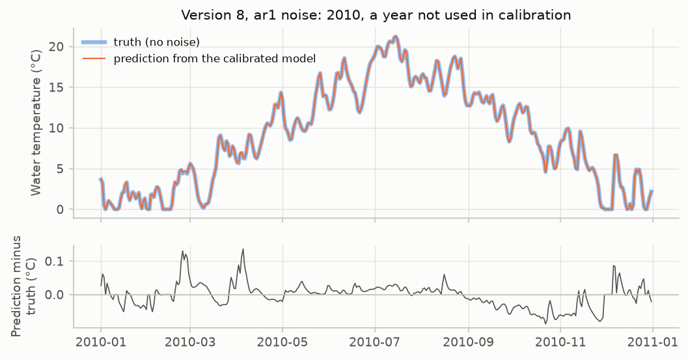

# V3. Calibration recovers a known truth

[Validation summary](../REPORT.md) · pyair2stream 0.5.0, commit 5fc7dcb, 2026-10-06 03:58 UTC · run time 0.1 minutes

**Result: PASS.**

Correctly specified cases: prediction error against the truth 0.015-0.038 °C (noise level 0.5 °C). Mis-specified case (version 3 fitted to version-8 data): 0.517 °C.

## Question

When the data really come from the model, does calibration find it, so that predictions for other years match the truth?

## Method

For model versions 3, 5 and 8, the 'true' parameters are the published Mentue parameters. The model generates daily water temperature from the real Mentue air temperature and discharge (2002-2012). Noise with standard deviation 0.5 °C is added, either independent (iid) or autocorrelated (AR(1), rho = 0.7). The model is calibrated by DE (NSE, CRN) on 2002-2009 and then run on 2010-2012, where it is compared with the noise-free truth. A mis-specified case calibrates version 3 on data made by version 8.

## Pass criterion

For correctly specified cases, prediction error on 2010-2012 against the noise-free truth (RMSE) at most 0.1 °C, and calibration RMSE within 10% of the noise level.

## Results

### Predicting other years from a calibration on noisy data

Each case calibrates on 2002-2009 data made by the model plus noise of 0.5 °C, then predicts 2010-2012. The prediction is compared with the noise-free truth, so a perfect calibration would show zero error.

*With the correct model version, predictions for years not used in calibration are within a few hundredths of a degree of the truth, although the data had 0.5 °C of noise. The wrong version (grey) is shown for contrast.*

*The calibrated model's prediction follows the true temperature closely on every day.*

**Known-truth recovery, Mentue forcing** ([csv](../results/V3_1.csv))

| true version | fitted version | noise | calibration RMSE vs noisy data | prediction RMSE vs truth, 2010-2012 | largest parameter error (%) | pass |
|---|---|---|---|---|---|---|
| 3 | 3 | iid | 0.496 | 0.024 | 1.8 | yes |
| 3 | 3 | ar1 | 0.511 | 0.022 | 2.6 | yes |
| 5 | 5 | iid | 0.501 | 0.015 | 2.4 | yes |
| 5 | 5 | ar1 | 0.47 | 0.035 | 5.8 | yes |
| 8 | 8 | iid | 0.509 | 0.029 | 12.9 | yes |
| 8 | 8 | ar1 | 0.492 | 0.038 | 16.1 | yes |
| 8 | 3 | iid | 0.792 | 0.517 |  |  |

## What this means

Parameter errors can be large for version 8 even when predictions are accurate: several parameter combinations produce almost the same temperatures (equifinality). Predictions, not individual parameter values, are what the model can be relied on for.
