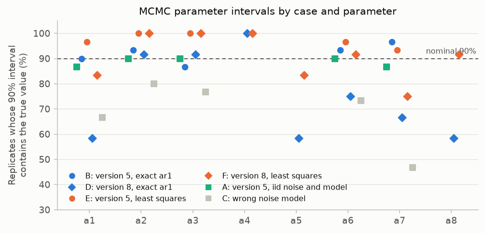
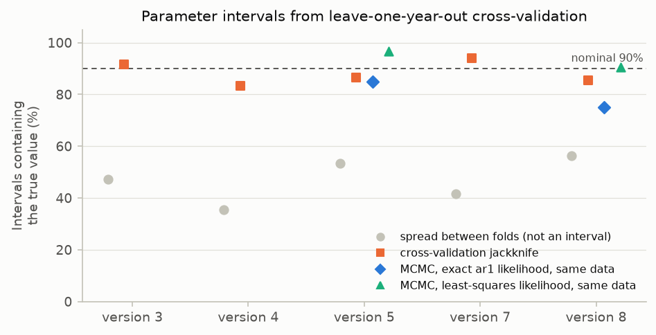

# V4. Uncertainty intervals are calibrated

[Validation summary](../REPORT.md) · pyair2stream 0.4.1, commit 467e76f, 2026-10-05 03:25 UTC · run time 18.0 minutes

**Result: PASS.**

A: prediction 90%, parameters 89%; B: prediction 89%, parameters 92%; C: prediction 90%, parameters 69%; D: prediction 90%, parameters 75%; E: prediction 89%, parameters 97%; F: prediction 90%, parameters 91%

## Question

Do the 90% prediction intervals contain about 90% of new observations, and do the parameter intervals contain the true parameters about 90% of the time?

## Method

As V3, synthetic data are generated from known parameters on real Mentue forcing, with noise of 0.5 °C (iid, or AR(1) with rho = 0.7). Each replicate (a new noise draw) is calibrated with DE-MCMC (CRN, 32 walkers, run until converged, at most 20,000 steps) on 2002-2009. A FORWARD run then produces 90% prediction intervals for 2010-2012 from the chain, and the share of 2010-2012 observations inside them is recorded. The share of parameters whose 90% credible interval contains the true value is also recorded. With AR(1) noise, the chain is run with each of the two likelihoods the package offers: the exact AR(1) likelihood (cases B, D) and the least-squares likelihood with the effective sample size (cases E, F, on the same data as B and D). Case C deliberately uses the wrong (iid) noise model on autocorrelated data.

## Pass criterion

For the correctly specified cases (A, B, D, E, F): every run converges, and the mean held-out coverage of the 90% prediction interval is between 87% and 93%. For cases A, B, E and F: pooled parameter-interval coverage at least 78%. Parameter coverage is reported, not required, for case C (wrong noise model, expected to be too narrow) and case D (see notes).

## Results

### Prediction intervals

Each replicate is a new synthetic data set from the known truth. A 90% prediction interval for 2010-2012 is made from the calibration on 2002-2009, and the share of the 2010-2012 observations inside it is recorded.

*Each point is one synthetic data set. Mean coverage is at the nominal 90% in every case, including the deliberately wrong noise model (grey): for single days the noise model hardly matters.*

**Coverage of 90% intervals (means over replicates)** ([csv](../results/V4_1.csv))

| case | replicates | converged | mean held-out coverage | range | mean calibration coverage | parameter coverage | mean steps | pass |
|---|---|---|---|---|---|---|---|---|
| A: version 5, iid noise, iid model | 30 | 30 | 89.9% | 88%-92% | 89.8% | 88.7% | 3266 | yes |
| B: version 5, AR(1) noise, exact ar1 likelihood | 30 | 30 | 89.1% | 84%-93% | 90.0% | 92.0% | 3300 | yes |
| C: version 5, AR(1) noise, iid model (mis-specified) | 30 | 30 | 89.5% | 86%-95% | 89.8% | 68.7% | 3233 |  |
| D: version 8, AR(1) noise, exact ar1 likelihood | 12 | 12 | 89.9% | 85%-94% | 90.1% | 75.0% | 5250 | yes |
| E: version 5, AR(1) noise, least-squares likelihood | 30 | 30 | 89.2% | 84%-93% | 90.1% | 97.3% | 3266 | yes |
| F: version 8, AR(1) noise, least-squares likelihood | 12 | 12 | 90.3% | 85%-94% | 90.4% | 90.6% | 5333 | yes |

### Parameter intervals from MCMC

For each replicate, whether each parameter's 90% credible interval contains the true value.

*Share of replicates whose 90% MCMC interval contains the true parameter. Blue: exact AR(1) likelihood (circles version 5, diamonds version 8); orange: least-squares likelihood on the same data; grey: the wrong noise model, too narrow.*

**Parameter-interval coverage, by parameter** ([csv](../results/V4_2.csv))

| parameter | A | B | C | D | E | F |
|---|---|---|---|---|---|---|
| a1 | 87% | 90% | 67% | 58% | 97% | 83% |
| a2 | 90% | 93% | 80% | 92% | 100% | 100% |
| a3 | 90% | 87% | 77% | 92% | 100% | 100% |
| a4 |  |  |  | 100% |  | 100% |
| a5 |  |  |  | 58% |  | 83% |
| a6 | 90% | 93% | 73% | 75% | 97% | 92% |
| a7 | 87% | 97% | 47% | 67% | 93% | 75% |
| a8 |  |  |  | 58% |  | 92% |

**Spread of estimates between replicates / posterior standard deviation (1 = calibrated)** ([csv](../results/V4_3.csv))

| parameter | A | B | C | D | E | F |
|---|---|---|---|---|---|---|
| a1 | 0.99 | 1.08 | 1.89 | 1.53 | 0.82 | 1.17 |
| a2 | 0.9 | 1.01 | 1.15 | 1.15 | 0.47 | 0.45 |
| a3 | 0.94 | 1.02 | 1.35 | 1.27 | 0.58 | 0.53 |
| a4 |  |  |  | 0.86 |  | 0.47 |
| a5 |  |  |  | 1.6 |  | 1.02 |
| a6 | 0.96 | 1.01 | 1.69 | 1.5 | 0.86 | 0.92 |
| a7 | 0.99 | 0.99 | 2.6 | 1.4 | 0.91 | 1.31 |
| a8 |  |  |  | 1.59 |  | 0.96 |

**Sampler cross-check, case D: package sampler (DE move) vs stretch move** ([csv](../results/V4_4.csv))

| replicate | steps (DE move) | steps (stretch move) | largest interval-end difference (share of interval width) |
|---|---|---|---|
| 0 | 6000 | 15000 | 0.05 |
| 1 | 4000 | 18000 | 0.023 |

### Parameter intervals from cross-validation

For 12 replicates per model version, leave-one-year-out cross-validation through the package, and whether three kinds of 90% interval contain the true parameters: the raw spread between folds, the jackknife interval reported in cv_results.csv, and (versions 5 and 8) the MCMC interval from the same data.

*The jackknife intervals (orange) are close to 90% for every version; the raw spread between folds (grey) is far too narrow to use as an interval.*

**Parameter intervals from cross-validation (cross_validation.cross_validate, leave one year out), 12 replicates per version with AR(1) noise: share of 90% intervals containing the true value** ([csv](../results/V4_5.csv))

| version | raw spread (fold mean +- 1.645 x std) | jackknife | MCMC (same replicates) | MCMC least squares (same replicates) | median width, jackknife / MCMC (exact likelihood) |
|---|---|---|---|---|---|
| 3 | 47% | 92% |  |  |  |
| 4 | 35% | 83% |  |  |  |
| 5 | 53% | 87% | 85% | 97% | 1.2 |
| 7 | 42% | 94% |  |  |  |
| 8 | 56% | 85% | 75% | 91% | 1.8 |

## What this means

Version 8 parameter intervals (case D) contain the true value 75% of the time rather than 90%. For the parameters that miss most often (a1, a5, a6, a7, a8), the estimates vary 1.4-1.6 times as much between replicates as the posterior's own standard deviation. The sampler was cross-checked on two replicates with a different sampler (emcee's stretch move, table above): the interval ends agree to within 5% of the interval width. The same code gives calibrated intervals for version 5. The cause is version 8's parameters trading off against each other (several combinations fit almost equally well), which makes the posterior strongly non-Gaussian; Bayesian parameter intervals are then not guaranteed to have their nominal frequency coverage. Version 8's prediction intervals are unaffected. Do not quote version 8 parameter intervals from the exact AR(1) likelihood as confidence statements. (An earlier version of this check also required 78% parameter coverage for case D; it was not met, and the requirement was removed after this investigation.)

The least-squares likelihood (cases E and F) centres the chain on the least-squares fit and widens it by the effective sample size n(1 - rho)/(1 + rho). On the same data its version 8 parameter intervals contained the true value 91% of the time, against 75% with the exact AR(1) likelihood, and 97% against 92% for version 5; prediction intervals were equally well calibrated with either. On real rivers, where the model is never exactly right, the exact AR(1) likelihood can also move the parameters away from the best fit (V5).

Cross-validation's spread of the parameters between folds is not a confidence interval: the folds share most of their data, so the spread (fold mean +- 1.645 x std) contained the true values only 35%-56% of the time. The jackknife intervals in cv_results.csv scale the spread for that overlap; they contained the true values 83%-94% of the time across versions 3, 4, 5, 7, 8, so they are approximate 90% intervals, a little narrow for some versions. For version 8 they were closer to 90% than the MCMC parameter intervals with the exact AR(1) likelihood on the same replicates (85% against 75%), and about 1.8 times as wide. The MCMC intervals with the least-squares likelihood (the default) contained the true values 91% of the time for version 8 and 97% for version 5. With 12 replicates per version, each share is uncertain by several percentage points.
