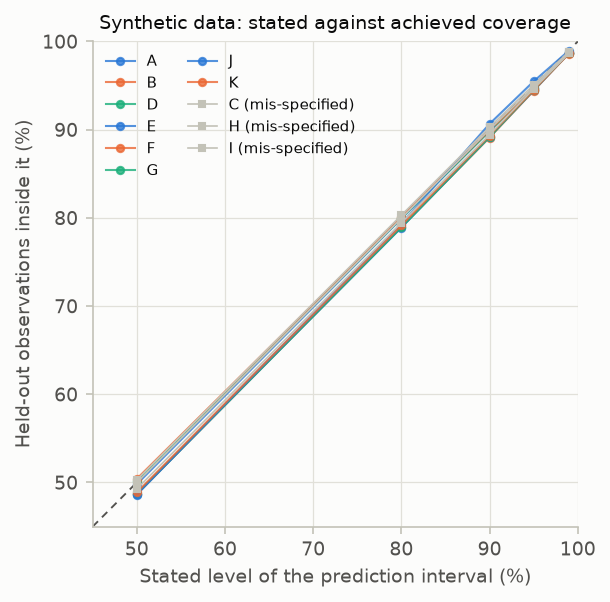
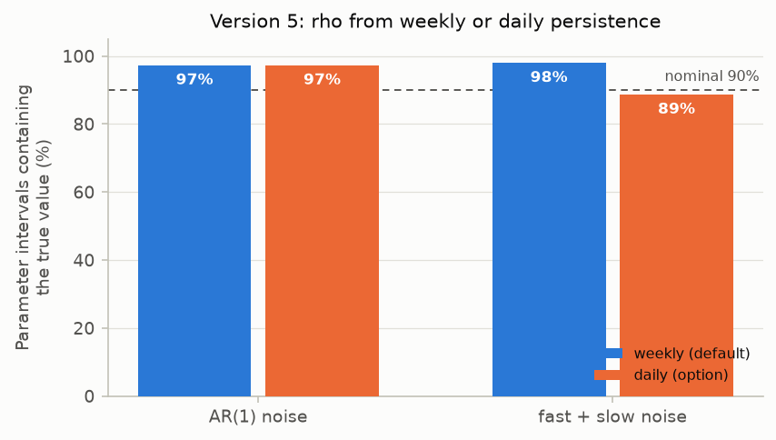

# V4. Uncertainty intervals are calibrated

[Validation summary](../REPORT.md) · pyair2stream 0.5.0, commit 4bf3843, 2026-10-09 00:33 UTC · run time 34.3 minutes

**Result: PASS.**

A: prediction 90%, parameters 87%; B: prediction 89%, parameters 93%; C: prediction 89%, parameters 67%; D: prediction 90%, parameters 74%; E: prediction 89%, parameters 97%; F: prediction 90%, parameters 93%; G: prediction 89%, parameters 97%; H: prediction 90%, parameters 98%; I: prediction 90%, parameters 89%; J: prediction 91%, parameters 76%; K: prediction 89%, parameters 91%. At every level tested (50%, 80%, 90%, 95%, 99%), the correctly specified cases' mean prediction coverage was within 1.3 points of the level (largest difference: case B, 50% interval, 48.7%)

## Question

Do the 90% prediction intervals contain about 90% of new observations, and do the parameter intervals contain the true parameters about 90% of the time?

## Method

As V3, synthetic data are generated from known parameters on real Mentue forcing, with noise of 0.5 °C (iid, or AR(1) with rho = 0.7). Each replicate (a new noise draw) is calibrated with DE-MCMC (CRN, 32 walkers, run until converged, at most 20,000 steps) on 2002-2009. A FORWARD run then produces 90% prediction intervals for 2010-2012 from the chain, and the share of 2010-2012 observations inside them is recorded. The share of parameters whose 90% credible interval contains the true value is also recorded. With AR(1) noise, the chain is run with each of the two likelihoods the package offers: the exact AR(1) likelihood (cases B, D) and the least-squares likelihood with the effective sample size (cases E, F, on the same data as B and D). Case C deliberately uses the wrong (iid) noise model on autocorrelated data. The AR(1) correlation rho is estimated, by default, from the week-to-week persistence of the errors (rho_timescale weekly); case G repeats case E with rho from consecutive days (the 'daily' option). Cases H and I use noise made of a fast (2-day) and a slow (3-4 week) part, as measured on the real rivers, which an AR(1) model can only approximate: H with the weekly default, I with the daily option, on the same data. Cases J and K repeat case E with weekly scoring (time_resolution 1w): the likelihood then compares weekly means, whose errors are much less correlated from week to week than days are. J uses the authors' bounds, which allow a negative a2 and a3; K requires both to be at least 0. The same simulations give the coverage of the 50%, 80%, 90%, 95%, 99% intervals (central percentiles of the 1000 simulations on each day), and the chain that of the parameter intervals at those levels.

## Pass criterion

For the correctly specified cases (A, B, D, E, F, G, K): every run converges, and the mean held-out coverage of the 90% prediction interval is between 87% and 93%, and that of the 50%, 80%, 95%, 99% intervals within 3 percentage points of their level (at most 100%). For cases A, B, E, F, G and K: pooled parameter-interval coverage at least 78%. Results are reported, not judged, for case C (wrong noise model, expected to be too narrow), case D (see notes), cases H and I (noise that AR(1) can only approximate) and case J (see notes).

## Results

### Prediction intervals

Each replicate is a new synthetic data set from the known truth. A 90% prediction interval for 2010-2012 is made from the calibration on 2002-2009, and the share of the 2010-2012 observations inside it is recorded. The second table gives the coverage of intervals at other levels, from the same simulations: a user may ask for any level.

*Each point is one synthetic data set. Mean coverage is at the nominal 90% in every case, including the deliberately wrong noise model (grey): for single days the noise model hardly matters.*

*Mean share of held-out observations inside the prediction interval, for each stated level and case. On the dashed diagonal the intervals hold at every level.*

**Coverage of 90% intervals (means over replicates)** ([csv](../results/V4_1.csv))

| case | replicates | converged | mean held-out coverage | range | mean calibration coverage | parameter coverage | mean steps | mean rho | pass |
|---|---|---|---|---|---|---|---|---|---|
| A: version 5, iid noise, iid model | 30 | 30 | 89.9% | 88%-92% | 89.7% | 87.3% | 3200 | 0.054 | yes |
| B: version 5, AR(1) noise, exact ar1 likelihood | 30 | 30 | 89.1% | 85%-93% | 90.0% | 92.7% | 3300 | 0.699 | yes |
| C: version 5, AR(1) noise, iid model (mis-specified) | 30 | 30 | 89.4% | 86%-95% | 89.8% | 67.3% | 3233 | 0.713 |  |
| D: version 8, AR(1) noise, exact ar1 likelihood | 12 | 12 | 89.8% | 85%-92% | 90.1% | 74.0% | 5333 | 0.696 | yes |
| E: version 5, AR(1) noise, least-squares likelihood | 30 | 30 | 89.2% | 85%-93% | 90.1% | 97.3% | 3166 | 0.699 | yes |
| F: version 8, AR(1) noise, least-squares likelihood | 12 | 12 | 89.9% | 85%-93% | 90.4% | 92.7% | 5000 | 0.696 | yes |
| G: version 5, AR(1) noise, least squares, rho from consecutive days | 30 | 30 | 89.2% | 85%-93% | 90.1% | 97.3% | 3100 | 0.691 | yes |
| H: version 5, fast + slow noise, least squares (mis-specified noise) | 30 | 30 | 90.3% | 86%-93% | 90.6% | 98.0% | 3400 | 0.867 |  |
| I: version 5, fast + slow noise, least squares, rho from consecutive days (mis-specified noise) | 30 | 30 | 90.0% | 86%-93% | 90.1% | 88.7% | 3166 | 0.705 |  |
| J: version 5, AR(1) noise, least squares, weekly scoring (time_resolution 1w), authors' bounds | 30 | 26 | 90.7% | 85%-99% | 91.7% | 76.2% | 4538 | 0.565 |  |
| K: as J, with a2 and a3 at least 0 | 30 | 30 | 89.3% | 87%-93% | 90.3% | 91.3% | 3300 | 0.699 | yes |

**Coverage at each level (means over replicates)** ([csv](../results/V4_2.csv))

| case | 50% interval | 80% interval | 90% interval | 95% interval | 99% interval |
|---|---|---|---|---|---|
| A | 49.8% | 79.9% | 89.9% | 94.7% | 98.7% |
| B | 48.7% | 79.0% | 89.1% | 94.4% | 98.6% |
| C | 49.3% | 79.4% | 89.4% | 94.6% | 98.6% |
| D | 50.1% | 79.9% | 89.8% | 94.7% | 98.7% |
| E | 48.7% | 78.9% | 89.2% | 94.4% | 98.7% |
| F | 50.4% | 80.1% | 89.9% | 94.6% | 98.6% |
| G | 48.7% | 78.9% | 89.2% | 94.5% | 98.7% |
| H | 50.3% | 80.3% | 90.3% | 95.1% | 98.8% |
| I | 50.0% | 80.0% | 90.0% | 94.8% | 98.8% |
| J | 48.6% | 79.3% | 90.7% | 95.5% | 99.0% |
| K | 48.9% | 79.2% | 89.3% | 94.5% | 98.7% |

### Parameter intervals from MCMC

For each replicate, whether each parameter's 90% credible interval contains the true value.

*Share of replicates whose 90% MCMC interval contains the true parameter. Blue: exact AR(1) likelihood (circles version 5, diamonds version 8); orange: least-squares likelihood on the same data; grey: the wrong noise model, too narrow.*

**Parameter intervals at each level: share containing the true value (pooled)** ([csv](../results/V4_3.csv))

| case | 50% interval | 80% interval | 90% interval | 95% interval | 99% interval |
|---|---|---|---|---|---|
| A | 55.3% | 80.0% | 87.3% | 98.0% | 99.3% |
| B | 50.7% | 75.3% | 92.7% | 94.0% | 98.7% |
| C | 32.7% | 57.3% | 67.3% | 74.7% | 83.3% |
| D | 35.4% | 60.4% | 74.0% | 84.4% | 92.7% |
| E | 64.7% | 91.3% | 97.3% | 98.7% | 99.3% |
| F | 53.1% | 83.3% | 92.7% | 96.9% | 100.0% |
| G | 64.7% | 91.3% | 97.3% | 98.7% | 99.3% |
| H | 74.0% | 93.3% | 98.0% | 98.7% | 99.3% |
| I | 54.7% | 79.3% | 88.7% | 94.0% | 98.7% |
| J | 53.1% | 70.8% | 76.2% | 83.8% | 84.6% |
| K | 57.3% | 82.0% | 91.3% | 98.0% | 100.0% |

**Parameter-interval coverage, by parameter** ([csv](../results/V4_4.csv))

| parameter | A | B | C | D | E | F | G | H | I | J | K |
|---|---|---|---|---|---|---|---|---|---|---|---|
| a1 | 83% | 90% | 63% | 58% | 97% | 92% | 97% | 100% | 90% | 69% | 90% |
| a2 | 90% | 93% | 80% | 92% | 100% | 100% | 100% | 100% | 100% | 69% | 90% |
| a3 | 87% | 90% | 77% | 92% | 100% | 100% | 100% | 100% | 100% | 73% | 93% |
| a4 |  |  |  | 100% |  | 100% |  |  |  |  |  |
| a5 |  |  |  | 58% |  | 83% |  |  |  |  |  |
| a6 | 90% | 93% | 70% | 67% | 97% | 92% | 97% | 100% | 87% | 92% | 90% |
| a7 | 87% | 97% | 47% | 67% | 93% | 83% | 93% | 90% | 67% | 77% | 93% |
| a8 |  |  |  | 58% |  | 92% |  |  |  |  |  |

**Spread of estimates between replicates / posterior standard deviation (1 = calibrated)** ([csv](../results/V4_5.csv))

| parameter | A | B | C | D | E | F | G | H | I | J | K |
|---|---|---|---|---|---|---|---|---|---|---|---|
| a1 | 0.99 | 1.08 | 1.9 | 1.51 | 0.81 | 1.13 | 0.82 | 0.6 | 0.97 | 8.02 | 0.86 |
| a2 | 0.91 | 1.01 | 1.14 | 1.13 | 0.46 | 0.45 | 0.47 | 0.33 | 0.53 | 8.92 | 0.77 |
| a3 | 0.94 | 1.02 | 1.35 | 1.25 | 0.57 | 0.54 | 0.58 | 0.39 | 0.63 | 15.19 | 0.79 |
| a4 |  |  |  | 0.85 |  | 0.47 |  |  |  |  |  |
| a5 |  |  |  | 1.58 |  | 0.99 |  |  |  |  |  |
| a6 | 0.96 | 1 | 1.69 | 1.48 | 0.84 | 0.89 | 0.86 | 0.66 | 1.06 | 0.72 | 0.91 |
| a7 | 0.99 | 1 | 2.61 | 1.39 | 0.89 | 1.28 | 0.91 | 0.97 | 1.55 | 23.32 | 0.9 |
| a8 |  |  |  | 1.57 |  | 0.93 |  |  |  |  |  |

**Width of parameter intervals, theory and measurement: true spread of the estimates / interval standard deviation (1 = right, below 1 = too wide, above 1 = too narrow); E, H weekly rho; G, I daily rho** ([csv](../results/V4_6.csv))

| parameter | E: theory / measured | G: theory / measured | H: theory / measured | I: theory / measured |
|---|---|---|---|---|
| a1 | 0.74 / 0.81 | 0.74 / 0.82 | 0.52 / 0.60 | 0.82 / 0.97 |
| a2 | 0.54 / 0.46 | 0.54 / 0.47 | 0.28 / 0.33 | 0.45 / 0.53 |
| a3 | 0.58 / 0.57 | 0.58 / 0.58 | 0.34 / 0.39 | 0.53 / 0.63 |
| a6 | 0.80 / 0.84 | 0.80 / 0.86 | 0.60 / 0.66 | 0.95 / 1.06 |
| a7 | 0.96 / 0.89 | 0.96 / 0.91 | 1.00 / 0.97 | 1.59 / 1.55 |

**Sampler cross-check, case D: package sampler (DE move) vs stretch move** ([csv](../results/V4_7.csv))

| replicate | steps (DE move) | steps (stretch move) | largest interval-end difference (share of interval width) |
|---|---|---|---|
| 0 | 5000 | 16000 | 0.017 |
| 1 | 6000 | 14000 | 0.019 |

### Estimating rho from week-to-week persistence

Version 5 with the least-squares likelihood, on identical synthetic data for each pair of cases: rho estimated from the persistence of the errors from week to week (the default) or from consecutive days (the 'daily' option). With AR(1) noise both should behave alike. With noise that also has a slow part, as real model errors do, the daily estimate sees only the fast part.

*Share of parameter intervals containing the true value, with rho estimated from week-to-week persistence (blue) or from consecutive days (orange), on identical synthetic data.*

**rho time scale: estimated rho and coverage of 90% intervals** ([csv](../results/V4_8.csv))

| noise in the data | case | rho time scale | mean rho | prediction coverage | parameter coverage |
|---|---|---|---|---|---|
| AR(1) noise | E | weekly (default) | 0.699 | 89.2% | 97.3% |
| AR(1) noise | G | daily (option) | 0.691 | 89.2% | 97.3% |
| fast + slow noise | H | weekly (default) | 0.867 | 90.3% | 98.0% |
| fast + slow noise | I | daily (option) | 0.705 | 90.0% | 88.7% |

### Parameter intervals from cross-validation

For 12 replicates per model version, leave-one-year-out cross-validation through the package, and whether three kinds of 90% interval contain the true parameters: the raw spread between folds, the jackknife interval reported in cv_results.csv, and (versions 5 and 8) the MCMC interval from the same data.

*The jackknife intervals (orange) are close to 90% for every version; the raw spread between folds (grey) is far too narrow to use as an interval.*

**Parameter intervals from cross-validation (cross_validation.cross_validate, leave one year out), 12 replicates per version with AR(1) noise: share of 90% intervals containing the true value** ([csv](../results/V4_9.csv))

| version | raw spread (fold mean +- 1.645 x std) | jackknife | MCMC (same replicates) | MCMC least squares (same replicates) | median width, jackknife / MCMC (exact likelihood) |
|---|---|---|---|---|---|
| 3 | 47% | 92% |  |  |  |
| 4 | 35% | 83% |  |  |  |
| 5 | 52% | 92% | 85% | 97% | 1.3 |
| 7 | 52% | 95% |  |  |  |
| 8 | 46% | 83% | 74% | 93% | 1.6 |

## What this means

Why the parameter intervals behave as they do (theory). The least-squares likelihood with the effective sample size widens every parameter's interval by the same factor, (1 + rho)/(1 - rho). The spread of each estimate really grows by a factor that depends on how that parameter's effect on the simulated temperature varies over time (the 'sandwich' covariance of least squares with correlated errors): a parameter whose effect changes slowly (here a7, the seasonal timing) needs the full allowance for long-lasting errors, a parameter whose effect changes from day to day (a2, a3) much less. The table gives the ratio predicted by that formula next to the one measured over the replicates; they agree closely. With fast + slow noise, the daily rho makes a7's interval 1.6 times too narrow (theory; measured 1.55); the weekly rho gives it the right width (1.00; measured 0.97) and makes the others wider than necessary. With a single factor for all parameters, the weekly rho is the choice that leaves no parameter's interval too narrow in these tests; intervals of parameters with fast-varying effects are wider than they need to be with either rho.

Version 8 parameter intervals (case D) contain the true value 74% of the time rather than 90%. For the parameters that miss most often (a1, a5, a6, a7, a8), the estimates vary 1.4-1.6 times as much between replicates as the posterior's own standard deviation. The sampler was cross-checked on two replicates with a different sampler (emcee's stretch move, table above): the interval ends agree to within 2% of the interval width. The same code gives calibrated intervals for version 5. The cause is version 8's parameters trading off against each other (several combinations fit almost equally well), which makes the posterior strongly non-Gaussian; Bayesian parameter intervals are then not guaranteed to have their nominal frequency coverage. Version 8's prediction intervals are unaffected. Do not quote version 8 parameter intervals from the exact AR(1) likelihood as confidence statements. (An earlier version of this check also required 78% parameter coverage for case D; it was not met, and the requirement was removed after this investigation.)

The least-squares likelihood (cases E and F) centres the chain on the least-squares fit and widens it by the effective sample size n(1 - rho)/(1 + rho). On the same data its version 8 parameter intervals contained the true value 93% of the time, against 74% with the exact AR(1) likelihood, and 97% against 93% for version 5; prediction intervals were equally well calibrated with either. On real rivers, where the model is never exactly right, the exact AR(1) likelihood can also move the parameters away from the best fit (V5).

rho time scale. With AR(1) noise (true rho 0.7) the weekly default estimated rho = 0.70 on average and the daily option 0.69; parameter intervals covered the truth 97% and 97% of the time. With fast + slow noise the weekly default estimated rho = 0.87 and the daily option 0.70; parameter coverage was 98% and 89%. Prediction coverage of single days was 89%-90% in all four cases, since on a single day rho does not change the width of the band (V9 tests quantities that span weeks).

Weekly scoring (case K, the data of case E). The likelihood counts weekly means, and allows for their correlation from week to week: n/n_eff = 1 + 2 r_b/(1 - rho^7), on average 1.56, against (1 + rho)/(1 - rho) = 5.68 for daily values with the same rho. Parameter intervals contained the true value 91% of the time (97% with daily scoring).

Weekly scoring with the authors' bounds (case J). 9 of 30 calibrations ended on a parameter set with a negative relaxation rate (a3 below 0) whose daily simulation zigzags between 0 °C and high values: weekly means average the zigzag out, so it can score as well as the true parameters. pyair2stream's plausibility check (negative relaxation rate, or successive daily changes correlated below -0.5) warned for each of these 9 and for 0 of the 264 calibrations in the other cases; 4 of the 9 did not converge. Over the 30 calibrations, parameter intervals contained the true value 76% of the time, and 90% over the 21 that converged without a warning. With weekly or monthly scoring, bounds that keep a2 and a3 at least 0 rule such sets out (case K). An earlier run of this check judged case J against the parameter criterion and failed for this reason (76%); case K was added after it.

Cross-validation's spread of the parameters between folds is not a confidence interval: the folds share most of their data, so the spread (fold mean +- 1.645 x std) contained the true values only 35%-52% of the time. The jackknife intervals in cv_results.csv scale the spread for that overlap; they contained the true values 83%-95% of the time across versions 3, 4, 5, 7, 8, so they are approximate 90% intervals, a little narrow for some versions. For version 8 they were closer to 90% than the MCMC parameter intervals with the exact AR(1) likelihood on the same replicates (83% against 74%), and about 1.6 times as wide. The MCMC intervals with the least-squares likelihood (the default) contained the true values 93% of the time for version 8 and 97% for version 5. With 12 replicates per version, each share is uncertain by several percentage points.
