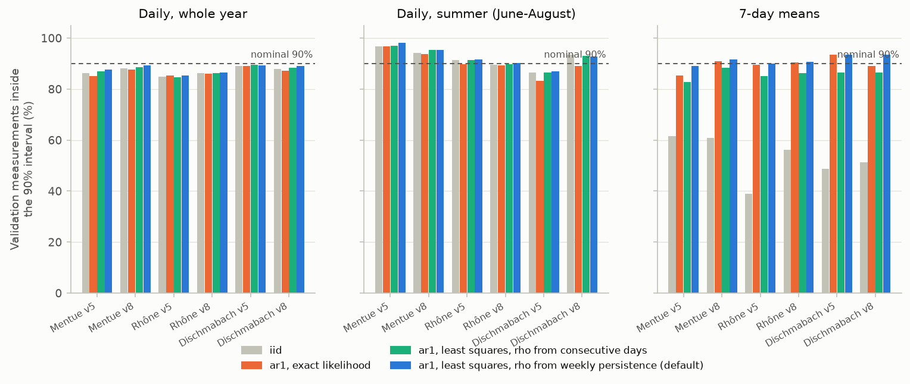
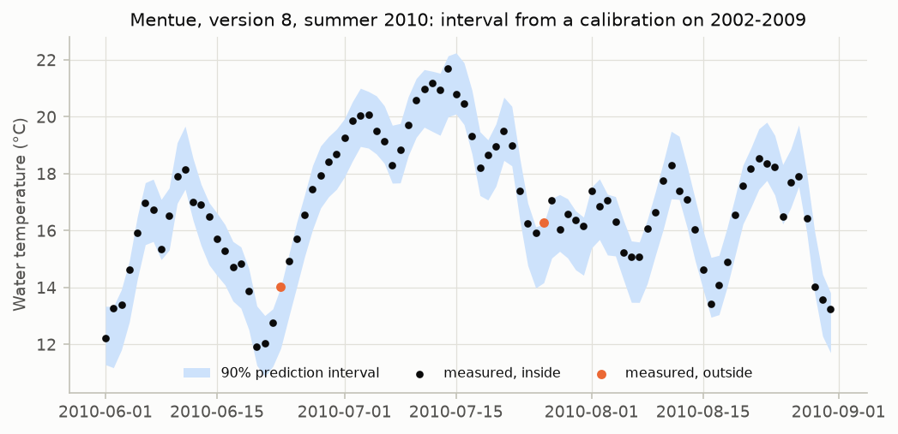

# V5. Predicts real rivers in years it was not calibrated on

[Validation summary](../REPORT.md) · pyair2stream 0.5.0, commit 46b9d02, 2026-10-09 01:08 UTC · run time 5.7 minutes

**Result: FAIL.**

(A) Validation RMSE of the best version vs the best simple alternative: Dischmabach 0.65 vs 0.99 °C; Mentue 0.78 vs 1.48 °C; Rhône 0.74 vs 1.06 °C. (B) 24 of 24 MCMC runs converged; 90% interval coverage of real validation data 84.7%-89.6% (summer 83%-98%). Default error model at each level, share of validation days inside the interval: 50% interval 42.8%-52.9%; 80% interval 74.7%-79.4%; 90% interval 85.4%-89.3%; 95% interval 91.0%-95.1%; 99% interval 94.9%-99.5%. Outside the accepted range: Mentue version 5, 95% interval 91.4%; Mentue version 5, 99% interval 96.1%; Mentue version 8, 99% interval 96.5%; Rhône version 5, 95% interval 91.3%; Rhône version 5, 99% interval 96.8%; Rhône version 8, 95% interval 91.0%; Rhône version 8, 99% interval 94.9%. Outside the accepted 85%-95%: Rhône version 5 (iid noise) 84.91%; Rhône version 5 (AR(1), least squares, daily rho) 84.72%.

## Question

Calibrated on some years of real data, how well does the model predict other years, compared with simple alternatives? And do its 90% prediction intervals contain about 90% of what was actually measured?

## Method

Three Swiss rivers with different behaviour: the Mentue (small lowland river), the Rhône at Sion (large, glacier-fed and regulated by hydropower) and the Dischmabach (small alpine stream fed by snowmelt). Each is split as in Piccolroaz et al. (2016) into calibration and later validation years.

- (A) Each model version is calibrated by DE (NSE, CRN, the authors' parameter ranges) on the calibration years and then predicts the validation years. Two simple alternatives, fitted on the same calibration years, are scored the same way: the average water temperature for each day of the year (smoothed over a month), and a straight-line regression of water temperature on same-day air temperature.
- (B) For versions 5 and 8, DE-MCMC (32 walkers, run until converged, at most 20,000 steps) is run on the calibration years with each error model (iid; AR(1) with the exact likelihood; AR(1) with the least-squares likelihood, with rho from week-to-week persistence (the default) or from consecutive days), and a FORWARD run gives 90% prediction intervals for the validation years. The share of real observations inside them is recorded, for the whole year and for summer (June-August), when temperature limits are usually at stake. The same simulations give the coverage of intervals at other levels (50%, 80%, 90%, 95%, 99%), for days, summer days and 7-day means.

## Pass criterion

(A) In every river, every version predicts the validation years with a lower RMSE than both simple alternatives. (B) Every MCMC run converges, and the 90% interval contains between 85% and 95% of the validation observations. With the default error model, the same holds at every level tested (50%, 80%, 90%, 95%, 99%): the share of days outside the interval is between half and 1.5 times the stated share (for example 92.5-97.5% for a 95% interval, 98.5-99.5% for a 99% interval).

## Results

### A. Predicting years not used for calibration

Each version was calibrated on each river's calibration years and predicted its later validation years. The grey bars are two simple alternatives fitted on the same years.

*Prediction error on years not used for calibration (lower is better). Coloured: the five model versions; grey: the two simple alternatives.*

**A. Validation years: model versions and simple alternatives** ([csv](../results/V5_1.csv))

| river | version | RMSE | NSE | KGE | bias | parameters at a bound |
|---|---|---|---|---|---|---|
| Mentue | 3 | 0.933 | 0.975 | 0.966 | -0.111 | none |
| Mentue | 4 | 0.935 | 0.975 | 0.968 | -0.106 | none |
| Mentue | 5 | 0.8 | 0.981 | 0.973 | -0.093 | none |
| Mentue | 7 | 0.779 | 0.982 | 0.971 | -0.054 | none |
| Mentue | 8 | 0.779 | 0.982 | 0.972 | -0.051 | none |
| Rhône | 3 | 1.048 | 0.792 | 0.833 | -0.053 | none |
| Rhône | 4 | 1.047 | 0.792 | 0.833 | -0.053 | none |
| Rhône | 5 | 1.046 | 0.793 | 0.83 | -0.082 | a1 |
| Rhône | 7 | 0.74 | 0.896 | 0.922 | -0.034 | none |
| Rhône | 8 | 0.739 | 0.896 | 0.923 | -0.035 | none |
| Dischmabach | 3 | 0.941 | 0.892 | 0.936 | -0.081 | none |
| Dischmabach | 4 | 0.934 | 0.894 | 0.938 | -0.083 | a2 |
| Dischmabach | 5 | 0.759 | 0.93 | 0.957 | -0.091 | a1 |
| Dischmabach | 7 | 0.659 | 0.947 | 0.952 | -0.179 | a5, a6 |
| Dischmabach | 8 | 0.651 | 0.948 | 0.953 | -0.176 | a5, a6 |
| Mentue | day-of-year average | 1.895 | 0.896 | 0.902 | 0.024 |  |
| Mentue | air-temperature regression | 1.483 | 0.936 | 0.955 | -0.145 |  |
| Rhône | day-of-year average | 1.101 | 0.77 | 0.783 | -0.168 |  |
| Rhône | air-temperature regression | 1.056 | 0.789 | 0.829 | -0.055 |  |
| Dischmabach | day-of-year average | 0.994 | 0.88 | 0.906 | -0.09 |  |
| Dischmabach | air-temperature regression | 1.105 | 0.851 | 0.913 | -0.074 |  |

### B. Do 90% prediction intervals contain 90% of real measurements?

For versions 5 and 8, intervals were made for the validation years from a calibration on the earlier years, with each error model (iid noise; AR(1) noise with the exact AR(1) likelihood; AR(1) noise with the least-squares likelihood and rho from week-to-week persistence, the default, or from consecutive days), and compared with what was measured: day by day, in summer, and for 7-day means (computed within each simulated series). The last two columns show where the band is centred: its median minus the measured temperature, and the same for the best fit.

*Share of real validation-year measurements inside the 90% interval, by error model. Daily values depend little on the error model; 7-day means need AR(1) noise.*

*An example of a prediction interval for a year the model was not calibrated on: 98% of this summer's measurements fall inside it.*

*Real rivers, default error model: share of validation-year measurements inside the prediction interval for each stated level. Dashed: stated = achieved; shaded: the accepted range (a miss rate between half and 1.5 times the stated one).*

**B. 90% prediction intervals on the validation years** ([csv](../results/V5_2.csv))

| river | version | noise model | converged | steps | rho | coverage | summer coverage (Jun-Aug) | 7-day mean coverage | band centre bias (°C) | best-fit bias (°C) | mean width (°C) | calibration coverage |
|---|---|---|---|---|---|---|---|---|---|---|---|---|
| Mentue | 5 | iid | yes | 3000 | 0.885 | 86.3% | 96.7% | 61.5% | -0.0949 | -0.09277 | 2.19 | 89.6% |
| Mentue | 5 | ar1 | yes | 4000 | 0.885 | 85.1% | 96.7% | 85.3% | -0.1191 | -0.09277 | 2.2 | 90.2% |
| Mentue | 5 | ar1-ls | yes | 4000 | 0.885 | 87.7% | 98.2% | 89.1% | -0.09142 | -0.09277 | 2.22 | 90.5% |
| Mentue | 5 | ar1-ls-daily | yes | 3000 | 0.725 | 86.9% | 97.1% | 82.7% | -0.09462 | -0.09277 | 2.2 | 90.2% |
| Mentue | 8 | iid | yes | 6000 | 0.858 | 88.0% | 94.2% | 60.9% | -0.0512 | -0.05081 | 2.08 | 89.9% |
| Mentue | 8 | ar1 | yes | 5000 | 0.858 | 87.8% | 93.8% | 91.0% | -0.09801 | -0.05081 | 2.09 | 90.2% |
| Mentue | 8 | ar1-ls | yes | 7000 | 0.858 | 89.3% | 95.3% | 91.7% | -0.05369 | -0.05081 | 2.12 | 91.3% |
| Mentue | 8 | ar1-ls-daily | yes | 6000 | 0.696 | 88.7% | 95.3% | 88.5% | -0.05111 | -0.05081 | 2.1 | 90.3% |
| Rhône | 5 | iid | yes | 4000 | 0.954 | 84.9% | 91.4% | 38.9% | -0.0809 | -0.0816 | 2.85 | 90.3% |
| Rhône | 5 | ar1 | yes | 4000 | 0.954 | 85.3% | 89.7% | 89.5% | -0.06567 | -0.0816 | 2.87 | 90.5% |
| Rhône | 5 | ar1-ls | yes | 18000 | 0.954 | 85.4% | 91.5% | 89.9% | -0.07979 | -0.0816 | 2.9 | 91.2% |
| Rhône | 5 | ar1-ls-daily | yes | 4000 | 0.855 | 84.7% | 91.3% | 85.2% | -0.0814 | -0.0816 | 2.87 | 90.6% |
| Rhône | 8 | iid | yes | 5000 | 0.915 | 86.2% | 89.6% | 56.1% | -0.03495 | -0.03493 | 1.89 | 90.2% |
| Rhône | 8 | ar1 | yes | 5000 | 0.915 | 86.1% | 89.4% | 90.5% | -0.02037 | -0.03493 | 1.9 | 90.3% |
| Rhône | 8 | ar1-ls | yes | 7000 | 0.915 | 86.5% | 90.2% | 90.8% | -0.0334 | -0.03493 | 1.92 | 91.0% |
| Rhône | 8 | ar1-ls-daily | yes | 5000 | 0.736 | 86.2% | 89.7% | 86.2% | -0.0343 | -0.03493 | 1.9 | 90.4% |
| Dischmabach | 5 | iid | yes | 5000 | 0.937 | 88.9% | 86.6% | 48.7% | -0.09137 | -0.09121 | 2.44 | 90.2% |
| Dischmabach | 5 | ar1 | yes | 6000 | 0.937 | 88.9% | 83.3% | 93.6% | -0.2043 | -0.09121 | 2.45 | 90.7% |
| Dischmabach | 5 | ar1-ls | yes | 5000 | 0.937 | 89.3% | 87.0% | 93.6% | -0.1014 | -0.09121 | 2.5 | 91.7% |
| Dischmabach | 5 | ar1-ls-daily | yes | 5000 | 0.806 | 89.6% | 86.6% | 86.5% | -0.09081 | -0.09121 | 2.45 | 90.7% |
| Dischmabach | 8 | iid | yes | 10000 | 0.862 | 87.9% | 93.5% | 51.3% | -0.1735 | -0.1762 | 2.07 | 89.5% |
| Dischmabach | 8 | ar1 | yes | 12000 | 0.862 | 87.1% | 89.1% | 89.1% | -0.1508 | -0.1762 | 2.08 | 90.0% |
| Dischmabach | 8 | ar1-ls | yes | 10000 | 0.862 | 89.0% | 92.8% | 93.6% | -0.16 | -0.1762 | 2.13 | 91.5% |
| Dischmabach | 8 | ar1-ls-daily | yes | 8000 | 0.711 | 88.4% | 93.1% | 86.5% | -0.1667 | -0.1762 | 2.1 | 90.4% |

**B. Default error model, daily values inside the interval at each level** ([csv](../results/V5_3.csv))

| river | version | 50% interval | 80% interval | 90% interval | 95% interval | 99% interval |
|---|---|---|---|---|---|---|
| Mentue | 5 | 52.9% | 78.7% | 87.7% | 91.4% | 96.1% |
| Mentue | 8 | 50.3% | 78.9% | 89.3% | 93.3% | 96.5% |
| Rhône | 5 | 42.8% | 74.7% | 85.4% | 91.3% | 96.8% |
| Rhône | 8 | 50.4% | 78.1% | 86.5% | 91.0% | 94.9% |
| Dischmabach | 5 | 50.7% | 79.4% | 89.3% | 95.1% | 98.7% |
| Dischmabach | 8 | 48.6% | 78.7% | 89.0% | 94.8% | 99.5% |

**B. Default error model, summer values inside the interval at each level** ([csv](../results/V5_4.csv))

| river | version | 50% interval | 80% interval | 90% interval | 95% interval | 99% interval |
|---|---|---|---|---|---|---|
| Mentue | 5 | 63.0% | 90.9% | 98.2% | 99.3% | 100.0% |
| Mentue | 8 | 57.6% | 84.8% | 95.3% | 98.9% | 100.0% |
| Rhône | 5 | 40.6% | 78.1% | 91.5% | 96.4% | 99.6% |
| Rhône | 8 | 48.9% | 80.2% | 90.2% | 95.5% | 98.7% |
| Dischmabach | 5 | 41.7% | 75.0% | 87.0% | 91.7% | 97.8% |
| Dischmabach | 8 | 53.6% | 84.4% | 92.8% | 97.1% | 99.6% |

**B. Default error model, 7-day values inside the interval at each level** ([csv](../results/V5_5.csv))

| river | version | 50% interval | 80% interval | 90% interval | 95% interval | 99% interval |
|---|---|---|---|---|---|---|
| Mentue | 5 | 60.3% | 80.1% | 89.1% | 94.9% | 97.4% |
| Mentue | 8 | 57.7% | 87.2% | 91.7% | 95.5% | 97.4% |
| Rhône | 5 | 42.6% | 78.5% | 89.9% | 94.4% | 98.1% |
| Rhône | 8 | 55.9% | 85.2% | 90.8% | 93.5% | 95.7% |
| Dischmabach | 5 | 51.3% | 83.3% | 93.6% | 96.8% | 99.4% |
| Dischmabach | 8 | 49.4% | 84.0% | 93.6% | 96.2% | 100.0% |

**B. Accepted coverage at each level (miss rate between half and 1.5 times the stated one)** ([csv](../results/V5_6.csv))

| level | accepted share of days inside |
|---|---|
| 50% | 25.0%-75.0% |
| 80% | 70.0%-90.0% |
| 90% | 85.0%-95.0% |
| 95% | 92.5%-97.5% |
| 99% | 98.5%-99.5% |

## What this means

7-day means: with iid noise the 90% intervals contained only 39%-62% of the observed 7-day mean temperatures; with AR(1) noise and the least-squares likelihood, 89%-94% with rho from week-to-week persistence (the default; rho 0.86-0.95) and 83%-88% with rho from consecutive days (rho 0.70-0.85); with the exact AR(1) likelihood, 85%-94%. With iid noise the simulated day-to-day errors average out within a week, but real model errors persist for days to weeks. Use noise_model: ar1 (the default) whenever the quantity of interest spans several days (7-day means, runs of consecutive days).

Where the band is centred: the median of the band minus the measured temperature, compared with the same for the best fit. With the least-squares likelihood (the default) the band's centre stays within 0.02 °C of the best fit's. With the exact AR(1) likelihood it moves by up to 0.11 °C (cooler in that case; cooler in 3 of 6 runs): that likelihood weighs day-to-day changes more than the overall level, and a model that is not exactly right is then pulled towards parameters that fit the level slightly worse. This is why the least-squares likelihood is the default (uncertainty_options.likelihood).

Daily coverage on the validation years (84.7%-89.6%) is a little below the 90% achieved on the calibration years, because the noise level is estimated from the calibration years and the model's errors are somewhat larger in years it has not seen. The intervals are therefore slightly optimistic for new years.

Where a calibrated parameter sits on the edge of the authors' ranges (last column of table A), the best fit would lie outside that range; the fit is still valid within it.

On real data the model is never exactly right, so interval coverage on real rivers tests the whole approach (model, noise model and data), not only the code. Coverage can differ between seasons because the model's errors are larger in some seasons.
