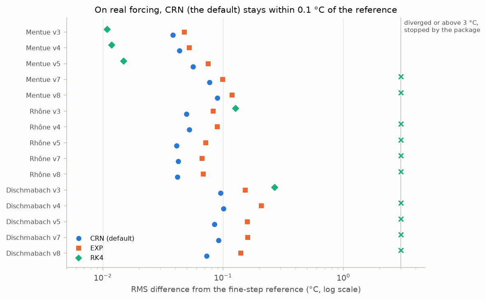
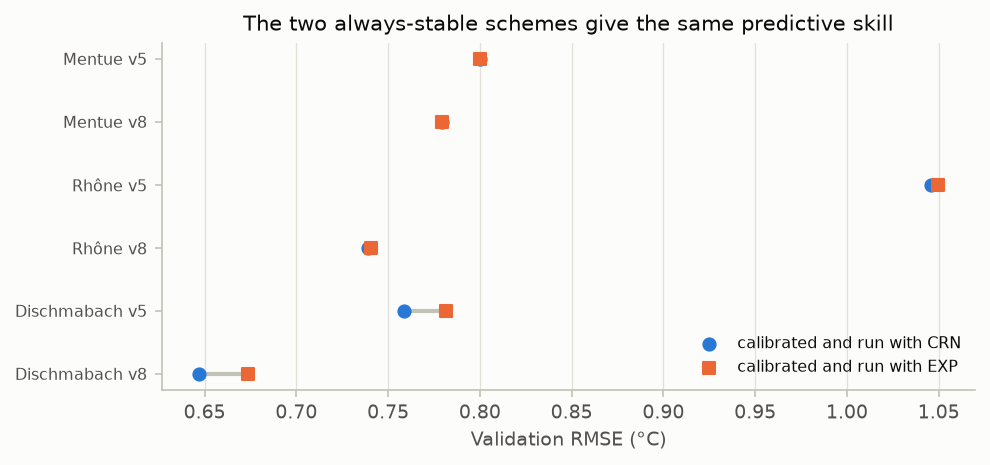

# V6. Numerical accuracy and warnings

[Validation summary](../REPORT.md) · pyair2stream 0.5.0, commit 5fc7dcb, 2026-10-06 03:58 UTC · run time 0.3 minutes

**Result: PASS.**

- (A) Largest error against the exact solution: 0.033 °C (schemes), 2e-13 °C (reference).
- (B) CRN differs from the reference by 0.04-0.10 °C RMS on real forcing; 26 explicit-scheme runs diverged and all were stopped.
- (C) Calibrating with EXP instead of CRN changes validation RMSE by at most 0.027 °C.

## Question

Are the numerical schemes solved correctly, how much do they differ on real data, does the package stop runs that go wrong, and would a different stable scheme change the calibrated model's predictions?

## Method

- (A) With constant air temperature and discharge the equation has an exact solution (a steady seasonal cycle). Each scheme, and a reference solver, is compared with it for versions 5 and 8 (published Mentue parameters).
- (B) On real forcing (three rivers, five versions, published parameters) each scheme is compared with the reference solver: the same equation solved with 96 small steps per day, with air temperature and discharge varying linearly within each day. The package's own checks (stability warning, divergence stop) are recorded for every run.
- (C) Versions 5 and 8 are calibrated (DE, NSE) on each river with each of the two always-stable schemes, CRN and EXP, and predict the validation years with the same scheme.

## Pass criterion

- (A) CRN, EXP, RK4 and RK2 within 0.01 °C of the exact solution; EUL, a first-order method, within 0.05 °C; the reference solver within 1e-06 °C.
- (B) Every run that diverges (temperatures not a number or above 60 °C) is stopped with an error.
- (C) CRN and EXP give validation RMSE within 0.05 °C of each other in every case.

## Results

### A. Against the exact solution

With constant air temperature and discharge the equation has an exact solution, so the error of each scheme can be measured directly.

*Largest error of each scheme against the exact solution (log scale). All are within their limits; the reference solver used in part B is exact to rounding.*

**A. Error against the exact solution** ([csv](../results/V6_1.csv))

| test | scheme | max \|error\| (°C) |
|---|---|---|
| version 5 | CRN | 6.7e-07 |
| version 5 | EXP | 2.3e-03 |
| version 5 | RK4 | 8.1e-06 |
| version 5 | RK2 | 2.4e-04 |
| version 5 | EUL | 2.8e-02 |
| version 5 | reference (96 sub-steps/day) | 6.8e-14 |
| version 8 | CRN | 5.3e-07 |
| version 8 | EXP | 4.0e-03 |
| version 8 | RK4 | 2.8e-05 |
| version 8 | RK2 | 5.7e-04 |
| version 8 | EUL | 3.3e-02 |
| version 8 | reference (96 sub-steps/day) | 1.6e-13 |

### B. Real forcing: each scheme against a fine-step reference

The same equation solved with 96 small steps per day serves as the reference. The package's response (warning or stop) is recorded for every run.

*Difference of each scheme from the fine-step reference on real forcing with the published parameters. RK4 diverges where the water responds quickly; every such run was stopped (RK2 and EUL: see table).*

**B. Real forcing, published parameters: difference from the reference solution** ([csv](../results/V6_2.csv))

| river | version | scheme | RMS difference from reference (°C) | max \|difference\| (°C) | share of the model's error | package response |
|---|---|---|---|---|---|---|
| Mentue | 3 | CRN | 0.038 | 0.530 | 5% | none |
| Mentue | 3 | EXP | 0.048 | 0.536 | 6% | none |
| Mentue | 3 | RK4 | 0.011 | 0.303 | 1% | none |
| Mentue | 3 | RK2 | 0.109 | 0.580 | 14% | none |
| Mentue | 3 | EUL | 0.731 | 3.536 | 92% | none |
| Mentue | 4 | CRN | 0.043 | 0.564 | 6% | none |
| Mentue | 4 | EXP | 0.052 | 0.564 | 7% | none |
| Mentue | 4 | RK4 | 0.012 | 0.325 | 2% | none |
| Mentue | 4 | RK2 | 0.114 | 0.633 | 15% | none |
| Mentue | 4 | EUL | 0.727 | 3.420 | 93% | none |
| Mentue | 5 | CRN | 0.056 | 0.554 | 8% | none |
| Mentue | 5 | EXP | 0.075 | 0.585 | 11% | none |
| Mentue | 5 | RK4 | 0.015 | 0.275 | 2% | none |
| Mentue | 5 | RK2 | 0.206 | 1.120 | 31% | none |
| Mentue | 5 | EUL | 0.883 | 4.472 | 133% | none |
| Mentue | 7 | CRN | 0.077 | 0.847 | 12% | none |
| Mentue | 7 | EXP | 0.099 | 0.765 | 16% | none |
| Mentue | 7 | RK4 | diverged | diverged |  | stopped (diverged) |
| Mentue | 7 | RK2 | diverged | diverged |  | stopped (diverged) |
| Mentue | 7 | EUL | diverged | diverged |  | stopped (diverged) |
| Mentue | 8 | CRN | 0.090 | 0.880 | 14% | none |
| Mentue | 8 | EXP | 0.119 | 0.911 | 18% | none |
| Mentue | 8 | RK4 | diverged | diverged |  | stopped (diverged) |
| Mentue | 8 | RK2 | diverged | diverged |  | stopped (stability check) |
| Mentue | 8 | EUL | diverged | diverged |  | stopped (stability check) |
| Rhône | 3 | CRN | 0.050 | 0.277 | 5% | none |
| Rhône | 3 | EXP | 0.083 | 0.389 | 9% | none |
| Rhône | 3 | RK4 | 0.127 | 0.594 | 14% | none |
| Rhône | 3 | RK2 | diverged | diverged |  | stopped (stability check) |
| Rhône | 3 | EUL | 9.465 | 17.704 | 1044% | stopped (stability check) |
| Rhône | 4 | CRN | 0.052 | 0.323 | 6% | none |
| Rhône | 4 | EXP | 0.089 | 0.596 | 10% | none |
| Rhône | 4 | RK4 | diverged | diverged |  | stopped (stability check) |
| Rhône | 4 | RK2 | diverged | diverged |  | stopped (stability check) |
| Rhône | 4 | EUL | 12.024 | 37.019 | 1326% | stopped (stability check) |
| Rhône | 5 | CRN | 0.041 | 0.235 | 5% | none |
| Rhône | 5 | EXP | 0.072 | 0.339 | 8% | none |
| Rhône | 5 | RK4 | diverged | diverged |  | stopped (stability check) |
| Rhône | 5 | RK2 | diverged | diverged |  | stopped (stability check) |
| Rhône | 5 | EUL | 11.243 | 21.253 | 1291% | stopped (stability check) |
| Rhône | 7 | CRN | 0.042 | 0.341 | 7% | none |
| Rhône | 7 | EXP | 0.067 | 0.351 | 12% | none |
| Rhône | 7 | RK4 | diverged | diverged |  | stopped (stability check) |
| Rhône | 7 | RK2 | 5.846 | 16.879 | 1010% | stopped (stability check) |
| Rhône | 7 | EUL | diverged | diverged |  | stopped (stability check) |
| Rhône | 8 | CRN | 0.042 | 0.315 | 7% | none |
| Rhône | 8 | EXP | 0.069 | 0.312 | 12% | none |
| Rhône | 8 | RK4 | diverged | diverged |  | stopped (stability check) |
| Rhône | 8 | RK2 | diverged | diverged |  | stopped (stability check) |
| Rhône | 8 | EUL | diverged | diverged |  | stopped (stability check) |
| Dischmabach | 3 | CRN | 0.096 | 0.624 | 10% | none |
| Dischmabach | 3 | EXP | 0.153 | 0.629 | 16% | none |
| Dischmabach | 3 | RK4 | 0.268 | 2.601 | 29% | none |
| Dischmabach | 3 | RK2 | diverged | diverged |  | stopped (stability check) |
| Dischmabach | 3 | EUL | 6.425 | 15.553 | 686% | stopped (stability check) |
| Dischmabach | 4 | CRN | 0.101 | 0.583 | 11% | none |
| Dischmabach | 4 | EXP | 0.208 | 1.257 | 22% | none |
| Dischmabach | 4 | RK4 | diverged | diverged |  | stopped (stability check) |
| Dischmabach | 4 | RK2 | diverged | diverged |  | stopped (stability check) |
| Dischmabach | 4 | EUL | diverged | diverged |  | stopped (stability check) |
| Dischmabach | 5 | CRN | 0.085 | 0.571 | 11% | none |
| Dischmabach | 5 | EXP | 0.160 | 0.665 | 22% | none |
| Dischmabach | 5 | RK4 | diverged | diverged |  | stopped (stability check) |
| Dischmabach | 5 | RK2 | diverged | diverged |  | stopped (stability check) |
| Dischmabach | 5 | EUL | 13.606 | 35.224 | 1836% | stopped (stability check) |
| Dischmabach | 7 | CRN | 0.092 | 0.504 | 14% | none |
| Dischmabach | 7 | EXP | 0.161 | 0.647 | 25% | none |
| Dischmabach | 7 | RK4 | diverged | diverged |  | stopped (stability check) |
| Dischmabach | 7 | RK2 | diverged | diverged |  | stopped (stability check) |
| Dischmabach | 7 | EUL | diverged | diverged |  | stopped (stability check) |
| Dischmabach | 8 | CRN | 0.073 | 0.371 | 12% | none |
| Dischmabach | 8 | EXP | 0.141 | 0.692 | 22% | none |
| Dischmabach | 8 | RK4 | 4.690 | 10.569 | 742% | stopped (stability check) |
| Dischmabach | 8 | RK2 | 6.339 | 52.329 | 1003% | stopped (stability check) |
| Dischmabach | 8 | EUL | diverged | diverged |  | stopped (stability check) |

### C. Does the choice of stable scheme change a calibrated model's predictions?

Each case is calibrated and validated twice, once with each always-stable scheme.

*Validation error when the model is calibrated and run with CRN or with EXP. The difference is at most a few hundredths of a degree: the parameters absorb the scheme's behaviour.*

**C. Calibrated with CRN or EXP: validation RMSE (°C)** ([csv](../results/V6_3.csv))

| river | version | CRN | EXP | difference (°C) |
|---|---|---|---|---|
| Mentue | 5 | 0.8 | 0.8 | 0 |
| Mentue | 8 | 0.779 | 0.779 | 0 |
| Rhône | 5 | 1.046 | 1.05 | 0.004 |
| Rhône | 8 | 0.739 | 0.741 | 0.002 |
| Dischmabach | 5 | 0.758 | 0.782 | 0.023 |
| Dischmabach | 8 | 0.647 | 0.674 | 0.027 |

## What this means

The difference between a scheme and the reference is not an error in the model's predictions: the parameters are calibrated with the scheme, and absorb its behaviour (part C). The published parameters were calibrated with CRN and are reproduced by CRN (V1, V2); they should not be run with another scheme. A FORWARD run given the calibration's calibration_metadata.json refuses a different version or scheme.

RK4, RK2 and EUL are kept only to reproduce the original program. They are unstable when the model's decay rate B exceeds their limit (2.785 for RK4, 2 for RK2 and EUL), which the published Rhône and Dischmabach parameters do (a3 > 2), and they can be inaccurate even when stable (EUL by up to about 1 °C on the Mentue). The package prints a notice when one of them is selected.
